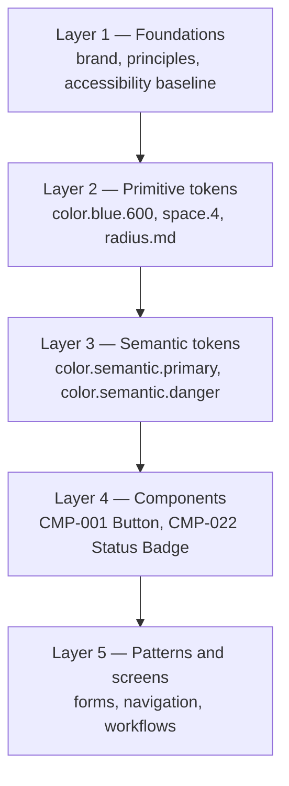

# Design System — Aish Laundry App

**Step:** 2 — Design System and UX Foundation
**Status:** IN PROGRESS
**Master Source:** `docs/MASTER_SOURCE.md` version 1.3.0, §18 (UX and design foundation), §5 (Platforms)
**Scope:** DOCUMENTATION ONLY

---

## 1. What this document is

This is the entry point to the Aish Laundry App design system. It defines the layer model, states what
each layer may and may not decide, and records the honest status of every artefact in the system.

**This document specifies a design system. It does not implement one.** No Flutter package, no Dart
code, no widget, no rendered screen, and no compiled theme exists. `packages/design_system` is
`ABSENT`. Every specification in this directory describes an obligation that a later Step must
discharge — never an achievement already banked.

A reader who wants to know "does the product look like this today?" has one answer: **no, nothing is
built.** A reader who wants to know "what must the product look like when Step 11 builds it?" has this
directory.

---

## 2. Status table

| Artefact | Status |
|---|---|
| Design system specification (this directory) | IN PROGRESS |
| Design token JSON files (`docs/design/tokens/`) | IN PROGRESS |
| `packages/design_system` Flutter package | ABSENT |
| Light theme (canonical MVP theme) | NOT IMPLEMENTED |
| Dark theme | PLANNED |
| Component implementations | NOT IMPLEMENTED |
| Screen designs | PLANNED (Step 11 and beyond) |
| Rendered visual mockups | NOT STARTED |
| Accessibility runtime testing | NOT STARTED |
| Contrast ratios in `COLOR_AND_CONTRAST.md` | Computed from hex values; NOT runtime-verified on device |
| Approved logo / brand mark | NOT APPROVED |
| Icon set selection | PLANNED |
| Font binaries | NOT APPLICABLE (system-first strategy, see `TYPOGRAPHY.md`) |
| Application CI | NOT APPLICABLE |
| UAT | NOT STARTED |

Step 2 may carry `IN PROGRESS`, and after validation `TESTED` or `WATCH`. **`GO` is conferred by the
repository owner and is never written here by an agent** (Rule 01).

---

## 3. The layer model

The design system has five layers. Each layer may only depend on the layers above it. A lower layer
never reaches past its parent to redefine something higher up.



### Layer 1 — Foundations

Brand attributes, design principles, accessibility baseline, content voice. These are decided from the
Master Source §18 and are not re-negotiated per screen.

Documents: `DESIGN_PRINCIPLES.md`, `BRAND_FOUNDATION.md`, `ACCESSIBILITY.md`, `CONTENT_DESIGN.md`,
`UX_COPY_GLOSSARY.md`.

### Layer 2 — Primitive tokens

Raw, context-free values. A primitive token names a value; it does not name a purpose.
`color.blue.600` is a primitive. It says nothing about what it is for.

Naming convention (fixed — do not invent an alternative):

```
color.<hue>.<step>          color.blue.600, color.gold.400, color.neutral.900
space.<step>                space.4, space.8
size.<group>.<name>         size.touch.min, size.icon.md
radius.<name>               radius.sm, radius.md, radius.full
font.size.<role>.<size>     font.size.body.md, font.size.headline.lg
font.weight.<name>          font.weight.semibold
line.height.<role>.<size>   line.height.body.md
duration.<name>             duration.fast
easing.<name>               easing.standard
elevation.<level>           elevation.2
border.width.<name>         border.width.thin
breakpoint.<name>           breakpoint.expanded
```

Documents: `COLOR_AND_CONTRAST.md`, `TYPOGRAPHY.md`, `SPACING_SIZING_DENSITY.md`,
`SHAPE_BORDER_ELEVATION.md`, `MOTION_AND_REDUCED_MOTION.md`.

### Layer 3 — Semantic tokens

Purpose-named tokens that resolve to a primitive. A component **never** references a primitive
directly; it references a semantic token. This is what makes the dark theme possible later without
touching a single component specification.

Naming convention (fixed):

```
color.semantic.primary        color.semantic.secondary     color.semantic.success
color.semantic.warning        color.semantic.danger        color.semantic.information
color.semantic.neutral        color.semantic.focus         color.semantic.selected
color.semantic.disabled       color.semantic.offline       color.semantic.syncing
color.semantic.conflict       color.semantic.surface       color.semantic.border
color.semantic.text.primary   color.semantic.text.secondary
```

Variants follow the same scheme by suffix, for example `color.semantic.primary.pressed`,
`color.semantic.surface.raised`, `color.semantic.border.interactive`, `color.semantic.text.inverse`.

### Layer 4 — Components

Named, identified UI building blocks. Every component carries a `CMP-###` identifier that is permanent
and never reused. A component specification declares which semantic tokens it consumes, its states,
its keyboard contract, and its screen-reader contract.

Documents: `COMPONENT_CATALOG.md`, `COMPONENT_STATE_MATRIX.md`,
`FORM_AND_VALIDATION_PATTERNS.md`, `ICONOGRAPHY.md`, `DATA_VISUALIZATION.md`.

### Layer 5 — Patterns and screens

Compositions of components into workflows. **Step 2 does not design screens.** Screen design belongs
to the Steps that build each surface (Step 11 and beyond). Step 2 delivers the responsive and platform
rules that screens must obey.

Documents: `RESPONSIVE_FOUNDATION.md`, `PLATFORM_ADAPTATION.md`.

---

## 4. How to read this directory

| I want to know… | Read |
|---|---|
| Why the system is shaped this way | [`DESIGN_PRINCIPLES.md`](DESIGN_PRINCIPLES.md) |
| What the brand is and what the logo status is | [`BRAND_FOUNDATION.md`](BRAND_FOUNDATION.md) |
| Which colour to use and whether it passes contrast | [`COLOR_AND_CONTRAST.md`](COLOR_AND_CONTRAST.md) |
| Which text style to use | [`TYPOGRAPHY.md`](TYPOGRAPHY.md) |
| How much space to leave | [`SPACING_SIZING_DENSITY.md`](SPACING_SIZING_DENSITY.md) |
| Corner radius, borders, shadows | [`SHAPE_BORDER_ELEVATION.md`](SHAPE_BORDER_ELEVATION.md) |
| Which icon means which status | [`ICONOGRAPHY.md`](ICONOGRAPHY.md) |
| Whether an animation is allowed | [`MOTION_AND_REDUCED_MOTION.md`](MOTION_AND_REDUCED_MOTION.md) |
| How layout changes with screen width | [`RESPONSIVE_FOUNDATION.md`](RESPONSIVE_FOUNDATION.md) |
| How each surface differs | [`PLATFORM_ADAPTATION.md`](PLATFORM_ADAPTATION.md) |
| The accessibility obligations | [`ACCESSIBILITY.md`](ACCESSIBILITY.md) |
| How to write UI copy | [`CONTENT_DESIGN.md`](CONTENT_DESIGN.md) |
| The Indonesian label for a canonical status | [`UX_COPY_GLOSSARY.md`](UX_COPY_GLOSSARY.md) |
| Chart rules | [`DATA_VISUALIZATION.md`](DATA_VISUALIZATION.md) |
| The specification for a component | [`COMPONENT_CATALOG.md`](COMPONENT_CATALOG.md) |
| Which states a component must support | [`COMPONENT_STATE_MATRIX.md`](COMPONENT_STATE_MATRIX.md) |
| How forms validate | [`FORM_AND_VALIDATION_PATTERNS.md`](FORM_AND_VALIDATION_PATTERNS.md) |
| What we knowingly deferred | [`DESIGN_DEBT_REGISTER.md`](DESIGN_DEBT_REGISTER.md) |
| Why a design decision was taken | [`DESIGN_DECISION_LOG.md`](DESIGN_DECISION_LOG.md) |

---

## 5. The four surfaces

The design system serves four surfaces (Master Source §5). One design language, four adaptations.

| Surface | Stack | Primary users | Defining constraint |
|---|---|---|---|
| Aish Laundry Customer Android | Flutter | Laundry customers | Consumer-grade clarity; low-end Android baseline |
| Aish Laundry Ops Android | Flutter | kasir, manager outlet, operator produksi, quality control, kurir, laundry admin | Offline-first; speed at a busy counter; sunlight legibility |
| Aish Laundry Console Web | Flutter Web | owner, tenant admin, manager, finance, platform admin | Dense data, keyboard operation, 1366×768 baseline |
| Portal Tracking Publik | Browser-based, Flutter not mandatory | Anyone holding a tracking link | No app install, ever; usable at 320 px; heavily masked data |

`PLATFORM_ADAPTATION.md` governs how the shared language adapts. The rule that matters most: **a
mobile layout is never merely enlarged into a desktop layout, and a desktop table is never merely
shrunk into an Android screen.**

---

## 6. Non-negotiable constraints inherited from governance

These are not design preferences. They are inherited hard rules, and a design that violates one is
rejected regardless of how it looks.

1. **Status is never conveyed by colour alone.** Every status carries a text label, and where useful an
   icon and a shape (Master Source §18.2 rule 2). See `COLOR_AND_CONTRAST.md` §7 and `ICONOGRAPHY.md`.
2. **Destructive actions are spatially and visually separated** from routine actions, and confirmed. A
   refund control is never adjacent to a print control (§18.2 rule 3).
3. **Errors explain recovery.** An error names what failed and what to do next. "Terjadi kesalahan"
   alone is a defect (§18.2 rule 4).
4. **Offline and sync state are visible** at all times in the Ops app (§18.2 rule 5).
5. **Money is integer Rupiah**, formatted `Rp79.000`. No floating point appears in any money path, and
   no design implies a client-computed total is authoritative (Rule 04).
6. **The public tracking portal never shows a full address** and never requires an app install
   (Master Source §9.2, §9.3, DEC-0006, DEC-0014).
7. **No route optimization claim, no delivery-time guarantee, no "unlimited WhatsApp".** Copy says
   *usulan rute*, never *rute optimal* (Rule 09, Rule 08, Rule 01).
8. **Accessibility target:** DESIGNED TO MEET WCAG 2.2 AA REQUIREMENTS — NOT YET RUNTIME-TESTED.
9. **Light theme is the canonical MVP theme.** Dark mode is PLANNED / NOT IMPLEMENTED and is never
   presented as available.
10. **Bahasa Indonesia is the user-facing language.** Canonical domain identifiers such as
    `READY_FOR_PICKUP` remain English SCREAMING_SNAKE in code, events, and API fields, and map to an
    Indonesian label for display (`UX_COPY_GLOSSARY.md`).

---

## 7. Token contract

Token values live in `docs/design/tokens/` as JSON. **Specification documents reference tokens by
name only.** A specification that hard-codes a hex value where a token exists is a defect, because the
value will drift the moment the token changes.

Where a specification document does print a hex value — `COLOR_AND_CONTRAST.md` is the one place it
does — that value is the documented definition of the primitive token, and the JSON file is the
authority. If the two disagree, the JSON file is correct and the document is corrected.

---

## 8. Governance boundary of Step 2

Step 2 has authority over: token naming, the spacing scale, colour semantics, breakpoint policy,
navigation patterns, density policy, the system-font strategy, the accessibility baseline, and the UX
state taxonomy. Those decisions are recorded in `DESIGN_DECISION_LOG.md`.

Step 2 has **no authority** over: the payment provider, the WhatsApp provider, the legality of storage
fees, the final tracking-token expiry period, legal proof-retention periods, the production framework
for the tracking portal, or the map provider. Where a design depends on one of those, the design
records the dependency and stops. It does not invent the answer (Rule 00, rule 6).

---

## 9. Definition of Done for Step 2

Step 2 is not done until:

1. Every document listed in §4 exists and is internally consistent.
2. Every token referenced in any document exists in `docs/design/tokens/`.
3. Every component in `COMPONENT_CATALOG.md` appears in `COMPONENT_STATE_MATRIX.md` with no blank
   cells.
4. Every canonical status in Master Source §19 sets appears in `UX_COPY_GLOSSARY.md` with an
   Indonesian label.
5. Every colour pair used for text carries a computed contrast ratio and a stated pass or fail against
   its target.
6. No runtime artefact exists — no `pubspec.yaml`, no Dart, no font binary, no icon binary.
7. The Step 2 validator passes, with output captured at the exact commit SHA (DEC-0013).
8. The status table in §2 still reads honestly, and nothing in this directory claims an implementation,
   a test, a build, a deployment, or a UAT result.
9. Owner acceptance. `GO` is the owner's to confer.
