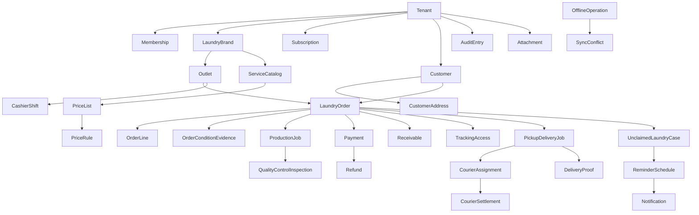

# Aggregate Catalog — Aish Laundry App

**Step:** 1 — Product Requirement and Domain Model
**Status:** `NOT IMPLEMENTED` (documentation only; backend runtime `ABSENT`, no schema, no migration)
**Canonical source:** [`../MASTER_SOURCE.md`](../MASTER_SOURCE.md) v1.0.1

This catalogue models **31 aggregates**. Each entry records: aggregate root, entities, value objects,
commands, invariants, allowed transitions, forbidden transitions, domain events, tenant ownership,
concurrency concerns, idempotency concerns, retention, sensitive fields, and deletion or reversal
policy.

Value objects are defined once in
[`ENTITY_AND_VALUE_OBJECT_CATALOG.md`](ENTITY_AND_VALUE_OBJECT_CATALOG.md) and referenced here.
Numbered requirement identifiers (`TEN-`, `FIN-`, `OFF-`, `TRK-`, `DEL-`, `UCL-`, `NOT-`) are defined
in [`DOMAIN_INVARIANTS.md`](DOMAIN_INVARIANTS.md).

All example data is **fictional**. This repository is PUBLIC.

---

## Aggregate relationship overview

CONCEPTUAL DOMAIN MODEL — NOT DATABASE SCHEMA

**Explanation.** The diagram shows *containment and reference*, not tables, columns, keys, or
cardinality constraints. Every arrow crossing an aggregate boundary is a **reference by identifier**,
never an object graph traversal and never a foreign-key join across a module boundary. `Tenant` is
the ancestor of every business node: an aggregate that cannot be traced to a `Tenant` is not
representable in this model. `OfflineOperation` and `SyncConflict` sit outside the containment tree
deliberately — they are transport-layer aggregates that carry a tenant context but own no business
truth.

---

## 1. Tenant

- **Aggregate root.** `Tenant`.
- **Entities.** Tenant profile, tenant policy set (proof policy, quiet-hours override, variance
  threshold), tenant lifecycle record.
- **Value objects.** `TenantId`, `Address` (registered address), `PhoneNumber`, `Version`,
  `AuditActor`, `ReasonCode`.
- **Commands.** `RegisterTenant`, `UpdateTenantPolicy`, `SuspendTenant`, `ReactivateTenant`.
- **Invariants.** `TEN-001`, `TEN-002`, `TEN-003`. A tenant is the isolation boundary; it has exactly
  one `Subscription`; a suspended tenant retains its data and its export right.
- **Allowed transitions.** `ACTIVE -> SUSPENDED`, `SUSPENDED -> ACTIVE`, `ACTIVE -> CLOSING`,
  `CLOSING -> CLOSED`.
- **Forbidden transitions.** `CLOSED -> ACTIVE` without an owner decision; any transition that
  deletes tenant business data; any transition that revokes the export right (`TEN-028`).
- **Domain events.** `TenantRegistered`, `TenantSuspended`, `TenantReactivated`.
- **Tenant ownership.** It *is* the boundary.
- **Concurrency.** Low contention. `Version` guards policy edits.
- **Idempotency.** Tenant registration is idempotent on the provisioning request reference.
- **Retention.** Retained for the tenant relationship and for the tenant's legal and tax obligations.
- **Sensitive fields.** Registered address, owner contact details.
- **Deletion or reversal.** No hard delete. Closure is a lifecycle state, and deletion requests are
  handled at the tenant boundary through a documented process that honours financial retention
  obligations.

## 2. Membership

- **Aggregate root.** `Membership`.
- **Entities.** Role assignment, permission grant set, scope restriction (brand or outlet).
- **Value objects.** `TenantId`, `UserId`, `OutletId`, `AuditActor`, `Version`.
- **Commands.** `GrantMembership`, `ChangeMembershipRoles`, `RestrictMembershipScope`,
  `RevokeMembership`.
- **Invariants.** `TEN-004`, `TEN-005`, `TEN-006`, `TEN-007`. **All authority derives from a
  Membership**; a bare `UserId` grants nothing. A membership belongs to exactly one tenant. Least
  privilege is the default: a new membership starts with nothing.
- **Allowed transitions.** `INVITED -> ACTIVE`, `ACTIVE -> SUSPENDED`, `SUSPENDED -> ACTIVE`,
  `ACTIVE -> REVOKED`, `INVITED -> EXPIRED`.
- **Forbidden transitions.** `REVOKED -> ACTIVE` (a new membership is granted instead, so the
  revocation remains in the record); any transition that widens scope beyond the granting actor's own
  authority; any membership spanning two tenants.
- **Domain events.** `MembershipGranted`, `MembershipRoleChanged`, `MembershipRevoked`,
  `TenantContextSwitched`.
- **Tenant ownership.** Exactly one tenant per membership. A user in three tenants holds three
  memberships.
- **Concurrency.** `Version` guards concurrent role edits; the later edit must re-read.
- **Idempotency.** Granting the same role twice is a no-op that still writes an audit entry.
- **Retention.** Revoked memberships are retained as audit history.
- **Sensitive fields.** The membership graph itself, which reveals organisational structure.
- **Deletion or reversal.** No hard delete. Revocation is a state, and it takes effect immediately
  server-side including on live sessions (`TEN-014`).

## 3. LaundryBrand

- **Aggregate root.** `LaundryBrand`.
- **Entities.** Brand profile, presentation settings, notification template overrides.
- **Value objects.** `TenantId`, `Version`, `AuditActor`.
- **Commands.** `CreateBrand`, `UpdateBrandPresentation`, `ArchiveBrand`.
- **Invariants.** `TEN-008`. A brand belongs to exactly one tenant; a tenant may hold many brands;
  brand-level pricing and presentation never leak between brands of different tenants.
- **Allowed transitions.** `ACTIVE -> ARCHIVED`, `ARCHIVED -> ACTIVE`.
- **Forbidden transitions.** Transfer of a brand between tenants (would carry orders and customers
  across an isolation boundary; requires an owner decision record and is not modelled).
- **Domain events.** `BrandCreated`, `BrandArchived`.
- **Tenant ownership.** Direct child of `Tenant`.
- **Concurrency.** Low.
- **Idempotency.** Creation idempotent on brand slug within the tenant.
- **Retention.** Retained; archiving preserves historical orders and notas.
- **Sensitive fields.** None beyond commercial presentation.
- **Deletion or reversal.** Archive only. Archiving a brand never alters a past order or nota.

## 4. Outlet

- **Aggregate root.** `Outlet`.
- **Entities.** Operating hours, capacity profile, service zones, printer configuration, shift
  definitions, proof policy.
- **Value objects.** `OutletId`, `TenantId`, `Address`, `GeoPoint`, `TimeWindow`, `PhoneNumber`,
  `Version`.
- **Commands.** `OpenOutlet`, `UpdateOperatingHours`, `DefineServiceZone`, `SetProofPolicy`,
  `CloseOutlet`.
- **Invariants.** `TEN-009`, `TEN-010`, `NOT-004`. An outlet belongs to exactly one brand. Outlet
  local time governs quiet hours and business-day aging.
- **Allowed transitions.** `PLANNED -> ACTIVE`, `ACTIVE -> TEMPORARILY_CLOSED`,
  `TEMPORARILY_CLOSED -> ACTIVE`, `ACTIVE -> CLOSED`.
- **Forbidden transitions.** `CLOSED -> ACTIVE` without an explicit reopen command that records a
  reason; moving an outlet between tenants.
- **Domain events.** `OutletOpened`, `OutletClosed`.
- **Tenant ownership.** Through its brand, to its tenant.
- **Concurrency.** Low; `Version` guards configuration edits.
- **Idempotency.** Zone definitions are idempotent on zone name within the outlet.
- **Retention.** Retained; closure preserves historical records.
- **Sensitive fields.** Full outlet address and geolocation are operational, not customer, data.
- **Deletion or reversal.** No hard delete. Closure is a lifecycle state.

## 5. Customer

- **Aggregate root.** `Customer` (a **tenant customer profile**).
- **Entities.** Contact record, consent record, customer notes.
- **Value objects.** `TenantId`, `PhoneNumber`, `MaskedPhoneNumber`, `ConsentState`,
  `NotificationPreference`, `Version`, `AuditActor`.
- **Commands.** `CreateCustomerProfile`, `UpdateCustomerContact`, `GrantMarketingConsent`,
  `WithdrawMarketingConsent`, `RecordCustomerNote`.
- **Invariants.** `TEN-011`, `TEN-012`, `TEN-013`, `NOT-011`. **A customer profile belongs to exactly
  one tenant.** The same phone number in two tenants yields two unrelated profiles. Profiles are
  **never** merged or linked because name, email, phone, device, or shared ownership match. Marketing
  consent is recorded per customer **per tenant**, with a timestamp and a source.
- **Allowed transitions.** `ACTIVE -> INACTIVE`, `INACTIVE -> ACTIVE`, `ACTIVE -> ANONYMISED`.
- **Forbidden transitions.** Any merge with a profile in another tenant. Any reset of an opt-out by a
  data import (`NOT-013`). `ANONYMISED -> ACTIVE`.
- **Domain events.** `CustomerProfileCreated`, `CustomerContactUpdated`, `CustomerConsentGranted`,
  `CustomerConsentWithdrawn`.
- **Tenant ownership.** Direct child of `Tenant`. Cross-tenant lookup does not exist as a capability.
- **Concurrency.** Moderate at the counter; `Version` guards contact edits.
- **Idempotency.** Profile creation from an offline queue is idempotent on `ClientReference`.
- **Retention.** Retained for the tenant relationship; anonymisation preserves financial records.
- **Sensitive fields.** Name, phone number, notes, order history. Masked per context; the public
  portal shows only masked forms.
- **Deletion or reversal.** No hard delete where financial records reference the profile.
  Anonymisation replaces personal fields and preserves the financial trail.

## 6. CustomerAddress

- **Aggregate root.** `CustomerAddress`.
- **Entities.** Address label, access notes (for example a fictional "pagar hijau, lantai 2").
- **Value objects.** `Address`, `GeoPoint`, `TenantId`, `Version`.
- **Commands.** `AddCustomerAddress`, `UpdateCustomerAddress`, `ArchiveCustomerAddress`,
  `SetDefaultAddress`.
- **Invariants.** `TEN-014` scoping applies; `TRK-018`, `DEL-020`. **The full address is never shown
  on the public tracking portal.** A courier sees only what the assigned job requires.
- **Allowed transitions.** `ACTIVE -> ARCHIVED`, `ARCHIVED -> ACTIVE`.
- **Forbidden transitions.** Exposure to any principal outside the owning tenant; inclusion in a
  notification body (`NOT-015`).
- **Domain events.** `CustomerAddressAdded`, `CustomerAddressArchived`.
- **Tenant ownership.** Through `Customer`, to `Tenant`.
- **Concurrency.** Low.
- **Idempotency.** Idempotent on `ClientReference` when queued offline.
- **Retention.** Archived addresses retained while referenced by a historical job.
- **Sensitive fields.** The entire aggregate is sensitive personal data.
- **Deletion or reversal.** Archive only, so historical delivery records stay interpretable.

## 7. ServiceCatalog

- **Aggregate root.** `ServiceCatalog` (per brand).
- **Entities.** Catalog item (kiloan, satuan, package), add-on definition, item category.
- **Value objects.** `TenantId`, `Money` (list price reference), `Weight`, `Quantity`, `Version`.
- **Commands.** `PublishCatalogItem`, `UpdateCatalogItem`, `RetireCatalogItem`.
- **Invariants.** `FIN-009`, `FIN-010`. A catalog item's price is always expressed as `Money`
  (integer Rupiah). Retiring an item never alters an existing order.
- **Allowed transitions.** Item: `DRAFT -> PUBLISHED`, `PUBLISHED -> RETIRED`.
- **Forbidden transitions.** `RETIRED -> PUBLISHED` in place (a new item version is published
  instead, preserving the historical record).
- **Domain events.** `ServiceCatalogItemPublished`, `ServiceCatalogItemRetired`.
- **Tenant ownership.** Through `LaundryBrand`, to `Tenant`.
- **Concurrency.** Low; `Version` guards concurrent edits by two admins.
- **Idempotency.** Publication idempotent on item code and version.
- **Retention.** Permanent. Retired items must remain resolvable for historical nota reprints.
- **Sensitive fields.** Commercial pricing — competitively sensitive between tenants.
- **Deletion or reversal.** No hard delete. Retirement only.

## 8. PriceList

- **Aggregate root.** `PriceList` (a **version**, effective over a date range).
- **Entities.** Price entry per catalog item; effective period.
- **Value objects.** `Money`, `TenantId`, `Version`, `AuditActor`.
- **Commands.** `DraftPriceListVersion`, `PublishPriceListVersion`, `SupersedePriceListVersion`.
- **Invariants.** `FIN-009`, `FIN-011`, `FIN-012`. **Every price is integer Rupiah.** A published
  price list version is **immutable**; a change publishes a new version. **Editing a price list never
  changes a past order, invoice, or nota.**
- **Allowed transitions.** `DRAFT -> PUBLISHED`, `PUBLISHED -> SUPERSEDED`.
- **Forbidden transitions.** `PUBLISHED -> DRAFT`. Any in-place edit of a published version. Any
  retroactive application to orders created before the effective date.
- **Domain events.** `PriceListVersionPublished`.
- **Tenant ownership.** Through `LaundryBrand`, to `Tenant`.
- **Concurrency.** Low; publication is serialized so two versions cannot claim the same effective
  instant.
- **Idempotency.** Publication idempotent on version identifier.
- **Retention.** Permanent. A superseded version must remain readable to explain a historical order.
- **Sensitive fields.** Pricing.
- **Deletion or reversal.** No hard delete, ever. Supersession only.

## 9. PriceRule

- **Aggregate root.** `PriceRule` (versioned alongside a `PriceList`).
- **Entities.** Condition, modifier, applicability scope (brand, outlet, service, customer tier).
- **Value objects.** `Money`, `Weight`, `Quantity`, `TenantId`, `Version`.
- **Commands.** `AddPriceRule`, `RetirePriceRule`, `EvaluateRules`.
- **Invariants.** `FIN-013`, `FIN-014`. **Rule evaluation uses integer arithmetic only.** Rounding is
  explicit, applied at one defined point, and recorded in the snapshot — never left to a language's
  default numeric behaviour. Rules are versioned and their evaluation is captured in the order line's
  price snapshot.
- **Allowed transitions.** `DRAFT -> ACTIVE`, `ACTIVE -> RETIRED`.
- **Forbidden transitions.** In-place edit of an active rule; retroactive re-evaluation of an
  existing order.
- **Domain events.** `PriceRuleAdded`, `PriceRuleRetired`.
- **Tenant ownership.** Through `LaundryBrand`, to `Tenant`.
- **Concurrency.** Low.
- **Idempotency.** Deterministic: the same inputs and the same rule version always yield the same
  `Money`.
- **Retention.** Permanent, for the same reason as `PriceList`.
- **Sensitive fields.** Discount logic and margin structure.
- **Deletion or reversal.** Retirement only.

## 10. LaundryOrder

- **Aggregate root.** `LaundryOrder`.
- **Entities.** `OrderLine` collection, status history, first-ready record, issue record, handover
  record.
- **Value objects.** `OrderId`, `HumanOrderNumber`, `TenantId`, `OutletId`, `Money`, `OrderStatus`,
  `PaymentStatus`, `ClientReference`, `ReasonCode`, `Version`, `AuditActor`.
- **Commands.** `DraftOrder`, `AddOrderLine`, `RemoveOrderLine`, `ConfirmOrderIntake`,
  `TransitionOrderStatus`, `FlagOrderIssue`, `ResolveOrderIssue`, `CancelOrder`, `CompleteOrder`.
- **Invariants.**
  - `FIN-001`, `FIN-002` — every monetary field is `Money` (integer Rupiah); no float anywhere in the
    order total path.
  - `FIN-011` — every line carries an immutable price snapshot taken at intake.
  - `FIN-015` — the order total is computed and authoritative **on the server**; a client-computed
    total is display only.
  - `UCL-001`, `UCL-002` — **the first-ready timestamp is recorded exactly once, on the first
    transition into `READY_FOR_PICKUP`, and is immutable thereafter.** It never resets, not even
    after a `REWORK` cycle returns the order to ready.
  - `TEN-015` — the order carries `tenant_id`, brand, and outlet.
  - `TRK-003` — the `HumanOrderNumber` is guessable by design and **never** grants access to
    anything.
- **Allowed transitions.** Enumerated exhaustively in
  [`../state-machines/ORDER_STATE_MACHINE.md`](../state-machines/ORDER_STATE_MACHINE.md). Nothing
  outside that enumeration is permitted.
- **Forbidden transitions.** Any transition not enumerated; any transition out of `COMPLETED` or
  `CANCELLED` other than the enumerated corrective path; `QUALITY_CONTROL -> READY_FOR_PICKUP`
  without a `PASSED` or `WAIVED_WITH_AUTHORIZATION` inspection; any status change driven by a
  notification outcome (`NOT-001`).
- **Domain events.** `OrderDrafted`, `OrderLineAdded`, `OrderLineRemoved`, `OrderPriceSnapshotTaken`,
  `OrderReceived`, `OrderStatusChanged`, `OrderReachedReadyForPickupFirstTime`, `OrderFlaggedAsIssue`,
  `OrderIssueResolved`, `OrderCompleted`, `OrderCancelled`.
- **Tenant ownership.** Direct. Human order numbers are sequential **within an outlet** and are never
  unique across tenants — another reason they cannot be an access credential.
- **Concurrency.** **High.** Kasir, operator produksi, quality control, and kurir may act on the same
  order. `Version` optimistic concurrency plus a serialising lock on status transition and on payment
  application (`FIN-016`).
- **Idempotency.** Order creation is idempotent on `ClientReference` (`OFF-001`). A retried intake
  after a network timeout produces **exactly one** order.
- **Retention.** Retained for the tenant's legal and tax obligations. Financial linkage prevents
  early removal.
- **Sensitive fields.** Customer identity, condition photographs, amounts, internal notes. Internal
  notes are never exposed on the public projection.
- **Deletion or reversal.** No hard delete. `CANCELLED` is a status with a recorded `ReasonCode` and
  actor; any money already taken is corrected by reversal, never by removing the order.

## 11. OrderLine

- **Aggregate root.** Contained within `LaundryOrder`; not independently addressable.
- **Entities.** Add-on application, item-level notes, per-item tracking marks for satuan work.
- **Value objects.** `Money` (unit price snapshot, line total), `Weight`, `Quantity`, `Version`.
- **Commands.** `AddOrderLine`, `RemoveOrderLine`, `AdjustLineQuantityBeforeIntakeConfirmation`.
- **Invariants.** `FIN-011`, `FIN-017`, `FIN-018`. The line's price snapshot is written once at
  intake confirmation and is immutable. Line total is derived by integer arithmetic from the snapshot;
  it is never re-derived from the live catalog. After intake confirmation a line may not be edited —
  a correction is a documented order amendment that records actor, reason, and the resulting
  financial adjustment.
- **Allowed transitions.** `DRAFT -> CONFIRMED`. `CONFIRMED -> AMENDED` only through an authorised
  amendment that emits an adjustment entry.
- **Forbidden transitions.** Silent edit of a confirmed line. Re-pricing from a newer price list.
  Deletion of a confirmed line.
- **Domain events.** `OrderLineAdded`, `OrderLineRemoved`, `OrderPriceSnapshotTaken`.
- **Tenant ownership.** Through `LaundryOrder`.
- **Concurrency.** Guarded by the parent order's `Version`.
- **Idempotency.** Line addition from an offline queue is idempotent on the line's own
  `ClientReference`.
- **Retention.** As the parent order.
- **Sensitive fields.** Item descriptions and notes that may describe personal garments.
- **Deletion or reversal.** Removal permitted only before intake confirmation. Afterwards: amendment
  with an adjustment entry.

## 12. OrderConditionEvidence

- **Aggregate root.** `OrderConditionEvidence`.
- **Entities.** Evidence item (photograph reference, note, defect marker), capture context.
- **Value objects.** `OrderId`, `TenantId`, `AuditActor`, `ReasonCode`, `ClientReference`.
- **Commands.** `CaptureConditionEvidence`, `AnnotateConditionEvidence`.
- **Invariants.** `TEN-016`, `DEL-021`. Evidence is **private data**, stored in private object
  storage, served only through signed expiring URLs, tenant-scoped, and **never exposed on the public
  tracking portal**. Evidence is append-only.
- **Allowed transitions.** `CAPTURED -> ANNOTATED`.
- **Forbidden transitions.** Any deletion or replacement of captured evidence; any public exposure.
- **Domain events.** `OrderConditionEvidenceCaptured`.
- **Tenant ownership.** Through `LaundryOrder`.
- **Concurrency.** Append-only; no contention.
- **Idempotency.** Idempotent on `ClientReference` — a retried upload after a dropped connection
  produces one evidence item, not two.
- **Retention.** Retained for the dispute window defined by tenant policy, at minimum as long as the
  order.
- **Sensitive fields.** Photographs of a customer's garments — among the most sensitive data held.
- **Deletion or reversal.** No deletion. Superseding annotations only.

## 13. ProductionJob

- **Aggregate root.** `ProductionJob`.
- **Entities.** Stage record (sorting, washing, drying, finishing), batch membership, blocker record,
  rework cycle record.
- **Value objects.** `OrderId`, `OutletId`, `TenantId`, `ReasonCode`, `AuditActor`,
  `ClientReference`, `Version`.
- **Commands.** `CreateProductionJob`, `StartStage`, `CompleteStage`, `BlockProductionJob`,
  `ResumeProductionJob`, `SendToQualityControl`.
- **Invariants.** Stages are recorded with real start and completion timestamps — a stage is never
  back-filled as complete without an actor and a recorded time. A batch never spans two tenants. A
  job references exactly one order in the same tenant and outlet.
- **Allowed transitions.** `CREATED -> IN_PROGRESS -> AWAITING_QC`; `IN_PROGRESS -> BLOCKED`;
  `BLOCKED -> IN_PROGRESS`; `AWAITING_QC -> REWORK_IN_PROGRESS -> AWAITING_QC`;
  `AWAITING_QC -> CLOSED`.
- **Forbidden transitions.** `CREATED -> CLOSED` (work cannot be skipped silently);
  `AWAITING_QC -> CLOSED` without a recorded inspection verdict; any transition that would set the
  order to `READY_FOR_PICKUP` directly.
- **Domain events.** `ProductionJobCreated`, `ProductionStageStarted`, `ProductionStageCompleted`,
  `ProductionJobBlocked`, `ProductionJobResumed`, `ReworkRequested`, `ReworkCompleted`.
- **Tenant ownership.** Through `LaundryOrder`, plus its own `tenant_id`.
- **Concurrency.** Moderate — several operators may act on one job. Stage completion is serialized so
  a stage cannot be completed twice.
- **Idempotency.** Stage events idempotent on `ClientReference`; a duplicated offline replay does not
  create a second stage record.
- **Retention.** Retained with the order.
- **Sensitive fields.** Item notes and defect photographs; staff performance data derivable from
  stage timings.
- **Deletion or reversal.** No deletion. A mis-recorded stage is corrected by a superseding entry
  that records the correction, its actor, and its reason.

## 14. QualityControlInspection

- **Aggregate root.** `QualityControlInspection`.
- **Entities.** Checklist result, defect record, waiver authorisation record.
- **Value objects.** `OrderId`, `TenantId`, `AuditActor`, `ReasonCode`, `Version`.
- **Commands.** `OpenInspection`, `RecordInspectionPassed`, `RecordInspectionFailed`,
  `WaiveInspectionWithAuthorization`.
- **Invariants.** Statuses are exactly `PENDING`, `PASSED`, `FAILED_REWORK_REQUIRED`,
  `WAIVED_WITH_AUTHORIZATION`. **A waiver requires a permission, a recorded `ReasonCode` plus reason
  text, and an audit entry** — all three, always. Only `PASSED` or `WAIVED_WITH_AUTHORIZATION`
  permits the order to reach `READY_FOR_PICKUP`.
- **Allowed transitions.** `PENDING -> PASSED`; `PENDING -> FAILED_REWORK_REQUIRED`;
  `PENDING -> WAIVED_WITH_AUTHORIZATION`; `FAILED_REWORK_REQUIRED -> PENDING` (a new inspection cycle
  after rework).
- **Forbidden transitions.** `PASSED -> PENDING`; `PASSED -> FAILED_REWORK_REQUIRED` (a new
  inspection is opened instead); `FAILED_REWORK_REQUIRED -> PASSED` without an intervening rework
  cycle; a waiver recorded by the same actor who performed the failing inspection where tenant policy
  requires separation of duties; **a waiver without an audit entry**.
- **Domain events.** `QualityControlInspectionOpened`, `QualityControlPassed`,
  `QualityControlFailedReworkRequired`, `QualityControlWaived`.
- **Tenant ownership.** Through `LaundryOrder`.
- **Concurrency.** Low; one inspection open per order at a time.
- **Idempotency.** Verdicts idempotent on inspection identifier; a replayed verdict does not open a
  second inspection.
- **Retention.** Retained with the order; waivers retained indefinitely as audit material.
- **Sensitive fields.** Defect photographs; inspector identity.
- **Deletion or reversal.** No deletion. A wrong verdict is corrected by opening a new inspection
  cycle that records why.

## 15. Payment

- **Aggregate root.** `Payment`.
- **Entities.** Payment attempt, gateway verification record, allocation to order or receivable.
- **Value objects.** `Money`, `PaymentStatus`, `ClientReference`, `IdempotencyKey`, `TenantId`,
  `OutletId`, `AuditActor`, `ReasonCode`, `Version`.
- **Commands.** `RecordPaymentIntent`, `CapturePayment`, `VerifyGatewayCallback`,
  `AllocatePaymentToOrder`.
- **Invariants.**
  - `FIN-001`, `FIN-002` — integer Rupiah; **floating point is forbidden** in storage, computation,
    transport, and any display path that round-trips through a float.
  - `FIN-003` — **payments are idempotent**, keyed on a stable client-supplied `ClientReference`. The
    same logical payment submitted any number of times produces **exactly one** payment.
  - `FIN-004` — gateway callbacks are verified server-side: signature, amount, currency, and status
    checked against the gateway, not trusted from the payload. Replays are rejected.
  - `FIN-005` — **an order is never marked paid on a client claim.**
  - `FIN-019` — an offline device may record a payment *intent*; it may never record a confirmed
    gateway payment.
- **Allowed transitions.** Enumerated in
  [`../state-machines/PAYMENT_STATE_MACHINE.md`](../state-machines/PAYMENT_STATE_MACHINE.md).
- **Forbidden transitions.** Any transition to `CAPTURED` from an unverified callback; any transition
  that reduces a captured amount in place; any deletion.
- **Domain events.** `PaymentIntentRecorded`, `PaymentCaptured`, `PaymentDuplicateSuppressed`,
  `PaymentFailed`, `PaymentGatewayCallbackVerified`, `PaymentGatewayCallbackRejected`.
- **Tenant ownership.** Direct `tenant_id` plus outlet. A financial query that is not tenant-scoped
  is simultaneously a security defect and a financial defect.
- **Concurrency.** **Highest in the model.** Concurrent operations on the same order or payment are
  serialized by a database transaction or distributed lock, so a double submission cannot create a
  double payment (`FIN-016`).
- **Idempotency.** The defining property. Duplicate suppression is observable: a suppressed duplicate
  emits `PaymentDuplicateSuppressed` and returns the original result, it does not silently do
  nothing.
- **Retention.** Permanent, subject to the tenant's legal and tax obligations.
- **Sensitive fields.** Amounts, gateway references, actor identity.
- **Deletion or reversal.** **Never deleted through ordinary UI.** There is no "delete payment"
  button for regular roles. Corrections are reversal or adjustment entries that preserve the original
  record (`FIN-006`, `FIN-007`).

## 16. Refund

- **Aggregate root.** `Refund`.
- **Entities.** Approval record, settlement record, linkage to the original `Payment`.
- **Value objects.** `Money`, `ReasonCode`, `ClientReference`, `AuditActor`, `TenantId`, `Version`.
- **Commands.** `RequestRefund`, `ApproveRefund`, `RejectRefund`, `SettleRefund`.
- **Invariants.** `FIN-006`, `FIN-020`, `FIN-021`. **A refund requires an explicit permission and a
  recorded reason** — both, always, with actor, timestamp, and amount. A refund never exceeds the
  captured amount of the payment it reverses, net of prior refunds. A refund is never silent.
- **Allowed transitions.** Enumerated in
  [`../state-machines/REFUND_STATE_MACHINE.md`](../state-machines/REFUND_STATE_MACHINE.md).
- **Forbidden transitions.** Approval by the requesting actor where tenant policy requires separation
  of duties; settlement without approval; any deletion.
- **Domain events.** `RefundRequested`, `RefundApproved`, `RefundRejected`, `RefundSettled`.
- **Tenant ownership.** Direct.
- **Concurrency.** Serialized against the parent payment so two refunds cannot jointly exceed the
  captured amount.
- **Idempotency.** Idempotent on `ClientReference`; a retried refund settles once.
- **Retention.** Permanent.
- **Sensitive fields.** Amount, reason text, actor.
- **Deletion or reversal.** No deletion. A wrongly issued refund is corrected by an adjustment entry.

## 17. Receivable

- **Aggregate root.** `Receivable`.
- **Entities.** Balance record, settlement allocations, held-invoice marker.
- **Value objects.** `Money`, `OrderId`, `TenantId`, `Version`.
- **Commands.** `OpenReceivable`, `AllocateSettlement`, `MarkInvoiceHeld`, `SettleReceivable`,
  `PostAdjustmentEntry`.
- **Invariants.** `FIN-022`, `FIN-023`, `UCL-014`. Balance is integer Rupiah and is derived only from
  posted financial entries. **The unclaimed dashboard reads unpaid balance and held invoices from
  here** — it never recomputes money independently.
- **Allowed transitions.** `OPEN -> PARTIALLY_SETTLED -> SETTLED`; `OPEN -> HELD`;
  `HELD -> PARTIALLY_SETTLED`; `HELD -> SETTLED`; any state `-> ADJUSTED` via an adjustment entry.
- **Forbidden transitions.** `SETTLED -> OPEN` by mutation (a reversal entry is posted instead); any
  write-off that is not an authorised, reasoned, audited adjustment entry.
- **Domain events.** `ReceivableOpened`, `ReceivableSettled`, `AdjustmentEntryPosted`.
- **Tenant ownership.** Direct.
- **Concurrency.** Serialized with payment application.
- **Idempotency.** Allocations idempotent on the settling payment's `ClientReference`.
- **Retention.** Permanent.
- **Sensitive fields.** Outstanding amounts per customer.
- **Deletion or reversal.** Reversal and adjustment only.

## 18. CashierShift

- **Aggregate root.** `CashierShift`.
- **Entities.** Opening float record, cash movement records, closing count, variance record and
  acknowledgement.
- **Value objects.** `Money`, `OutletId`, `TenantId`, `AuditActor`, `ReasonCode`, `Version`.
- **Commands.** `OpenCashierShift`, `RecordCashMovement`, `CloseCashierShift`, `AcknowledgeVariance`.
- **Invariants.** `FIN-024`, `FIN-025`, `FIN-026`. **Shift closing compares expected cash against
  actual cash and records the variance explicitly.** A variance beyond the tenant's configured
  threshold requires a recorded reason. A variance is **never** masked, auto-rounded away, absorbed,
  or suppressed from a report.
- **Allowed transitions.** `OPEN -> COUNTING -> CLOSED_WITH_VARIANCE_ACKNOWLEDGED`;
  `OPEN -> COUNTING -> CLOSED_BALANCED`.
- **Forbidden transitions.** `COUNTING -> CLOSED_BALANCED` when a variance exists; closing without a
  count; reopening a closed shift (a corrective adjustment entry is posted instead).
- **Domain events.** `CashierShiftOpened`, `CashierShiftClosed`, `CashierShiftVarianceRecorded`.
- **Tenant ownership.** Direct, plus outlet.
- **Concurrency.** Serialized — shift closing takes a lock so concurrent counts cannot interleave.
- **Idempotency.** Closing is idempotent on shift identifier; a retried close does not double-count.
- **Retention.** Permanent.
- **Sensitive fields.** Cash amounts and the identity of the accountable cashier.
- **Deletion or reversal.** No deletion. Corrections by adjustment entry.

## 19. PickupDeliveryJob

- **Aggregate root.** `PickupDeliveryJob`.
- **Entities.** Stop record, schedule record, failure record, reschedule chain.
- **Value objects.** `TenantId`, `OutletId`, `OrderId`, `Address`, `GeoPoint`, `TimeWindow`,
  `DeliveryStatus`, `ReasonCode`, `ClientReference`, `Version`.
- **Commands.** `RequestPickup`, `ConfirmJob`, `ScheduleJob`, `StartJob`, `RecordArrival`,
  `RecordPickup`, `RecordDelivery`, `RecordJobFailure`, `RescheduleJob`, `CancelJob`.
- **Invariants.**
  - `DEL-001` — statuses are exactly `REQUESTED`, `CONFIRMED`, `SCHEDULED`, `ASSIGNED`, `EN_ROUTE`,
    `ARRIVED`, `PICKED_UP`, `DELIVERED`, `FAILED`, `RESCHEDULED`, `CANCELLED`.
  - `DEL-002` — **every custody transfer requires proof.** A parcel never silently changes hands.
  - `DEL-003` — **a failed delivery is a first-class outcome with a recorded reason**, not an error
    state. The laundry returns to the outlet and the order returns to a defined status.
  - `DEL-004` — the customer is given a `TimeWindow`, never a fictitious exact minute.
  - `DEL-005` — **no route optimization claims.** Stop ordering is a *usulan rute* (suggestion). The
    product never says "rute optimal", and never promises an arrival time or ETA it does not compute.
- **Allowed transitions.** Enumerated in
  [`../state-machines/PICKUP_DELIVERY_STATE_MACHINE.md`](../state-machines/PICKUP_DELIVERY_STATE_MACHINE.md).
- **Forbidden transitions.** `ARRIVED -> DELIVERED` without a captured `DeliveryProof`;
  `EN_ROUTE -> DELIVERED` (arrival must be recorded); `DELIVERED -> anything`; any transition driven
  by a notification outcome.
- **Domain events.** `PickupRequested`, `PickupConfirmed`, `JobScheduled`, `JobEnRoute`,
  `CourierArrived`, `ParcelPickedUp`, `ParcelDelivered`, `JobFailed`, `JobRescheduled`,
  `JobCancelled`.
- **Tenant ownership.** Direct. Zones belong to outlets, which belong to tenants.
- **Concurrency.** Moderate. A job has exactly one active `CourierAssignment` at a time.
- **Idempotency.** Every courier-captured transition is idempotent on `ClientReference` — a retry
  after a dead zone does not create a second delivery record.
- **Retention.** Retained with the order and its proofs.
- **Sensitive fields.** Full customer address, access notes, geolocation.
- **Deletion or reversal.** No deletion. Cancellation and failure are recorded states with reasons.

## 20. CourierAssignment

- **Aggregate root.** `CourierAssignment`.
- **Entities.** Assignment record, stop ordering (suggestion), guest link record for an external
  courier.
- **Value objects.** `TenantId`, `OutletId`, `UserId` (internal courier only), `TrackingTokenHash`
  (guest link hash), `TimeWindow`, `ReasonCode`, `Version`.
- **Commands.** `AssignInternalCourier`, `AssignExternalCourier`, `IssueGuestJobLink`,
  `RevokeGuestJobLink`, `OrderStopsAsSuggestion`, `ReassignCourier`.
- **Invariants.**
  - `DEL-006` — an internal courier acts through a `Membership`.
  - `DEL-007` — **an external local courier receives no membership, no account, and no application
    access.** They hold a guest job link only.
  - `DEL-008` — the guest job link uses a **high-entropy token, stored hashed**, is **revocable** and
    **expiring**, is **not** the order number and is not derivable from it, and exposes **only the
    assigned job and the minimum data needed to complete it** — never customer history, never other
    orders, never pricing, never any other tenant data.
  - `DEL-009` — the guest link is tenant-scoped. Two tenants engaging the same rider issue two
    unrelated links with no traversal between them.
  - `DEL-010` — stop ordering is labelled a suggestion. See `DEL-005`.
- **Allowed transitions.** `DRAFT -> ASSIGNED -> ACCEPTED -> IN_PROGRESS -> COMPLETED`;
  `ASSIGNED -> REASSIGNED`; any state `-> CANCELLED` with a reason.
- **Forbidden transitions.** Issuing a guest link that does not expire or cannot be revoked; storing
  a guest token in plaintext; two simultaneously active assignments on one job.
- **Domain events.** `CourierAssigned`, `GuestJobLinkIssued`, `GuestJobLinkRevoked`.
- **Tenant ownership.** Direct.
- **Concurrency.** Reassignment is serialized so a job never has two active couriers.
- **Idempotency.** Assignment idempotent on job identifier plus courier identity.
- **Retention.** Retained with the job. Guest link hashes retained as audit material; plaintext never
  stored.
- **Sensitive fields.** Guest link token hash; the minimum address disclosed to an external rider.
- **Deletion or reversal.** No deletion. Revocation is immediate and recorded.

## 21. DeliveryProof

- **Aggregate root.** `DeliveryProof`.
- **Entities.** Proof item (OTP verification, photograph reference, signature reference, recipient
  name), capture context.
- **Value objects.** `TenantId`, `OrderId`, `AuditActor`, `ClientReference`, `GeoPoint` (where tenant
  policy captures it).
- **Commands.** `CaptureProof`, `VerifyProofOtp`, `AttachProofArtifact`.
- **Invariants.**
  - `DEL-011` — **proof of pickup and proof of delivery are mandatory for every custody transfer.**
    The method may vary by tenant policy; *some* recorded proof is always required.
  - `DEL-012` — **proof artefacts are private data**: private object storage, signed expiring URLs
    only, tenant-scoped and unguessable keys, and **never exposed on the public tracking portal**.
  - `DEL-013` — proof capture works offline and syncs later; a courier in a dead zone is never forced
    to skip proof.
- **Allowed transitions.** `PENDING -> CAPTURED -> VERIFIED`; `PENDING -> WAIVED_BY_POLICY` only
  where tenant policy explicitly permits an alternative method, and always with a recorded reason.
- **Forbidden transitions.** `PENDING -> VERIFIED` without capture; any deletion; any public
  exposure of an artefact.
- **Domain events.** `DeliveryProofCaptured`.
- **Tenant ownership.** Direct.
- **Concurrency.** Append-only.
- **Idempotency.** Idempotent on `ClientReference`; a retried upload produces one proof, not two.
- **Retention.** Retained for the tenant's dispute and legal window, at minimum as long as the order.
- **Sensitive fields.** Photographs of a customer's doorstep or home, handwritten signatures,
  recipient names. Among the most sensitive artefacts in the product.
- **Deletion or reversal.** No deletion. A disputed proof is annotated, never removed.

## 22. CourierSettlement

- **Aggregate root.** `CourierSettlement`.
- **Entities.** Collection record per job, expected total, declared total, variance record,
  acceptance record.
- **Value objects.** `Money`, `TenantId`, `OutletId`, `AuditActor`, `ReasonCode`, `Version`.
- **Commands.** `OpenCourierSettlement`, `RecordCashCollected`, `SubmitCourierSettlement`,
  `RecordSettlementVariance`, `AcceptCourierSettlement`.
- **Invariants.**
  - `FIN-027` — **cash collected at the door is a financial transaction** and inherits every
    financial rule: integer Rupiah, idempotency, no deletion via ordinary UI, corrections by reversal
    or adjustment, and audited actor, timestamp, and reason.
  - `FIN-028` — courier cash is tracked **per courier, per shift or route, from collection to
    hand-over**.
  - `FIN-029` — expected versus actual is compared **explicitly**, and any variance is recorded and
    acknowledged. **A variance is never hidden, auto-adjusted, or written off silently.**
- **Allowed transitions.** Enumerated in
  [`../state-machines/COURIER_SETTLEMENT_STATE_MACHINE.md`](../state-machines/COURIER_SETTLEMENT_STATE_MACHINE.md).
- **Forbidden transitions.** Acceptance while an unacknowledged variance exists; silent adjustment of
  a declared total; deletion of a collection record.
- **Domain events.** `CourierCashCollected`, `CourierSettlementOpened`, `CourierSettlementSubmitted`,
  `CourierSettlementVarianceRecorded`, `CourierSettlementAccepted`.
- **Tenant ownership.** Direct.
- **Concurrency.** Serialized at submission and acceptance.
- **Idempotency.** Collections idempotent on `ClientReference`, since they are captured offline at
  the door.
- **Retention.** Permanent.
- **Sensitive fields.** Cash amounts and courier accountability.
- **Deletion or reversal.** No deletion. Reversal and adjustment only.

## 23. TrackingAccess

- **Aggregate root.** `TrackingAccess`.
- **Entities.** Issuance record, view log, OTP challenge record, revocation record.
- **Value objects.** `TrackingTokenHash`, `OrderId`, `TenantId`, `AuditActor`, `ReasonCode`,
  `Version`.
- **Commands.** `IssueTrackingAccess`, `ResolveTrackingToken`, `ChallengeWithOtp`,
  `VerifyPortalOtp`, `RevokeTrackingAccess`, `ExpireTrackingAccess`.
- **Invariants.**
  - `TRK-001` — the token is **high-entropy**, from a cryptographically secure random source.
  - `TRK-002` — the token is **stored hashed** (`TrackingTokenHash`); the plaintext exists only in
    the link and is **never logged**.
  - `TRK-003` — the token **is not the order number** and is not derivable from it.
  - `TRK-004` — tokens are **revocable**.
  - `TRK-005` — tokens **expire**. The canonical default is **expiry 30 days after order
    completion**, and expiry is always bounded regardless of order state.
  - `TRK-006` — the portal is served `noindex`; tracking pages never enter search engines.
  - `TRK-007` — token lookup is **rate-limited and enumeration-protected**.
  - `TRK-008` — the portal serves a **separate public projection**, not the internal order
    representation.
- **Allowed transitions.** Enumerated in
  [`../state-machines/TRACKING_ACCESS_LIFECYCLE.md`](../state-machines/TRACKING_ACCESS_LIFECYCLE.md).
- **Forbidden transitions.** `REVOKED -> ACTIVE`; `EXPIRED -> ACTIVE` (a new access is issued
  instead); serving any field not present in the public projection.
- **Domain events.** `TrackingAccessIssued`, `TrackingAccessViewed`, `TrackingAccessOtpChallenged`,
  `TrackingAccessOtpVerified`, `TrackingAccessRevoked`, `TrackingAccessExpired`,
  `TrackingAccessThrottled`.
- **Tenant ownership.** Direct. **Access is scoped to exactly one order in exactly one tenant.** It
  never lists other orders and never traverses tenants. Tenant context is derived from the stored
  record server-side, never from the request.
- **Concurrency.** A link is deliberately shareable (a family member may collect); concurrent views
  are expected and are all logged.
- **Idempotency.** Issuance is idempotent per order plus purpose; re-issuing revokes the prior token
  and records why.
- **Retention.** Access records retained as security audit material after expiry; the projection is
  rebuilt, never archived with personal data.
- **Sensitive fields.** Token hash, view log with request metadata. **The public projection never
  contains a full address, a full phone number, other orders, internal notes, or laundry
  photographs.**
- **Deletion or reversal.** No deletion. Revocation and expiry are states.

## 24. Notification

- **Aggregate root.** `Notification`.
- **Entities.** Send attempt, provider response record, deduplication marker, deferral record.
- **Value objects.** `TenantId`, `OutletId`, `OrderId`, `MaskedPhoneNumber`, `NotificationChannel`,
  `NotificationPreference`, `ConsentState`, `IdempotencyKey`, `ReasonCode`, `Version`.
- **Commands.** `RequestNotification`, `EvaluateSendPolicy`, `DeferForQuietHours`, `DispatchMessage`,
  `RecordDeliveryOutcome`, `OfferManualDeepLinkFallback`.
- **Invariants.**
  - `NOT-001` — **a provider failure never changes business state.** No order, payment, or job is
    ever cancelled, blocked, or altered because a message failed.
  - `NOT-002` — **deduplication is mandatory**, keyed on recipient + event + order + intended send
    window. A retry, queue replay, scheduler restart, or double-trigger never produces a second
    identical message.
  - `NOT-003` — **quiet hours default to 20.00–08.00 outlet local time.** Non-urgent messages are
    **deferred to the next permitted window** — never dropped, never sent anyway.
  - `NOT-005` — **opt-out is honoured at send time**, permanently, across all outlets of the tenant.
  - `NOT-006` — transactional and marketing messages are separated: separate categories, templates,
    consent handling, and reporting. A marketing message is never routed through a transactional path
    to evade opt-out.
  - `NOT-007` — the manual deep-link fallback is explicit and visible and is **never described as
    automation**.
  - `NOT-008` — **the product never promises "unlimited WhatsApp"**, anywhere.
- **Allowed transitions.** `REQUESTED -> SUPPRESSED_DUPLICATE`; `REQUESTED -> SUPPRESSED_OPT_OUT`;
  `REQUESTED -> DEFERRED -> QUEUED`; `REQUESTED -> QUEUED -> DISPATCHED -> DELIVERED`;
  `DISPATCHED -> FAILED -> QUEUED` (bounded retry); `FAILED -> FALLBACK_OFFERED`.
- **Forbidden transitions.** Any transition that writes back into a business aggregate; sending
  inside quiet hours without an explicitly recorded exception; sending marketing to an opted-out
  recipient; unbounded retry.
- **Domain events.** `NotificationRequested`, `NotificationDeduplicated`,
  `NotificationDeferredForQuietHours`, `NotificationSuppressedByOptOut`, `NotificationDispatched`,
  `NotificationDelivered`, `NotificationFailed`, `ManualDeepLinkFallbackOffered`.
- **Tenant ownership.** Direct. Every send records tenant, outlet, order, recipient, template,
  category, status, timestamp, and provider reference.
- **Concurrency.** High volume; the deduplication key is the concurrency control.
- **Idempotency.** The deduplication key **is** the idempotency key.
- **Retention.** Send records retained for cost transparency and dispute resolution; message bodies
  retained per tenant policy.
- **Sensitive fields.** Recipient number, message body, embedded tracking link. **A message never
  contains a full address, and never echoes an OTP alongside a tracking link.** Logs never contain
  token plaintext.
- **Deletion or reversal.** A dispatched message cannot be recalled. The record is never deleted.

## 25. ReminderSchedule

- **Aggregate root.** `ReminderSchedule`.
- **Entities.** Ladder stage record (H+1, H+3, H+7, H+14), fired marker, deferral record.
- **Value objects.** `OrderId`, `TenantId`, `OutletId`, `IdempotencyKey`, `Version`.
- **Commands.** `ScheduleReminderLadder`, `FireReminderStage`, `SkipStageWithReason`.
- **Invariants.**
  - `UCL-003` — the canonical ladder is exactly **H+1 friendly reminder; H+3 second reminder; H+7
    priority reminder plus an assignable follow-up task; H+14 escalation to manager or owner.**
    Adding, removing, or renumbering a stage requires a decision record.
  - `UCL-004` — **each stage fires exactly once per order.**
  - `UCL-005` — stages are computed against the **immutable first-ready timestamp**, in outlet local
    time and Asia/Jakarta business-day semantics — never against an arbitrary UTC midnight.
  - `UCL-006` — reminders respect quiet hours and opt-out.
  - `UCL-007` — a reminder that fails to send is retried and made visible; it is never silently
    dropped, and **its failure never alters the order's state**.
- **Allowed transitions.** Per stage: `PENDING -> DUE -> FIRED`; `DUE -> DEFERRED -> DUE`;
  `PENDING -> SKIPPED` with a recorded reason (for example the order was collected first).
- **Forbidden transitions.** `FIRED -> PENDING`; firing a stage twice; firing a stage whose anchor
  timestamp has been recomputed.
- **Domain events.** `ReminderScheduled`, `ReminderStageFired`.
- **Tenant ownership.** Direct.
- **Concurrency.** Scheduler restarts must not double-fire; the fired marker plus `IdempotencyKey`
  guarantees this.
- **Idempotency.** Firing is idempotent on order + stage.
- **Retention.** Retained with the unclaimed case.
- **Sensitive fields.** None beyond linkage to a customer.
- **Deletion or reversal.** No deletion. Skipping is recorded with a reason.

## 26. UnclaimedLaundryCase

- **Aggregate root.** `UnclaimedLaundryCase`.
- **Entities.** Aging record, follow-up task, escalation record, reason-not-collected record.
- **Value objects.** `OrderId`, `TenantId`, `OutletId`, `Money` (unpaid balance, read from
  `Receivable`), `ReasonCode`, `AuditActor`, `Version`.
- **Commands.** `OpenUnclaimedCase`, `CreateFollowUpTask`, `AssignFollowUpTask`, `CloseFollowUpTask`,
  `EscalateCase`, `RecordReasonNotCollected`, `ProposeDeliveryAsRecovery`, `CloseUnclaimedCase`.
- **Invariants.**
  - `UCL-001`, `UCL-002` — **aging starts when the order FIRST reaches `READY_FOR_PICKUP` and never
    restarts**, even if the order returns to `REWORK` and becomes ready again.
  - `UCL-008` — canonical aging buckets are **1–2 days; 3–6 days; 7–13 days; 14–30 days; More than
    30 days.**
  - `UCL-009` — the H+7 follow-up task is a **real, assignable, closable task with a named owner** —
    not a flag, not a notification.
  - `UCL-010` — the H+14 escalation reaches a manager or owner: a human accountable for the outcome.
  - `UCL-011` — "reason not collected" is a **first-class recorded field**, captured from staff
    follow-up.
  - `UCL-012` — the dashboard exposes at minimum all **nine** fields: order count, customer count,
    held invoices, unpaid balance, order age, outlet, last reminder, follow-up officer, reason not
    collected.
  - `UCL-013` — **absolute prohibition.** The product **never** automatically discards, sells,
    auctions, donates, or transfers ownership of a customer's laundry — not behind a flag, not as a
    future option, not as a TODO. Its role ends at reminding, escalating, and reporting.
- **Allowed transitions.** Enumerated in
  [`../state-machines/UNCLAIMED_LAUNDRY_STATE_MACHINE.md`](../state-machines/UNCLAIMED_LAUNDRY_STATE_MACHINE.md).
- **Forbidden transitions.** Any transition that resets aging; any transition representing disposal,
  sale, auction, donation, or ownership transfer — **such a transition does not exist in this model
  and must never be added**.
- **Domain events.** `UnclaimedCaseOpened`, `FollowUpTaskCreated`, `FollowUpTaskAssigned`,
  `FollowUpTaskClosed`, `UnclaimedCaseEscalated`, `ReasonNotCollectedRecorded`, `UnclaimedCaseClosed`.
- **Tenant ownership.** Direct. Aging statistics never cross a tenant boundary.
- **Concurrency.** Low; the scheduler and staff may act concurrently, guarded by `Version`.
- **Idempotency.** Case opening is idempotent on order identifier — the second and later ready events
  do not open a second case.
- **Retention.** Retained with the order.
- **Sensitive fields.** Customer contact, unpaid balance, reason text.
- **Deletion or reversal.** No deletion. Closure with a reason.

## 27. Subscription

- **Aggregate root.** `Subscription`.
- **Entities.** Plan assignment, trial record, usage counters against fair-use ceilings, lapse and
  grace record.
- **Value objects.** `TenantId`, `Money`, `ReasonCode`, `AuditActor`, `Version`.
- **Commands.** `StartTrial`, `ActivateSubscription`, `ChangePlan`, `RecordSubscriptionPayment`,
  `MarkSubscriptionLapsed`, `SuspendSubscription`, `ReactivateSubscription`, `CancelSubscription`,
  `RequestTenantDataExport`.
- **Invariants.**
  - `TEN-017` — exactly one subscription per tenant; billing operates at the tenant boundary, never
    per user or per outlet.
  - `TEN-018` — **tenant data remains exportable per policy when a subscription lapses.** A lapse
    restricts features; it never holds a tenant's business records hostage.
  - `TEN-019` — fair-use ceilings **signal**; they never silently degrade service, never delete data,
    and never stop a laundry mid-shift.
  - `FIN-030` — subscription amounts are `Money` (integer Rupiah). Pricing figures themselves are
    canonical in Master Source §21 and are never restated from memory, rounded, or reformatted.
  - `TEN-020` — **no lifetime cloud plan exists, ever**; and no per-nota fee applies on normal plans.
  - `TEN-021` — the security baseline, tenant isolation, and encrypted backup are **not** paid
    tiers.
- **Allowed transitions.** Enumerated in
  [`../state-machines/SUBSCRIPTION_STATE_MACHINE.md`](../state-machines/SUBSCRIPTION_STATE_MACHINE.md).
- **Forbidden transitions.** Any transition that blocks export for a lapsed tenant; any transition
  that places a security control behind a tier; any transition to a plan not present in the canonical
  pricing table.
- **Domain events.** `SubscriptionTrialStarted`, `SubscriptionActivated`, `SubscriptionPlanChanged`,
  `SubscriptionPaymentFailed`, `SubscriptionLapsed`, `SubscriptionSuspended`,
  `SubscriptionReactivated`, `SubscriptionCancelled`, `PlanLimitApproached`,
  `PlanLimitExceededFairUse`, `TenantDataExportRequested`.
- **Tenant ownership.** One per tenant.
- **Concurrency.** Low; plan change is serialized.
- **Idempotency.** Plan changes idempotent on change request identifier.
- **Retention.** Permanent.
- **Sensitive fields.** Billing identifiers. Plan pricing is public.
- **Deletion or reversal.** No deletion. Cancellation is a state.

## 28. AuditEntry

- **Aggregate root.** `AuditEntry`.
- **Entities.** None — an entry is atomic.
- **Value objects.** `AuditActor`, `TenantId`, `OutletId`, `ReasonCode`, `Money` (before and after,
  where financial).
- **Commands.** `AppendAuditEntry`.
- **Invariants.** `TEN-022`, `FIN-031`. **Append-only.** An entry records actor, tenant, outlet,
  timestamp, action, before and after values where financial, and reason. For financial and
  security-relevant actions the audit write shares the transaction with the action: **no audit, no
  action.** Entries **never** contain passwords, OTPs, tokens, or credential values.
- **Allowed transitions.** None. An entry is immutable from creation.
- **Forbidden transitions.** Update. Delete. Log rotation of the financial audit trail
  (`FIN-032` — the financial audit trail is not subject to log rotation).
- **Domain events.** `AuditEntryAppended`.
- **Tenant ownership.** Entries carry tenant context. Platform-scoped entries (impersonation start
  and end, tenant lifecycle) are separated and remain readable by the tenant they concern.
- **Concurrency.** Append-only; no contention.
- **Idempotency.** An entry is written once per action; a replayed action writes a distinct entry
  recording the replay.
- **Retention.** Permanent for financial and security entries.
- **Sensitive fields.** Actor identity and reason text. Never credentials.
- **Deletion or reversal.** Never.

## 29. Attachment

- **Aggregate root.** `Attachment`.
- **Entities.** Storage reference, validation result, signed-URL issuance log.
- **Value objects.** `TenantId`, `AuditActor`, `ReasonCode`, `Version`.
- **Commands.** `RequestUploadSlot`, `RegisterAttachment`, `IssueSignedUrl`, `QuarantineAttachment`.
- **Invariants.** `TEN-023`, `DEL-012`. **Uploads are validated server-side** for type, size, and
  content; a client-declared content type is untrusted. **Object keys are tenant-scoped and
  unguessable** — a sequential or predictable key is an enumeration vulnerability. **Buckets are
  never publicly readable or listable for tenant data.** Private files are served only through
  **signed, expiring URLs**.
- **Allowed transitions.** `PENDING -> VALIDATED -> AVAILABLE`; `PENDING -> REJECTED`;
  `AVAILABLE -> QUARANTINED`.
- **Forbidden transitions.** `PENDING -> AVAILABLE` without validation; issuing a non-expiring URL;
  making any tenant artefact publicly readable.
- **Domain events.** `AttachmentUploaded`, `AttachmentSignedUrlIssued`, `AttachmentQuarantined`.
- **Tenant ownership.** Direct, and encoded into the object key.
- **Concurrency.** Low.
- **Idempotency.** Registration idempotent on `ClientReference` plus content digest.
- **Retention.** Per artefact class and tenant policy; proofs and condition evidence retained at
  least as long as their order.
- **Sensitive fields.** The content itself — photographs of homes, garments, and handwriting.
- **Deletion or reversal.** Quarantine rather than delete where the artefact is referenced by a
  financial or custody record.

## 30. OfflineOperation

- **Aggregate root.** `OfflineOperation` (client-side aggregate with a server-side acceptance
  record).
- **Entities.** Queued payload, retry record, dependency link to a predecessor operation.
- **Value objects.** `ClientReference`, `IdempotencyKey`, `TenantId`, `UserId`, `Version`.
- **Commands.** `QueueOfflineOperation`, `RetryOfflineOperation`, `SubmitOfflineOperation`,
  `AcceptOfflineOperation`, `RejectOfflineOperation`, `AuthorizeFinancialQueuePurge`.
- **Invariants.**
  - `OFF-001` — **every critical operation carries a stable `ClientReference`, generated once before
    the first attempt, persisted with the queued operation, and reused unchanged on every retry.**
    Regenerating it on retry defeats the entire mechanism and is the highest-risk bug class in the
    design.
  - `OFF-002` — the queue is **persistent**: it survives application restart, device reboot, and
    crash. An in-memory queue is not acceptable.
  - `OFF-003` — retries use **exponential backoff**, spaced and bounded.
  - `OFF-004` — **the financial queue is never casually deleted.** Clearing a queued financial
    operation requires an explicit, permissioned, audited action — never a "clear cache", a logout, a
    version upgrade, or a developer convenience button.
  - `OFF-005` — **the server is the final source of truth**; the client reconciles to it.
  - `OFF-006` — **local data is partitioned per tenant AND per user.** A tenant or user switch never
    exposes the previous context's cached data.
  - `OFF-007` — **a duplicate order or duplicate payment produced by a retry is unacceptable** and is
    an automatic `NO-GO`.
  - `OFF-008` — a failed operation is never silently dropped; it remains visible and actionable.
  - `OFF-009` — dependency ordering is respected: an operation whose predecessor failed does not jump
    ahead.
- **Allowed transitions.** `QUEUED -> SUBMITTING -> ACCEPTED`; `SUBMITTING -> FAILED -> QUEUED`
  (backoff); `SUBMITTING -> REJECTED`; `QUEUED -> BLOCKED_ON_PREDECESSOR -> QUEUED`;
  `QUEUED -> PURGED` only via `AuthorizeFinancialQueuePurge` for financial operations.
- **Forbidden transitions.** Retry with a **new** `ClientReference`; purge of a financial operation
  without an audited authorisation; replay under a different tenant or user context; silent drop of a
  failed operation.
- **Domain events.** `OfflineOperationQueued`, `OfflineOperationRetried`, `OfflineOperationAccepted`,
  `OfflineOperationRejected`, `OfflineQueuePurgeAuthorized`.
- **Tenant ownership.** Carries the tenant and user it was captured under. Rejected if replayed
  elsewhere.
- **Concurrency.** Serialized per queue; dependent operations preserve order.
- **Idempotency.** The whole point of the aggregate.
- **Retention.** Accepted operations are pruned after server acknowledgement; **financial operations
  are pruned only after confirmed acceptance**, never on a timer.
- **Sensitive fields.** Payloads containing money and customer data, encrypted at rest using platform
  secure storage.
- **Deletion or reversal.** Only through an explicit, permissioned, audited purge.

## 31. SyncConflict

- **Aggregate root.** `SyncConflict`.
- **Entities.** Local value record, server value record, resolution record.
- **Value objects.** `ClientReference`, `TenantId`, `UserId`, `AuditActor`, `ReasonCode`, `Version`.
- **Commands.** `RaiseSyncConflict`, `PresentConflictToHuman`, `ResolveSyncConflictByHuman`,
  `ResolveNonFinancialByDocumentedRule`.
- **Invariants.**
  - `OFF-010` — **a payment conflict is never silently overwritten.** Both values are surfaced to a
    human with enough context to decide.
  - `OFF-011` — **conflicts affecting money escalate to a human**, always. Conflicts affecting
    non-financial metadata may use a last-write rule **only if that rule is written down** in
    advance.
  - `OFF-012` — resolution is recorded with actor, timestamp, chosen value, and reason.
  - `OFF-013` — a kasir must never believe a payment was recorded while it is still queued or in
    conflict; sync state is visible at all times.
- **Allowed transitions.** `DETECTED -> PRESENTED -> RESOLVED_BY_HUMAN`;
  `DETECTED -> RESOLVED_BY_DOCUMENTED_RULE` (non-financial only).
- **Forbidden transitions.** `DETECTED -> RESOLVED_BY_DOCUMENTED_RULE` for a financial conflict;
  auto-resolution of any money conflict; dismissal without a recorded resolution.
- **Domain events.** `SyncConflictDetected`, `SyncConflictResolvedByHuman`.
- **Tenant ownership.** Carries the tenant and user of the originating operation.
- **Concurrency.** One open conflict per operation.
- **Idempotency.** Conflict detection is idempotent on `ClientReference`.
- **Retention.** Retained as financial and operational audit material.
- **Sensitive fields.** The conflicting values, which may be money.
- **Deletion or reversal.** No deletion. Resolution is a recorded state.

---

## Status

All 31 aggregates are `NOT IMPLEMENTED`. No schema, migration, table, class, or module exists.
Backend runtime is `ABSENT`; Flutter workspace is `ABSENT`. This document claims no test, build,
deployment, CI run, or UAT.

---

## Related documents

- [`ENTITY_AND_VALUE_OBJECT_CATALOG.md`](ENTITY_AND_VALUE_OBJECT_CATALOG.md)
- [`DOMAIN_INVARIANTS.md`](DOMAIN_INVARIANTS.md)
- [`DOMAIN_EVENTS.md`](DOMAIN_EVENTS.md)
- [`COMMANDS_AND_POLICIES.md`](COMMANDS_AND_POLICIES.md)
- [`DATA_OWNERSHIP.md`](DATA_OWNERSHIP.md)
