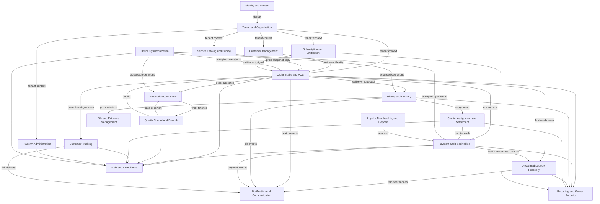
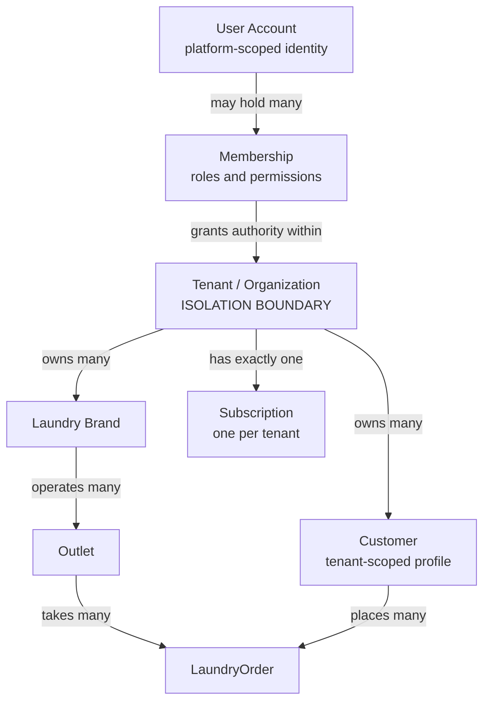

# Context Map — Aish Laundry App

**Step:** 1 — Product Requirement and Domain Model
**Status:** `NOT IMPLEMENTED` (documentation only; backend runtime `ABSENT`)
**Canonical source:** [`../MASTER_SOURCE.md`](../MASTER_SOURCE.md) v1.0.1

This document maps the relationships between the twenty bounded contexts defined in
[`BOUNDED_CONTEXTS.md`](BOUNDED_CONTEXTS.md). The diagrams are illustrations of the written rules
below; **a diagram never replaces a written rule**. Where a diagram and the prose appear to differ,
the prose governs.

---

## 1. Integration patterns used

Only four integration patterns appear in this model. Anything else requires a decision record.

| Pattern | Meaning | Where used |
| --- | --- | --- |
| **Conformist read** | The downstream context reads an upstream context's published interface and conforms to its shape. | Reporting reading order and payment records. |
| **Snapshot copy** | The downstream context copies data at a point in time and thereafter owns its copy, immune to upstream change. | Order Intake copying a price from Service Catalog and Pricing. |
| **Event subscription** | The downstream context reacts asynchronously to a published domain event. | Notification, Unclaimed Laundry Recovery, Tracking issuance. |
| **Anti-corruption layer** | An adapter isolates an external system so its vocabulary never enters the domain. | The WhatsApp provider abstraction; the payment gateway adapter. |

**Modules never reach into another module's tables.** Every arrow in this document is an interface
call or an event, never a shared query (Master Source §6.2).

---

## 2. The context map

### Reading the diagram

- **Everything descends from Tenant and Organization.** No business context operates without a
  server-derived tenant context. There is no arrow into a business context that bypasses it.
- **Identity and Access feeds Tenant and Organization, not the business contexts directly.** An
  authenticated identity is not authority; a verified membership is.
- **Service Catalog and Pricing has exactly one outgoing business arrow, and it is a snapshot copy.**
  Once an order line holds its price snapshot, no later catalog change reaches it.
- **Notification is a sink, never a source of business truth.** Every arrow into Notification is
  outbound; no arrow leaves Notification into a business context. This is the structural expression
  of the rule that a provider failure never changes business state.
- **Audit is a universal sink.** Every context that changes money, permission, or exposure writes to
  it.
- **Offline Synchronization is an inbound adapter**, not a peer. It converts queued client intent
  into accepted commands on the owning context, or rejects it. It never holds business truth.
- **Reporting has only inbound arrows.** It owns projections and is never a system of record.

---

## 3. Tenant relationship

### Written rules the diagram encodes

1. A User Account may hold memberships in **many** tenants; one owner may own or manage many tenants.
2. **Authorisation is evaluated against a Membership, never a bare User Account.** A session proves
   identity only.
3. A Tenant owns many Brands; a Brand operates many Outlets.
4. Subscription and billing operate at the **tenant** boundary — not per user, not per outlet.
5. **A Customer profile belongs to exactly one Tenant.** The same phone number in two tenants
   produces two unrelated profiles. Profiles are never merged because name, email, phone, device, or
   shared ownership match. There is no global shared customer profile.
6. Every business aggregate below the Tenant node carries tenant ownership. A client-supplied tenant
   identifier is never authorisation proof.
7. A tenant switcher exists wherever a user may belong to more than one tenant; switching re-derives
   context server-side, partitions client caches, and is audited.

---

## 4. Relationship register

Each row states the upstream context, the downstream context, the pattern, and the **rule that
constrains the relationship**.

| Upstream | Downstream | Pattern | Constraining rule |
| --- | --- | --- | --- |
| Identity and Access | Tenant and Organization | Conformist read | Identity confers no business authority. |
| Tenant and Organization | All business contexts | Conformist read | Tenant context is derived server-side; a request-supplied tenant id is a hint to verify, never a grant. |
| Service Catalog and Pricing | Order Intake and POS | **Snapshot copy** | The order copies price and rule evaluation at creation. Later catalog edits never reach it. |
| Customer Management | Order Intake and POS | Conformist read | Customer identity is tenant-scoped; no cross-tenant lookup exists to call. |
| Order Intake and POS | Production Operations | Event subscription | A production job exists only for an order already accepted in the same tenant and outlet. |
| Production Operations | Quality Control and Rework | Event subscription | Work reaches inspection; inspection alone authorises `READY_FOR_PICKUP`. |
| Quality Control and Rework | Production Operations | Event subscription | A failed inspection returns the order to `REWORK`. The rework loop is bounded and every cycle is recorded. |
| Quality Control and Rework | Order Intake and POS | Conformist read | Only `PASSED` or `WAIVED_WITH_AUTHORIZATION` permits `READY_FOR_PICKUP`. A waiver requires permission, a reason, and an audit entry. |
| Order Intake and POS | Payment and Receivables | Interface call | The order's amount due is authoritative on the server; a client-computed total is display only. |
| Order Intake and POS | Customer Tracking | Event subscription | Tracking access is issued as a **new high-entropy secret**, never derived from the order number. |
| Order Intake and POS | Unclaimed Laundry Recovery | Event subscription | Only `OrderReachedReadyForPickupFirstTime` opens a case. Subsequent ready events are ignored for aging. |
| Order Intake and POS | Pickup and Delivery | Interface call | A delivery job references exactly one order in the same tenant. |
| Pickup and Delivery | Courier Assignment and Settlement | Interface call | An external courier receives a scoped guest job link, never a membership. |
| Courier Assignment and Settlement | Payment and Receivables | Interface call | Courier cash is a financial transaction and inherits every financial rule, including idempotency and reversal-only correction. |
| Payment and Receivables | Unclaimed Laundry Recovery | Conformist read | Held invoices and unpaid balance are **read from** the financial records, never recomputed independently. |
| Unclaimed Laundry Recovery | Notification and Communication | Event subscription | Reminders respect quiet hours, deduplication, and opt-out. Each ladder stage fires once per order. |
| Any business context | Notification and Communication | Event subscription | **One-way only.** No notification outcome ever changes business state. |
| Offline Synchronization | Order Intake, Payment, Production, Pickup and Delivery | Anti-corruption layer | A queued operation carries a stable `ClientReference`, reused unchanged on retry. The server deduplicates on it. |
| Any context | File and Evidence Management | Interface call | Artefacts are private, tenant-scoped, unguessably keyed, and served only through signed expiring URLs. |
| Any context | Audit and Compliance | Interface call | For financial and security-relevant actions the audit write shares the transaction: no audit, no action. |
| All record-owning contexts | Reporting and Owner Portfolio | Event subscription | Consolidation is **within one tenant** only. A figure that cannot be computed is shown as unavailable, never as zero. |
| Platform Administration | Tenant and Organization | Interface call | An explicitly separated, audited path. Impersonation is time-bound; there is no silent tenant access. |
| Subscription and Entitlement | Order Intake and POS | Event subscription | Fair-use ceilings signal; they never stop a laundry mid-shift and never delete data. |

---

## 5. Anti-corruption layers

Two external systems touch the domain, and both are wrapped.

### 5.1 WhatsApp provider

- The domain speaks only `Notification`, `NotificationChannel`, template identity, and delivery
  outcome. No vendor SDK type, payload shape, error code, or identifier crosses into business logic.
- Swapping providers is an adapter and configuration change, never a product change.
- The manual deep-link fallback is a **separate, visible** path, never presented as automation.
- Provider costs are transparent and billed separately from the subscription plan.

### 5.2 Payment gateway

- The domain speaks only `Payment`, `Money`, `ClientReference`, and verification outcome.
- **Gateway callbacks are verified server-side** — signature, amount, currency, and status checked
  against the gateway, not trusted from the callback payload. Replays are rejected.
- **An order is never marked paid on a client claim.**
- An offline device may record a payment *intent*; it may never record a confirmed gateway payment.

---

## 6. Contexts that must never be merged

| Pair | Why separation is mandatory |
| --- | --- |
| Customer Tracking and Order Intake and POS | The public projection is a **separate read model** with its own masked fields. Merging them would make the internal representation one rendering bug away from a public leak. |
| Notification and any business context | Structural guarantee that provider failure cannot change business state. |
| Platform Administration and Tenant and Organization | Cross-tenant capability must live behind an explicitly separated, audited surface, never inside an ordinary tenant role. |
| Payment and Receivables and Reporting | Money has exactly one system of record. A reporting context that could write money would create a second, divergent truth. |
| Courier Assignment and Settlement and Identity and Access | An external ojek lokal must remain outside the identity system entirely: a guest job link, never an account. |

---

## 7. Status

Every context, relationship, and integration described here is `NOT IMPLEMENTED`. No module, adapter,
interface, or event bus exists. Backend runtime is `ABSENT`; Flutter workspace is `ABSENT`. This
document claims no test, build, deployment, CI run, or UAT.

---

## Related documents

- [`BOUNDED_CONTEXTS.md`](BOUNDED_CONTEXTS.md)
- [`AGGREGATE_CATALOG.md`](AGGREGATE_CATALOG.md)
- [`DOMAIN_EVENTS.md`](DOMAIN_EVENTS.md)
- [`COMMANDS_AND_POLICIES.md`](COMMANDS_AND_POLICIES.md)
- [`DATA_OWNERSHIP.md`](DATA_OWNERSHIP.md)
