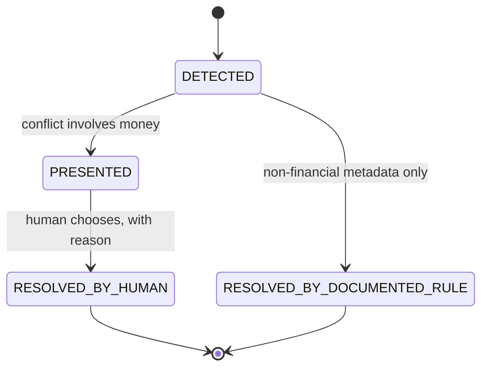

# Offline Synchronization Domain — Aish Laundry App

**Step:** 1 — Product Requirement and Domain Model
**Status:** `NOT IMPLEMENTED` (documentation only)
**Canonical source:** [`../MASTER_SOURCE.md`](../MASTER_SOURCE.md) v1.0.1

The Ops Android app runs at a laundry counter and on a courier's motorbike in Indonesian conditions:
patchy mobile data, dead zones, cheap devices, interruptions mid-transaction. **The app must keep
working offline, and it must never let a connectivity problem turn into a money problem.**

---

## 1. Scope

Primarily the **Aish Laundry Ops Android** surface. Owns: the persistent operation queue, retry
policy, submission, acceptance and rejection, conflict detection, and conflict resolution.

Owns no business truth. It is an **anti-corruption layer** that converts queued client intent into
accepted commands on the owning context, or rejects it.

---

## 2. The nine canonical offline rules

| # | Rule | ID |
| --- | --- | --- |
| 1 | **`ClientReference` on every important operation.** Generated once before the first attempt, persisted with the queued operation, and **reused unchanged on every retry**. | `OFF-001` |
| 2 | **Persistent queue.** Survives application restart, device reboot, and crash. An in-memory queue is not acceptable. | `OFF-002` |
| 3 | **Exponential backoff retry.** Spaced and bounded, never a tight loop against a struggling server. | `OFF-003` |
| 4 | **The financial queue is never casually deleted.** Not by a cache wipe, a logout, a version upgrade, or a developer convenience button. | `OFF-004` |
| 5 | **Payment conflicts are never silently overwritten.** The conflict surfaces with both values. | `OFF-010` |
| 6 | **The server is the final source of truth.** On divergence, server state prevails and the client reconciles. | `OFF-005` |
| 7 | **Local data is separated per tenant AND per user.** Switching either never exposes the previous context's cached data. | `OFF-006` |
| 8 | **Sensitive local data is encrypted**, using platform secure storage for credentials and tokens. | `OFF-014` |
| 9 | **A duplicate order or duplicate payment produced by a retry is unacceptable.** This is the defining requirement of the design, not a best-effort goal. | `OFF-007` |

---

## 3. `ClientReference` — the mechanism

The single most important detail in the entire offline design.

- The client generates a stable, unique `ClientReference` **before** the operation is attempted.
- It is **persisted with the queued operation**, so it survives a crash.
- It is **reused unchanged on every retry**, without exception.
- The server uses it as the **idempotency key** and returns the **original result** on a repeat
  (`OFF-017`).

> **Regenerating a `ClientReference` on retry defeats the entire mechanism. It is the highest-risk
> bug class in the whole offline design, and an operation retried with a regenerated reference is
> rejected outright** (`OFF-025`).

**Idempotency is a server contract, not a client trick.** The client cannot guarantee exactly-once
delivery over an unreliable network; the server can guarantee exactly-once *effect*. That asymmetry
is why the reference must be stable.

---

## 4. Queue behaviour

- **Ordering matters for dependent operations.** Create order, then add payment. An operation whose
  predecessor failed **does not jump ahead** (`OFF-009`).
- **A failed operation is never silently dropped.** It stays visible and actionable (`OFF-008`).
- **Replay after a long offline period reconciles correctly** rather than producing a burst of
  duplicates (`OFF-018`).
- **Application kill mid-submit does not lose the queued operation** (`OFF-019`).
- **Server timestamps are authoritative** for ordering and reporting. Client clock skew is expected
  (`OFF-015`).
- **Financial operations are pruned only after confirmed server acceptance**, never on a timer
  (`OFF-021`).

---

## 5. The financial queue

A queued payment **is money**. It is therefore governed more strictly than any other queued
operation.

- It is **never cleared** by a routine "clear cache", a version upgrade, a logout, or a developer
  convenience button (`OFF-004`).
- Removing a queued financial operation requires an **explicit, permissioned, audited action** —
  `AuthorizeFinancialQueuePurge`, emitting `OfflineQueuePurgeAuthorized` (`OFF-024`).
- A queued financial operation deleted without that audited action is a **financial integrity
  violation**.
- An **offline device may record a payment intent. It may never record a confirmed gateway payment**
  (`FIN-019`).

---

## 6. Conflict handling

**Explanation.** The split at `DETECTED` is the whole design. A conflict touching money **always**
takes the left branch to a human (`OFF-011`); there is no automatic resolution path for it, and
adding one would be a rejected design. A conflict touching non-financial metadata may take the right
branch **only if the last-write rule is written down in advance** — an undocumented automatic rule is
not permitted, because "the code does it this way" is not a policy.

Every resolution records **actor, timestamp, chosen value, and reason** (`OFF-012`).

---

## 7. Visible sync state

> **A kasir must never believe a payment was recorded when it is still sitting in a queue.**
> (`OFF-013`)

Offline and sync state are visible **at all times**: what is pending, what failed, what needs
attention. This is a UX requirement with a financial-integrity purpose. A confident green checkmark
over an unsynced payment is how a shift ends short at closing time.

---

## 8. Tenant and user partitioning

- **Local data is separated per tenant AND per user** (`OFF-006`).
- A tenant switch or user switch **never** exposes the previous context's cached data. Local cache
  surviving a switch is treated as a **tenant isolation defect** (`OFF-020`, `TEN-030`).
- A queued operation carries the **tenant and user it was captured under**, and is **rejected** if
  replayed under a different context (`OFF-016`).
- Sensitive local data is encrypted on device using platform secure storage for credentials and
  tokens (`OFF-014`).

---

## 9. What is honestly not offline

The product states its limits plainly rather than pretending to degrade gracefully (`OFF-023`):

- **Payment gateway confirmation requires the network.** An offline device records an intent, never a
  confirmed gateway payment.
- **OTP verification requires the network.**
- **Public tracking is server-rendered and requires the network by nature** (`TRK-027`).

---

## 10. Testing expectation (later Steps)

Recorded now so no later Step ships weaker. The Definition of Done for offline functionality requires
demonstrated tests for:

- retry after network loss produces **exactly one** order and **exactly one** payment;
- application kill mid-submit does not lose the queued operation;
- replay after a long offline period reconciles correctly;
- a tenant switch leaks no cached data;
- a payment conflict **surfaces** rather than overwrites.

No such test exists today.

---

## 11. NO-GO triggers

- A **duplicate order or duplicate payment caused by a retry** (`OFF-007`, `FIN-039`). Stop, preserve
  evidence at the exact SHA, notify the owner, fix, and add a regression test.
- A **queued financial operation deleted** without an audited, permissioned action (`OFF-024`).
- A **payment conflict resolved silently** (`OFF-010`).
- **Local cache surviving a tenant or user switch** (`OFF-020`) — a tenant isolation defect.
- An operation **retried with a fresh `ClientReference`** (`OFF-025`).

---

## 12. Status

The offline synchronization domain is `NOT IMPLEMENTED`. **Flutter workspace: `ABSENT`.** No client,
queue, retry policy, conflict handler, or sync path exists. Backend runtime is `ABSENT`. This
document claims no test, build, deployment, CI run, or UAT.

---

## Related documents

- [`PAYMENT_DOMAIN.md`](PAYMENT_DOMAIN.md)
- [`ORDER_DOMAIN.md`](ORDER_DOMAIN.md)
- [`PICKUP_DELIVERY_DOMAIN.md`](PICKUP_DELIVERY_DOMAIN.md)
- [`TENANT_BOUNDARIES.md`](TENANT_BOUNDARIES.md)
- [`DOMAIN_INVARIANTS.md`](DOMAIN_INVARIANTS.md)
