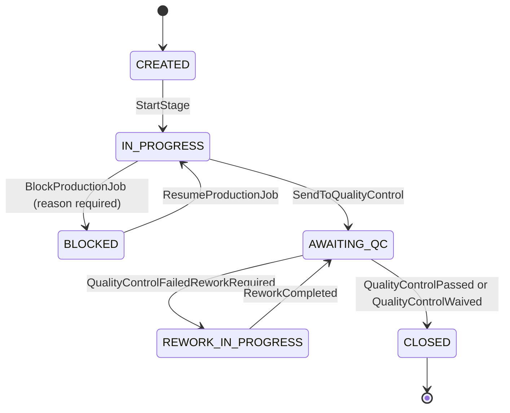

# Production and Quality Control Domain — Aish Laundry App

**Step:** 1 — Product Requirement and Domain Model
**Status:** `NOT IMPLEMENTED` (documentation only)
**Canonical source:** [`../MASTER_SOURCE.md`](../MASTER_SOURCE.md) v1.0.1
**State machines:**
[`../state-machines/PRODUCTION_STATE_MACHINE.md`](../state-machines/PRODUCTION_STATE_MACHINE.md),
[`../state-machines/QUALITY_CONTROL_STATE_MACHINE.md`](../state-machines/QUALITY_CONTROL_STATE_MACHINE.md)

Production turns an accepted order into finished laundry. Quality control decides whether that work
may be declared ready. Together they are the only path to `READY_FOR_PICKUP`.

---

## 1. Scope

Owns: production job creation, the physical stages, batching, blockers, the rework loop, inspection
verdicts, and waivers.

Does not own: order status authority (Order Intake and POS holds it), money, custody transfer, or
aging.

---

## 2. Production stages

The canonical stages map onto order statuses: **sorting**, **washing**, **drying**, **finishing**,
then **quality control**.

- Each stage records a real start and a real completion, with an actor and a server timestamp. **A
  stage is never back-filled as complete without an actor and a recorded time.**
- A batch groups items processed together in one machine load. **A batch never spans two tenants** —
  a shared machine load across tenants is not representable in this model.
- A blocker (machine down, missing item, unclear instruction) records a `ReasonCode` and is visible
  rather than hidden as a stalled job.
- Stage transitions are captured with a `ClientReference` and are idempotent, because the production
  floor is exactly where the network drops (`OFF-001`).

**Honesty rule.** Production timings feed capacity reporting and rework-rate metrics. A figure that
cannot be computed for a period is shown as unavailable, never as zero.

---

## 3. The rework loop

**Explanation.** The loop between `AWAITING_QC` and `REWORK_IN_PROGRESS` is deliberately unbounded in
the state machine but **bounded in policy**: every cycle is counted and recorded, and a job exceeding
the tenant's configured rework threshold surfaces to a manager rather than looping silently. `CLOSED`
is reachable **only** through a recorded inspection verdict — there is no path from `CREATED` or
`IN_PROGRESS` directly to `CLOSED`, because work cannot be skipped silently.

**Critically: a rework cycle never resets unclaimed aging** (`UCL-017`). If the order had already
reached `READY_FOR_PICKUP` once, the aging anchor is already fixed and immutable.

---

## 4. The four quality control statuses

`PENDING`, `PASSED`, `FAILED_REWORK_REQUIRED`, `WAIVED_WITH_AUTHORIZATION`. There is no fifth.

| Status | Meaning | Consequence |
| --- | --- | --- |
| `PENDING` | An inspection is open and undecided. | The order cannot reach `READY_FOR_PICKUP`. |
| `PASSED` | The work meets the standard. | The order may reach `READY_FOR_PICKUP`. |
| `FAILED_REWORK_REQUIRED` | The work does not meet the standard. | The order returns to `REWORK`. |
| `WAIVED_WITH_AUTHORIZATION` | The work is released despite a failed or incomplete inspection. | The order may reach `READY_FOR_PICKUP`, **and the waiver is permanently recorded**. |

---

## 5. The waiver rule

> **A waiver requires a permission, a reason, and an audit entry — all three, always.**

- **Permission.** Only a role holding the explicit waiver permission may waive. It is not a default
  capability of any operator role.
- **Reason.** A `ReasonCode` plus free text. "Customer waiting" is a legitimate reason; a blank field
  is not.
- **Audit entry.** Written in the same transaction as the waiver. **If the audit entry cannot be
  written, the waiver does not happen** (`FIN-038` applied to a non-financial gate).
- Where tenant policy requires separation of duties, the waiving actor may not be the actor who
  performed the failing inspection.
- Waiver rates are a monitored signal. A tenant whose waivers climb is a tenant whose quality process
  is failing, and the product surfaces that honestly rather than normalising it.

---

## 6. Forbidden transitions

| Forbidden | Why |
| --- | --- |
| `CREATED -> CLOSED` | Work cannot be skipped silently. |
| `AWAITING_QC -> CLOSED` without a recorded verdict | The verdict **is** the authorisation. |
| Any production transition setting the order to `READY_FOR_PICKUP` directly | Only `QualityControlPassed` or `QualityControlWaived` reaches ready. |
| `PASSED -> PENDING` or `PASSED -> FAILED_REWORK_REQUIRED` | A new inspection cycle is opened instead, so the earlier verdict remains in the record. |
| `FAILED_REWORK_REQUIRED -> PASSED` without an intervening rework cycle | Otherwise a failure could be silently overturned. |
| A waiver without an audit entry | See §5. |
| Any transition driven by a notification outcome | `NOT-001`. |

---

## 7. Evidence

Condition evidence captured at intake and defect photographs captured at inspection are **private
data**:

- stored in private object storage with tenant-scoped, unguessable keys (`TEN-023`);
- served only through signed, expiring URLs;
- **never exposed on the public tracking portal** (`TRK-017`, `DEL-021`);
- never deleted — evidence is append-only, and a correction is a superseding annotation.

They may show the inside of a customer's home or their personal garments. They are treated
accordingly.

---

## 8. Offline behaviour

- Stage start and completion, blocker records, and inspection verdicts are all capturable offline and
  queued with a stable `ClientReference` (`OFF-001`).
- A replayed stage completion does **not** create a second stage record.
- The operator always sees which records are pending sync (`OFF-013`).
- Physical work continues regardless; the record is reconstructed on reconnection. **No money is at
  risk in this domain**, which is why its failure mode is degraded rather than dangerous.

---

## 9. Tenant rules

- Jobs, batches, inspections, and evidence are tenant- and outlet-scoped (`TEN-015`).
- A production job references exactly one order in the same tenant and outlet.
- Staff performance data derivable from stage timings and inspection outcomes is tenant-scoped and
  never aggregated across tenants.

---

## 10. Status

The production and quality control domain is `NOT IMPLEMENTED`. No job, stage, batch, inspection, or
waiver path exists. Backend runtime is `ABSENT`. This document claims no test, build, deployment, CI
run, or UAT.

---

## Related documents

- [`ORDER_DOMAIN.md`](ORDER_DOMAIN.md)
- [`UNCLAIMED_LAUNDRY_DOMAIN.md`](UNCLAIMED_LAUNDRY_DOMAIN.md)
- [`DOMAIN_INVARIANTS.md`](DOMAIN_INVARIANTS.md)
