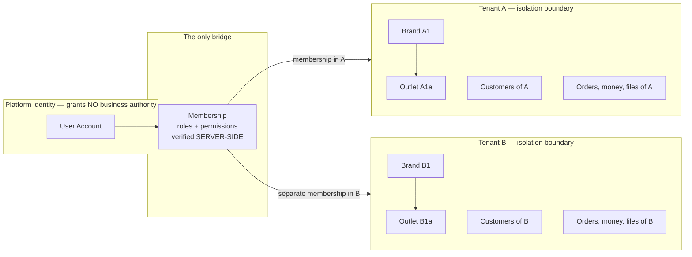

# Tenant Boundaries — Aish Laundry App

**Step:** 1 — Product Requirement and Domain Model
**Status:** `NOT IMPLEMENTED` (documentation only; no enforcement code exists)
**Canonical source:** [`../MASTER_SOURCE.md`](../MASTER_SOURCE.md) v1.0.1
**Decision records:** [DEC-0002](../decisions/DEC-0002-multi-tenant-architecture.md),
[DEC-0012](../decisions/DEC-0012-tenant-isolation-and-financial-integrity-hard-gate.md)

Tenant isolation is the product's central safety property. A single cross-tenant leak is not a bug to
schedule — it is a business-ending event for the tenant whose customer list, pricing, or revenue
becomes visible to a competitor. **Cross-tenant data exposure is an automatic `NO-GO`** (`TEN-030`).

Invariant identifiers are defined in [`DOMAIN_INVARIANTS.md`](DOMAIN_INVARIANTS.md).

---

## 1. The boundary

```
User Account -> Membership -> Tenant/Organization -> Laundry Brand -> Outlet
```

The **Tenant/Organization** node is the boundary. Everything above it is identity; everything below
it is tenant-owned data.



**Explanation.** One person may hold memberships in both Tenant A and Tenant B. Those memberships are
**two unrelated grants**. Nothing in the diagram permits data to travel horizontally between the two
tenant boxes — not a shared customer record, not a shared cache key, not a shared object-storage
prefix, not a consolidated report. The `User Account` node touches only `Membership`; it never touches
tenant data directly (`TEN-004`).

---

## 2. The thirteen hard rules, expressed in the domain model

| # | Master Source hard rule | Domain-model expression |
| --- | --- | --- |
| 1 | One user may join multiple tenants. | A `UserId` may be referenced by many `Membership` aggregates. |
| 2 | One owner may own or manage multiple tenants. | Ownership is a role on a `Membership`, not an attribute of a `UserId`. |
| 3 | A tenant may have multiple brands. | `Tenant` contains many `LaundryBrand`. |
| 4 | A brand may have multiple outlets. | `LaundryBrand` contains many `Outlet`. |
| 5 | A tenant switcher exists in every authenticated client. | `SwitchTenantContext` command; `TenantContextSwitched` event; policy P-28 partitions caches. |
| 6 | Subscription and billing operate at the tenant boundary. | Exactly one `Subscription` per `Tenant` (`TEN-002`, `TEN-017`). |
| 7 | Every business table has `tenant_id`. | Every business aggregate carries `TenantId` (`TEN-015`). An aggregate that cannot be traced to a `Tenant` is not representable. |
| 8 | All business queries are tenant-scoped. | Enforced by construction at the data-access layer, failing closed (`TEN-025`). |
| 9 | A client-supplied tenant identifier is never authorisation proof. | `TenantId` in a payload is an untrusted hint validated against memberships (`TEN-024`). |
| 10 | The backend verifies membership **and** permission on every request. | Every command in [`COMMANDS_AND_POLICIES.md`](COMMANDS_AND_POLICIES.md) is authorised server-side against a verified `Membership`. |
| 11 | Data is never merged because name, email, or phone match. | **No merge command exists in the model** (`TEN-012`). |
| 12 | Cross-tenant data exposure is an automatic `NO-GO`. | `TEN-030`, severity GATE. |
| 13 | The owner portfolio dashboard must not weaken tenant isolation. | Reporting consolidates **within one tenant** only; an owner with several tenants switches tenants. |

---

## 3. Every surface that must carry a tenant dimension

A tenant boundary is only as strong as its weakest carrier. The following list is exhaustive for this
model; a surface not on it that later appears must be added before it ships.

| Surface | Requirement |
| --- | --- |
| Business records | `TenantId` on every aggregate (`TEN-015`). |
| Queries | Tenant scope applied by construction; missing scope yields **no rows** (`TEN-025`). |
| Cache keys | A tenant dimension in every key. **A tenant-less cache key is a cross-tenant leak waiting to happen** (`TEN-026`). |
| Queue messages | Explicit tenant context in the payload; a job never infers it from "the last request" (`TEN-027`). |
| Background jobs and schedulers | Explicit tenant context (`TEN-027`). |
| Search indexes | Tenant-partitioned; a query never spans partitions. |
| Exports and report files | Tenant-scoped, and carrying the same access rules as the underlying records. |
| Object-storage keys | Tenant-scoped and **unguessable**; buckets never publicly readable or listable (`TEN-023`). |
| Signed URLs | Short-lived, scoped to one artefact, never a directory listing. |
| Device-local storage | Partitioned **per tenant AND per user** (`OFF-006`). |
| Offline queue entries | Carry the capture tenant and user; rejected if replayed elsewhere (`OFF-016`). |
| Notification sends | Record tenant, outlet, order, recipient, template, category, status, timestamp, provider reference (`NOT-019`). |
| Templates | Tenant-scoped (`NOT-023`). |
| Tracking access | Scoped to exactly one order in exactly one tenant (`TRK-020`); context derived server-side from the stored record (`TRK-021`). |
| Guest job links | Tenant-scoped; two tenants engaging one rider issue two unrelated links with no traversal (`DEL-009`). |
| Audit entries | Tenant context recorded (`TEN-022`). |
| Telemetry | Tenant identifier for filtering only — **never as personal data**, and never a bypass around isolation. |
| Reporting projections | Built per tenant; consolidation never widens the query surface. |

---

## 4. The customer identity rule, stated at length

This rule is restated in full because it is the one most likely to be "optimised" away by someone
trying to be helpful.

**A `Customer` profile belongs to exactly one Tenant** (`TEN-011`).

- The same phone number appearing in two tenants produces **two unrelated tenant customer profiles**.
  That is the correct outcome, not a data-quality problem.
- Profiles are **never** merged, linked, deduplicated, or cross-referenced because name, email, phone
  number, device fingerprint, or the identity of the tenant owner match (`TEN-012`).
- **There is no global shared customer profile by default.** Creating one would be a product decision
  requiring the repository owner and a decision record; it is not an implementation choice.
- Consent, notification preference, loyalty balance, and deposit balance are all recorded **per
  customer per tenant** (`TEN-013`). A deposit with one tenant is not spendable with another.
- Two laundry businesses on this platform are frequently competitors serving the same neighbourhood.
  A shared customer record would tell each of them who the other serves. That is the leak this rule
  prevents.

**Consequence for the model.** No `MergeCustomerProfiles` command, no cross-tenant lookup endpoint,
no deduplication job, and no "possible duplicate" suggestion that spans tenants exists anywhere in
this design.

---

## 5. Legitimate cross-tenant capability, and how it is bounded

Exactly two capabilities legitimately span tenants. Both are bounded structurally.

### 5.1 The tenant switcher

A user with memberships in several tenants sees a switcher. Switching:

1. re-derives a **new server-side tenant context** bound to the verified membership;
2. **clears or partitions client-side caches** so no data from the previous tenant remains visible
   (`OFF-020`, policy P-28);
3. is recorded in the audit trail.

The switcher moves a *session's* context. It never returns data from two tenants in one response.

### 5.2 Platform administration

Platform administration operates the SaaS itself. It is bounded by:

- an **explicitly separated surface**, never a relaxation of tenant scoping for an ordinary role
  (`TEN-029`);
- **time-bound impersonation** with a start, an end, a reason, and an actor;
- an **immutable audit record** readable by the tenant it concerns;
- the rule that **platform support has no silent tenant access** — if the audit entry cannot be
  written, the impersonation does not start (`FIN-038` analogue for access).

### 5.3 What is not legitimate

The owner portfolio dashboard consolidates **within one tenant** across that tenant's brands and
outlets. An owner holding several tenants **switches tenants**. Consolidation across tenants is never
achieved by widening a query, relaxing a scope, or adding a "global" flag. If a genuine cross-tenant
view is ever wanted, it is an explicitly consented, separately authorised construct with its own
decision record — not an implementation shortcut (Master Source §12.2, hard rule 13).

---

## 6. Fail-closed design

The boundary is designed so that a mistake produces **nothing**, never **someone else's data**.

| Failure mode | Designed outcome |
| --- | --- |
| A developer forgets to apply a tenant scope | The query returns **no rows** (`TEN-025`). |
| A tenant context cannot be resolved | The command is rejected. No permissive default exists. |
| A cache key is built without a tenant dimension | The key construction itself is invalid; there is no fallback path that omits it. |
| A background job starts without explicit tenant context | The job refuses to run rather than inferring context (`TEN-027`). |
| An audit entry cannot be written for a financial or security action | The action does not proceed (`FIN-038`). |
| An offline operation is replayed under a different tenant or user | It is rejected (`OFF-016`). |
| A tracking token resolves but the stored record's tenant cannot be established | The lookup fails (`TRK-021`). |

---

## 7. Negative testing expectation (later Steps)

Recorded now so that no later Step ships a weaker guarantee. When tenant functionality is built in
Step 3 and beyond, isolation must be covered by **explicit negative tests**: a member of Tenant A
must be proven unable to read, list, count, search, filter, export, or mutate any record of Tenant B —
including via identifier guessing, filter parameters, report endpoints, aggregate counts, cache
warming, search indexes, and file URLs. **Absence of such tests blocks the Definition of Done.**

No such test exists today. Nothing in this document is verified.

---

## 8. Violation handling

- **Any actual or suspected cross-tenant exposure** — automatic `NO-GO`. Stop feature work
  immediately, notify the repository owner, preserve evidence at the exact commit SHA, and ship
  nothing else from the branch until the defect is fixed and covered by a regression test.
- **A business aggregate without tenant ownership** — the design is rejected until it carries one.
- **Authorisation derived from a client-supplied tenant identifier** — a security defect of the
  highest severity, not a code-style comment.
- **A proposal to relax isolation for convenience, performance, reporting, or a demo** — refused and
  escalated to the owner. There is no staging exemption.
- **A proposal to merge customer profiles across tenants** — refused; it requires an owner decision
  record and is not an engineering choice.

---

## 9. Status

No tenancy implementation exists. There is no membership check, no query scope, no cache key, and no
test. Everything above is `NOT IMPLEMENTED` and **unverified**. Backend runtime is `ABSENT`; Flutter
workspace is `ABSENT`.

---

## Related documents

- [`DOMAIN_INVARIANTS.md`](DOMAIN_INVARIANTS.md)
- [`DATA_OWNERSHIP.md`](DATA_OWNERSHIP.md)
- [`BOUNDED_CONTEXTS.md`](BOUNDED_CONTEXTS.md)
- [`OFFLINE_SYNC_DOMAIN.md`](OFFLINE_SYNC_DOMAIN.md)
