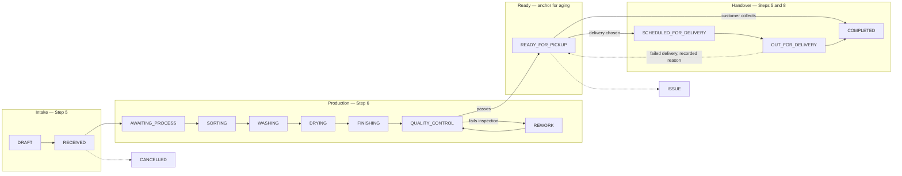

# Aish Laundry App — Operational Journeys

**Document version: 1.0.0** · **Step: 1 — Product Requirement and Domain Model**
**Status of every journey described here: NOT IMPLEMENTED**

Canonical source: [`../MASTER_SOURCE.md`](../MASTER_SOURCE.md) §7, §8, §10, §13, §16.
Subordinate to the Master Source.

Scope: journeys experienced by **staff-side and platform-side personas**. Customer-side journeys are in
[`USER_JOURNEYS.md`](USER_JOURNEYS.md).

Related: [`PERSONAS.md`](PERSONAS.md) · [`USE_CASE_CATALOG.md`](USE_CASE_CATALOG.md) ·
[`PRODUCT_REQUIREMENTS.md`](PRODUCT_REQUIREMENTS.md)

The canonical order status machine is owned by `docs/state-machines/ORDER_STATUS_MACHINE.md`. The domain
entities referenced here are defined in `docs/domain/DOMAIN_GLOSSARY.md`.

All example data is fictional: outlet "Outlet Contoh Pusat", brand "Laundry Contoh", customer
*Budi Santoso*, phone `+62-8xx-XXXX-1234`, address `Jl. Contoh No. 1, Jakarta`.

---

## 1. Operational flow overview



**Explanation — the diagram does not replace these rules.**

- The diagram is an **illustration of the operational flow**, not the authoritative transition table. The
  legal transitions are defined in `docs/state-machines/ORDER_STATUS_MACHINE.md`.
- The **first** arrival at `READY_FOR_PICKUP` records an immutable timestamp that anchors
  unclaimed-laundry aging. A `REWORK` loop followed by a second arrival at `READY_FOR_PICKUP` does
  **not** reset it ([`../MASTER_SOURCE.md`](../MASTER_SOURCE.md) §11.1).
- `CANCELLED` and `ISSUE` are reachable outcomes with recorded reasons, not error dead-ends.
- A **failed delivery returns the laundry to the outlet** and the order returns to a defined status with
  a recorded reason (§10.2 rule 5).
- Whether a tenant may configure a shorter production stage sequence — for example skipping `SORTING`
  for a satuan order — is an open question, OQ-003 in
  [`ASSUMPTIONS_AND_OPEN_QUESTIONS.md`](ASSUMPTIONS_AND_OPEN_QUESTIONS.md).

---

## 2. OJ-001 — Take an order at the counter

| Field | Detail |
| --- | --- |
| Persona | Cashier (P-06) |
| Jobs served | JTBD-010, JTBD-012, JTBD-014 |
| Surface | Aish Laundry Ops Android |
| Canonical Step | Step 5 |
| Requirements | FR-021 … FR-030, FR-031 … FR-040, FR-048 … FR-060, FR-061 … FR-070 |
| Status | NOT IMPLEMENTED |

**Main flow.**

1. The kasir starts a new order. The order exists as `DRAFT`.
2. The kasir identifies the customer by phone number, or creates a new customer profile. The profile is
   **tenant-scoped**; an identical phone number in another tenant is an entirely separate profile and is
   never merged ([`../MASTER_SOURCE.md`](../MASTER_SOURCE.md) §4.2 rule 11).
3. The kasir adds order lines: kiloan by weight, satuan by item, packages, and add-ons.
4. Prices are read from the brand's active price list. **The order captures the price that applied when
   it was created**; a later price-list edit never changes it (§16.4).
5. The total is computed **server-side** in **integer Rupiah**. A client-computed total is display only.
   Floating point is forbidden anywhere in the money path (§16.1).
6. The kasir takes full payment, a deposit, or records the order as unpaid.
7. The order moves to `RECEIVED`. A nota is produced and a tracking link is issued and sent.

**Alternate flows.**

- **A-1 Offline.** Every step above works offline. The operation carries a `client_reference` generated
  once before the first attempt and reused on every retry. The queue persists across app kill and device
  reboot. Pending versus synced state is visible to the kasir at all times (§13.1, §13.2).
- **A-2 Price override.** Requires an explicit permission and a recorded reason. Without the permission,
  the override is refused, not hidden.
- **A-3 Existing customer with a saved address.** Reused, subject to the tenant's masking rules.

**Exception flows.**

- **E-1 Double tap or retry.** The `client_reference` makes the server treat the repeat as the same
  logical operation. **Exactly one order and exactly one payment result.** A duplicate payment created by
  a retry is a financial integrity failure and an automatic NO-GO (§16.6).
- **E-2 Payment gateway unreachable.** An offline device may record an **intent**, never a confirmed
  gateway payment. The product is honest that gateway confirmation requires the network (§13.3).
- **E-3 The customer walks away mid-order.** The order stays `DRAFT` or moves to `CANCELLED` with a
  reason. It never sits in an undefined state.

**Definition-of-done anchors for this journey.** Retry idempotency, duplicate callback replay rejection,
and historical price immutability are all mandatory tested behaviours from the Step that introduces them
(§28.3).

---

## 3. OJ-002 — Run a production shift

| Field | Detail |
| --- | --- |
| Personas | Production Operator (P-07), Quality Control (P-08) |
| Jobs served | JTBD-015, JTBD-016, JTBD-017 |
| Surface | Aish Laundry Ops Android |
| Canonical Step | Step 6 |
| Requirements | FR-071 … FR-080, FR-081 … FR-085 |
| Status | NOT IMPLEMENTED |

**Main flow.**

1. The operator opens the production queue for their outlet, scoped to the tenant.
2. Orders move through the stages: `AWAITING_PROCESS`, `SORTING`, `WASHING`, `DRYING`, `FINISHING`.
3. Stage progress is recorded at the machine, in one action, working offline.
4. The order enters `QUALITY_CONTROL`.
5. Quality control passes the order. It reaches `READY_FOR_PICKUP` — and if this is the **first** time,
   the immutable aging anchor is recorded.
6. A transactional "ready" notification is sent with the tracking link.

**Alternate flows.**

- **A-1 Inspection fails.** The order moves to `REWORK` with a recorded defect reason, returns through
  the necessary stages, and re-enters `QUALITY_CONTROL`. **The aging anchor is not touched.**
- **A-2 Batch processing.** Several orders move through a stage together while remaining individually
  identifiable. Per-item tracking is a Step 6 capability.
- **A-3 Special handling instruction.** Visible to the operator on the order before the stage starts.

**Exception flows.**

- **E-1 Item damaged or missing.** Flagged against the specific order. The order may move to `ISSUE` with
  a reason. The customer is not left to discover it at the counter.
- **E-2 Device offline for a whole shift.** All stage records queue locally and sync later. Server
  timestamps are authoritative for ordering; clock skew on the device does not corrupt the record.
- **E-3 An operator attempts to skip quality control** where tenant policy requires it. The transition is
  refused server-side.

---

## 4. OJ-003 — Close a shift and reconcile cash

| Field | Detail |
| --- | --- |
| Personas | Outlet Manager (P-05), Finance (P-11) |
| Jobs served | JTBD-018, JTBD-032 |
| Surface | Aish Laundry Ops Android for closing; Aish Laundry Console Web for review |
| Canonical Step | Step 10, using payment records created in Step 5 |
| Requirements | FR-061 … FR-070, RPT-001 … RPT-020 |
| Status | NOT IMPLEMENTED |

**Main flow.**

1. At the end of a shift the manager initiates shift closing.
2. The system presents **expected cash**, derived from the authoritative payment records in integer
   Rupiah.
3. The manager counts and enters **actual cash**.
4. The system computes the variance and **records it explicitly**. A variance beyond the configured
   threshold requires a reason (§16.5 rule 10).
5. The shift closes with an auditable record: actor, tenant, outlet, timestamp, expected, actual,
   variance, reason.

**Rules that constrain this journey.**

- A variance is **never** masked, auto-rounded away, absorbed, or suppressed from a report. A visible
  discrepancy is a feature; a hidden one is not.
- Shift closing must be serialised so that concurrent operations cannot produce two closings for the same
  shift.
- No financial transaction is deleted at any point. Corrections are reversal or adjustment entries that
  preserve the original record (§16.3).

**Exception flows.**

- **E-1 Pending offline payments at closing time.** The manager sees them plainly as pending. Expected
  cash makes their state unambiguous. A kasir must never believe money settled when it is still queued
  (§13.2).
- **E-2 A payment conflict is unresolved.** Both values are surfaced to a human. Software never silently
  picks a winner on a money conflict (§13.1 rule 5).

---

## 5. OJ-004 — Run a courier route

| Field | Detail |
| --- | --- |
| Personas | Courier Internal (P-09), Outlet Manager (P-05) |
| Jobs served | JTBD-021, JTBD-022, JTBD-023, JTBD-024 |
| Surface | Aish Laundry Ops Android |
| Canonical Step | Step 8 |
| Requirements | FR-100 … FR-111 |
| Status | NOT IMPLEMENTED |

```mermaid
sequenceDiagram
    participant M as Outlet Manager
    participant S as Aish Laundry backend
    participant K as Courier (Ops Android)
    participant C as Customer at the door

    M->>S: Assign jobs to courier for a route
    S-->>K: Ordered job list (usulan rute — a suggestion)
    K->>C: Arrive within the stated time window
    C-->>K: Identify recipient
    K->>K: Capture proof (OTP / photo / signature / recipient name)
    K->>K: Record cash collected, if any (integer Rupiah)
    Note over K,S: If offline, both are queued with a stable client_reference
    K-->>S: Sync proof and cash on reconnect
    K->>M: Hand over cash at end of route
    M->>S: Reconcile expected vs actual; record variance explicitly
```

**Explanation — the diagram does not replace these rules.**

- The job list is presented as **usulan rute**. The product never claims an optimal route and never
  guarantees an arrival time ([`../MASTER_SOURCE.md`](../MASTER_SOURCE.md) §10.2 rule 4, §23 non-goal 7).
  A **time window** is what the customer is given (§10.1).
- **Proof is mandatory for every custody transfer.** No parcel silently changes hands (§10.2 rule 1).
  Proof artefacts are private data stored in private object storage and served only through signed,
  expiring URLs. They never appear on the public tracking portal (§15.3, §17.2).
- Cash collected at the door is a **financial transaction** and inherits §16 in full.
- Offline proof capture and offline cash recording are required, because couriers lose signal (§13).
- Courier cash reconciliation compares expected against actual per courier, per shift or route, and any
  variance is recorded and acknowledged, never absorbed silently (§16.5 rule 11).

**Exception flows.**

- **E-1 Nobody home.** The delivery fails with a recorded reason. The laundry returns to the outlet and
  the order returns to a defined status.
- **E-2 The customer pays less than the amount due.** The shortfall is recorded. It is never written off
  automatically; no automated system decides refunds, writes off balances, or adjusts cash (§23 non-goal
  8).
- **E-3 The courier's phone dies mid-route.** The persistent queue survives app kill and device restart.
  Proof already captured is not lost.

---

## 6. OJ-005 — Use an external local courier

| Field | Detail |
| --- | --- |
| Personas | Outlet Manager (P-05), External Local Courier (P-10) |
| Jobs served | JTBD-025, JTBD-026 |
| Surface | Ops Android for issuing; a plain browser for the external rider |
| Canonical Step | Step 8 |
| Requirements | FR-100 … FR-111; the `DEL` and `SEC` series |
| Status | NOT IMPLEMENTED |

**Main flow.**

1. The manager assigns a job to an external local courier.
2. The system issues a **guest job link**: high-entropy token, stored hashed server-side, not the order
   number and not derivable from it, expiring, revocable, tenant-scoped, and scoped to exactly one job.
3. The rider opens the link in their own browser. No account, no membership, no installation.
4. The rider sees only what the job genuinely requires. Not the customer's order history, not other
   orders, not pricing, not any other tenant data, and never a full customer address in a shareable or
   indexable form.
5. The rider completes the job and captures the required proof.
6. The link is revoked or expires.

**Constraints.**

- A rider working for two tenants receives **two unrelated links** and can never traverse from one to the
  other ([`../MASTER_SOURCE.md`](../MASTER_SOURCE.md) §4, §10.2 rule 3).
- The link is a minimum-privilege temporary credential. A guessable, non-expiring, non-revocable, or
  plaintext-stored link is a security defect of the highest severity.
- The external rider is **never** granted a membership account. This is a design invariant, not a
  configuration.

---

## 7. OJ-006 — Work the unclaimed-laundry dashboard

| Field | Detail |
| --- | --- |
| Personas | Outlet Manager (P-05), Tenant Owner (P-03) |
| Jobs served | JTBD-030 |
| Surface | Aish Laundry Console Web and Ops Android |
| Canonical Step | Step 9 |
| Requirements | FR-112 … FR-117; RPT-011 … RPT-014 |
| Status | NOT IMPLEMENTED |

**Main flow.**

1. The manager opens the unclaimed-laundry dashboard, scoped to their tenant and permitted outlets.
2. The dashboard shows, at minimum, all nine canonical fields: order count, customer count, held
   invoices, unpaid balance, order age, outlet, last reminder, follow-up officer, and reason not
   collected ([`../MASTER_SOURCE.md`](../MASTER_SOURCE.md) §11.3).
3. At H+7 an assignable follow-up task exists with a named owner. The manager works it.
4. At H+14 the escalation surfaces to the manager and the owner.
5. The manager records the **reason not collected** — the field that actually reduces the pile.
6. Where appropriate the manager offers **delivery** as a recovery action, which is often the strongest
   remedy (§10.3).

**Constraints.**

- Unpaid balance and held invoices are **read from the authoritative financial records** and are integer
  Rupiah. They are never recomputed independently by the reporting layer (§12.4 rule 1, §16).
- Every figure is tenant-scoped.
- A dashboard missing any of the nine fields does not meet the Definition of Done for Step 9.
- **No disposal.** The dashboard offers reminding, escalating, delivering, and recording. It never offers
  discarding, selling, auctioning, donating, or transferring ownership, at any age or balance
  (§11.4).

---

## 8. OJ-007 — Review the owner portfolio

| Field | Detail |
| --- | --- |
| Persona | Tenant Owner (P-03) |
| Jobs served | JTBD-028, JTBD-029, JTBD-031 |
| Surface | Aish Laundry Console Web |
| Canonical Step | Step 10 |
| Requirements | RPT-001 … RPT-020 |
| Status | NOT IMPLEMENTED |

**Main flow.**

1. The owner opens the portfolio for the current tenant.
2. They see revenue by day, outlet, brand, and service type; orders taken, in production, ready,
   delivered, cancelled; cash expected versus actual per shift and courier cash outstanding; unpaid
   balance and held invoices; unclaimed aging buckets and pending escalations; time-window adherence,
   rework rate, and capacity pressure; and subscription plan, usage against fair-use limits, and trial or
   renewal state ([`../MASTER_SOURCE.md`](../MASTER_SOURCE.md) §12.3).
3. They drill from any aggregate to the underlying records, within their permission and within the
   tenant.

**Trust rules that constrain this journey (§12.4).**

1. Every number derives from the same system of record operations use. There is no separate reporting
   truth.
2. Any figure that is an estimate is **labelled** an estimate.
3. A figure that cannot be computed for a period is shown as **unavailable**, never as zero.
4. Drill-down is possible for a user with permission, inside the same tenant.

**Isolation rule.** An owner who owns multiple tenants **switches tenants** to see the other tenant.
Consolidation across tenants is never achieved by widening the query surface. Hard rule 13 applies
without exception (§12.2).

---

## 9. OJ-008 — Configure a tenant and onboard an outlet

| Field | Detail |
| --- | --- |
| Persona | Tenant Admin (P-04) |
| Jobs served | JTBD-034, JTBD-035 |
| Surface | Aish Laundry Console Web |
| Canonical Step | Steps 3 and 4 |
| Requirements | FR-001 … FR-020, FR-021 … FR-047 |
| Status | NOT IMPLEMENTED |

**Main flow.**

1. The admin creates a brand under the tenant, then an outlet under the brand.
2. They configure outlet master data: operating hours, capacity, service zones, printers, shift
   definitions.
3. They publish a price list for the brand.
4. They invite staff and assign roles. Every role starts with nothing and is granted what it needs
   (§7.3 rule 3).
5. They configure tenant policies, including the proof requirements for pickup and delivery and the
   quiet-hours configuration.

**Constraints.**

- Publishing a new price list affects **future orders only**. Historical orders and reprinted nota show
  the original price (§16.4).
- The permission model itself is canonical and not tenant-editable; roles are configurable **within** it
  (§7.3 rule 5).
- Revoking a staff member's access must take effect immediately, including session revocation and device
  revocation (§15.4 rules 14 and 15).

---

## 10. OJ-009 — Platform support responds to a tenant

| Field | Detail |
| --- | --- |
| Personas | Platform Support (P-02), Platform Super Admin (P-01) |
| Jobs served | JTBD-040, JTBD-041 |
| Surface | Aish Laundry Console Web, platform surface |
| Canonical Step | Step 12 |
| Requirements | SUB-016 … SUB-020 |
| Status | NOT IMPLEMENTED |

**Main flow.**

1. A tenant reports a problem that support cannot reproduce from platform telemetry alone.
2. Support starts an impersonation session with a **recorded reason** and an explicit **time bound**.
3. The impersonated state is unmistakable in the interface — a persistent indicator that does not rely on
   colour alone.
4. Support reproduces the problem, records findings, and ends the session.
5. The start, end, actor, tenant, duration, and reason form an immutable audit record.

**Absolute rule.** **Platform support has no silent tenant access.** There is no invisible back door into
tenant data. Silent or unaudited platform access to tenant data is an automatic NO-GO
([`../MASTER_SOURCE.md`](../MASTER_SOURCE.md) §15.5, §17.2 rule 5).

---

## 11. OJ-010 — Handle a subscription lifecycle event

| Field | Detail |
| --- | --- |
| Personas | Tenant Owner (P-03), Platform Super Admin (P-01) |
| Jobs served | JTBD-036, JTBD-037, JTBD-038, JTBD-039 |
| Surface | Aish Laundry Console Web |
| Canonical Step | Step 12 |
| Requirements | SUB-001 … SUB-020 |
| Status | NOT IMPLEMENTED |

**Main flow.**

1. A tenant begins with **Trial: 14 hari gratis**.
2. Usage is metered against the plan's limits, tenant-scoped and enforced server-side.
3. Approaching a fair-use ceiling triggers an honest notice and a plan recommendation.
4. The tenant upgrades, downgrades, or lets the subscription lapse.
5. WhatsApp provider fees are reported **separately** from the subscription plan and shown transparently
   ([DEC-0011](../decisions/DEC-0011-transparent-third-party-messaging-costs.md)).

**Constraints.**

- Exceeding a fair-use ceiling **does not** silently degrade service, delete data, or stop a laundry
  operating mid-shift ([`../MASTER_SOURCE.md`](../MASTER_SOURCE.md) §21.5).
- A lapsed subscription **does not** block export of the tenant's own business data per policy (§17.3,
  §21.4 guardrail 9).
- There is **no lifetime cloud plan** ([DEC-0010](../decisions/DEC-0010-no-lifetime-cloud-subscription.md))
  and **no per-nota fee on normal plans** (§21.4 guardrails 1 and 2).
- The security baseline, tenant isolation, and encrypted backup are on **every** plan including Starter.
  They are never upsells (§21.4 guardrails 4, 5, 6).
- **"Unlimited WhatsApp" is never promised** (§14.1 rule 10).

---

## 12. Journey-to-requirement summary

| Journey | Personas | Canonical Step | Primary requirement ranges |
| --- | --- | --- | --- |
| OJ-001 Take an order | P-06 | Step 5 | FR-048 … FR-070 |
| OJ-002 Run a production shift | P-07, P-08 | Step 6 | FR-071 … FR-085 |
| OJ-003 Close a shift and reconcile cash | P-05, P-11 | Steps 5 and 10 | FR-061 … FR-070, RPT-005 … RPT-010 |
| OJ-004 Run a courier route | P-09, P-05 | Step 8 | FR-100 … FR-111 |
| OJ-005 Use an external local courier | P-05, P-10 | Step 8 | FR-104, FR-108 … FR-111 |
| OJ-006 Work the unclaimed dashboard | P-05, P-03 | Step 9 | FR-112 … FR-117, RPT-011 … RPT-014 |
| OJ-007 Review the owner portfolio | P-03 | Step 10 | RPT-001 … RPT-020 |
| OJ-008 Configure a tenant | P-04 | Steps 3 and 4 | FR-001 … FR-047 |
| OJ-009 Platform support response | P-02, P-01 | Step 12 | SUB-016 … SUB-020 |
| OJ-010 Subscription lifecycle | P-03, P-01 | Step 12 | SUB-001 … SUB-020 |

---

## 13. Status

Every operational journey in this document is **NOT IMPLEMENTED**. Backend runtime is **ABSENT**. Flutter
workspace is **ABSENT**. No journey has been built, tested, piloted, or observed in a real outlet.
