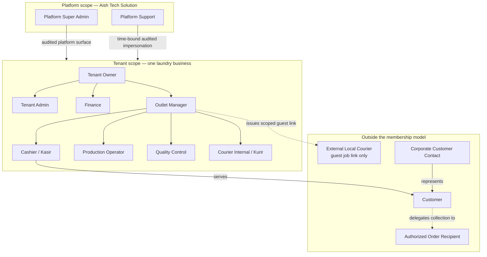

# Aish Laundry App — Personas

**Document version: 1.0.0** · **Step: 1 — Product Requirement and Domain Model**
**Status of every capability described here: NOT IMPLEMENTED**

Canonical source: [`../MASTER_SOURCE.md`](../MASTER_SOURCE.md) §7 (Roles), §5 (Platforms), §17 (Privacy).
Subordinate to the Master Source in every respect. Where this file and the Master Source disagree, the
Master Source wins and this file is defective.

Related: [`JOBS_TO_BE_DONE.md`](JOBS_TO_BE_DONE.md) · [`USER_JOURNEYS.md`](USER_JOURNEYS.md) ·
[`OPERATIONAL_JOURNEYS.md`](OPERATIONAL_JOURNEYS.md) · [`PRODUCT_REQUIREMENTS.md`](PRODUCT_REQUIREMENTS.md)

---

## 0. How to read this document

Fourteen personas are canonical for Step 1. Each persona is described against a fixed template so that
later Steps can be checked against it mechanically:

| Field | Meaning |
| --- | --- |
| Goals | What the person is trying to achieve when they open the product |
| Pain points | What currently goes wrong for them without the product |
| Responsibilities | What the business holds them accountable for |
| Devices | The hardware they realistically use |
| Connectivity | The network conditions the design must survive |
| Frequency | How often they interact with the product |
| Sensitive data exposure | The personal or financial data they can legitimately see |
| Critical actions | Actions the product must make fast and reliable for them |
| Prohibited actions | Actions the product must refuse them |
| Success metrics | What "the product worked for this person" will be measured by |
| Accessibility | Specific accessibility constraints for this persona |

**Two persona-level rules are absolute.**

1. **Authorisation is derived from a Membership, never from a persona label.** A persona is a design
   artefact. The runtime check is always membership + permission, server-side, tenant-scoped
   ([`../MASTER_SOURCE.md`](../MASTER_SOURCE.md) §4.2 rules 9 and 10).
2. **The External Local Courier does NOT get a membership account.** They are not a user of the platform.
   They receive a scoped, expiring, revocable **guest job link** granting exactly one job and nothing
   else ([`../MASTER_SOURCE.md`](../MASTER_SOURCE.md) §10.1, §10.2 rule 3,
   [DEC-0007](../decisions/DEC-0007-pickup-and-delivery-as-core-product.md)).

All example names, numbers, and addresses in this repository are **fictional** and deliberately
recognisable as such, because this repository is PUBLIC
([`../MASTER_SOURCE.md`](../MASTER_SOURCE.md) §15.8,
[DEC-0016](../decisions/DEC-0016-public-repository-visibility-accepted-deviation.md)).

---

## 1. Actor map

**Explanation of the diagram — the diagram does not replace these rules.**

- The Platform box and the Tenant box are **separate authorisation surfaces**. A platform role is never a
  shortcut into tenant data; it is a distinct, audited path
  ([`../MASTER_SOURCE.md`](../MASTER_SOURCE.md) §4.3, §7.3 rule 2).
- Every arrow inside the Tenant box represents an organisational relationship, **not** an inherited
  permission. A Tenant Owner does not automatically hold a Cashier's permissions; each permission is
  granted explicitly under least privilege (§7.3 rule 3).
- The dotted arrow to External Local Courier is deliberately dotted: no membership is created, no account
  exists, and the link expires.
- Customer, Corporate Customer Contact, and Authorized Order Recipient sit outside the tenant staff
  model. They interact through the Portal Tracking Publik and, optionally, the Customer Android app. The
  app is an enhancement, never a prerequisite
  ([DEC-0014](../decisions/DEC-0014-customer-android-does-not-replace-public-tracking.md)).

---

## 2. Persona index

| # | Persona | Scope | Primary surface | Membership account |
| --- | --- | --- | --- | --- |
| P-01 | Platform Super Admin | Platform | Aish Laundry Console Web | Yes, platform-scoped |
| P-02 | Platform Support | Platform | Aish Laundry Console Web | Yes, platform-scoped |
| P-03 | Tenant Owner | Tenant | Aish Laundry Console Web | Yes |
| P-04 | Tenant Admin | Tenant | Aish Laundry Console Web | Yes |
| P-05 | Outlet Manager | Tenant, outlet-scoped | Aish Laundry Ops Android + Console Web | Yes |
| P-06 | Cashier | Tenant, outlet-scoped | Aish Laundry Ops Android | Yes |
| P-07 | Production Operator | Tenant, outlet-scoped | Aish Laundry Ops Android | Yes |
| P-08 | Quality Control | Tenant, outlet-scoped | Aish Laundry Ops Android | Yes |
| P-09 | Courier Internal | Tenant, outlet-scoped | Aish Laundry Ops Android | Yes |
| P-10 | External Local Courier | Single job only | Guest job link in a browser | **No — never** |
| P-11 | Finance | Tenant | Aish Laundry Console Web | Yes |
| P-12 | Customer | Own data only | Portal Tracking Publik + Customer Android | Optional customer identity |
| P-13 | Corporate Customer Contact | Own organisation's orders | Portal Tracking Publik + Customer Android | Optional customer identity |
| P-14 | Authorized Order Recipient | Single collection event | Shared tracking link + proof at handover | **No** |

---

## P-01 — Platform Super Admin

Employed by Aish Tech Solution. Operates the SaaS platform itself
([`../MASTER_SOURCE.md`](../MASTER_SOURCE.md) §7.2).

| Field | Detail |
| --- | --- |
| Goals | Keep the platform healthy; onboard and offboard tenants; manage plans and fair-use conversations; understand platform-wide load without reading tenant business data. |
| Pain points | Cannot distinguish a platform fault from a single tenant's misuse; has no honest picture of which tenant is near a fair-use ceiling; risks being asked to "just look" inside a tenant. |
| Responsibilities | Tenant lifecycle; subscription and plan administration; platform health; ensuring every platform action is audited. |
| Devices | Desktop or laptop browser. |
| Connectivity | Reliable office broadband. |
| Frequency | Daily. |
| Sensitive data exposure | Tenant identity, subscription state, usage counters, platform telemetry. **Not** tenant business records, customer personal data, or laundry photographs, except through an explicit, time-bound, audited impersonation session. |
| Critical actions | Create and suspend a tenant; change a plan; view platform health; view audit trail. |
| Prohibited actions | Silent access to tenant data; reading customer personal data without an audited impersonation; merging tenants; deleting financial records; weakening tenant isolation for a support request. |
| Success metrics | Time to resolve a platform incident; proportion of platform actions with a complete audit record; zero unaudited tenant data access. |
| Accessibility | Dense data tables must remain keyboard-navigable and readable at large browser zoom; status never conveyed by colour alone. |

---

## P-02 — Platform Support

Employed by Aish Tech Solution. Answers tenant questions.

| Field | Detail |
| --- | --- |
| Goals | Reproduce and resolve a tenant's reported problem quickly, with the least data access necessary. |
| Pain points | A tenant describes a problem vaguely; support cannot see what the tenant sees without a controlled mechanism; ad-hoc database access would be both a temptation and a breach. |
| Responsibilities | Triage; guided troubleshooting; escalation; leaving a truthful record of what was accessed and why. |
| Devices | Desktop or laptop browser. |
| Connectivity | Reliable office broadband. |
| Frequency | Daily. |
| Sensitive data exposure | Only what an impersonation session exposes, only for its duration, only for the stated reason. |
| Critical actions | Start an impersonation with a recorded reason; end it; attach findings to a support record. |
| Prohibited actions | **Silent tenant access of any kind.** Impersonation without a reason, without a time bound, or without an audit entry. Exporting tenant data for convenience. Any cross-tenant comparison. |
| Success metrics | Median impersonation duration; proportion of impersonations with a recorded reason and a clean end event; number of silent access incidents, which must be zero. |
| Accessibility | Same as P-01. Impersonation state must be unmistakable — a persistent, non-colour-only banner. |

---

## P-03 — Tenant Owner

Owns the laundry business. May own several tenants
([DEC-0003](../decisions/DEC-0003-multi-laundry-owner-model.md)).

| Field | Detail |
| --- | --- |
| Goals | Know what every outlet earned, what is stuck on the shelf, what cash is in transit, and which outlet needs attention today — in one consolidated view within the tenant. |
| Pain points | Three outlets produce three separate realities; numbers arrive by WhatsApp screenshot; cash variance is discovered late; unclaimed laundry is invisible until the shelf is full. |
| Responsibilities | Commercial decisions; pricing within the tenant; approving exceptions; subscription plan choice; ultimate accountability for the tenant's data. |
| Devices | Mid-range Android phone primarily; laptop browser occasionally. |
| Connectivity | Mobile data, variable. |
| Frequency | Daily glance; weekly deep review. |
| Sensitive data exposure | Full financial and operational data for their own tenant, including customer records. Never another tenant's data, even a tenant they also own — that requires a deliberate tenant switch (§4.4). |
| Critical actions | Open the portfolio dashboard; drill from an aggregate to underlying records; review unclaimed-laundry escalations at H+14; review shift cash variance. |
| Prohibited actions | Viewing another tenant's data in the same session; deleting financial transactions; disabling audit; overriding tenant isolation for a consolidated view (§12.2, hard rule 13). |
| Success metrics | Time to answer "how did the business do yesterday"; proportion of H+14 escalations actioned; reduction in value of laundry older than H+7. |
| Accessibility | Must be usable at large system font scale on a phone; every figure carries a text label; estimates are labelled as estimates (§12.4). |

---

## P-04 — Tenant Admin

Configures the tenant on the owner's behalf.

| Field | Detail |
| --- | --- |
| Goals | Get brands, outlets, staff, roles, services, and price lists set up correctly and keep them correct. |
| Pain points | Price changes risk corrupting historical orders; staff turnover means constant access changes; a misconfigured outlet breaks the shop floor immediately. |
| Responsibilities | Brands, outlets, memberships and roles, master data, tenant policies such as proof requirements and quiet-hours configuration. |
| Devices | Laptop browser primarily. |
| Connectivity | Broadband or good mobile data. |
| Frequency | Weekly, plus bursts during onboarding. |
| Sensitive data exposure | Staff records, customer records, configuration. Financial data only where explicitly granted. |
| Critical actions | Invite and revoke staff access; create an outlet; publish a price list; configure the proof policy for pickup and delivery. |
| Prohibited actions | Editing a historical order price; granting a permission beyond what the owner authorised; editing the canonical permission model itself (§7.3 rule 5); creating cross-tenant links. |
| Success metrics | Time to onboard a new outlet; number of configuration-caused shop-floor incidents; access revocation latency after a staff departure. |
| Accessibility | Long configuration forms must survive font scaling without truncation; destructive configuration actions are visually and spatially separated (§18.2 rule 3). |

---

## P-05 — Outlet Manager

Runs one outlet day to day.

| Field | Detail |
| --- | --- |
| Goals | Get through the day without a queue at the counter, without lost laundry, and without a cash discrepancy at closing. |
| Pain points | Exceptions land on them — reworks, complaints, missing items, courier problems, cash that does not balance; they are frequently away from a desk. |
| Responsibilities | Daily operations; approving exceptions within permission; shift closing; handling H+7 follow-up tasks and receiving H+14 escalations; assigning couriers. |
| Devices | Mid-range Android phone; occasionally a shared counter tablet. |
| Connectivity | Shop Wi-Fi that drops; mobile data as fallback. Must work offline (§13). |
| Frequency | Continuously throughout a shift. |
| Sensitive data exposure | Customer records for the outlet, order and payment detail, proof artefacts, staff performance for the outlet. |
| Critical actions | Approve a refund or void within permission with a recorded reason; close a shift and acknowledge variance; assign a courier; issue a guest job link to an external ojek; resolve a sync conflict. |
| Prohibited actions | Deleting a financial transaction; hiding a cash variance; suppressing an escalation; approving their own high-risk exception where policy requires separation; issuing a guest link that exposes more than one job. |
| Success metrics | Shift closing variance magnitude and frequency; H+7 follow-up task closure rate; time-window adherence for the outlet; unresolved sync conflicts at end of shift. |
| Accessibility | One-handed operation on a phone; high contrast for bright shop lighting; offline and sync state always visible (§13.2). |

---

## P-06 — Cashier (Kasir)

The highest-frequency staff user. The order-intake path is the most latency-critical internal surface
(§19.2 rule 2).

| Field | Detail |
| --- | --- |
| Goals | Take an order in as few taps as possible, quote the right price, take payment, print or send the nota, and move to the next customer. |
| Pain points | Evening rush queues; the network drops mid-transaction; customers ask "is my laundry ready" by phone all day; handwritten nota get lost; price questions interrupt the flow. |
| Responsibilities | Order intake; weighing and item counting; quoting; accepting payment; handing over finished laundry against proof; sending the tracking link. |
| Devices | Low-end to mid-range Android phone or shared counter device; possibly a Bluetooth thermal printer. |
| Connectivity | **Unreliable by assumption.** The offline-first design exists for this persona (§13). |
| Frequency | Dozens of interactions per hour during peak. |
| Sensitive data exposure | Customer name, phone, address for pickup/delivery, order and payment detail for their outlet. |
| Critical actions | Create an order; take a payment; reprint a nota; look up an order by number or customer; hand over laundry and record who collected it. |
| Prohibited actions | Marking an order paid without an authorised recorded payment; deleting a payment; issuing a refund without permission and a reason; overriding a price without permission; clearing the offline financial queue. |
| Success metrics | Median taps and seconds to complete an order intake; proportion of orders completed while offline that sync without conflict; duplicate payments created, which must be zero; status enquiries handled manually per day, which should fall as tracking adoption rises. |
| Accessibility | Large touch targets usable with wet or gloved hands; readable in bright light; no colour-only status; error messages that name the recovery step in Bahasa Indonesia (§18.2 rule 4). |

---

## P-07 — Production Operator (Operator Produksi)

Executes the physical work.

| Field | Detail |
| --- | --- |
| Goals | Know what to wash next, record progress without leaving the machine, and never lose track of which items belong to which order. |
| Pain points | Batches mix customers' garments; paper tickets get wet; progress is recorded from memory at the end of the shift; a customer's special instruction is on a note that nobody read. |
| Responsibilities | Executing production stages; recording stage progress; flagging damage, missing items, and special-handling needs. |
| Devices | Shared low-end Android device, often wet-handled; possibly a barcode or QR scan surface in a later Step. |
| Connectivity | Poor inside a production area. Offline operation is required. |
| Frequency | Continuously during a production shift. |
| Sensitive data exposure | Order contents and handling instructions; minimal customer identity — enough to distinguish orders, not a full customer profile. |
| Critical actions | Advance an order or batch through a production stage; flag an issue; view special handling instructions. |
| Prohibited actions | Marking an order `READY_FOR_PICKUP` without the configured quality control step where policy requires it; editing prices or payments; viewing financial reports; deleting an order. |
| Success metrics | Stage-recording latency against physical reality; items reported missing per thousand orders; rework rate attributable to missed instructions. |
| Accessibility | Very large targets; minimal typing; readable in humid, poorly lit rooms; works with the device in a protective case. |

---

## P-08 — Quality Control

The gate before a customer sees the work.

| Field | Detail |
| --- | --- |
| Goals | Catch defects before the customer does, and send work back cleanly when it fails. |
| Pain points | Rework is informal and untracked; nobody knows which stage caused a recurring defect; sending work back feels like an accusation rather than a process step. |
| Responsibilities | Verifying finished work; passing or rejecting to `REWORK`; recording the defect reason. |
| Devices | Shared low-end Android device at an inspection station. |
| Connectivity | Poor. Offline operation required. |
| Frequency | Continuously during a production shift. |
| Sensitive data exposure | Order contents and defect history; minimal customer identity. |
| Critical actions | Pass an order to `READY_FOR_PICKUP`; reject to `REWORK` with a reason; attach a photograph of a defect where the tenant's policy requires it. |
| Prohibited actions | Passing without inspection where policy requires a recorded check; deleting a rework record; altering the first `READY_FOR_PICKUP` timestamp, which is immutable and anchors unclaimed-laundry aging (§11.1). |
| Success metrics | Rework rate; defect-reason distribution; proportion of customer complaints that quality control had already flagged. |
| Accessibility | Same as P-07. Photograph capture must work one-handed. |

---

## P-09 — Courier Internal (Kurir)

Staff courier. Holds customer property and customer cash — the two riskiest operational surfaces.

| Field | Detail |
| --- | --- |
| Goals | Complete the day's pickups and deliveries, capture proof every time, and hand over cash that balances. |
| Pain points | Coordination happens in personal chat; addresses are ambiguous; the customer is not home; proof does not exist when a delivery is disputed; cash is reconciled from memory. |
| Responsibilities | Executing assigned pickup and delivery jobs; capturing proof of pickup and proof of delivery; collecting cash at the door; handing cash over at end of route or shift. |
| Devices | Personal or shared low-end Android phone, used one-handed, outdoors, in sunlight and rain. |
| Connectivity | **Frequently absent.** Dead zones are normal. Offline proof capture and offline cash recording are required (§13). |
| Frequency | Continuously while on route. |
| Sensitive data exposure | Customer name, phone, and the delivery address for the assigned jobs; proof artefacts they captured; cash amounts they collected. Not the customer's full order history, not other customers' data. |
| Critical actions | View the day's ordered job list; navigate to a stop; capture proof by OTP, photo, signature, or recipient name; record cash collected; record a failed delivery with a reason; hand over cash. |
| Prohibited actions | Completing a delivery without the configured proof; altering a recorded cash amount after handover; deleting a proof artefact; accessing an order not assigned to them; adjusting a cash variance silently. |
| Success metrics | Proportion of custody transfers with valid proof, which must be total; time-window adherence; courier cash reconciliation lag and variance; jobs completed offline that sync without duplication. |
| Accessibility | Deliberately simple interface: large targets, few decisions, one job at a time, one-handed, sunlight-readable (§18.2 rule 7). Route order is presented as **usulan rute** — a suggestion — never as an optimal route, and no arrival time is guaranteed (§10.2 rule 4). |

---

## P-10 — External Local Courier (Ojek Lokal)

**Not a platform user. No membership. No account. No password.**

| Field | Detail |
| --- | --- |
| Goals | Pick up a parcel, deliver it, get paid, and move on — with the least friction possible. |
| Pain points | Instructions arrive as chat messages; there is no record when a customer disputes a delivery; they are asked to install software for a single job, which they will not do. |
| Responsibilities | Executing exactly one assigned job and capturing the proof that job requires. |
| Devices | Their own low-end Android phone, browser only. |
| Connectivity | Mobile data, variable. |
| Frequency | Occasional and unpredictable — possibly one job, once. |
| Sensitive data exposure | **The minimum the assigned job genuinely requires and nothing more.** No customer order history, no other orders, no pricing, no tenant data beyond the assignment, and no shareable or indexable form of the customer's address. |
| Critical actions | Open the guest job link; see the single assigned job; capture the required proof; record cash collected where the job includes cash. |
| Prohibited actions | Everything not part of the single assigned job. Traversing to another job, another customer, another outlet, or another tenant is impossible by construction — a rider working for two tenants receives two unrelated links with no path between them. |
| Success metrics | Proportion of external jobs completed with valid proof; guest-link misuse incidents, which must be zero; time from link issue to job completion. |
| Accessibility | Must work in a plain mobile browser on a low-end device over a poor network, with no installation, large targets, and Bahasa Indonesia copy. |

**Guest job link canonical properties** ([`../MASTER_SOURCE.md`](../MASTER_SOURCE.md) §10.1, §10.2 rule 3):
high-entropy token, stored hashed server-side, never the order number and not derivable from it,
expiring, revocable, tenant-scoped, and scoped to exactly one job. The detailed security requirements for
this link belong to the DEL and SEC requirement series owned by other Step 1 documents.

---

## P-11 — Finance

Reconciles money for the tenant.

| Field | Detail |
| --- | --- |
| Goals | Close the books with every Rupiah accounted for, and explain any variance with evidence. |
| Pain points | Cash, transfer, and gateway payments arrive through different paths; courier cash is outstanding for days; refunds are agreed verbally; a corrected figure destroys the original record. |
| Responsibilities | Payment reconciliation; refund and void review; shift-closing review; courier cash settlement; producing revenue and receivable reports. |
| Devices | Laptop browser. |
| Connectivity | Broadband. |
| Frequency | Daily to weekly. |
| Sensitive data exposure | Full financial records for the tenant, including customer payment history. |
| Critical actions | Review shift closings and variances; approve or reject a refund within permission; post a reversal or adjustment entry with a reason; export a financial report. |
| Prohibited actions | **Deleting a financial transaction — there is no such path** (§16.3 rule 7). Editing a historical order price. Absorbing a variance without recording it. Computing unpaid balances outside the authoritative financial records. |
| Success metrics | Time to close a period; number of unexplained variances, which must be zero; reconciliation lag for courier cash; refunds recorded with a complete actor, timestamp, amount, and reason. |
| Accessibility | Large financial tables must be navigable by keyboard and readable at high zoom; money is always shown as formatted integer Rupiah, never as a rounded approximation. |

---

## P-12 — Customer

The reason the product exists. Example persona: *Budi Santoso*, fictional.

| Field | Detail |
| --- | --- |
| Goals | Know where their laundry is without phoning anyone; know what they owe; collect or receive their laundry without friction. |
| Pain points | No visibility after handing over the bag; forgets to collect; is asked to install an application for a single transaction; receives duplicate or late-night messages. |
| Responsibilities | Providing correct contact details; collecting or accepting delivery; paying. |
| Devices | Low-end to mid-range Android phone, browser first. |
| Connectivity | Mobile data on a congested network. This is the baseline the tracking portal is designed for (§19.1). |
| Frequency | Once per order — sometimes weekly, sometimes monthly. |
| Sensitive data exposure | **Their own order only.** Masked personal data on the public portal; never a full address; never another customer's data; never laundry photographs on the public portal (§9.2, §9.3). |
| Critical actions | Open the tracking link and see status, amount due, and estimated completion; request pickup; share the link with a family member who will collect; opt out of marketing messages. |
| Prohibited actions | Accessing another customer's order; changing a delivery address without OTP verification; marking their own order paid. |
| Success metrics | Share of orders whose tracking link is opened; median age of laundry at collection; recovery rate after H+1, H+3, and H+7 reminders; complaints about duplicate or quiet-hours messages, which should be zero. |
| Accessibility | **No installation may ever be required to track an order** ([DEC-0006](../decisions/DEC-0006-public-tracking-without-app-installation.md), [DEC-0014](../decisions/DEC-0014-customer-android-does-not-replace-public-tracking.md)). The portal must load fast on a cold cache on a low-end browser, support font scaling, and never convey status by colour alone. |

**Tenant-scoping rule for customer profiles.** A customer profile belongs to exactly one tenant. The same
phone number appearing in two tenants means **two separate, unrelated customer profiles**. They are never
merged, deduplicated, or cross-referenced, regardless of matching name, email, or phone number
([`../MASTER_SOURCE.md`](../MASTER_SOURCE.md) §4.2 rule 11).

---

## P-13 — Corporate Customer Contact

A named person at an organisation — a fictional example would be the housekeeping coordinator at
"PT Contoh Sejahtera" — who sends laundry on behalf of that organisation.

| Field | Detail |
| --- | --- |
| Goals | Send recurring volume, track several concurrent orders, and reconcile one invoice rather than many receipts. |
| Pain points | Multiple orders in flight with no consolidated view; invoices that do not match what was sent; no record of who collected what. |
| Responsibilities | Placing and tracking their organisation's orders; nominating who may collect; approving the organisation's invoices. |
| Devices | Mid-range Android phone; occasionally a desktop browser. |
| Connectivity | Office Wi-Fi or mobile data. |
| Frequency | Several times per week. |
| Sensitive data exposure | Their organisation's orders and invoices within the serving tenant. Never another organisation's data, and never data from another tenant. |
| Critical actions | Track multiple concurrent orders; nominate an Authorized Order Recipient; view and pay consolidated invoices; request scheduled pickup. |
| Prohibited actions | Accessing orders of other customers of the same tenant; altering prices; approving their own credit terms inside the product. |
| Success metrics | Time to reconcile a period's invoices; disputed collections, which should fall to zero once recipients are recorded; proportion of orders tracked without contacting the outlet. |
| Accessibility | Multi-order views must remain readable on a phone at large font scale, with per-order status carried in text. |

**Open question.** Whether a Corporate Customer Contact is modelled as a distinct entity with a
consolidated billing relationship, or as a Customer profile with additional attributes, is **not decided**
and is recorded in [`ASSUMPTIONS_AND_OPEN_QUESTIONS.md`](ASSUMPTIONS_AND_OPEN_QUESTIONS.md) as OQ-005.
This document does not invent the answer.

---

## P-14 — Authorized Order Recipient

The person who actually collects the laundry when it is not the customer. A fictional example: the
customer's sibling, arriving with the forwarded tracking link.

| Field | Detail |
| --- | --- |
| Goals | Collect the right laundry, quickly, without a dispute at the counter. |
| Pain points | The counter has no way to verify they are entitled to collect; the customer's word arrives as a screenshot; disputes surface later with no record. |
| Responsibilities | Presenting whatever the tenant's policy requires at handover, and being recorded as the person who received the goods. |
| Devices | Their own phone, browser only, or nothing at all if they arrive in person. |
| Connectivity | Mobile data; may be absent inside the shop. |
| Frequency | Once, per collection event. |
| Sensitive data exposure | Only what the shared tracking link shows, which is already masked and never includes a full address (§9.2 rules 7 and 8). |
| Critical actions | Present the forwarded tracking link; provide the recipient name and any configured proof at handover. |
| Prohibited actions | Accessing the customer's other orders; changing the delivery address; performing any action the portal gates behind OTP verification. |
| Success metrics | Proportion of handovers with a recorded recipient identity; collection disputes, which should fall as recipient recording becomes routine. |
| Accessibility | Must work with no installation and no account. Large targets, Bahasa Indonesia copy, sunlight-readable. |

**Canonical basis.** The tracking link is explicitly shareable so that a family member can collect
([`../MASTER_SOURCE.md`](../MASTER_SOURCE.md) §9.1). Because it is shareable, it is also revocable and
expiring, and it never exposes the full address or the customer's other orders.

**Open question.** Whether an Authorized Order Recipient must be pre-nominated by the customer, or may be
recorded at the counter at the moment of handover, or both, is **not decided** — recorded as OQ-006 in
[`ASSUMPTIONS_AND_OPEN_QUESTIONS.md`](ASSUMPTIONS_AND_OPEN_QUESTIONS.md).

---

## 3. Cross-persona design constraints

1. **Least privilege by default.** A new role starts with nothing (§7.3 rule 3). Persona descriptions
   above describe intent; they never grant permission.
2. **No persona may bypass tenant isolation.** Not the Owner, not the Platform Super Admin, not Support.
   Cross-tenant exposure is an automatic NO-GO (§4.2 rule 12, §15.7).
3. **No persona may delete a financial transaction.** Corrections are reversal or adjustment entries
   only (§16.3).
4. **Offline-capable personas** are P-05, P-06, P-07, P-08, and P-09 — all on Aish Laundry Ops Android.
   P-10, P-12, P-13, and P-14 use browsers and are not offline-capable; the product is honest about that
   (§13.3).
5. **Personas exposed to money** are P-03, P-05, P-06, P-09, and P-11. Every one of them inherits the
   full financial integrity rule set (§16) including integer Rupiah and idempotency.
6. **Personas exposed to customer property** are P-06, P-07, P-08, P-09, and P-10. Every custody transfer
   between them requires recorded proof (§10.2 rule 1).
7. **Accessibility is not a persona-specific nicety.** Font scaling, contrast, adequate touch targets,
   and non-colour-only status apply to every surface (§18.2 rule 6).

---

## 4. Status

Every persona, permission, surface, and capability described in this document is **NOT IMPLEMENTED**.
Backend runtime is **ABSENT**. Flutter workspace is **ABSENT**. This document is a requirement baseline
produced in Step 1, not a description of working software.
