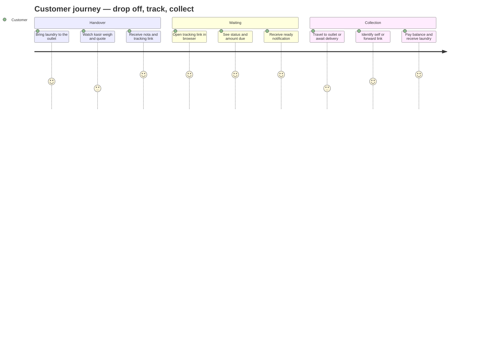
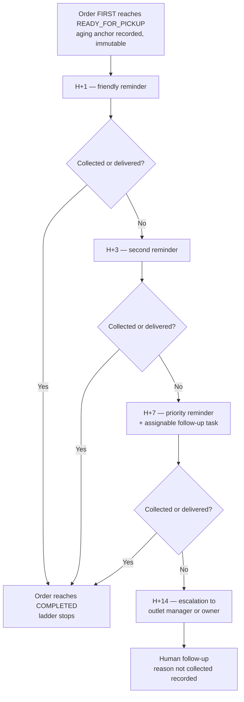

# Aish Laundry App — User Journeys

**Document version: 1.0.0** · **Step: 1 — Product Requirement and Domain Model**
**Status of every journey described here: NOT IMPLEMENTED**

Canonical source: [`../MASTER_SOURCE.md`](../MASTER_SOURCE.md) §5, §9, §10, §11, §14.
Subordinate to the Master Source.

Scope of this document: journeys experienced by **customer-side personas** — Customer, Corporate Customer
Contact, and Authorized Order Recipient. Staff-side journeys are in
[`OPERATIONAL_JOURNEYS.md`](OPERATIONAL_JOURNEYS.md).

Related: [`PERSONAS.md`](PERSONAS.md) · [`JOBS_TO_BE_DONE.md`](JOBS_TO_BE_DONE.md) ·
[`USE_CASE_CATALOG.md`](USE_CASE_CATALOG.md) · [`PRODUCT_REQUIREMENTS.md`](PRODUCT_REQUIREMENTS.md)

The canonical order status machine — the exact fifteen statuses and their legal transitions — is owned by
`docs/state-machines/ORDER_STATUS_MACHINE.md`. This document uses the status names but does not define
the machine.

**All example data is fictional.** Example customer: *Budi Santoso*, phone rendered as
`+62-8xx-XXXX-1234`, address `Jl. Contoh No. 1, Jakarta`. No real personal data appears in this
repository ([`../MASTER_SOURCE.md`](../MASTER_SOURCE.md) §15.8).

---

## 0. Canonical order statuses referenced by these journeys

The fifteen canonical order statuses are:

`DRAFT`, `RECEIVED`, `AWAITING_PROCESS`, `SORTING`, `WASHING`, `DRYING`, `FINISHING`,
`QUALITY_CONTROL`, `REWORK`, `READY_FOR_PICKUP`, `SCHEDULED_FOR_DELIVERY`, `OUT_FOR_DELIVERY`,
`COMPLETED`, `CANCELLED`, `ISSUE`.

Two properties matter for every journey below:

1. **`READY_FOR_PICKUP` is the anchor status.** The moment an order **first** reaches it, the
   unclaimed-laundry aging clock starts and never restarts, even if the order returns through `REWORK`
   and reaches `READY_FOR_PICKUP` again ([`../MASTER_SOURCE.md`](../MASTER_SOURCE.md) §11.1).
2. **`ISSUE` is a first-class outcome, not an error.** A failed delivery, a missing item, or a dispute
   moves the order into a recorded state with a reason, rather than leaving it silently stuck
   (§10.2 rule 5).

---

## 1. Journey map — the primary customer journey

**Explanation — the diagram does not replace these rules.**

- The "Receive nota and tracking link" step is where the product's differentiator is created. The link is
  sent over WhatsApp and opens in a browser. **No installation is ever required**
  ([DEC-0006](../decisions/DEC-0006-public-tracking-without-app-installation.md)).
- The "Open tracking link" step must be fast on a cold cache on a low-end Android browser over a
  congested network. This is the most performance-critical surface in the product
  ([`../MASTER_SOURCE.md`](../MASTER_SOURCE.md) §19.2 rule 1).
- The "Forward link" branch is deliberate: the link is shareable so a family member can collect (§9.1).
  Because it is shareable, it is also expiring and revocable, shows masked personal data, and never shows
  a full address (§9.2 rules 4, 5, 7, 8).
- Satisfaction scores in the diagram are **illustrative design intent**, not measurements. No customer
  satisfaction has been measured; measurement begins at Step 14.

---

## 2. UJ-001 — Track an order without installing anything

| Field | Detail |
| --- | --- |
| Persona | Customer (P-12), optionally Authorized Order Recipient (P-14) |
| Jobs served | JTBD-001, JTBD-002, JTBD-003 |
| Surfaces | Portal Tracking Publik; WhatsApp as the delivery channel for the link |
| Canonical Step | Step 7 |
| Requirements | FR-086 … FR-092, FR-093 … FR-099; the `TRK`, `NOT`, and `SEC` series |
| Status | NOT IMPLEMENTED |

**Preconditions.** An order exists in a status at or beyond `RECEIVED`. The customer has a phone number
recorded and has not opted out of transactional messaging.

**Main flow.**

1. The order reaches `RECEIVED`. A tracking token is issued: high-entropy, generated from a
   cryptographically secure source, stored hashed, never derived from the order number.
2. A transactional WhatsApp message is sent containing the tracking link and no OTP value.
3. The customer taps the link. The portal loads in the browser with `noindex` set.
4. The portal shows: order number, brand and outlet identity, service type, current status and status
   history, estimated completion, amount due, payment state, and the actions available.
5. The customer returns to the link whenever they want. The status reflects production progress as it
   happens.
6. When the order first reaches `READY_FOR_PICKUP`, a transactional message is sent with the same link.

**Alternate flows.**

- **A-1 Link forwarded.** The customer forwards the link to a family member. The portal behaves
  identically. Personal data remains masked and the full address is never shown.
- **A-2 Sensitive action requested.** The customer asks to change the delivery address or request a
  schedule change from the portal. The portal requires OTP verification before proceeding (§9.2 rule 9).
- **A-3 Link revoked.** The customer or the outlet invalidates a link that was shared too widely. The
  link stops working; a new link may be issued.
- **A-4 Link expired.** The portal states plainly that the link has expired and explains how to obtain a
  new one. It never silently shows nothing.

**Exception flows.**

- **E-1 Token guessing attempted.** Rate limiting and brute-force protection apply to tracking-token
  lookup. Tokens are high-entropy, so guessing is not a viable path.
- **E-2 Message delivery fails.** The order lifecycle is unaffected. Messaging is a side effect; a
  WhatsApp failure never cancels or blocks an order (§14.1 rule 8). The failure is visible and retried
  under a bounded policy.

**Never in this journey.** The portal never shows a full address, another order belonging to the same
customer without OTP verification, internal notes, or laundry photographs (§9.3). The portal is never
degraded into an app-install prompt
([DEC-0014](../decisions/DEC-0014-customer-android-does-not-replace-public-tracking.md)).

---

## 3. UJ-002 — Request a pickup

| Field | Detail |
| --- | --- |
| Persona | Customer (P-12) |
| Jobs served | JTBD-004 |
| Surfaces | Portal Tracking Publik or Aish Laundry Customer Android; staff may raise it on the customer's behalf from Ops Android |
| Canonical Step | Step 8 |
| Requirements | FR-100 … FR-107; the `DEL` series |
| Status | NOT IMPLEMENTED |

**Main flow.**

1. The customer requests a pickup, choosing an address and a preferred day.
2. The system matches the address to a service **zone** defined by the outlet.
3. The customer is offered a **time window** — not a fictitious exact minute.
4. The request becomes a scheduled pickup job.
5. A courier is assigned. The customer is notified that a courier has been assigned.
6. At pickup, the courier captures **proof of pickup** using the mechanism the tenant's policy requires:
   OTP, photo, signature, or recipient name.
7. The order is created or updated and enters the normal lifecycle.

**Alternate flows.**

- **A-1 Address outside every zone.** The customer is told plainly that pickup is not available for that
  address and is offered the alternative of bringing the laundry to the outlet. The product does not
  invent coverage it does not have.
- **A-2 Staff-raised request.** A kasir or outlet manager raises the request on the customer's behalf.
  The journey is otherwise identical.
- **A-3 External ojek used.** Capacity is supplied by an external local courier who receives a scoped,
  expiring, revocable guest link for exactly that one job. They never receive an account.

**Exception flows.**

- **E-1 Customer not present at pickup.** Recorded as a failed pickup with a reason. This is an outcome
  with a defined status, not an error state.
- **E-2 No courier available in the window.** The customer is told before the window, not after it.

**Honesty constraint.** Route order presented to a courier is **usulan rute** — a suggestion. The product
never claims an optimal route and never guarantees an arrival time
([`../MASTER_SOURCE.md`](../MASTER_SOURCE.md) §10.2 rule 4, §23 non-goal 7). Time-window adherence is
measured and reported honestly (§29.1).

---

## 4. UJ-003 — Receive a delivery

| Field | Detail |
| --- | --- |
| Persona | Customer (P-12), Authorized Order Recipient (P-14) |
| Jobs served | JTBD-007, JTBD-009 |
| Surfaces | Portal Tracking Publik; the courier's Ops Android or guest link at the door |
| Canonical Step | Step 8 |
| Requirements | FR-100 … FR-111; the `DEL` and `FIN` series |
| Status | NOT IMPLEMENTED |

**Main flow.**

1. The order reaches `READY_FOR_PICKUP` and the customer chooses delivery.
2. The order moves to `SCHEDULED_FOR_DELIVERY` with a time window.
3. A courier is assigned; the order moves to `OUT_FOR_DELIVERY`.
4. At the door, the recipient is identified. **Proof of delivery is mandatory** — OTP, photo, signature,
   or recipient name per tenant policy (§10.2 rule 1).
5. If a balance is due, cash is collected at the door. Cash collection is a financial transaction and
   inherits every rule in §16: integer Rupiah, idempotent, never deleted, corrected only by reversal.
6. The order reaches `COMPLETED`.

**Alternate flows.**

- **A-1 A different person receives.** The Authorized Order Recipient's name is recorded as part of the
  proof. Whether recipients must be pre-nominated is an open question — OQ-006 in
  [`ASSUMPTIONS_AND_OPEN_QUESTIONS.md`](ASSUMPTIONS_AND_OPEN_QUESTIONS.md).
- **A-2 Payment already settled.** No cash is collected; proof is still mandatory.

**Exception flows.**

- **E-1 Nobody home.** The delivery fails with a recorded reason, the laundry returns to the outlet, and
  the order returns to a defined status. This is a first-class outcome (§10.2 rule 5).
- **E-2 Courier offline at the door.** Proof capture and cash recording queue locally under the
  offline-first rules with a stable `client_reference`, and sync later without creating duplicates
  (§13.1).
- **E-3 Customer disputes the handover.** The proof artefact is retrievable by an authorised staff
  member through a signed, expiring URL. Proof artefacts are private data, never public, and never shown
  on the tracking portal (§15.3, §17.2).

---

## 5. UJ-004 — Collect at the outlet

| Field | Detail |
| --- | --- |
| Persona | Customer (P-12), Authorized Order Recipient (P-14) |
| Jobs served | JTBD-003, JTBD-007, JTBD-009 |
| Surfaces | Outlet counter, Ops Android in the kasir's hands; the customer's tracking link |
| Canonical Step | Step 5 for the handover record, Step 6 for the status lifecycle |
| Requirements | FR-048 … FR-070 |
| Status | NOT IMPLEMENTED |

**Main flow.**

1. The customer arrives and presents the tracking link, the nota, the order number, or their phone
   number.
2. The kasir locates the order by number, phone, or name — scoped to the tenant and outlet.
3. Any outstanding balance is settled. The payment is recorded server-side; an order is never marked paid
   on a client claim (§16.2 rule 5).
4. The handover is recorded, including who received the laundry.
5. The order reaches `COMPLETED`.

**Exception flows.**

- **E-1 The customer cannot prove entitlement.** The tenant's policy governs. The product records what
  happened rather than forcing an unrecorded handover.
- **E-2 An item is missing.** The order moves to `ISSUE` with a recorded reason. Resolution is a human
  process; the product's job is to make the state and the reason visible.
- **E-3 The counter is offline.** The handover is recorded locally and queued. Pending state is visible
  to the kasir; the kasir never believes a payment settled when it is still queued (§13.2).

---

## 6. UJ-005 — Receive and act on an unclaimed-laundry reminder

| Field | Detail |
| --- | --- |
| Persona | Customer (P-12) |
| Jobs served | JTBD-005 |
| Surfaces | WhatsApp; Portal Tracking Publik |
| Canonical Step | Step 9 |
| Requirements | FR-112 … FR-117; the `UCL` and `NOT` series |
| Status | NOT IMPLEMENTED |

**Explanation — the diagram does not replace these rules.**

- The anchor is the **first** arrival at `READY_FOR_PICKUP`. Returning through `REWORK` and arriving
  again does **not** reset the clock. The first-ready timestamp is recorded once and is immutable
  thereafter ([`../MASTER_SOURCE.md`](../MASTER_SOURCE.md) §11.1).
- **Each stage fires exactly once per order.** Deduplication is mandatory and must survive retries, queue
  replays, and scheduler restarts (§11.2, §14.1 rule 7).
- **Quiet hours default to 20.00–08.00 outlet local time.** A message due inside the window is deferred
  to the next permitted window — not dropped, and not sent anyway (§14.1 rule 6).
- **Opt-out is honoured.** A customer who opted out of marketing receives no marketing message, across
  every outlet of the tenant, permanently (§14.1 rule 5).
- The **H+7 follow-up task** is a real, assignable, closable task with an owner — not a flag on a report
  (§11.2).
- The **H+14 escalation** reaches a human who is accountable: the outlet manager or the owner.
- A reminder that fails to send is retried and made visible. It is never silently dropped, and its
  failure never changes the order's state.

**Absolute prohibition.** At no age, for no unpaid balance, under no configuration, and behind no flag
does the product automatically discard, sell, auction, donate, or transfer ownership of a customer's
laundry (§11.4, §23 non-goal 9). The product's role ends at reminding, escalating, and recording the
reason it was never collected.

---

## 7. UJ-006 — Manage notification consent

| Field | Detail |
| --- | --- |
| Persona | Customer (P-12) |
| Jobs served | JTBD-006 |
| Surfaces | WhatsApp opt-out path; Portal Tracking Publik; Customer Android |
| Canonical Step | Step 7 |
| Requirements | FR-093 … FR-099; the `NOT` series |
| Status | NOT IMPLEMENTED |

**Main flow.**

1. The customer opts out of marketing messages.
2. Consent state is recorded **per customer, per tenant**, with a timestamp and a source (§17.4).
3. Marketing sending stops immediately, across every outlet of that tenant.
4. Transactional messages — order received, ready, delivered, payment received, unclaimed reminders —
   continue, because they concern an order the customer placed.

**Rules that constrain this journey.**

- Transactional and marketing messages are separated: different templates, different consent, different
  opt-out handling (§14.1 rule 4).
- A marketing message must never be routed through a transactional path to evade opt-out.
- Opt-out is evaluated at send time, not only when a campaign is built.
- **Opt-out is never reset by a data import** (§17.4).
- Opting out of marketing in tenant A has no effect in tenant B, because the two customer profiles are
  separate and unrelated even if the phone number is identical (§4.2 rule 11).

---

## 8. UJ-007 — Corporate contact tracks several orders

| Field | Detail |
| --- | --- |
| Persona | Corporate Customer Contact (P-13) |
| Jobs served | JTBD-008 |
| Surfaces | Portal Tracking Publik; Aish Laundry Customer Android |
| Canonical Step | Step 11 for the consolidated app experience; Step 7 for per-order tracking |
| Requirements | FR-086 … FR-092, FR-118 … FR-120 |
| Status | NOT IMPLEMENTED |

**Main flow.**

1. The contact places or hands over several orders on behalf of their organisation.
2. Each order gets its own tracking link, exactly as for an individual customer.
3. The contact reviews the orders and reconciles them against the invoices the tenant issues.

**Open question.** Whether a consolidated corporate view, consolidated invoicing, or credit terms exist
is **not decided**. It is recorded as OQ-005 in
[`ASSUMPTIONS_AND_OPEN_QUESTIONS.md`](ASSUMPTIONS_AND_OPEN_QUESTIONS.md). This document does not invent
the answer, and no requirement in this Step assumes one.

---

## 9. UJ-008 — Use the Customer Android application

| Field | Detail |
| --- | --- |
| Persona | Customer (P-12) |
| Jobs served | JTBD-001, JTBD-002, JTBD-004 in enhanced form |
| Surface | Aish Laundry Customer Android (Flutter) |
| Canonical Step | Step 11 |
| Requirements | FR-118 … FR-120 |
| Status | NOT IMPLEMENTED |

**Main flow.**

1. The customer installs the application by choice and logs in with phone number and OTP.
2. They see active orders, order history, tracking, pickup request, saved addresses, invoices, loyalty,
   feedback, and notifications
   ([`../MASTER_SOURCE.md`](../MASTER_SOURCE.md) §5.1).

**The binding constraint.** The application is an **enhancement, never a replacement**
([DEC-0014](../decisions/DEC-0014-customer-android-does-not-replace-public-tracking.md), §9.4). Any
capability a customer genuinely needs in order to follow their laundry must remain reachable from the
Portal Tracking Publik. App installs are explicitly **not** a success metric that could justify degrading
the portal (§29.4). A customer who never installs anything still gets full tracking.

---

## 10. Journey-to-requirement summary

| Journey | Personas | Canonical Step | Primary requirement ranges |
| --- | --- | --- | --- |
| UJ-001 Track without installing | P-12, P-14 | Step 7 | FR-086 … FR-092, FR-093 … FR-099 |
| UJ-002 Request a pickup | P-12 | Step 8 | FR-100 … FR-107 |
| UJ-003 Receive a delivery | P-12, P-14 | Step 8 | FR-100 … FR-111 |
| UJ-004 Collect at the outlet | P-12, P-14 | Steps 5 and 6 | FR-048 … FR-070, FR-071 … FR-085 |
| UJ-005 Unclaimed-laundry reminder | P-12 | Step 9 | FR-112 … FR-117 |
| UJ-006 Manage notification consent | P-12 | Step 7 | FR-093 … FR-099 |
| UJ-007 Corporate multi-order tracking | P-13 | Steps 7 and 11 | FR-086 … FR-092, FR-118 … FR-120 |
| UJ-008 Customer Android application | P-12 | Step 11 | FR-118 … FR-120 |

---

## 11. Status

Every journey in this document is **NOT IMPLEMENTED**. No journey has been prototyped, built, tested, or
validated with a real customer. Journey validation with real users belongs to **Step 14 — Pilot and
Commercial Launch**, and until then no claim of validation may be made.
