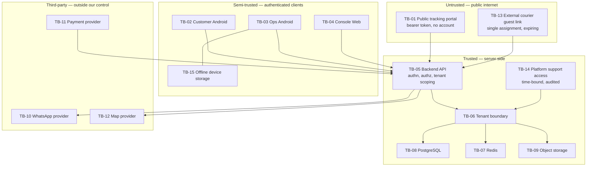

# Initial Threat Model — Aish Laundry App

**Step:** 1 — Product Requirement and Domain Model
**Status:** IN PROGRESS
**Implementation status:** NOT IMPLEMENTED. Backend runtime ABSENT. Flutter workspace ABSENT.
Deployment ABSENT. Application CI NOT APPLICABLE. UAT NOT STARTED.
**Canonical source:** [`../MASTER_SOURCE.md`](../MASTER_SOURCE.md) §4, §9, §13, §14, §15, §16, §17, §20
**Related decisions:** [DEC-0012](../decisions/DEC-0012-tenant-isolation-and-financial-integrity-hard-gate.md),
[DEC-0013](../decisions/DEC-0013-exact-sha-evidence-before-go.md),
[DEC-0006](../decisions/DEC-0006-public-tracking-without-app-installation.md),
[DEC-0016](../decisions/DEC-0016-public-repository-visibility-accepted-deviation.md)

---

## 1. What this document is, and what it is not

This is a **documentation artefact**. It models threats against a system that **does not exist yet**.
Nothing described here is implemented, tested, deployed, or verified. Every mitigation named below is a
**requirement placed on a future roadmap Step**, never a description of an existing control.

No penetration test has been performed. No scanning tool has been run. No security testing of any kind
has occurred, because there is no runtime to test. Any statement in this document that reads like a
control is a **planned control**.

**Method: STRIDE.** Each threat is classified as Spoofing, Tampering, Repudiation, Information
disclosure, Denial of service, or Elevation of privilege. STRIDE was chosen because the system is
defined at this Step as a set of data flows crossing named trust boundaries, which is exactly the shape
STRIDE addresses. It is applied per asset per boundary crossing.

**Governance mode.** This repository operates under single-maintainer governance
([`../MASTER_SOURCE.md`](../MASTER_SOURCE.md) §15.8). **Independent human approval is ABSENT.** This
threat model has not been reviewed by a second person. Internal re-verification by the same maintainer
is not independent peer review and is never described as such.

**Public repository constraint.** Every example in this document is **fictional** and recognisably so.
No real phone number, name, address, token, key, or credential appears anywhere. See
[`DATA_CLASSIFICATION.md`](DATA_CLASSIFICATION.md).

---

## 2. Assets

An asset is something an attacker wants, or something whose corruption harms a tenant, a customer, or
the platform.

| Asset | Why it matters | Primary class |
| --- | --- | --- |
| **Customer data** | Names, phone numbers, addresses, order histories. The tenant's commercial relationship. | CONFIDENTIAL / RESTRICTED |
| **Order data** | Operational state of a customer's belongings, including status and location. | CONFIDENTIAL |
| **Payment records** | Money. Integer Rupiah amounts, payment state, refunds, reversals. | RESTRICTED |
| **Tenant configuration** | Price lists, services, zones, plan limits, staff roster. Competitive intelligence. | CONFIDENTIAL |
| **Membership** | The join carrying role and permission. Authorisation derives from it entirely. | RESTRICTED |
| **Tracking token** | The bearer credential for the public tracking portal. | SECRET |
| **Courier address access** | The set of customer addresses a courier is permitted to see for an assignment. | RESTRICTED |
| **Audit evidence** | Financial and security audit trails, and evidence packs under `evidence/`. | CONFIDENTIAL / RESTRICTED |
| **Notification consent** | Opt-in and opt-out state per customer per tenant. | CONFIDENTIAL |
| **Local offline queue** | Pending orders and payments held on an Ops Android device. | RESTRICTED |
| **Subscription entitlement** | Plan, limits, and billing state at the tenant boundary. | CONFIDENTIAL |
| **Uploaded images** | Laundry photographs, proof-of-pickup and proof-of-delivery photos, signatures. | RESTRICTED |

---

## 3. Trust boundaries

A trust boundary is a line where the level of trust in data or in a caller changes. Data crossing one
must be re-validated on the receiving side.

| # | Boundary | Nature of the crossing |
| --- | --- | --- |
| TB-01 | **Public tracking portal** | Unauthenticated internet ↔ backend. Bearer-token only, no account. Highest exposure. |
| TB-02 | **Customer Android** | Customer-authenticated device ↔ backend. Device is not trusted. |
| TB-03 | **Ops Android** | Staff-authenticated device ↔ backend. Offline-capable, so it holds state. |
| TB-04 | **Console Web** | Owner/admin/finance browser ↔ backend. Highest privilege client surface. |
| TB-05 | **Backend API** | The single enforcement point. Everything above converges here. |
| TB-06 | **Tenant boundary** | Inside the backend, between one tenant's data and another's. The product's central safety property. |
| TB-07 | **Redis** | Backend ↔ cache, queue, lock, rate-limit store. Never the system of record. |
| TB-08 | **PostgreSQL** | Backend ↔ system of record. |
| TB-09 | **Object storage** | Backend ↔ S3-compatible private storage for images and exports. |
| TB-10 | **WhatsApp provider** | Backend ↔ third-party messaging vendor. Outbound personal data, inbound webhooks. |
| TB-11 | **Payment provider** | Backend ↔ third-party payment gateway. Inbound callbacks assert money moved. |
| TB-12 | **Map provider** | Backend or client ↔ third-party geocoding/tiles. Outbound address data. |
| TB-13 | **External courier guest link** | Unauthenticated ojek lokal ↔ backend, scoped to one assignment. |
| TB-14 | **Platform support access** | Platform staff ↔ tenant data, via explicit, time-bound, audited impersonation. |
| TB-15 | **Offline device storage** | Ops Android application ↔ on-device persistent storage, per tenant and per user. |

### 3.1 Boundary diagram

**Explanation of the diagram.** Four groups are shown in decreasing order of hostility. The untrusted
group holds the two surfaces reachable without an account: the public tracking portal and the external
courier guest link. Both present a bearer credential and nothing else, which is why both credentials
must be high-entropy, hashed at rest, expiring, and revocable. The semi-trusted group holds the three
authenticated client surfaces plus on-device offline storage, which is drawn inside the client group
because a lost or rooted device places that storage in an attacker's hands. Every arrow from those two
groups terminates at a single point, TB-05, the backend API: there is no private back channel and no
client-to-database path. Inside the server, every data access passes through TB-06, the tenant
boundary, before reaching PostgreSQL, Redis, or object storage — including platform support access,
which enters through the same boundary rather than around it. The third-party group is drawn separately
because data leaving to it has left our control, and the one inbound arrow — the payment provider
callback — asserts that money moved and must therefore be verified server-side rather than believed.

---

## 4. Threat register

**Field meanings.** *Precondition* is what must already be true for the attack to be attempted.
*Prevention* stops it, *detection* notices it, *response* is what happens once it is noticed. *Residual
risk* is what remains after the stated mitigations. *Step* is the future roadmap Step accountable for
implementing the mitigation; none of these Steps has started.

**Mitigation rule.** Every threat rated CRITICAL or HIGH carries at least one explicit prevention entry.
A CRITICAL or HIGH threat with no mitigation is a validator failure and must block the Step.

---

### 4.1 Spoofing

#### THREAT-001 — OTP brute force against customer login
- **STRIDE:** Spoofing
- **Actor:** Remote unauthenticated attacker with a target phone number
- **Asset:** Customer data, order data
- **Precondition:** Phone + OTP authentication is exposed and the OTP space is small
- **Scenario:** The attacker requests an OTP for a customer's number, then submits codes in bulk until one is accepted, taking over the account.
- **Impact:** Full customer account takeover; order history, addresses, and invoices disclosed
- **Likelihood:** HIGH
- **Severity:** CRITICAL
- **Prevention:** Adequate OTP length and entropy; short expiry; single-use codes; per-number and per-IP rate limiting; progressive delay and lockout after repeated failure; attempt counter bound to the OTP record, not to the session
- **Detection:** Authentication failure and lockout rate metrics (§20.3); alert on failure-rate spike per number and per source
- **Response:** Lock the affected identity, invalidate outstanding OTPs, notify the customer through an already-verified channel, review whether any session was established
- **Residual risk:** A targeted attacker controlling the SIM still succeeds; see THREAT-008
- **Step:** 3 (authentication), hardened in 13

#### THREAT-002 — Tracking token guessing or derivation from the order number
- **STRIDE:** Spoofing
- **Actor:** Remote unauthenticated attacker
- **Asset:** Tracking token, order data, customer data
- **Precondition:** The portal accepts a low-entropy identifier, or the token is derivable from the printed order number
- **Scenario:** Order numbers are sequential and printed on every nota. The attacker enumerates them, or derives tokens from them, and reads other customers' orders.
- **Impact:** Mass disclosure of order and customer data across a tenant; potentially across tenants
- **Likelihood:** HIGH
- **Severity:** CRITICAL
- **Prevention:** The token is **not** the order number and is not derivable from it; generated from a cryptographically secure random source with high entropy; stored **hashed**; expiring; revocable; rate-limited lookup; constant-time comparison
- **Detection:** Rate of failed token lookups per source; alert on enumeration-shaped traffic
- **Response:** Rate-limit or block the source, revoke affected tokens, notify the tenant, treat confirmed disclosure as NO-GO under §15.7
- **Residual risk:** A token shared by the customer into a group chat remains valid until expiry or revocation
- **Step:** 7, hardened in 13

#### THREAT-003 — External courier guest link forwarded or reused
- **STRIDE:** Spoofing
- **Actor:** External ojek courier, or anyone the link is forwarded to
- **Asset:** Courier address access, order data
- **Precondition:** A guest link exists for an assignment
- **Scenario:** The courier forwards the link, or keeps it after the job ends, and a third party opens it to view the assignment and its address.
- **Impact:** Disclosure of a customer address and delivery window to an unauthorised person
- **Likelihood:** MEDIUM
- **Severity:** HIGH
- **Prevention:** High-entropy token stored hashed; scoped to exactly one assignment; short expiry tied to the job window; revocable by the outlet; minimum-necessary address detail; no access to customer history, other orders, pricing, or any other tenant data; tenant-scoped so two links for the same courier are unrelated
- **Detection:** Access log per guest token including source; alert on access after job completion or from an unexpected number of distinct sources
- **Response:** Revoke the token, reassign the job, record the incident, inform the tenant
- **Residual risk:** Within the job window a forwarded link is indistinguishable from the courier
- **Step:** 8

#### THREAT-004 — Lost or stolen Ops device with a live session
- **STRIDE:** Spoofing
- **Actor:** Finder or thief of a staff device
- **Asset:** Order data, payment records, local offline queue, customer data
- **Precondition:** A staff device holds a valid session and cached tenant data
- **Scenario:** The device is taken and used to browse orders, view customer addresses, or record payments as the legitimate staff member.
- **Impact:** Customer data disclosure, fraudulent financial entries attributed to an innocent staff member
- **Likelihood:** MEDIUM
- **Severity:** HIGH
- **Prevention:** Device revocation without forcing a global password change; session revocation effective immediately server-side; credentials and tokens in Android secure storage; sensitive local data encrypted; session lifetime bounded; re-authentication for sensitive actions
- **Detection:** Session and device revocation audit events; anomalous location or hour of use surfaced to the outlet manager
- **Response:** Revoke the device, revoke the session, review every financial entry made from it, reverse fraudulent entries by adjustment (never deletion)
- **Residual risk:** Actions taken between theft and revocation are legitimate-looking and must be reconciled by hand
- **Step:** 3, hardened in 13

#### THREAT-005 — Forged WhatsApp provider webhook
- **STRIDE:** Spoofing
- **Actor:** Remote attacker who has discovered the webhook endpoint
- **Asset:** Notification consent, order data
- **Precondition:** An inbound provider webhook exists and its authenticity is not verified
- **Scenario:** The attacker posts fabricated delivery-status or inbound-message events, corrupting notification records or forging an opt-out.
- **Impact:** Incorrect messaging state; a customer wrongly recorded as opted out or opted in
- **Likelihood:** LOW
- **Severity:** MEDIUM
- **Prevention:** Signature verification on every inbound webhook; source restriction; replay rejection by event identifier and timestamp window; webhook events never alter order lifecycle state
- **Detection:** Count of rejected webhook signatures; alert on sustained rejection
- **Response:** Rotate the webhook secret, reconcile notification records against provider-side history
- **Residual risk:** Provider-side compromise is outside our control
- **Step:** 7

#### THREAT-006 — Forged or replayed payment gateway callback
- **STRIDE:** Spoofing
- **Actor:** Remote attacker, or a customer wanting a free service
- **Asset:** Payment records, order data
- **Precondition:** A gateway callback endpoint marks orders paid
- **Scenario:** The attacker replays a genuine callback, or forges one, so an unpaid order is marked paid.
- **Impact:** Direct financial loss to the tenant; corrupted ledger
- **Likelihood:** MEDIUM
- **Severity:** CRITICAL
- **Prevention:** Server-side signature and authenticity verification; amount and currency checked against the expected order; replay rejected by gateway reference; idempotency keyed on a stable reference; an order is **never** marked paid on a client claim; state changes serialized under a lock
- **Detection:** Payment success, retry, and duplicate-suppression counts (§20.3); reconciliation of gateway settlement against internal ledger
- **Response:** Automatic NO-GO under §16.6 — stop, preserve evidence at the exact SHA, notify the owner, correct by reversal or adjustment entry, add a regression test
- **Residual risk:** A compromised gateway account produces callbacks that are genuine by every check available to us
- **Step:** 5, hardened in 13

#### THREAT-007 — Support impersonation without an audit record
- **STRIDE:** Spoofing
- **Actor:** Platform support staff, or an attacker with a support account
- **Asset:** Customer data, payment records, tenant configuration
- **Precondition:** An impersonation capability exists
- **Scenario:** Support enters a tenant to "check something" and the entry leaves no record, or the record can be suppressed.
- **Impact:** Silent access to tenant data; loss of the tenant's ability to know who saw what
- **Likelihood:** MEDIUM
- **Severity:** HIGH
- **Prevention:** Impersonation is explicit, time-bound, reason-required, and audited with actor, tenant, start, end, and reason; the audit record is append-only and cannot be suppressed by the impersonator; **platform support has no silent tenant access**; the tenant can see that it happened
- **Detection:** Impersonation start and end are mandatory security audit events (§20.2); alert on long or frequent sessions
- **Response:** Automatic NO-GO under §15.5 if silent access is found; revoke the path, disclose to affected tenants
- **Residual risk:** A support account with database-level access bypasses the application audit entirely; database access must therefore be separately controlled
- **Step:** 12, hardened in 13

#### THREAT-008 — Phone number reassignment or SIM swap
- **STRIDE:** Spoofing
- **Actor:** Whoever now controls a recycled or swapped number
- **Asset:** Customer data, order data
- **Precondition:** Authentication is anchored to a phone number
- **Scenario:** A customer's number is recycled by the carrier or swapped by an attacker; OTP now reaches the wrong person, who takes over the account.
- **Impact:** Account takeover including order history and saved addresses
- **Likelihood:** MEDIUM
- **Severity:** MEDIUM
- **Prevention:** Re-verification of dormant accounts; sensitive actions require a fresh OTP; number-change events invalidate existing sessions; recorded notice to the previous device
- **Detection:** Sudden change in device fingerprint alongside a first login after a long dormancy
- **Response:** Suspend the account, require staff-assisted re-verification at the outlet
- **Residual risk:** Carrier-level compromise cannot be prevented by the application
- **Step:** 3

---

### 4.2 Tampering

#### THREAT-009 — Client-supplied tenant identifier trusted as authorisation
- **STRIDE:** Tampering
- **Actor:** Any authenticated user with a proxy
- **Asset:** Every tenant-scoped asset
- **Precondition:** A request carries a tenant identifier and the server uses it without validating membership
- **Scenario:** The user edits the tenant identifier in a request and receives another tenant's data.
- **Impact:** Cross-tenant data exposure across every module at once
- **Likelihood:** MEDIUM
- **Severity:** CRITICAL
- **Prevention:** A client-supplied tenant identifier is **never** authorisation proof; it is an untrusted hint validated against the authenticated user's memberships; scoping is enforced by default at the data access layer so a missing scope returns nothing rather than another tenant's rows; membership **and** permission verified server-side on every request
- **Detection:** Permission-denial audit events; negative tenant-isolation tests in CI from Step 3 onward
- **Response:** Automatic NO-GO under §4.2 rule 12 and §15.7 — stop all feature work on the branch, preserve evidence at the exact SHA, notify the owner
- **Residual risk:** A new endpoint added without the default scope; mitigated by making the scope the default rather than a per-call-site decision
- **Step:** 3

#### THREAT-010 — Client-supplied price or total accepted by the server
- **STRIDE:** Tampering
- **Actor:** Customer, or staff with a modified client
- **Asset:** Payment records, order data, tenant configuration
- **Precondition:** The server accepts a total, unit price, or discount computed by a client
- **Scenario:** The client submits an order with an altered total and the server stores it.
- **Impact:** Direct revenue loss; ledger that does not reconcile against the price list
- **Likelihood:** MEDIUM
- **Severity:** CRITICAL
- **Prevention:** Totals are computed and authoritative on the server; client-computed totals are display only; the order captures the price that applied at creation from the server-side price list; money is integer Rupiah with floating point forbidden in every financial path; discounts require permission and are recorded with actor and reason
- **Detection:** Reconciliation of order totals against price-list history; variance reporting at shift close
- **Response:** Financial integrity NO-GO under §16.6; correct by reversal or adjustment entry
- **Residual risk:** A staff member with legitimate discount permission can still under-charge; addressed by audit and variance reporting rather than by prevention
- **Step:** 5

#### THREAT-011 — Invalid order status transition
- **STRIDE:** Tampering
- **Actor:** Staff with a modified client, or a defective integration
- **Asset:** Order data
- **Precondition:** Status transitions are not validated server-side
- **Scenario:** An order jumps from `RECEIVED` straight to `COMPLETED`, skipping `WASHING`, `QUALITY_CONTROL`, and `READY_FOR_PICKUP`, so no aging clock ever starts and no customer notification fires.
- **Impact:** Broken operational truth; unclaimed-laundry aging never begins; customer never told the order is ready
- **Likelihood:** MEDIUM
- **Severity:** HIGH
- **Prevention:** The canonical fifteen-status machine — `DRAFT`, `RECEIVED`, `AWAITING_PROCESS`, `SORTING`, `WASHING`, `DRYING`, `FINISHING`, `QUALITY_CONTROL`, `REWORK`, `READY_FOR_PICKUP`, `SCHEDULED_FOR_DELIVERY`, `OUT_FOR_DELIVERY`, `COMPLETED`, `CANCELLED`, `ISSUE` — is enforced server-side; every transition is validated, permissioned, and audited with actor and timestamp
- **Detection:** Audit trail of transitions; report of orders that reached `COMPLETED` without a first-ready timestamp
- **Response:** Reject the transition; correct the record through an audited adjustment, never a silent rewrite
- **Residual risk:** A legitimately permitted but operationally wrong transition still occurs; addressed by audit
- **Step:** 6

#### THREAT-012 — First `READY_FOR_PICKUP` timestamp mutated to reset aging
- **STRIDE:** Tampering
- **Actor:** Staff wanting a cleaner unclaimed-laundry dashboard
- **Asset:** Order data, audit evidence
- **Precondition:** The first-ready timestamp is writable after it is set
- **Scenario:** An order is bounced back through `REWORK` and returned to `READY_FOR_PICKUP`, or the timestamp is edited directly, so the aging clock restarts and the H+7 and H+14 stages never fire.
- **Impact:** Unclaimed laundry hidden from the escalation ladder; unpaid balances never recovered; shelf space lost
- **Likelihood:** MEDIUM
- **Severity:** HIGH
- **Prevention:** The **first** `READY_FOR_PICKUP` timestamp is recorded once and is immutable thereafter; a later return to `READY_FOR_PICKUP` does **not** restart the clock; the field has no ordinary-UI edit path; any correction is an audited, permissioned adjustment
- **Detection:** Audit trail on the field; aging distribution metric (§20.3) showing an implausible reset pattern
- **Response:** Restore the original anchor from the audit trail; record the incident
- **Residual risk:** An order genuinely re-opened for rework still shows a long age; this is correct behaviour and must be explained in the UI rather than fixed
- **Step:** 9

#### THREAT-013 — Offline queue tampering on a rooted device
- **STRIDE:** Tampering
- **Actor:** Staff member with a rooted device, or a thief
- **Asset:** Local offline queue, payment records
- **Precondition:** Pending financial operations are stored on device
- **Scenario:** The queue file is edited to change a payment amount or to inject an operation before it syncs.
- **Impact:** Fraudulent payment records entering the ledger with a valid `client_reference`
- **Likelihood:** LOW
- **Severity:** MEDIUM
- **Prevention:** Sensitive local data encrypted with keys in Android secure storage; the server re-validates every queued operation against server-side price and permission rather than trusting the payload; totals recomputed server-side; queued financial operations cannot be deleted by a cache clear, a logout, or a version upgrade
- **Detection:** Shift-close variance; server-side rejection counts for revalidated operations
- **Response:** Reject the operation; reconcile the shift; audit the device
- **Residual risk:** A rooted device is fundamentally untrusted; the mitigation is server-side revalidation, not device hardening
- **Step:** 5, with the offline model from 13.1

#### THREAT-014 — Falsified proof of delivery
- **STRIDE:** Tampering
- **Actor:** Courier
- **Asset:** Uploaded images, order data, payment records
- **Precondition:** Proof capture accepts arbitrary input
- **Scenario:** The courier marks a job `DELIVERED` with a reused photograph, a self-signed signature, or a fabricated recipient name, while the laundry is not actually handed over.
- **Impact:** Customer's belongings lost with the system asserting they were delivered; cash marked collected that was not
- **Likelihood:** MEDIUM
- **Severity:** HIGH
- **Prevention:** Proof is **mandatory** for every custody transfer across the eleven pickup and delivery statuses — `REQUESTED`, `CONFIRMED`, `SCHEDULED`, `ASSIGNED`, `EN_ROUTE`, `ARRIVED`, `PICKED_UP`, `DELIVERED`, `FAILED`, `RESCHEDULED`, `CANCELLED`; recipient OTP is the strongest available method and is preferred where the tenant enables it; proof artefacts carry server-side capture timestamp and the courier identity; images are not accepted from the gallery where the platform allows distinguishing capture source; duplicate-image detection within an assignment set
- **Detection:** Customer dispute rate per courier; `FAILED` versus `DELIVERED` ratio per courier; cash variance per courier per shift
- **Response:** Suspend the courier's assignments, investigate with the tenant, correct financial entries by reversal
- **Residual risk:** A determined courier photographing a bag on a doorstep and removing it afterwards defeats photo proof; OTP proof is the answer where the tenant accepts the friction
- **Step:** 8

#### THREAT-015 — Malicious upload
- **STRIDE:** Tampering
- **Actor:** Any user able to upload, including a portal visitor if uploads are ever exposed there
- **Asset:** Object storage, backend API
- **Precondition:** An upload endpoint exists
- **Scenario:** A file with a declared image content type contains executable or polyglot content, an archive bomb, or a payload aimed at an image-processing library.
- **Impact:** Server-side code execution, storage exhaustion, or stored content that harms a later viewer
- **Likelihood:** MEDIUM
- **Severity:** HIGH
- **Prevention:** Uploads validated server-side by **type, size, and content**, not by extension and not by the client-declared content type; re-encoding of images rather than storing the original bytes verbatim; size caps; storage never serves user content from a domain that shares an origin with an application surface; object keys tenant-scoped and unguessable
- **Detection:** Upload rejection counts; storage growth per tenant against plan limits
- **Response:** Reject and quarantine; if processing occurred, treat as a potential compromise and escalate
- **Residual risk:** A novel parser vulnerability in an image library; reduced by re-encoding and by keeping processing isolated
- **Step:** 8, hardened in 13

#### THREAT-016 — Tenant-less cache key
- **STRIDE:** Tampering / Information disclosure
- **Actor:** Any user, unintentionally
- **Asset:** Every tenant-scoped asset, via Redis
- **Precondition:** A cache key omits the tenant dimension
- **Scenario:** Tenant A's price list is cached under a key such as a bare price-list identifier; tenant B's request hits the same key and receives tenant A's data.
- **Impact:** Cross-tenant data exposure with no attacker required
- **Likelihood:** MEDIUM
- **Severity:** HIGH
- **Prevention:** **Every cache key carries a tenant dimension**, enforced by a key-construction helper rather than by developer memory; the same rule applies to queues, search indexes, exports, report files, and object-storage keys; background jobs carry explicit tenant context and never infer it from the last request
- **Detection:** Static check on key construction; negative tenant-isolation tests exercising cached paths specifically
- **Response:** Automatic NO-GO if exposure actually occurred; flush affected keys, notify the owner
- **Residual risk:** A cache populated before the fix still holds mixed data; a flush is part of remediation
- **Step:** 3, with every module thereafter

#### THREAT-017 — Audit or evidence record altered
- **STRIDE:** Tampering / Repudiation
- **Actor:** Insider, or an agent trying to make a report read cleanly
- **Asset:** Audit evidence
- **Precondition:** Audit trails or evidence packs are editable
- **Scenario:** A financial audit entry is edited to hide a reversal, or an evidence file is quietly changed so a failed validator run appears to have passed.
- **Impact:** Loss of the only mechanism by which any claim in this project can be trusted
- **Likelihood:** LOW
- **Severity:** HIGH
- **Prevention:** Financial and security audit trails are **append-only** and not subject to log rotation; evidence artefacts are bound to an exact 40-character commit SHA and are append-only in spirit; a checksum is regenerated by tooling and never hand-edited; fabricated output is an automatic NO-GO
- **Detection:** Exact-SHA CI re-running validators at the reviewed commit; checksum verification; git history on `evidence/`
- **Response:** Automatic NO-GO under DEC-0013 — stop work, disclose, treat every claim from the same session as suspect until re-verified
- **Residual risk:** With **independent human approval ABSENT**, a maintainer error that both the maintainer and the validators miss is not caught by a second person. The validators carry the load a reviewer would otherwise carry
- **Step:** Already binding at Step 0; extended in 13

---

### 4.3 Repudiation

#### THREAT-018 — Courier denies receiving collected cash
- **STRIDE:** Repudiation
- **Actor:** Courier
- **Asset:** Payment records
- **Precondition:** Cash is collected at the door
- **Scenario:** Cash is collected on delivery and never handed over; the courier disputes that it was collected at all.
- **Impact:** Direct cash loss with no record of who holds it
- **Likelihood:** MEDIUM
- **Severity:** HIGH
- **Prevention:** Cash collection is a financial transaction in integer Rupiah, recorded at the point of collection against the courier identity, the shift, and the order; **courier cash reconciliation** compares expected against actual per courier per shift; variance is recorded and acknowledged, never absorbed silently; handover is an explicit recorded event
- **Detection:** Per-courier per-shift variance report; trend per courier over time
- **Response:** Record the variance honestly and surface it; corrections by adjustment entry with actor and reason; never auto-round or write off silently
- **Residual risk:** Reconciliation detects rather than prevents; the control is honest visibility, not elimination
- **Step:** 8, reporting in 10

#### THREAT-019 — Staff denies issuing a refund or void
- **STRIDE:** Repudiation
- **Actor:** Kasir or manager
- **Asset:** Payment records
- **Precondition:** Refund and void exist
- **Scenario:** A refund is issued to an accomplice and later disputed, or attributed to a shared login.
- **Impact:** Unrecoverable financial loss; inability to attribute the action
- **Likelihood:** LOW
- **Severity:** HIGH
- **Prevention:** Refund and void require **permission and a recorded reason**; every entry records actor, tenant, outlet, timestamp, amount before and after, and reason text; financial transactions are never deleted through ordinary UI; corrections are reversal or adjustment entries preserving the original; shared logins are prevented by per-user membership
- **Detection:** Refund volume per actor; alert on outlier
- **Response:** Investigate with the tenant; the audit trail is the evidence
- **Residual risk:** A manager with legitimate permission acting dishonestly is detected, not prevented
- **Step:** 5

#### THREAT-020 — Customer disputes marketing consent
- **STRIDE:** Repudiation
- **Actor:** Customer, or a regulator acting for one
- **Asset:** Notification consent
- **Precondition:** Marketing messages are sent
- **Scenario:** The customer states they never consented; the tenant cannot show when, how, or through what wording consent was given.
- **Impact:** Compliance and trust failure; provider-side account risk
- **Likelihood:** MEDIUM
- **Severity:** MEDIUM
- **Prevention:** Consent recorded **per customer per tenant with a timestamp and a source**; transactional and marketing consent held separately; opt-out takes effect immediately and is **never reset by a data import**; opt-out evaluated at send time, not only at campaign build time
- **Detection:** Message send records carrying the consent state applied at send time
- **Response:** Stop marketing sends for the tenant, produce the consent record or accept the dispute, fix the path
- **Residual risk:** Consent captured verbally at the counter is only as good as the staff member's record
- **Step:** 7

#### THREAT-021 — Missing correlation identifier prevents reconstruction
- **STRIDE:** Repudiation
- **Actor:** None — a design failure rather than an attacker
- **Asset:** Audit evidence, order data
- **Precondition:** A customer interaction spans an API request, a queue job, and a provider call
- **Scenario:** A customer asks what happened to a specific order and no single identifier links the request, the queued notification, and the provider outcome.
- **Impact:** The system cannot answer "what exactly happened to this order", which §20.1 names as a purpose of observability
- **Likelihood:** MEDIUM
- **Severity:** MEDIUM
- **Prevention:** Every request carries a correlation identifier that **flows through queues and background jobs**; structured logging with a stable schema; tenant context recorded as an identifier for filtering and **never as personal data**
- **Detection:** Absence of correlation coverage is itself the finding; sampled trace completeness
- **Response:** Treat as a Definition of Done failure for the Step that introduced the gap
- **Residual risk:** Third-party provider internals remain opaque
- **Step:** 13

---

### 4.4 Information disclosure

#### THREAT-022 — Cross-tenant read by identifier guessing
- **STRIDE:** Information disclosure
- **Actor:** Authenticated user of tenant A
- **Asset:** Every tenant-scoped asset
- **Precondition:** A record is fetched by identifier without a tenant predicate
- **Scenario:** The user requests a record identifier belonging to tenant B — a competitor — and the backend returns it.
- **Impact:** A competing laundry's customer list, price list, or revenue disclosed. Business-ending for the victim tenant
- **Likelihood:** MEDIUM
- **Severity:** CRITICAL
- **Prevention:** Every business table carries `tenant_id`; every business query is tenant-scoped; scoping is a **default at the data access layer** so that a forgotten scope yields nothing rather than another tenant's row — fail closed, never fail open; identifiers are non-sequential where they appear in URLs
- **Detection:** Negative tenant-isolation tests across every access path — direct identifier, list, filter, search, count, export, report endpoint, and file URL — required before the Definition of Done from Step 3 onward
- **Response:** **Automatic NO-GO** (DEC-0012). Stop feature work, preserve evidence at the exact SHA, notify the owner, ship nothing else from the branch until fixed and covered by a regression test
- **Residual risk:** A raw query written outside the data access layer; addressed by review and by making the safe path the easy path
- **Step:** 3

#### THREAT-023 — Cross-tenant leakage through export or report
- **STRIDE:** Information disclosure
- **Actor:** Authenticated user of tenant A, especially an owner using the portfolio dashboard
- **Asset:** Customer data, payment records, tenant configuration
- **Precondition:** Reporting or export paths build queries differently from ordinary reads
- **Scenario:** A report endpoint aggregates without the tenant predicate, or an export file is written to a shared location and fetched by another tenant.
- **Impact:** Bulk cross-tenant disclosure — worse than a single-record leak because it is complete
- **Likelihood:** MEDIUM
- **Severity:** CRITICAL
- **Prevention:** Reporting queries use the same tenant-scoped data access layer as ordinary reads; export files are tenant-scoped with unguessable object keys and signed expiring URLs; **the owner portfolio dashboard aggregates only across tenants the user legitimately belongs to and never widens the query surface to achieve it**; exports carry the same access rules as the underlying records
- **Detection:** Negative isolation tests targeting report and export endpoints specifically; object-key audit
- **Response:** Automatic NO-GO under DEC-0012
- **Residual risk:** A hand-written analytics query bypassing the layer; such queries must be treated as production code
- **Step:** 10

#### THREAT-024 — Publicly readable object storage or predictable object keys
- **STRIDE:** Information disclosure
- **Actor:** Anyone on the internet
- **Asset:** Uploaded images, customer data
- **Precondition:** A bucket is public or listable, or keys are sequential
- **Scenario:** Laundry photographs — which may show the inside of a customer's home and their personal garments — and delivery-proof signatures are fetched directly or enumerated.
- **Impact:** Personal data exposed publicly. Severe privacy harm to people who are not even our users
- **Likelihood:** MEDIUM
- **Severity:** CRITICAL
- **Prevention:** Object storage is **never publicly readable or listable** for tenant data; private files served only through **signed, short-expiry URLs**; object keys are tenant-scoped and unguessable; laundry photographs are never attached to a public link, never indexed, and never used for marketing
- **Detection:** Bucket policy verification in Step 13; signed-URL-only access assertion in tests
- **Response:** **Automatic NO-GO** under §15.7 and Rule 03 — revoke the exposure path immediately, notify the owner, then notify affected tenants
- **Residual risk:** A signed URL forwarded by its recipient remains valid until expiry; expiry is therefore short
- **Step:** 8, hardened in 13

#### THREAT-025 — Full address rendered on the public tracking portal
- **STRIDE:** Information disclosure
- **Actor:** Anyone holding or intercepting a tracking link
- **Asset:** Customer data
- **Precondition:** The portal renders order detail including delivery information
- **Scenario:** A link forwarded into a group chat, or found in a browser history on a shared phone, reveals where the customer lives.
- **Impact:** Physical-safety-relevant disclosure of a home address
- **Likelihood:** MEDIUM
- **Severity:** HIGH
- **Prevention:** **The portal never shows a full address** under any condition; names and phone numbers are partially masked; the portal may show order number, brand and outlet identity, service type, current status and history, estimated completion, amount due, payment state, and available actions — nothing more; **sensitive actions such as changing a delivery address require OTP**
- **Detection:** Portal response assertions in Step 7 tests; review of every field added to the portal payload
- **Response:** Remove the field immediately; treat exposure as a personal-data NO-GO
- **Residual risk:** The estimated completion and outlet identity narrow a customer's location approximately; accepted as necessary to the portal's purpose
- **Step:** 7

#### THREAT-026 — Tracking pages indexed by search engines
- **STRIDE:** Information disclosure
- **Actor:** Search engine crawler, then anyone searching
- **Asset:** Order data, customer data, tracking token
- **Precondition:** A tracking URL is published or linked anywhere crawlable
- **Scenario:** A customer posts a tracking link publicly; the crawler indexes it; the order becomes searchable by anyone, permanently, including in caches.
- **Impact:** Permanent public exposure of order and partial customer data
- **Likelihood:** MEDIUM
- **Severity:** HIGH
- **Prevention:** The portal is served with **`noindex`**; tokens expire; tokens are revocable; the token lives in the link rather than in a persistent server-side association that outlives the order
- **Detection:** Periodic external search for portal URL patterns during Step 13
- **Response:** Revoke affected tokens, request removal from the index, notify the tenant
- **Residual risk:** `noindex` is honoured by cooperating crawlers only; expiry is the durable control
- **Step:** 7

#### THREAT-027 — Courier browses addresses unrelated to the assignment
- **STRIDE:** Information disclosure
- **Actor:** Internal courier or external ojek
- **Asset:** Courier address access, customer data
- **Precondition:** The courier surface returns more than the assigned stops
- **Scenario:** The courier changes a filter or an identifier and sees the outlet's whole customer address book, or another courier's route.
- **Impact:** Bulk address disclosure to someone who travels for a living
- **Likelihood:** MEDIUM
- **Severity:** HIGH
- **Prevention:** Courier access is scoped to the courier's own assignments; address detail is the **minimum needed to complete the assigned job**; no access to customer history, other orders, or pricing; the external guest link is single-assignment and tenant-scoped so a courier working for two tenants cannot traverse between them; addresses are not exposed in a shareable or indexable form
- **Detection:** Access audit per courier per assignment; alert on access volume exceeding assigned stops
- **Response:** Revoke the courier's access, notify the tenant, treat confirmed bulk access as a NO-GO
- **Residual risk:** A courier legitimately sees the addresses on their own route and can copy them; addressed by tenant policy, not by the product
- **Step:** 8

#### THREAT-028 — Secret or personal data committed to this PUBLIC repository
- **STRIDE:** Information disclosure
- **Actor:** Maintainer or AI agent, unintentionally
- **Asset:** Any credential; any customer data appearing in an example or evidence pack
- **Precondition:** This repository is **PUBLIC** by deliberate owner decision (AMENDMENT-0001, DEC-0016)
- **Scenario:** A real token, connection string, or a real customer's phone number is committed in documentation, an example, a test fixture, or an evidence pack.
- **Impact:** **Maximal and immediate.** Every file is world-readable and must be assumed mirrored, cached, and indexed. Deletion is not remediation
- **Likelihood:** MEDIUM
- **Severity:** CRITICAL
- **Prevention:** No secrets in the repository in any form; **every example datum is fictional and recognisably so**; only `PUBLIC` and sanitised `INTERNAL` material is committed; `CONFIDENTIAL`, `RESTRICTED`, and `SECRET` classes may be **described and modelled but never instantiated with real values**; evidence packs are sanitised before commit and state that sanitisation occurred; a secret-scanning gate runs in CI
- **Detection:** Secret scanning at the exact SHA under review; the honesty and evidence rules of DEC-0013
- **Response:** **Rotate first, discuss second.** Rotation is the remediation; removal alone is not. Then disclose, then remove. Automatic NO-GO
- **Residual risk:** A secret shaped unlike any known pattern evades scanning. With **independent human approval ABSENT**, the scanner is the primary control rather than a second reader
- **Step:** Already binding now; enforced continuously

#### THREAT-029 — Credentials, OTPs, or tokens written to logs
- **STRIDE:** Information disclosure
- **Actor:** Developer, unintentionally; then anyone with log access
- **Asset:** Tracking token, membership, customer data
- **Precondition:** A request object or provider payload is logged wholesale
- **Scenario:** A debug log line serialises the whole request, capturing an OTP or a plaintext tracking token, and the log is retained and readable by support staff.
- **Impact:** Credential disclosure at scale, in a store that is usually less protected than the database
- **Likelihood:** MEDIUM
- **Severity:** HIGH
- **Prevention:** **Logs never contain passwords, OTPs, tokens, or credentials** — not at debug level, not temporarily, not on a local branch; **redaction is enforced at the logging boundary**, not by hoping nobody logs the wrong object; telemetry carries tenant identifiers, never personal data; personal data in error reports and crash traces is redacted at source
- **Detection:** Log-content assertions in Step 13; sampled review
- **Response:** Stop and fix the logging path before further work; purge affected log data where possible; rotate anything exposed
- **Residual risk:** Third-party crash reporting may capture memory contents; provider configuration must restrict this
- **Step:** 13, but binding on every logging line written from Step 3

#### THREAT-030 — Cached tenant data surviving a tenant or user switch
- **STRIDE:** Information disclosure
- **Actor:** A staff member who belongs to two tenants
- **Asset:** Local offline queue, order data, customer data
- **Precondition:** A user has memberships in more than one tenant on one device
- **Scenario:** The user switches tenant and sees the previous tenant's cached orders or customers, or a queued operation syncs into the wrong tenant.
- **Impact:** Cross-tenant exposure originating on the device rather than the server
- **Likelihood:** MEDIUM
- **Severity:** HIGH
- **Prevention:** **Local data is separated per tenant and per user**; a switch clears or isolates the previous context; queued operations carry their tenant context explicitly and are never re-attributed; sensitive local data is encrypted
- **Detection:** Tenant-switch leak test required in the offline test suite before the Definition of Done
- **Response:** Treat as a tenant-isolation defect under §4.2 rule 12 — automatic NO-GO
- **Residual risk:** Storage recovered from a discarded device; addressed by encryption
- **Step:** 5 onward, with the offline model from §13

#### THREAT-031 — Personal data carried in telemetry
- **STRIDE:** Information disclosure
- **Actor:** None — a design failure
- **Asset:** Customer data
- **Precondition:** Telemetry attaches business context to spans and metrics
- **Scenario:** A trace attribute carries a customer phone number so an engineer can "find the order faster", and telemetry becomes an uncontrolled copy of personal data outside the tenant boundary.
- **Impact:** Personal data in a store with weaker access control than the database
- **Likelihood:** MEDIUM
- **Severity:** MEDIUM
- **Prevention:** **Tenant context in telemetry is an identifier for filtering, never personal data**; telemetry is not a bypass around tenant isolation or privacy; allowed attribute keys are defined rather than open
- **Detection:** Attribute allow-list violations; sampled inspection in Step 13
- **Response:** Remove the attribute, purge retained telemetry where possible
- **Residual risk:** Free-text error messages may embed data; message construction must avoid interpolating personal fields
- **Step:** 13

#### THREAT-032 — Error messages confirming records in another tenant
- **STRIDE:** Information disclosure
- **Actor:** Authenticated user probing identifiers
- **Asset:** Order data, tenant configuration
- **Precondition:** Authorisation failure and not-found produce distinguishable responses
- **Scenario:** Requesting a record from another tenant returns "forbidden" while a genuinely absent record returns "not found", letting the attacker map which identifiers exist elsewhere.
- **Impact:** Existence oracle enabling reconnaissance ahead of a stronger attack
- **Likelihood:** MEDIUM
- **Severity:** MEDIUM
- **Prevention:** Out-of-tenant records are indistinguishable from absent records; the tenant-scoped data access layer returns nothing rather than a row it then refuses, which makes the two cases naturally identical; stable machine-readable error codes that do not encode existence; response timing not materially different
- **Detection:** Response-shape assertions in negative isolation tests
- **Response:** Normalise the response; re-run the isolation suite
- **Residual risk:** Timing differences under load; accepted as low value to an attacker relative to the cost of eliminating them
- **Step:** 3

#### THREAT-033 — Backup exposed, unencrypted, or restored to the wrong place
- **STRIDE:** Information disclosure
- **Actor:** Anyone reaching backup storage
- **Asset:** Every asset at once
- **Precondition:** Encrypted backups exist off the primary database
- **Scenario:** A backup is written to storage with weaker controls than production, or a restore for testing is performed into an environment that is reachable and not sanitised.
- **Impact:** Complete disclosure of every tenant's data from a single object
- **Likelihood:** LOW
- **Severity:** HIGH
- **Prevention:** **Backups encrypted at rest and in transit**; keys held separately from the backup store; restore targets are access-controlled to the same standard as production; **restore is tested rather than assumed**; test restores use sanitised data or are isolated and destroyed
- **Detection:** Backup encryption and access-policy verification during Step 13; restore drill evidence bound to an exact SHA
- **Response:** Treat as a personal-data exposure NO-GO; rotate keys, notify the owner
- **Residual risk:** Backup retention extends the window in which an old key remains valuable; key rotation policy must account for it
- **Step:** 13

#### THREAT-034 — Customer addresses sent to a map provider
- **STRIDE:** Information disclosure
- **Actor:** Third-party map provider, and anyone with access to its logs
- **Asset:** Customer data
- **Precondition:** Geocoding or routing uses a third-party service
- **Scenario:** Every delivery address is sent to the provider with a tenant-identifying key, giving the provider a complete customer address book per laundry.
- **Impact:** Personal data leaving our control to a party the customer never chose
- **Likelihood:** MEDIUM
- **Severity:** MEDIUM
- **Prevention:** Send the minimum necessary and no order or customer identifiers alongside; prefer coordinates already held over repeated geocoding of names; no third-party service is introduced without owner approval; provider terms must forbid retention for the provider's own purposes; **route ordering is a suggestion and the product claims no optimisation and no guaranteed arrival time**
- **Detection:** Review of every outbound field in Step 8
- **Response:** Reduce the payload, or change provider, with an owner decision
- **Residual risk:** Any geocoding discloses the address to the geocoder by definition
- **Step:** 8

#### THREAT-035 — Notification delivered to the wrong recipient
- **STRIDE:** Information disclosure
- **Actor:** None — a data-quality failure with a privacy outcome
- **Asset:** Customer data, order data, notification consent
- **Precondition:** Messages are addressed by stored phone number
- **Scenario:** A mistyped or recycled number receives another person's order status, amount due, and outlet — repeatedly, through the H+1, H+3, H+7, and H+14 ladder.
- **Impact:** Personal data disclosed to an uninvolved third party, then repeated on a schedule
- **Likelihood:** MEDIUM
- **Severity:** HIGH
- **Prevention:** Message content follows the masking rules — **no full address, no token, no OTP echoed back**, no sensitive data beyond what the recipient already owns; number validation at capture; an easy recipient-side stop path that records an opt-out; bounded retries; quiet hours **20.00–08.00 outlet local time**; deduplication so a retry never re-sends
- **Detection:** Delivery outcomes per provider; complaints and stop-requests per number
- **Response:** Suppress the number immediately, correct the customer record, review other orders sharing it
- **Residual risk:** A wrong number captured correctly at the counter cannot be detected by the system
- **Step:** 7

---

### 4.5 Denial of service

#### THREAT-036 — Tracking-token lookup flood
- **STRIDE:** Denial of service
- **Actor:** Remote attacker, or an enumeration attempt from THREAT-002
- **Asset:** Public tracking portal, backend API
- **Precondition:** The portal is unauthenticated and public by design (DEC-0006)
- **Scenario:** High-volume lookups saturate the portal path, and the differentiator surface goes down for real customers.
- **Impact:** The product's most visible differentiator unavailable
- **Likelihood:** MEDIUM
- **Severity:** MEDIUM
- **Prevention:** Rate limiting on tracking-token lookup per source and globally; caching of the portal's static shell; the portal permitted a lighter stack than Flutter precisely so it stays cheap to serve; portal load isolated so it cannot starve the kasir path
- **Detection:** API error rate and latency percentiles; portal-specific request-rate metric
- **Response:** Tighten limits, block sources, serve a degraded but honest page rather than a blank one
- **Residual risk:** A distributed flood needs upstream mitigation outside the application
- **Step:** 13

#### THREAT-037 — OTP issuance flood
- **STRIDE:** Denial of service
- **Actor:** Remote attacker
- **Asset:** Subscription entitlement (cost), customer data (availability)
- **Precondition:** OTP issuance is reachable without authentication
- **Scenario:** The attacker requests OTPs in bulk, running up third-party messaging cost and locking legitimate customers out through repeated code invalidation.
- **Impact:** Direct cost to the tenant plus denial of login to real customers
- **Likelihood:** MEDIUM
- **Severity:** MEDIUM
- **Prevention:** Rate limiting per number, per source, and per tenant; cooldown between issuances; re-issuance returns the existing valid code rather than minting a new one within a window; **provider costs are transparent** so a spike is visible to the tenant; no plan promises unlimited messaging, because message volume has a real per-message cost
- **Detection:** OTP issuance rate; notification cost per tenant per day; alert on deviation
- **Response:** Tighten limits, notify the tenant of the cost impact, block sources
- **Residual risk:** Cost incurred before detection is real and is borne by someone; the transparency rule ensures it is at least visible
- **Step:** 3, cost reporting in 12, hardening in 13

#### THREAT-038 — Unbounded list or report query
- **STRIDE:** Denial of service
- **Actor:** Any authenticated user, often unintentionally
- **Asset:** PostgreSQL, backend API
- **Precondition:** A screen or export requests a result set without bounds
- **Scenario:** A large tenant opens an unpaginated order list or a year-wide report and the database saturates, degrading every other tenant on shared infrastructure.
- **Impact:** Cross-tenant availability impact from a single tenant's action
- **Likelihood:** MEDIUM
- **Severity:** MEDIUM
- **Prevention:** **No screen loads an unbounded result set**; order lists, production queues, and courier job lists are paginated, indexed, and bounded; **every tenant-scoped query is index-supported — a tenant-scoped query without a supporting index is a defect, not a tuning opportunity**; heavy report generation runs in a queue, never in a user request; per-tenant concurrency limits
- **Detection:** Latency percentiles by endpoint; slow-query capture; queue depth
- **Response:** Bound the query, add the index, move the work to a queue
- **Residual risk:** A genuinely large tenant on the Scale plan generates real load; capacity planning belongs to Step 13
- **Step:** 13, but binding on every list built from Step 5

#### THREAT-039 — Upload flood exhausting storage
- **STRIDE:** Denial of service
- **Actor:** Authenticated staff or courier, or an automated client
- **Asset:** Object storage, subscription entitlement
- **Precondition:** Image upload is available to operational roles
- **Scenario:** Large images are uploaded repeatedly until storage cost or quota becomes a problem.
- **Impact:** Cost escalation; potential failure of legitimate proof capture
- **Likelihood:** LOW
- **Severity:** MEDIUM
- **Prevention:** Size caps; **images compressed on device before upload**, served resized, and never loaded at full resolution in a list; per-tenant storage accounting; upload rate limiting per user
- **Detection:** Storage growth per tenant; upload rate per user
- **Response:** Apply limits, contact the tenant, investigate the client
- **Residual risk:** Legitimate high-volume tenants need headroom; plan limits must be honest about it
- **Step:** 8, limits in 12

#### THREAT-040 — Notification queue backlog starving reminders
- **STRIDE:** Denial of service
- **Actor:** Provider outage, or a marketing burst
- **Asset:** Notification consent, order data
- **Precondition:** Transactional and marketing messages share queue capacity
- **Scenario:** A marketing send or a provider outage backs up the queue; H+1, H+3, H+7, and H+14 reminders arrive days late or inside quiet hours once the backlog drains.
- **Impact:** Unclaimed laundry not recovered; messages delivered at the wrong time
- **Likelihood:** MEDIUM
- **Severity:** MEDIUM
- **Prevention:** Transactional and marketing paths separated with independent capacity; quiet hours evaluated **at send time**, so a drained backlog defers rather than dumps; deduplication keyed on recipient, event, order, and intended send window so a replay never double-sends; bounded retries; **a messaging failure never changes order state**
- **Detection:** Queue depth and job failure rate; notification delivery outcomes per provider
- **Response:** Drain with quiet hours honoured; report undelivered reminders to the outlet rather than dropping them silently
- **Residual risk:** A reminder that misses its window is late; lateness is reported rather than concealed
- **Step:** 7, with the ladder in 9

#### THREAT-041 — Redis unavailability causing rate limiting to fail open
- **STRIDE:** Denial of service / Elevation of privilege
- **Actor:** Any attacker who notices the condition
- **Asset:** Every asset protected by a rate limit
- **Precondition:** Rate-limit counters live in Redis
- **Scenario:** Redis is lost or partitioned; the rate limiter cannot read counters and permits every request, so OTP and tracking-token brute force become unconstrained exactly when the system is least healthy.
- **Impact:** Simultaneous loss of abuse resistance across authentication, OTP, and portal lookup
- **Likelihood:** LOW
- **Severity:** HIGH
- **Prevention:** Rate limiting **fails closed** for abusable endpoints rather than fails open; distributed locks guarding payment application and shift closing fail closed likewise; **losing Redis degrades performance and must never lose money or orders**; Redis is never the system of record
- **Detection:** Redis availability metric; rate-limiter error rate; alert on limiter fallback engagement
- **Response:** Degrade the abusable endpoints deliberately and say so honestly to users, rather than silently removing the protection
- **Residual risk:** Failing closed reduces availability during an outage; this trade is accepted because the alternative removes a security control at the worst moment
- **Step:** 13

---

### 4.6 Elevation of privilege

#### THREAT-042 — Stale membership retaining access
- **STRIDE:** Elevation of privilege
- **Actor:** A former staff member
- **Asset:** Every tenant-scoped asset
- **Precondition:** Authorisation is derived from membership, and sessions or caches outlive a membership change
- **Scenario:** A kasir leaves and their membership is removed, but a cached permission set or an unexpired session keeps working, so they continue reading orders and customer data.
- **Impact:** Continued access by someone the tenant has explicitly removed
- **Likelihood:** MEDIUM
- **Severity:** HIGH
- **Prevention:** **Membership and permission are verified server-side on every request** rather than trusted from a token claim; permission caches are short-lived and invalidated on membership change; membership removal revokes sessions for that tenant immediately; session and device revocation take effect immediately
- **Detection:** Access events by an identity with no current membership; alert on any occurrence, since the correct count is zero
- **Response:** Revoke immediately, audit what was accessed after removal, inform the tenant
- **Residual risk:** Offline device data already cached locally; addressed by remote wipe of tenant context on next connection and by local encryption
- **Step:** 3

#### THREAT-043 — Role escalation by self-assignment
- **STRIDE:** Elevation of privilege
- **Actor:** Authenticated staff member
- **Asset:** Membership, payment records, tenant configuration
- **Precondition:** A role or permission field is writable by the subject of the record
- **Scenario:** A kasir edits their own membership to manager, gaining refund, void, and price-list permissions.
- **Impact:** Full internal compromise of a tenant, with financial capability attached
- **Likelihood:** MEDIUM
- **Severity:** CRITICAL
- **Prevention:** Role and permission fields are not writable by the subject; granting a permission requires a strictly higher permission; **no user may grant themselves a capability they do not already hold**; permission changes are audited with actor, target, before and after, and timestamp; server-side authorisation at the API boundary, never only in the UI
- **Detection:** Permission-change audit events; alert on self-referential grants, whose correct count is zero
- **Response:** Revert the grant, revoke sessions, audit every action taken with the escalated role, correct financial entries by reversal
- **Residual risk:** A genuine tenant owner has full authority by design; the boundary is the tenant, not the individual
- **Step:** 3

#### THREAT-044 — Platform administration implemented by relaxing tenant scoping
- **STRIDE:** Elevation of privilege
- **Actor:** Platform staff; then anyone who compromises a platform account
- **Asset:** Every asset across every tenant
- **Precondition:** Platform admin needs to see across tenants
- **Scenario:** Rather than building a distinct audited path, the tenant scope is made optional for a "platform" flag, and that flag becomes reachable from an ordinary role or an injected parameter.
- **Impact:** The tenant boundary — the product's central safety property — is disabled by a single flag
- **Likelihood:** LOW
- **Severity:** CRITICAL
- **Prevention:** **Global and platform administration is a distinct, audited path and is never implemented by relaxing tenant scoping for ordinary roles**; there is no "disable scoping" parameter; the tenant-scoped data access layer has no bypass mode reachable from request input; platform access to tenant data goes through the audited impersonation path
- **Detection:** Code-level assertion that no scope-bypass path exists; negative tests attempting to reach a platform path from a tenant role
- **Response:** Automatic NO-GO — remove the bypass entirely, not merely restrict it
- **Residual risk:** Direct database access by platform engineers remains outside the application's control and must be governed separately
- **Step:** 12

#### THREAT-045 — Guest courier link traversal into tenant data
- **STRIDE:** Elevation of privilege
- **Actor:** External ojek courier
- **Asset:** Order data, customer data, tenant configuration
- **Precondition:** A guest link renders assignment detail from the same API as authenticated surfaces
- **Scenario:** The courier alters an identifier in a guest-scoped request and reads another order, the customer's history, or the tenant's pricing.
- **Impact:** An unauthenticated external party reading tenant data
- **Likelihood:** MEDIUM
- **Severity:** HIGH
- **Prevention:** The guest credential is **minimum-privilege and single-assignment**; it exposes only what the assigned job requires; it grants no access to customer history, other orders, pricing, or any tenant data beyond the assignment; it is tenant-scoped so links for two tenants are unrelated and non-traversable; every guest request re-derives its scope from the token, never from a parameter
- **Detection:** Guest-scoped negative tests; audit of every field in the guest payload
- **Response:** Revoke all guest tokens, fix the scope derivation, treat confirmed access as a NO-GO
- **Residual risk:** The assignment's own data is legitimately visible to the courier
- **Step:** 8

#### THREAT-046 — Subscription entitlement bypass
- **STRIDE:** Elevation of privilege
- **Actor:** Tenant administrator
- **Asset:** Subscription entitlement
- **Precondition:** Plan limits on outlets, staff, and monthly orders exist
- **Scenario:** Limits are enforced only in the client, so a modified client or a direct API call creates outlets and staff beyond the plan.
- **Impact:** Revenue leakage; capacity assumptions broken
- **Likelihood:** MEDIUM
- **Severity:** MEDIUM
- **Prevention:** **Plan limits are enforced server-side, tenant-scoped, and presented honestly to the tenant**; the Starter order limit is **fair-use** and must be described as fair-use rather than as a hard cutoff; **fair-use handling never stops a laundry operating mid-shift**; **tenant data remains exportable per policy when a subscription lapses**; the security baseline, tenant isolation, and backup are never behind a paid tier
- **Detection:** Entitlement counts against plan per tenant; reconciliation with billing
- **Response:** Enforce the limit, contact the tenant commercially — never by degrading security or withholding their data
- **Residual risk:** Enforcement lag between exceeding a limit and noticing; accepted, because stopping a laundry mid-shift is the worse failure
- **Step:** 12

#### THREAT-047 — Owner portfolio dashboard widening the query surface
- **STRIDE:** Elevation of privilege
- **Actor:** Owner with memberships in several tenants
- **Asset:** Every tenant-scoped asset
- **Precondition:** An owner legitimately needs figures spanning the tenants they belong to
- **Scenario:** To make consolidation easy, the dashboard queries without a tenant predicate and filters afterwards, so a defect in the filter exposes tenants the owner does not belong to.
- **Impact:** Cross-tenant exposure introduced by a convenience feature
- **Likelihood:** MEDIUM
- **Severity:** HIGH
- **Prevention:** **The owner portfolio dashboard must not weaken tenant isolation.** Aggregation is performed as a union of individually tenant-scoped queries over the memberships the user actually holds, never as one broad query filtered afterwards; **every aggregate drills down to underlying records within permission and within the tenant**; consolidation stays within the memberships the user holds
- **Detection:** Negative tests where an owner holds memberships in two tenants and a third exists that they must never see
- **Response:** Automatic NO-GO under DEC-0012
- **Residual risk:** Performance cost of the union approach; accepted, since §4.3 states convenience is never sufficient reason to relax isolation
- **Step:** 10

#### THREAT-048 — Over-privileged or unpinned CI workflow
- **STRIDE:** Elevation of privilege
- **Actor:** Supply-chain attacker, or a fork contributor
- **Asset:** Audit evidence, the repository itself
- **Precondition:** This repository is PUBLIC and runs GitHub Actions
- **Scenario:** An action referenced by a floating tag is repointed to malicious code, which runs with broad write permission and alters evidence, pushes to a branch, or exfiltrates a secret.
- **Impact:** Compromise of the governance chain on which every claim in this project rests
- **Likelihood:** LOW
- **Severity:** HIGH
- **Prevention:** **Actions pinned to a full commit SHA**, never a floating tag; **`permissions:` set explicitly, defaulting to `contents: read`**, granting nothing beyond what the job needs; workflows never echo secrets, never write them to logs or artefacts, and never expose them to fork code; workflows do not push to `main`, do not create or move tags, and do not change repository settings or visibility; **CI evidence is bound to an exact SHA** and does not transfer between commits
- **Detection:** Workflow review at every change; rejection of any unpinned action
- **Response:** Reject the workflow change until pinned and scoped down; if executed, treat any exposed secret as compromised and rotate first
- **Residual risk:** A pinned SHA whose content was already malicious; reduced by preferring few, well-known actions
- **Step:** Binding now; already enforced by policy at the Step 0 baseline

---

### 4.7 Lower-severity records

#### THREAT-049 — Staff identity over-exposed on the public portal
- **STRIDE:** Information disclosure
- **Actor:** Portal visitor
- **Asset:** Internal operational data
- **Precondition:** Status history renders the acting staff member
- **Scenario:** The portal shows full staff names for every status change, exposing the roster and shift pattern of an outlet.
- **Impact:** Minor disclosure of staffing; possible harassment vector for a named individual
- **Likelihood:** LOW
- **Severity:** LOW
- **Prevention:** The portal shows **staff identity only to the extent operationally necessary**; internal notes are never shown
- **Detection:** Field review of the portal payload
- **Response:** Reduce the field
- **Residual risk:** Outlet identity is shown by design and is not sensitive
- **Step:** 7

#### THREAT-050 — Competitor reads roadmap, pricing, and decisions from this PUBLIC repository
- **STRIDE:** Information disclosure
- **Actor:** Competitor
- **Asset:** Product strategy (not a customer or tenant asset)
- **Precondition:** Repository visibility is **PUBLIC** — a deliberate owner decision and an **accepted deviation** from a desired PRIVATE (AMENDMENT-0001, DEC-0016)
- **Scenario:** A competitor reads the roadmap, the pricing table, and every decision record.
- **Impact:** Commercial, not technical. Accepted on the reasoning that the advantage is execution rather than secrecy of a price list already published to customers
- **Likelihood:** HIGH
- **Severity:** INFORMATIONAL
- **Prevention:** None sought — the exposure is accepted deliberately and bounded by the authoring constraints in §15.8, which keep genuinely sensitive material out of the repository entirely
- **Detection:** Not applicable
- **Response:** Not applicable. The upgrade path to PRIVATE is recorded in DEC-0016 and is an owner decision
- **Residual risk:** Fully accepted and documented. **This repository is never described as private**
- **Step:** Not applicable — a standing governance position

---

## 5. Severity summary

| Severity | Count | Threat IDs |
| --- | --- | --- |
| CRITICAL | 11 | THREAT-001, 002, 006, 009, 010, 022, 023, 024, 028, 043, 044 |
| HIGH | 23 | THREAT-003, 004, 007, 011, 012, 014, 015, 016, 017, 018, 019, 025, 026, 027, 029, 030, 033, 035, 041, 042, 045, 047, 048 |
| MEDIUM | 14 | THREAT-005, 008, 013, 020, 021, 031, 032, 034, 036, 037, 038, 039, 040, 046 |
| LOW | 1 | THREAT-049 |
| INFORMATIONAL | 1 | THREAT-050 |
| **Total** | **50** | |

**Every CRITICAL and every HIGH threat above carries at least one explicit prevention entry.** This was
checked field by field when the register was written. It is an authoring assertion about the content of
this document, not a claim that any control exists.

---

## 6. What is deliberately not modelled

- **Automatic disposal, sale, auction, donation, or ownership transfer of customer laundry.** This is an
  **absolute prohibition** (§11.4). It is not modelled as a mitigation, a recovery action, a future
  option, or a flagged prototype, because it must never be built. The product's role ends at reminding,
  escalating, and reporting.
- **Route optimisation.** The product provides route *suggestion* and *ordering*. No optimisation claim,
  no guaranteed arrival time, and no ETA accuracy claim is made anywhere, so none is modelled.
- **Physical security of a tenant's premises**, which belongs to the tenant.
- **Threats requiring platform-level infrastructure compromise**, which are addressed by provider
  selection in Step 13 rather than by application design.

---

## 7. Related documents

- [`ABUSE_CASES.md`](ABUSE_CASES.md) — the same risks expressed as attacker goals
- [`DATA_CLASSIFICATION.md`](DATA_CLASSIFICATION.md) — the classes referenced in the asset table
- [`TRUST_BOUNDARIES.md`](TRUST_BOUNDARIES.md) — each boundary in detail
- [`PRIVACY_REQUIREMENTS.md`](PRIVACY_REQUIREMENTS.md) — personal data handling
- [`SECURITY_ACCEPTANCE_CRITERIA.md`](SECURITY_ACCEPTANCE_CRITERIA.md) — the `SEC-###` register
- [`../quality/NON_FUNCTIONAL_REQUIREMENTS.md`](../quality/NON_FUNCTIONAL_REQUIREMENTS.md)
- [`../quality/ACCEPTANCE_CRITERIA.md`](../quality/ACCEPTANCE_CRITERIA.md)
- [`../quality/STEP_01_DEFINITION_OF_DONE.md`](../quality/STEP_01_DEFINITION_OF_DONE.md)

Domain and product detail authored elsewhere in Step 1: `docs/domain/ORDER_DOMAIN.md`,
`docs/state-machines/ORDER_STATUS_MACHINE.md`, `docs/product/FUNCTIONAL_REQUIREMENTS.md`.

### T-51 — A production dependency is unresolved despite a green widget suite

| Field | Value |
| --- | --- |
| Threat ID | `T-51` |
| Category | STRIDE — Denial of Service (availability of the surface to its legitimate user) |
| Actor | None. This is a self-inflicted defect, not an adversary action. |
| Asset | Every authenticated surface, and every screen behind it |
| Precondition | A dependency is published through a provider whose default body throws, and the only thing that ever supplies it is a test override |
| Scenario | A widget test injects the dependency THROUGH THE SAME PROVIDER the production code reads. The test proves the screen works when something provides the dependency, and proves nothing about whether anything does. The build compiles, the suite is green, the scope guard passes — and the first real launch, or the first navigation to the screen, throws `UnimplementedError`. |
| Impact | Total loss of the affected surface for every user. Observed TWICE in this repository: `authServiceProvider` in all three applications (no build could authenticate at all), and `masterDataRepositoryProvider` in Ops Android and Console Web (no Step 4 master-data screen could open). |
| Likelihood | High. The defect is invisible to the test strategy that is otherwise correct, and it recurs whenever a new dependency is introduced the same way. |
| Severity | **HIGH** |
| Root cause | **Test-only overrides masking an incomplete production composition root.** |
| Prevention | The production default IS the real implementation; a test overrides it. A throwing default is permitted ONLY where the production entry point supplies the value — `environmentProvider` is the sole legitimate case, because the validated `Environment` cannot exist before `main` computes it. |
| Detection | `scripts/validate-production-composition.py` fails closed when any throwing provider is not overridden in that application's `main.dart`. Per-application composition tests resolve the entire critical graph with only the overrides `main` performs. Both run in `verify-step-04.sh` and in CI. |
| Response | Wire the dependency from the surface's authenticated `ApiClient`, extend the composition test, and prove the guard discriminates by reverting the wiring. |
| Residual risk | A dependency that resolves but is misconfigured — wired to the wrong client, for example — is not caught structurally. The composition test asserts the repository shares the authenticated `ApiClient` for exactly that reason. |
| Mitigation step | Step 3 corrective (DEC-0032) and Step 4 |

**Explicitly NOT an accepted mitigation:** giving a throwing provider a harmless
no-op production default. That converts a loud wiring failure into a screen that
renders empty forever, moving the failure from validation time to user-navigation
time and removing the only signal. Production wiring stays explicit and fails
closed.
