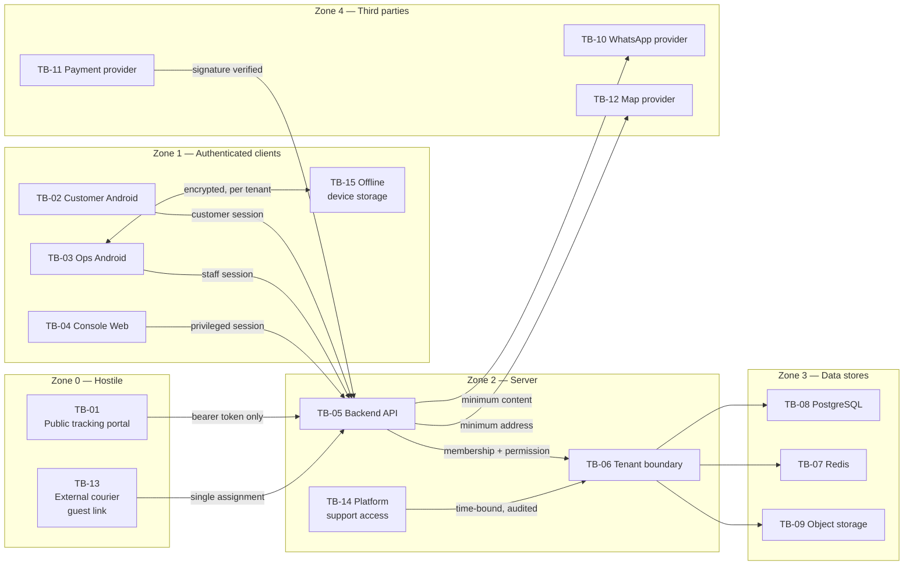

# Trust Boundaries — Aish Laundry App

**Step:** 1 — Product Requirement and Domain Model
**Status:** IN PROGRESS
**Implementation status:** NOT IMPLEMENTED. Backend runtime ABSENT. Flutter workspace ABSENT.
Deployment ABSENT. Application CI NOT APPLICABLE. UAT NOT STARTED.
**Canonical source:** [`../MASTER_SOURCE.md`](../MASTER_SOURCE.md) §4, §5, §6, §9, §13, §15
**Related decisions:** [DEC-0012](../decisions/DEC-0012-tenant-isolation-and-financial-integrity-hard-gate.md),
[DEC-0006](../decisions/DEC-0006-public-tracking-without-app-installation.md)

---

## 1. Purpose

A trust boundary is a line at which the trust placed in data, or in a caller, changes. Data crossing one
must be re-validated on the receiving side, because the assumptions that held on one side do not hold on
the other.

This document names fifteen boundaries, states what crosses each, and fixes the rule that governs the
crossing. **None of it is implemented.** Every rule is a requirement on a future Step.

---

## 2. Overview diagram

**Explanation of the diagram.** The zones descend in hostility from left to right. Zone 0 is reachable
by anyone on the internet with a link and no account, which is why both of its boundaries carry a bearer
credential and nothing else. Zone 1 holds the three authenticated client surfaces; the double-headed
arrow to TB-15 shows that the Ops app both writes to and reads from on-device storage, which is what
makes a lost device a data-exposure event rather than merely an access event. Every arrow out of Zones 0
and 1 terminates at TB-05: there is no path from any client to a data store, and no surface has a
private back channel. Inside Zone 2, every request passes TB-06 before reaching Zone 3 — including
platform support, which is drawn entering through TB-06 rather than around it, because platform
administration is a distinct audited path and is never implemented by relaxing tenant scoping. Zone 4 is
drawn last because data reaching it has left our control; note that only one arrow points inward from
it, the payment callback, and that arrow is labelled with the verification it must pass before it is
believed.

---

## 3. Boundary detail

### TB-01 — Public tracking portal
- **Between:** Anyone on the internet, holding a link ↔ backend API
- **Trust change:** From zero trust to a bearer-credential-scoped read of one order
- **What crosses inbound:** A tracking token, and portal actions such as a schedule-change request
- **What crosses outbound:** Order number, brand and outlet identity, service type, current status and status history, estimated completion, amount due, payment state, available actions — and **masked** name and phone
- **Governing rules:** The token is high-entropy, **stored hashed**, expiring, revocable, and **is not the order number** and not derivable from it. The portal is served with **`noindex`**. **The full address is never shown.** Laundry photographs, internal notes, other orders belonging to the same customer, and staff identity beyond the operationally necessary are never shown. **Sensitive actions require OTP.** Lookup is rate-limited.
- **Why it is the most exposed surface:** It exists precisely so that no app install is required (DEC-0006), which means it must be reachable by an unknown device on an unknown network, once, cold.
- **Threats:** THREAT-002, 025, 026, 036, 049 — **Step 7**, hardened **Step 13**

### TB-02 — Customer Android
- **Between:** A customer-authenticated device ↔ backend API
- **Trust change:** From an untrusted device to an identity-scoped session
- **What crosses:** Login and OTP, active orders, order history, tracking, pickup requests, addresses, invoices, loyalty, feedback, notification preferences
- **Governing rules:** The device is **not trusted**. Every request is re-authorised server-side; the client never asserts its own permissions. Credentials and tokens live in Android secure storage. A number change invalidates sessions. Session and device revocation take effect immediately.
- **Threats:** THREAT-001, 008 — **Step 11**, authentication in **Step 3**

### TB-03 — Ops Android
- **Between:** A staff-authenticated device ↔ backend API
- **Trust change:** From an untrusted device to a membership-and-permission-scoped session within one tenant at a time
- **What crosses:** Order intake, payments, production status transitions, quality control, courier jobs, proof capture, cash records
- **Governing rules:** Authorisation derives from **Membership**, never from the user account alone, and is verified server-side on every request. A **tenant switcher** exists wherever a user belongs to more than one tenant, and switching must not expose the previous context. This is the offline-first surface, so it also owns TB-15.
- **Threats:** THREAT-004, 011, 030, 042 — **Step 3** onward

### TB-04 — Console Web
- **Between:** An owner, tenant admin, manager, finance, or platform admin browser ↔ backend API
- **Trust change:** From an untrusted browser to the highest-privilege client session the product offers
- **What crosses:** Master data, price lists, reports, finance, the owner portfolio dashboard, subscription and platform administration
- **Governing rules:** The highest privilege means the strictest checks. Permission is enforced at the API boundary; hiding a control in the UI is a user-experience affordance and never an access control. **The owner portfolio dashboard must not weaken tenant isolation** — consolidation is a union of individually scoped queries over memberships actually held.
- **Threats:** THREAT-023, 043, 047 — **Step 10**, **Step 12**

### TB-05 — Backend API
- **Between:** Every client surface ↔ every server-side capability
- **Trust change:** This is the enforcement point. Everything above converges here and nothing bypasses it
- **What crosses:** All of it
- **Governing rules:** **Every client surface consumes the same versioned HTTP API** — no surface gets a private back channel or direct database access. Server-side authorisation on every protected endpoint. Rate limiting and brute-force protection on authentication, OTP, and tracking-token endpoints. Idempotency support on write endpoints clients may retry. Consistent JSON envelope, consistent error shape, stable machine-readable error codes, user-facing messages in Bahasa Indonesia. **Breaking changes require a new version and are never shipped by mutating `/api/v1` semantics under existing clients**, because mobile clients update slowly and old versions stay in the field.
- **Threats:** all of them, ultimately — **Step 3** onward

### TB-06 — Tenant boundary
- **Between:** One tenant's data ↔ every other tenant's data, inside the backend
- **Trust change:** The product's central safety property. There is no legitimate crossing
- **What crosses:** Nothing. That is the point
- **Governing rules:** The hierarchy is `User Account -> Membership -> Tenant/Organization -> Laundry Brand -> Outlet`. **Every business table carries `tenant_id`; every business query is tenant-scoped; a client-supplied tenant identifier is never authorisation proof; the backend verifies membership and permission server-side on every request.** Scoping is a **default at the data access layer**, so a forgotten scope yields nothing rather than another tenant's rows — fail closed, never fail open. Caches, queues, search indexes, exports, report files, uploaded files, and object-storage keys all carry a tenant dimension. Background jobs carry explicit tenant context and never infer it from the last request. **Data is never merged merely because owner name, email, or phone match** — identical contact details across tenants are expected. **Cross-tenant data exposure is an automatic NO-GO** (DEC-0012): it blocks merge, blocks release, blocks a GO tag, and is not subject to schedule negotiation.
- **Threats:** THREAT-009, 016, 022, 023, 030, 044, 047 — **Step 3**, and every Step thereafter

### TB-07 — Redis
- **Between:** Backend ↔ cache, queue, distributed lock, and rate-limit store
- **Trust change:** From authoritative state to derived, disposable state
- **What crosses:** Cached reads, queued jobs, lock acquisitions, rate-limit counters
- **Governing rules:** Redis is **never the system of record** — nothing financially or legally significant lives only there. **Losing Redis degrades performance and must never lose money or orders.** **Every cache key carries a tenant dimension**; a tenant-less key is a cross-tenant leak waiting to happen. Locks guard operations that must not run concurrently: payment application, shift closing, and status transitions. Rate limiting **fails closed** for abusable endpoints rather than fail open.
- **Threats:** THREAT-016, 041 — **Step 3**, hardened **Step 13**

### TB-08 — PostgreSQL
- **Between:** Backend ↔ the system of record
- **Trust change:** From application state to durable truth
- **What crosses:** Every business read and write
- **Governing rules:** PostgreSQL is the system of record. Money columns are **integer Rupiah**. Timestamps stored in UTC, rendered in Asia/Jakarta or outlet local time where outlet-local semantics matter. Migrations are forward-only and reviewed; destructive migrations require explicit owner approval and a tested rollback plan. Every tenant-scoped query is index-supported — **a tenant-scoped query without a supporting index is a defect, not a tuning opportunity**. Database credentials come from the environment, never from a committed file.
- **Threats:** THREAT-022, 038, 044 — **Step 3** onward

### TB-09 — Object storage
- **Between:** Backend ↔ S3-compatible private storage
- **Trust change:** From access-controlled application data to a store whose default posture must be explicitly closed
- **What crosses:** Laundry photographs, proof-of-pickup and proof-of-delivery images, signatures, exports
- **Governing rules:** Buckets are **not publicly readable or listable** for tenant data. Private files are served via **signed, expiring URLs** only. Object keys are **tenant-scoped and unguessable** — a sequential or predictable key is an enumeration vulnerability. Uploads validated by type, size, and content server-side. Images compressed on device before upload, served resized, never loaded at full resolution in a list.
- **Threats:** THREAT-015, 024, 039 — **Step 8**, hardened **Step 13**

### TB-10 — WhatsApp provider
- **Between:** Backend ↔ a third-party messaging vendor
- **Trust change:** Outbound, data leaves our control entirely; inbound, an untrusted party asserts events
- **What crosses outbound:** Recipient number, template identifier, and the minimum message content
- **What crosses inbound:** Delivery outcomes and, potentially, customer replies
- **Governing rules:** **Provider abstraction is mandatory** — sending sits behind an internal interface and no vendor SDK, payload shape, or identifier leaks into business logic. The official provider is the automated path; a `wa.me`-style manual deep link is an explicit, visible **fallback** and is never described or sold as automation. Message content carries **no full address, no token, no OTP echoed back**. **Quiet hours default 20.00–08.00 outlet local time**, evaluated at send time. Deduplication keyed on recipient, event, order, and intended send window. Inbound webhooks are signature-verified and replay-rejected, and **never alter order lifecycle state** — a WhatsApp failure never cancels an order. **Provider costs are transparent and billed separately from the plan**; there is never a promise of "unlimited WhatsApp".
- **Threats:** THREAT-005, 035, 037, 040 — **Step 7**

### TB-11 — Payment provider
- **Between:** Backend ↔ a third-party payment gateway
- **Trust change:** An external party asserts that money moved. This is the highest-consequence inbound assertion in the system
- **What crosses inbound:** Payment callbacks
- **What crosses outbound:** Payment initiation with an order reference and an amount
- **Governing rules:** Callbacks are **verified server-side** — signature and authenticity checked, amount and currency checked against the expected order, replay rejected. **An order is never marked paid on a client claim.** Payments are **idempotent** on a stable `client_reference`. Concurrent operations on the same order or payment are serialized so double submission cannot create double payment. **Any financial integrity failure is an automatic NO-GO.**
- **Threats:** THREAT-006 — **Step 5**

### TB-12 — Map provider
- **Between:** Backend or client ↔ a third-party geocoding or tile service
- **Trust change:** Outbound personal data to a party the customer never chose
- **What crosses:** Address text or coordinates for geocoding, zone definition, and route ordering
- **Governing rules:** Send the **minimum necessary**, without order or customer identifiers alongside. Prefer coordinates already held over repeated geocoding. No third-party service is introduced without owner approval. **Route ordering is a suggestion.** The product claims **no route optimisation, no guaranteed arrival time, and no ETA accuracy it does not provide** — copy uses "usulan rute" semantics, never "rute optimal".
- **Threats:** THREAT-034 — **Step 8**

### TB-13 — External courier guest link
- **Between:** An external ojek lokal, unauthenticated ↔ backend API, scoped to one assignment
- **Trust change:** From zero trust to a single-job, minimum-privilege, temporary credential
- **What crosses:** The guest token; and outbound, the assignment detail and its proof-capture and cash-recording actions
- **Governing rules:** The token is **high-entropy, stored hashed, revocable, and expiring**. It **is not the order number and is not derivable from it**. It exposes only the minimum needed to complete the assigned job, and grants **no** access to customer history, other orders, pricing, or any tenant data beyond the assignment. It does **not** show a full customer address beyond what the delivery genuinely requires, and never in a shareable or indexable form. It is **tenant-scoped**: a courier working for two tenants gets two unrelated links and can never traverse from one to the other. Every guest request re-derives its scope from the token, never from a request parameter. Courier UX is deliberately simple — large tap targets, few steps, one-handed, usable outdoors on a cheap phone — because complexity here produces skipped proofs and lost cash.
- **Threats:** THREAT-003, 027, 045 — **Step 8**

### TB-14 — Platform support access
- **Between:** Platform staff ↔ tenant data
- **Trust change:** From no tenant access at all to explicitly granted, time-bound, audited access
- **What crosses:** Whatever the impersonated role could see, for the duration
- **Governing rules:** **Platform support has no silent tenant access.** Impersonation is explicit, reason-required, **time-bound**, and audited with actor, tenant, start, end, and reason. Start and end are mandatory security audit events. The audit record is append-only and cannot be suppressed by the impersonator. **Global and platform administration is a distinct, audited path and is never implemented by relaxing tenant scoping for ordinary roles** — there is no bypass parameter and no scope-disable mode. Direct database access by platform engineers bypasses this boundary entirely and must be governed separately.
- **Threats:** THREAT-007, 044 — **Step 12**

### TB-15 — Offline device storage
- **Between:** The Ops Android application ↔ persistent storage on the device
- **Trust change:** From server-controlled data to data sitting on hardware that can be lost, sold, stolen, or rooted
- **What crosses:** The pending operation queue, cached orders and customers, credentials and tokens
- **Governing rules:** **`client_reference` on every important operation**, generated once, persisted with the queued operation, and **reused unchanged on every retry**. The queue is **persistent** across app restart and device reboot; an in-memory queue is not acceptable. Retries use bounded exponential backoff. **The financial queue is never casually deleted** — not by a cache clear, a version upgrade, a logout, or a developer convenience button; removal requires an explicit, permissioned, audited action. **Payment conflicts are never silently overwritten**; they surface to a human with both values. **The server is the final source of truth** on divergence. **Local data is separated per tenant and per user**, so a tenant or user switch exposes nothing from the previous context. Sensitive local data is encrypted, with credentials and tokens in Android secure storage. **Offline and sync state are visible to the user at all times** — what is pending, what failed, what needs attention. Clock skew is expected; server timestamps are authoritative for ordering and reporting. **A duplicate order or duplicate payment produced by a retry is unacceptable** and is an automatic NO-GO.
- **Threats:** THREAT-004, 013, 030 — **Step 5** onward

---

## 4. Crossing rules by data class

Which classes may cross which boundary, using the classes of
[`DATA_CLASSIFICATION.md`](DATA_CLASSIFICATION.md):

| Boundary | PUBLIC | INTERNAL | CONFIDENTIAL | RESTRICTED | SECRET |
| --- | --- | --- | --- | --- | --- |
| TB-01 Public portal | Yes | No | **Masked only** | **Never** | Token inbound only, never outbound |
| TB-02 Customer Android | Yes | No | Own records only | Own records only | Session token, secure storage |
| TB-03 Ops Android | Yes | Yes | Tenant-scoped | Tenant-scoped, role-limited | Session token, secure storage |
| TB-04 Console Web | Yes | Yes | Tenant-scoped | Tenant-scoped, role-limited | Session token |
| TB-05 Backend API | Yes | Yes | Yes | Yes | Handled, never returned in plaintext |
| TB-06 Tenant boundary | n/a | n/a | **No crossing** | **No crossing** | **No crossing** |
| TB-07 Redis | Yes | Yes | Tenant-keyed cache | Avoid; never the record | Rate-limit counters only, no credential values |
| TB-08 PostgreSQL | Yes | Yes | Yes | Yes | Hashed only |
| TB-09 Object storage | No public read | Yes | Yes | Yes, signed URL only | Never |
| TB-10 WhatsApp provider | Yes | No | Minimum content | **Never** — no address, no photo | **Never** — no OTP echoed |
| TB-11 Payment provider | Yes | No | Order reference and amount | No | Credential held server-side only |
| TB-12 Map provider | Yes | No | Minimum | Address only as strictly required | Never |
| TB-13 Guest link | Yes | No | Assignment only | Minimum address the job requires | Token inbound only |
| TB-14 Support access | Yes | Yes | Audited, time-bound | Audited, time-bound | Never |
| TB-15 Offline storage | Yes | Yes | Encrypted, per tenant and user | Encrypted, per tenant and user | Android secure storage |

---

## 5. Related documents

- [`INITIAL_THREAT_MODEL.md`](INITIAL_THREAT_MODEL.md)
- [`ABUSE_CASES.md`](ABUSE_CASES.md)
- [`DATA_CLASSIFICATION.md`](DATA_CLASSIFICATION.md)
- [`PRIVACY_REQUIREMENTS.md`](PRIVACY_REQUIREMENTS.md)
- [`SECURITY_ACCEPTANCE_CRITERIA.md`](SECURITY_ACCEPTANCE_CRITERIA.md)
- [`../quality/ACCEPTANCE_CRITERIA.md`](../quality/ACCEPTANCE_CRITERIA.md)
