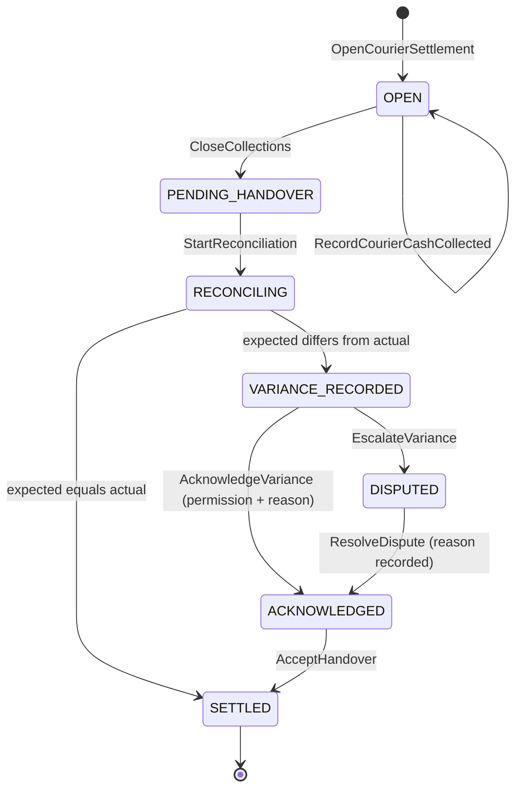

# Courier Settlement State Machine — Aish Laundry App

**Step:** 1 — Product Requirement and Domain Model
**Status:** `NOT IMPLEMENTED` (documentation only)
**Canonical source:** [`../MASTER_SOURCE.md`](../MASTER_SOURCE.md) v1.1.0
**Decision records:** [DEC-0007](../decisions/DEC-0007-pickup-and-delivery-as-core-product.md),
[DEC-0012](../decisions/DEC-0012-tenant-isolation-and-financial-integrity-hard-gate.md)
**Domain:** [`../domain/PICKUP_DELIVERY_DOMAIN.md`](../domain/PICKUP_DELIVERY_DOMAIN.md)

> **This enumeration is exhaustive. A transition not listed here is forbidden.**

A courier carries other people's money on a motorbike. This machine exists so that the amount
collected and the amount handed over are compared **explicitly**, and any difference between them is
recorded and acknowledged by a human rather than quietly absorbed.

---

## 1. The states

A `CourierSettlement` covers **one courier, one shift or route, one outlet, one tenant**.

| State | Meaning |
| --- | --- |
| `OPEN` | The shift is running. Cash collections accrue to this settlement. |
| `PENDING_HANDOVER` | Collections closed. The courier is bringing cash to the outlet. |
| `RECONCILING` | Expected and actual are being compared, note by note. |
| `VARIANCE_RECORDED` | Actual differs from expected. The difference is recorded and awaits acknowledgement. |
| `ACKNOWLEDGED` | A permissioned actor has acknowledged the variance, with a reason. |
| `SETTLED` | Cash handed over and accepted. Terminal. |
| `DISPUTED` | The variance is contested and escalated to a manager or owner. |

---

## 2. Diagram

**Explanation.** Three structural facts. First, there is **no edge from `RECONCILING` or
`VARIANCE_RECORDED` straight to `SETTLED`** — a settlement cannot be accepted while an
unacknowledged variance exists (`DEL-030`). Second, **`DISPUTED` resolves to `ACKNOWLEDGED`, never
directly to `SETTLED`**, so an escalation always leaves a recorded human decision behind it. Third,
**`SETTLED` is terminal**: a later correction is a reversal or adjustment entry, never an edit of a
closed settlement.

---

## 3. Transition table

Every transition names an **actor** and its **preconditions**.

| # | From | To | Command | Actor(s) | Preconditions (guards) | Events |
| --- | --- | --- | --- | --- | --- | --- |
| S-01 | — | `OPEN` | `OpenCourierSettlement` | Manager outlet, kasir | One courier, one shift or route, one outlet, one tenant; no other settlement `OPEN` for that courier and shift | `CourierSettlementOpened` |
| S-02 | `OPEN` | `OPEN` | `RecordCourierCashCollected` | Kurir, external courier | Cash collected at a `DELIVERED` transfer; **integer Rupiah**; idempotent on `ClientReference` (`FIN-027`, `DEL-014`) | `CourierCashCollected` |
| S-03 | `OPEN` | `PENDING_HANDOVER` | `CloseCollections` | Kurir, manager outlet | The shift or route ended; **expected total computed server-side** from the authoritative financial records, never from a client figure | `CourierCollectionsClosed` |
| S-04 | `PENDING_HANDOVER` | `RECONCILING` | `StartReconciliation` | Manager outlet, kasir, finance | The courier is present or the cash is presented; the actual counted amount is entered as integer Rupiah | `CourierReconciliationStarted` |
| S-05 | `RECONCILING` | `SETTLED` | `AcceptHandover` | Manager outlet, kasir, finance | **Expected equals actual, exactly.** No tolerance band, no rounding | `CourierCashHandedOver`, `CourierSettlementSettled` |
| S-06 | `RECONCILING` | `VARIANCE_RECORDED` | — (policy) | System | Expected differs from actual by any amount; the variance is recorded as a signed integer Rupiah figure with both sides shown | `CourierCashVarianceRecorded` |
| S-07 | `VARIANCE_RECORDED` | `ACKNOWLEDGED` | `AcknowledgeVariance` | Manager outlet, finance — **permission required** | **`ReasonCode` plus free text mandatory**; actor and server timestamp recorded; audit entry written in the same transaction | `CourierCashVarianceAcknowledged`, `AuditEntryRecorded` |
| S-08 | `VARIANCE_RECORDED` | `DISPUTED` | `EscalateVariance` | Manager outlet, kurir | The variance is contested; escalation reaches a manager or owner, a human accountable for the outcome | `CourierCashVarianceDisputed` |
| S-09 | `DISPUTED` | `ACKNOWLEDGED` | `ResolveDispute` | Manager outlet, tenant owner, finance | Resolution and `ReasonCode` recorded; the original variance figure is **preserved unchanged** | `CourierCashDisputeResolved` |
| S-10 | `ACKNOWLEDGED` | `SETTLED` | `AcceptHandover` | Manager outlet, kasir, finance | The variance is acknowledged; handover recorded per courier, per shift | `CourierCashHandedOver`, `CourierSettlementSettled` |

---

## 4. The money rules

- **Money is integer Rupiah.** The smallest unit is one Rupiah. **Floating point is forbidden** in
  every financial path — collection, expected total, actual count, variance, and handover
  (`FIN-001`, `FIN-002`).
- **Expected versus actual is compared explicitly** and both figures are shown. The product never
  presents only the difference.
- **Any variance is recorded and acknowledged, never silently absorbed**, auto-rounded away, written
  off, or suppressed from a report (`FIN-029`). A visible discrepancy is a feature; a hidden one is
  fraud-shaped.
- **Handover is tracked per courier, per shift**, from collection through to acceptance
  (`FIN-028`, `DEL-030`).
- Cash collection is a **financial transaction** in full: idempotent on a stable `ClientReference`,
  never deleted through ordinary UI, corrected only by reversal or adjustment entries, and audited
  with actor, timestamp, amount, and reason (`FIN-007`, `FIN-008`).
- Totals are computed and authoritative **on the server**. A client-computed total is display only,
  and an order is never marked paid on a client claim (`FIN-005`, `FIN-015`).
- Every settlement record carries `TenantId` and is outlet-scoped. A settlement never spans two
  tenants, and courier cash figures are never aggregated across tenants (`TEN-015`).

---

## 5. Custody, proof, and the guest link

Settlement inherits the custody rules of the delivery job it settles, restated here because cash and
custody travel together:

- **Proof is mandatory for every custody transfer** — OTP, photo, signature, or recipient name per
  tenant policy (`DEL-002`, `DEL-011`). A cash collection is always attached to a proven delivery;
  cash never appears against an unproven handover.
- **Proof artefacts are private**: private object storage, tenant-scoped unguessable keys, **signed
  expiring URLs only**, and **never shown on the public tracking portal** (`DEL-012`, `DEL-021`,
  `TRK-017`).
- **Route ordering is a suggestion — "usulan rute"** (`DEL-005`). A settlement report never implies
  the route was optimal, and the product never claims an optimal route, a route optimisation engine,
  or a guaranteed arrival time.
- An external ojek lokal settles through the same machine but reaches it only through a **scoped,
  expiring, revocable, high-entropy guest job link** that exposes **only the assigned job** and
  **never a tenant membership** (`DEL-007`, `DEL-008`, `DEL-024`). A guest link never exposes another
  courier's settlement, another job, pricing, or customer history.

---

## 6. Forbidden transitions

| Forbidden | Why |
| --- | --- |
| Any transition not enumerated above | The table is exhaustive. |
| `RECONCILING -> SETTLED` while expected and actual differ | Not permitted. Only S-05, on an exact match, may settle from `RECONCILING`. |
| `VARIANCE_RECORDED -> SETTLED` | Not permitted (`DEL-030`). A variance is acknowledged first. |
| `DISPUTED -> SETTLED` | Not permitted. A dispute resolves to `ACKNOWLEDGED`, leaving a recorded decision. |
| Acknowledging a variance without the permission, or without a reason | Disallowed. |
| Acknowledging a variance without an audit entry | Disallowed — the acknowledgement does not happen (`FIN-038`). |
| Editing or deleting a recorded variance, collection, or handover | Illegal. Corrections are reversal or adjustment entries (`FIN-007`, `FIN-008`). |
| `SETTLED -> anything` | Terminal. A later correction is a new adjustment entry. |
| Auto-adjusting, rounding away, or absorbing a variance | Illegal. Financial integrity failure and an automatic `NO-GO`. |
| Any floating-point arithmetic on any figure here | Forbidden without exception (`FIN-002`). |
| A settlement spanning two couriers, two shifts, or two tenants | Illegal. |
| A cash record created without an authenticated, authorised actor | Disallowed; authorisation is server-side. |
| Any transition driven by a notification outcome | Never (`NOT-001`). |

---

## 7. Emitted domain events

`CourierSettlementOpened`, `CourierCashCollected`, `CourierCollectionsClosed`,
`CourierReconciliationStarted`, `CourierCashVarianceRecorded`, `CourierCashVarianceAcknowledged`,
`CourierCashVarianceDisputed`, `CourierCashDisputeResolved`, `CourierCashHandedOver`,
`CourierSettlementSettled`, `AuditEntryRecorded`.

Each carries its **source aggregate** (`CourierSettlement`), `TenantId`, the actor, a server
timestamp, the `CorrelationId`, and — where monetary — an integer Rupiah amount. See
[`../domain/DOMAIN_EVENTS.md`](../domain/DOMAIN_EVENTS.md) §1.1.

---

## 8. Timestamps recorded

| Timestamp | Recorded at | Mutability |
| --- | --- | --- |
| `settlement_opened_at` | S-01 | Immutable |
| `cash_collected_at` | S-02 | Immutable per collection |
| `collections_closed_at` | S-03 | Immutable |
| `reconciliation_started_at` | S-04 | Immutable |
| `variance_recorded_at` | S-06 | Immutable; the figure is written once |
| `variance_acknowledged_at` | S-07 | Immutable |
| `disputed_at` / `dispute_resolved_at` | S-08, S-09 | Immutable |
| `handed_over_at`, `settled_at` | S-05, S-10 | Immutable |

Stored in UTC, rendered in Asia/Jakarta or outlet local time. **Server timestamps are
authoritative** (`OFF-015`).

---

## 9. Reason capture

A `ReasonCode` plus free text is **mandatory** on S-07 (acknowledgement), S-08 (escalation), and S-09
(dispute resolution). The reason is the whole point: "kembalian kurang", "uang palsu ditolak bank",
"pelanggan bayar sebagian" are legitimate reasons; a blank field is not. Reasons carry the actor and
a server timestamp and are **never edited** — a correction is a new entry that supersedes without
erasing.

---

## 10. Rollback and corrective paths

There is **no rollback**. The settlement ledger is append-only in effect.

| Mistake | Corrective path |
| --- | --- |
| The actual count was entered wrongly | Record a **new** reconciliation entry with a reason. The earlier figure remains visible with its actor. |
| Cash recorded against the wrong courier | A **reversal entry** against the wrong settlement and a fresh entry against the right one (`FIN-008`). Neither record is deleted. |
| A settlement closed too early | It stays closed. A late collection is recorded against a new settlement, referencing the closed one. |
| A variance acknowledged in error | The acknowledgement stands as a recorded fact; an adjustment entry with a reason corrects the money, and a manager review records the mistake. |
| Cash found later | An adjustment entry, never a retrospective edit of the variance. |
| A settlement settled with a wrong figure | An adjustment entry against the tenant's financial records. **The settled record is never reopened.** |

---

## 11. Conflict behaviour

- Every transition carries the settlement `Version` it read; a mismatch **rejects** the command.
- Reconciliation and handover acceptance take a **serialising lock**, so two managers cannot settle
  one shift twice (`FIN-016`).
- Two collections submitted for one delivery are deduplicated on `ClientReference`; exactly one cash
  record results.
- A collection arriving after `CloseCollections`: rejected against the closed settlement and
  surfaced, never silently folded into it.
- **A conflict affecting money escalates to a human** (`OFF-011`). A courier's figure and the
  outlet's figure disagreeing is exactly the case that must never be auto-resolved; it surfaces as a
  variance, which is what this machine is for.
- No conflict is resolved by discarding a financial record.

---

## 12. Offline sync behaviour

- Cash collection at the door is captured offline and queued with a stable `ClientReference`,
  generated once and **reused unchanged on every retry** (`OFF-001`, `DEL-034`).
- Idempotency is a **server contract**: a retry after a dead zone produces **exactly one** cash
  record. A duplicate payment is unacceptable (`OFF-007`).
- The queue is persistent and survives app kill and device reboot (`OFF-002`, `OFF-019`).
- **The financial queue is never casually deleted** — not by a cache clear, an app upgrade, a logout,
  or a developer convenience action. Removing a queued financial operation requires an explicit,
  permissioned, audited action (`OFF-004`).
- Retries use exponential backoff (`OFF-003`). Dependency ordering holds: a collection never syncs
  ahead of the delivery it belongs to (`OFF-009`).
- **Reconciliation, acknowledgement, and handover acceptance are server-side actions.** They are not
  completed offline, because a settlement accepted on a device that never reached the server is a
  settlement that did not happen.
- A queued operation replayed under a different tenant or user context is **rejected** (`OFF-016`).
- The courier and the manager both always see what is pending sync (`OFF-013`).
- On divergence the **server is the final source of truth** (`OFF-005`); **payment conflicts are
  never silently overwritten** (`OFF-011`).

---

## 13. Status

`NOT IMPLEMENTED`. No settlement, collection, reconciliation, variance, or handover path exists.
Backend runtime is `ABSENT`. This document claims no test, build, deployment, CI run, or UAT.

---

## Related documents

- [`PICKUP_DELIVERY_STATE_MACHINE.md`](PICKUP_DELIVERY_STATE_MACHINE.md)
- [`PAYMENT_STATE_MACHINE.md`](PAYMENT_STATE_MACHINE.md)
- [`REFUND_STATE_MACHINE.md`](REFUND_STATE_MACHINE.md)
- [`../domain/PAYMENT_DOMAIN.md`](../domain/PAYMENT_DOMAIN.md)
- [`../domain/DOMAIN_INVARIANTS.md`](../domain/DOMAIN_INVARIANTS.md)
