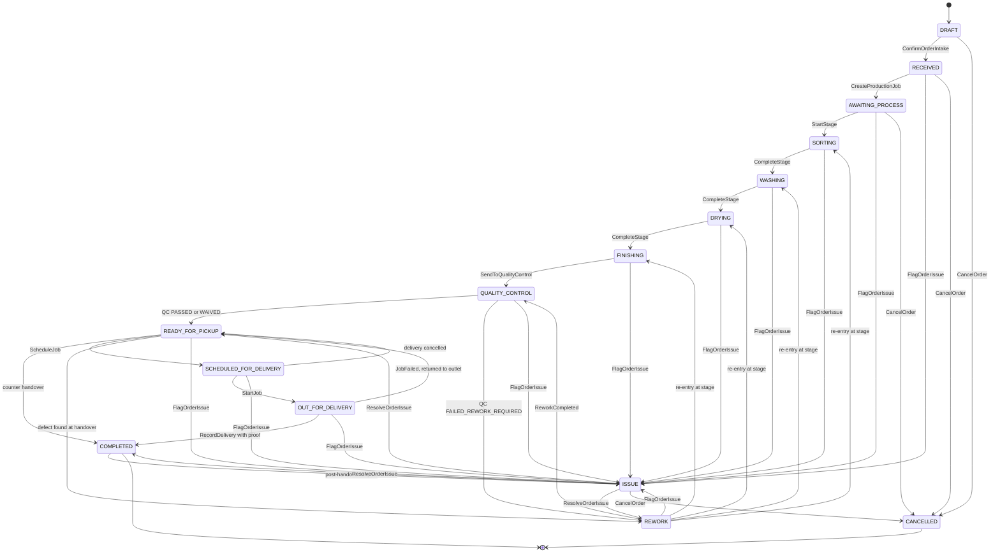

# Order State Machine — Aish Laundry App

**Step:** 1 — Product Requirement and Domain Model
**Status:** `NOT IMPLEMENTED` (documentation only)
**Canonical source:** [`../MASTER_SOURCE.md`](../MASTER_SOURCE.md) v1.0.1
**Domain:** [`../domain/ORDER_DOMAIN.md`](../domain/ORDER_DOMAIN.md)

> **This enumeration is exhaustive. A transition not listed here is forbidden.** There is no
> free-form status-update path and no `SetOrderStatus` command.

---

## 1. The fifteen states

| State | Meaning |
| --- | --- |
| `DRAFT` | Being built at the counter. Not yet a commitment. |
| `RECEIVED` | Intake confirmed. Price snapshot taken. Nota produced. |
| `AWAITING_PROCESS` | Accepted, queued for production. |
| `SORTING` | Being sorted. |
| `WASHING` | Being washed. |
| `DRYING` | Being dried. |
| `FINISHING` | Being ironed, folded, packed. |
| `QUALITY_CONTROL` | Awaiting or undergoing inspection. |
| `REWORK` | Failed inspection; being redone. |
| `READY_FOR_PICKUP` | Finished and available. **The first entry here anchors unclaimed aging, permanently.** |
| `SCHEDULED_FOR_DELIVERY` | A delivery job is scheduled. |
| `OUT_FOR_DELIVERY` | In a courier's custody. |
| `COMPLETED` | Handed over at the counter, or delivered with proof. |
| `CANCELLED` | Terminated with a recorded reason. |
| `ISSUE` | A problem requiring human resolution. A first-class state, not an error. |

---

## 2. Diagram

**Explanation.** Three structural facts the diagram encodes. First, **`QUALITY_CONTROL` is the only
gateway to `READY_FOR_PICKUP`** — no production stage reaches ready directly. Second, **`ISSUE` is
reachable from every operational state and returns to a defined state**, so a problem is never a dead
end and never silently deletes an order. Third, **`COMPLETED` and `CANCELLED` are terminal**, with
the single exception that a post-handover dispute may raise `COMPLETED -> ISSUE` — which resolves
back to `COMPLETED`, never to a re-opened production state.

---

## 3. Transition table

| # | From | To | Command | Actor(s) | Preconditions | Events |
| --- | --- | --- | --- | --- | --- | --- |
| T-01 | `DRAFT` | `RECEIVED` | `ConfirmOrderIntake` | Kasir, laundry admin | ≥1 line; price snapshot written; server-computed total (`FIN-015`) | `OrderPriceSnapshotTaken`, `OrderReceived` |
| T-02 | `DRAFT` | `CANCELLED` | `CancelOrder` | Kasir | `ReasonCode` | `OrderCancelled` |
| T-03 | `RECEIVED` | `AWAITING_PROCESS` | `CreateProductionJob` | System | Order accepted | `ProductionJobCreated`, `OrderStatusChanged` |
| T-04 | `AWAITING_PROCESS` | `SORTING` | `StartStage` | Operator produksi | Job created | `ProductionStageStarted`, `OrderStatusChanged` |
| T-05 | `SORTING` | `WASHING` | `CompleteStage` | Operator produksi | Sorting complete | `ProductionStageCompleted`, `OrderStatusChanged` |
| T-06 | `WASHING` | `DRYING` | `CompleteStage` | Operator produksi | Washing complete | Same |
| T-07 | `DRYING` | `FINISHING` | `CompleteStage` | Operator produksi | Drying complete | Same |
| T-08 | `FINISHING` | `QUALITY_CONTROL` | `SendToQualityControl` | Operator produksi | All stages complete | `QualityControlInspectionOpened`, `OrderStatusChanged` |
| T-09 | `QUALITY_CONTROL` | `READY_FOR_PICKUP` | `TransitionOrderStatus` | System, on verdict | Inspection `PASSED` **or** `WAIVED_WITH_AUTHORIZATION` | `OrderStatusChanged`; **on the first occurrence only**, `OrderReachedReadyForPickupFirstTime` |
| T-10 | `QUALITY_CONTROL` | `REWORK` | `TransitionOrderStatus` | System, on verdict | Inspection `FAILED_REWORK_REQUIRED` | `QualityControlFailedReworkRequired`, `ReworkRequested`, `OrderStatusChanged` |
| T-11 | `REWORK` | `SORTING` / `WASHING` / `DRYING` / `FINISHING` | `StartStage` | Operator produksi | Re-entry stage recorded with a reason | `ProductionStageStarted`, `OrderStatusChanged` |
| T-12 | `REWORK` | `QUALITY_CONTROL` | `SendToQualityControl` | Operator produksi | Rework complete | `ReworkCompleted`, `QualityControlInspectionOpened` |
| T-13 | `READY_FOR_PICKUP` | `COMPLETED` | `CompleteOrder` | Kasir | Handover recorded | `OrderCompleted` |
| T-14 | `READY_FOR_PICKUP` | `SCHEDULED_FOR_DELIVERY` | `ScheduleJob` | Kasir, manager outlet | `TimeWindow` set (`DEL-004`) | `JobScheduled`, `OrderStatusChanged` |
| T-15 | `READY_FOR_PICKUP` | `REWORK` | `TransitionOrderStatus` | Manager outlet, quality control | Defect found at handover; `ReasonCode` | `ReworkRequested`, `OrderStatusChanged`. **Aging anchor unchanged** (`UCL-017`) |
| T-16 | `SCHEDULED_FOR_DELIVERY` | `OUT_FOR_DELIVERY` | `StartJob` | Kurir, external courier | Courier assigned | `JobEnRoute`, `OrderStatusChanged` |
| T-17 | `SCHEDULED_FOR_DELIVERY` | `READY_FOR_PICKUP` | `CancelJob` | Kasir, manager outlet | `ReasonCode` | `JobCancelled`, `OrderStatusChanged` |
| T-18 | `OUT_FOR_DELIVERY` | `COMPLETED` | `RecordDelivery` | Kurir, external courier | **`DeliveryProof` captured** (`DEL-027`); `ARRIVED` recorded (`DEL-028`) | `ParcelDelivered`, `OrderCompleted` |
| T-19 | `OUT_FOR_DELIVERY` | `READY_FOR_PICKUP` | `RecordJobFailure` | Kurir, external courier | `ReasonCode`; laundry returned to outlet (`DEL-031`) | `JobFailed`, `OrderStatusChanged`. **Aging anchor unchanged** |
| T-20 | Any operational state | `ISSUE` | `FlagOrderIssue` | Kasir, manager outlet, quality control, kurir | `ReasonCode` + free text | `OrderFlaggedAsIssue` |
| T-21 | `COMPLETED` | `ISSUE` | `FlagOrderIssue` | Kasir, manager outlet | Post-handover or post-delivery dispute | `OrderFlaggedAsIssue` |
| T-22 | `ISSUE` | `READY_FOR_PICKUP` / `REWORK` / `COMPLETED` | `ResolveOrderIssue` | Manager outlet | Resolution and reason recorded | `OrderIssueResolved`, `OrderStatusChanged` |
| T-23 | `RECEIVED` / `AWAITING_PROCESS` / `ISSUE` | `CANCELLED` | `CancelOrder` | Manager outlet, or a permissioned laundry admin | `ReasonCode` + free text; captured money handled by reversal (`FIN-008`) | `OrderCancelled` |

---

## 4. Forbidden transitions

| Forbidden | Why |
| --- | --- |
| Any transition not in the table above | The enumeration is exhaustive. |
| `QUALITY_CONTROL -> READY_FOR_PICKUP` without a `PASSED` or `WAIVED_WITH_AUTHORIZATION` verdict | The verdict is the authorisation. |
| Any production stage `-> READY_FOR_PICKUP` directly | Inspection cannot be skipped. |
| `AWAITING_PROCESS -> COMPLETED` or any "skip to done" path | Work cannot be silently skipped. |
| `OUT_FOR_DELIVERY -> COMPLETED` without a captured `DeliveryProof` | `DEL-002`, `DEL-027`. |
| `EN_ROUTE`-equivalent jump past `ARRIVED` on the delivery job | `DEL-028`. |
| `CANCELLED -> anything` | Terminal. A new order is created instead. |
| `COMPLETED -> anything except ISSUE` | Terminal. A dispute is an `ISSUE`, not a re-opened order. |
| Any transition that **resets** the first-ready timestamp | `UCL-002`, `UCL-017`. |
| Any transition that **deletes** the order, a line, evidence, or money | `FIN-007`, `FIN-008`. |
| Any transition driven by a notification outcome | `NOT-001`, `NOT-029`. |
| Any transition that re-prices a line from a newer price list | `FIN-012`, `FIN-017`. |
| Any status change performed by a client without server authorisation | Server-side authorisation on every transition. |

---

## 5. Timestamps recorded

| Timestamp | Recorded at | Mutability |
| --- | --- | --- |
| `drafted_at` | T-01 predecessor | Immutable |
| `received_at` | T-01 | Immutable |
| Per-stage `started_at` / `completed_at` | T-04 … T-08, T-11 | Immutable per stage occurrence |
| `inspection_opened_at`, `inspection_decided_at` | T-08 … T-10 | Immutable per inspection |
| **`first_ready_at`** | **T-09, first occurrence only** | **Written once. Immutable forever. Never recomputed.** (`UCL-002`) |
| `latest_ready_at` | Every entry to `READY_FOR_PICKUP` | Overwritten; **never used for aging** |
| `scheduled_for_delivery_at`, `out_for_delivery_at` | T-14, T-16 | Immutable per job |
| `completed_at` | T-13, T-18 | Immutable |
| `cancelled_at` | T-02, T-23 | Immutable |
| `issue_raised_at`, `issue_resolved_at` | T-20 … T-22 | Immutable per issue |

All timestamps are stored in UTC and rendered in Asia/Jakarta or outlet local time. **Server
timestamps are authoritative** (`OFF-015`).

---

## 6. Reason capture

A `ReasonCode` plus free text is **mandatory** on: T-02, T-15, T-17, T-19, T-20, T-21, T-22, T-23,
and on any rework re-entry (T-11). Optional elsewhere. A reason is recorded with the actor and a
server timestamp, and is never edited afterwards — a correction is a new entry.

---

## 7. Rollback and corrective paths

There is **no rollback**. The order lifecycle is append-only in effect; a mistake is corrected by a
forward transition that records what happened.

| Mistake | Corrective path |
| --- | --- |
| Wrong status recorded | `FlagOrderIssue` (T-20), then `ResolveOrderIssue` (T-22) to the correct state, with a reason. |
| Order should not have been accepted | `CancelOrder` (T-23) with a reason; money reversed by an adjustment entry. |
| Defect found after ready | T-15 to `REWORK`. **Aging anchor unchanged.** |
| Delivery failed | T-19 back to `READY_FOR_PICKUP`. **Aging anchor unchanged.** |
| Dispute after handover | T-21 to `ISSUE`, resolved back to `COMPLETED`. |
| Wrong price snapshot | An authorised **amendment** with an adjustment entry (`FIN-018`). The snapshot itself is never edited. |

---

## 8. Conflict behaviour

- Every transition carries the aggregate `Version` it read. A mismatch **rejects** the command and
  the caller re-reads (optimistic concurrency).
- Status transition and payment application take a **serialising lock** on the order, so concurrent
  actors cannot interleave (`FIN-016`).
- Two operators completing the same stage: the second is rejected as a version conflict, not silently
  merged.
- A kasir completing an order while a courier is mid-delivery: rejected, because
  `OUT_FOR_DELIVERY -> COMPLETED` requires proof captured by the courier.

---

## 9. Offline sync behaviour

- Intake (T-01) and every production transition (T-04 … T-12) are capturable offline, queued with a
  stable `ClientReference`, and idempotent on it (`OFF-001`).
- **A retry after a network timeout produces exactly one order** (`OFF-007`).
- Dependency ordering is respected: the order must be accepted before a payment applies to it
  (`OFF-009`).
- A replayed status transition is recognised by its `ClientReference` and does **not** produce a
  second status-history entry.
- A queued transition is rejected if replayed under a different tenant or user context (`OFF-016`).
- The kasir and the operator always see which transitions are pending sync (`OFF-013`).
- A conflict between a local and a server status is resolved with the **server as final truth**
  (`OFF-005`); if money is implicated, it escalates to a human (`OFF-011`).

---

## 10. Interaction with payment

| Order state | Payment relationship |
| --- | --- |
| `DRAFT` | No financial record. A quoted total is display only. |
| `RECEIVED` | Amount due becomes authoritative; a `Receivable` opens if a balance remains (P-12). |
| Any production state | Payment may be captured at any point; production never blocks on payment. |
| `READY_FOR_PICKUP` | An unpaid order here becomes a **held invoice** on the unclaimed dashboard. |
| `OUT_FOR_DELIVERY` | Cash may be collected at the door — a financial transaction in full (`FIN-027`). |
| `COMPLETED` | Payment state is whatever the financial records say; completion never forces it. |
| `CANCELLED` | Captured money is corrected by **reversal or adjustment**, never by deleting a record (`FIN-008`). |

**An order is never marked paid on a client claim** (`FIN-005`), and no order transition ever writes
a financial record directly — it requests one from Payment and Receivables.

---

## 11. Interaction with delivery

| Order state | Delivery job state |
| --- | --- |
| `READY_FOR_PICKUP` | A job may be created and scheduled. |
| `SCHEDULED_FOR_DELIVERY` | Job is `SCHEDULED` or `ASSIGNED`. |
| `OUT_FOR_DELIVERY` | Job is `EN_ROUTE` or `ARRIVED`. |
| `COMPLETED` (via delivery) | Job is `DELIVERED` with proof captured. |
| `READY_FOR_PICKUP` (returned) | Job is `FAILED`; the laundry is back at the outlet (`DEL-031`). |

See [`PICKUP_DELIVERY_STATE_MACHINE.md`](PICKUP_DELIVERY_STATE_MACHINE.md).

---

## 12. Status

`NOT IMPLEMENTED`. No status machine, guard, transition handler, or timestamp field exists. Backend
runtime is `ABSENT`. This document claims no test, build, deployment, CI run, or UAT.
