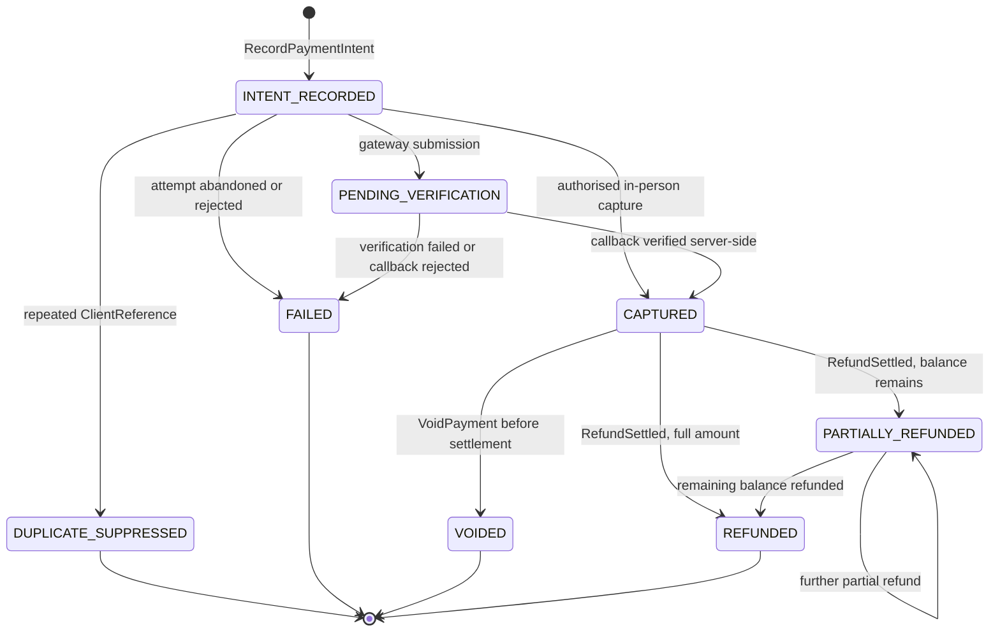

# Payment State Machine — Aish Laundry App

**Step:** 1 — Product Requirement and Domain Model
**Status:** `NOT IMPLEMENTED` (documentation only)
**Canonical source:** [`../MASTER_SOURCE.md`](../MASTER_SOURCE.md) v1.0.1
**Hard gate:** [DEC-0012](../decisions/DEC-0012-tenant-isolation-and-financial-integrity-hard-gate.md)
**Domain:** [`../domain/PAYMENT_DOMAIN.md`](../domain/PAYMENT_DOMAIN.md)

> **This enumeration is exhaustive.** Every amount is `Money` — integer Rupiah. **Floating point is
> forbidden in every path shown here** (`FIN-001`, `FIN-002`).

---

## 1. The states

| State | Meaning |
| --- | --- |
| `INTENT_RECORDED` | An intention to pay exists. **This is not a payment and is never shown as "paid".** |
| `PENDING_VERIFICATION` | A gateway payment awaiting server-side verification. |
| `CAPTURED` | Money is recognised. Set only by a server-verified event or an authorised in-person action. |
| `DUPLICATE_SUPPRESSED` | A repeated `ClientReference` was recognised; the original result was returned. |
| `FAILED` | The attempt did not succeed. Terminal for this payment. |
| `VOIDED` | Cancelled before settlement, with permission and a reason. |
| `PARTIALLY_REFUNDED` | One or more refunds settled; a captured balance remains. |
| `REFUNDED` | Fully refunded. |

---

## 2. Diagram

**Explanation.** Three things the diagram fixes. First, **there is no arrow into `CAPTURED` from an
unverified source** — the only two entries are an authorised in-person capture by an authenticated
staff member, and a server-verified gateway callback (`FIN-005`, `FIN-004`). Second,
**`DUPLICATE_SUPPRESSED` is a visible state, not a silent no-op**, so a kasir can distinguish a
suppressed duplicate from a lost attempt. Third, **no arrow leaves `CAPTURED` that reduces the
recorded amount in place** — refunds are separate `Refund` aggregates that leave the original
`Payment` record intact (`FIN-008`).

---

## 3. Transition table

| # | From | To | Command | Actor(s) | Preconditions | Events |
| --- | --- | --- | --- | --- | --- | --- |
| P-01 | — | `INTENT_RECORDED` | `RecordPaymentIntent` | Kasir, kurir (may be offline) | `ClientReference` generated once, before the first attempt (`OFF-001`) | `PaymentIntentRecorded` |
| P-02 | `INTENT_RECORDED` | `DUPLICATE_SUPPRESSED` | `CapturePayment` | Any | The `ClientReference` already produced a payment | `PaymentDuplicateSuppressed`; the **original result is returned** (`FIN-003`, `OFF-017`) |
| P-03 | `INTENT_RECORDED` | `CAPTURED` | `CapturePayment` | Kasir with capture permission, authenticated, in person | Server-side authorisation; serialising lock held on the order (`FIN-016`); cash or card physically taken | `PaymentCaptured` |
| P-04 | `INTENT_RECORDED` | `PENDING_VERIFICATION` | `CapturePayment` (gateway) | System | Network available. **An offline device may never reach this state** (`FIN-019`) | — |
| P-05 | `PENDING_VERIFICATION` | `CAPTURED` | `VerifyGatewayCallback` | System | Signature, amount, currency, and status verified **against the gateway**; replay rejected (`FIN-004`) | `PaymentGatewayCallbackVerified`, `PaymentCaptured` |
| P-06 | `PENDING_VERIFICATION` | `FAILED` | `VerifyGatewayCallback` | System | Verification failed | `PaymentGatewayCallbackRejected`, `PaymentFailed` |
| P-07 | `INTENT_RECORDED` | `FAILED` | — | System, kasir | Attempt abandoned or rejected | `PaymentFailed` |
| P-08 | `CAPTURED` | `VOIDED` | `VoidPayment` | Manager outlet, finance, **holding the void permission** | `ReasonCode` + free text; before settlement (`FIN-006`) | `AdjustmentEntryPosted` |
| P-09 | `CAPTURED` | `PARTIALLY_REFUNDED` | `SettleRefund` | Finance, system | Refund approved; amount < captured net of prior refunds (`FIN-020`) | `RefundSettled` |
| P-10 | `CAPTURED` | `REFUNDED` | `SettleRefund` | Finance, system | Refund approved for the full remaining amount | `RefundSettled` |
| P-11 | `PARTIALLY_REFUNDED` | `PARTIALLY_REFUNDED` / `REFUNDED` | `SettleRefund` | Finance, system | Cumulative refunds never exceed the captured amount; serialized against the parent payment | `RefundSettled` |

---

## 4. Forbidden transitions

| Forbidden | Why |
| --- | --- |
| Any transition into `CAPTURED` from an unverified callback | `FIN-004` |
| Any transition into `CAPTURED` on a **client claim** | `FIN-005` |
| `INTENT_RECORDED -> CAPTURED` from an offline device for a **gateway** payment | `FIN-019` |
| Any second `CAPTURED` record for the same `ClientReference` | `FIN-003`, `FIN-039` — automatic `NO-GO` |
| Any in-place reduction of a captured amount | `FIN-008` |
| Any deletion of a payment record | `FIN-007` — there is no `DeletePayment` command |
| `FAILED -> CAPTURED` | A new logical payment is a new aggregate. |
| `REFUNDED -> CAPTURED` | Terminal. A new payment is recorded instead. |
| `VOIDED -> anything` | Terminal. |
| A refund taking cumulative refunds above the captured amount | `FIN-020` |
| A void or refund without permission and a reason | `FIN-006` |
| Any transition whose audit entry cannot be written | `FIN-038` — no audit, no action |
| Any transition on a query that is not tenant-scoped | `TEN-030` and `FIN-040` fire jointly |

---

## 5. Timestamps recorded

| Timestamp | Recorded at | Mutability |
| --- | --- | --- |
| `intent_recorded_at` | P-01 (client capture time, plus server receipt time) | Immutable |
| `submitted_at` | P-04 | Immutable |
| `verified_at` | P-05 / P-06 | Immutable |
| `captured_at` | P-03 / P-05 | Immutable |
| `voided_at` | P-08 | Immutable |
| `refund_settled_at` | P-09 … P-11, per refund | Immutable |
| `suppressed_at` | P-02 | Immutable |

Both the client capture time and the server receipt time are stored for offline operations, because
they can differ by hours. **Server timestamps are authoritative for ordering and reporting**
(`OFF-015`).

---

## 6. Reason capture

`ReasonCode` plus free text is **mandatory** on P-08 (void) and on every refund settlement
(P-09 … P-11). Recorded with actor, timestamp, and amount (`FIN-006`, `FIN-021`). A refund is never a
silent operation.

---

## 7. Rollback and corrective paths

**There is no rollback and no delete.** Every correction is a forward entry.

| Mistake | Corrective path |
| --- | --- |
| Wrong amount captured | Refund the difference (P-09) or post an adjustment entry. The original record stands. |
| Payment captured against the wrong order | Post a **reversal** entry and a new correct payment. Both remain visible. |
| Duplicate suspected | Query by `ClientReference`. If it was suppressed, `PaymentDuplicateSuppressed` proves it. |
| Gateway callback replayed | Rejected at P-06 and recorded. No state change. |
| Refund issued in error | An **adjustment entry**, never a deletion. |
| Shift closed with an error | An adjustment entry. **A closed shift is never reopened.** |

---

## 8. Conflict behaviour

- **Concurrent operations on the same order or payment are serialized** by database transaction or
  distributed lock, so a double submission cannot create a double payment (`FIN-016`).
- Optimistic concurrency on `Version` rejects a stale write rather than merging it.
- **A payment conflict between local and server state is never silently overwritten** (`OFF-010`).
  Both values are surfaced to a human with enough context to decide.
- **Every money conflict escalates to a human** (`OFF-011`). There is no automatic resolution path,
  and adding one is a rejected design.
- Resolution records actor, timestamp, chosen value, and reason (`OFF-012`).

---

## 9. Offline sync behaviour

- A kasir offline may reach `INTENT_RECORDED` and, for **cash taken in person**, `CAPTURED`. A
  gateway payment cannot be confirmed offline (`FIN-019`, `OFF-023`).
- The `ClientReference` is generated **once**, persisted with the queued operation, and **reused
  unchanged on every retry** (`OFF-001`). Regenerating it is rejected (`OFF-025`).
- **The financial queue is never casually deleted** — not by a cache wipe, logout, or upgrade
  (`OFF-004`). Purging requires an explicit, permissioned, audited action (`OFF-024`).
- Financial operations are pruned only after **confirmed server acceptance**, never on a timer
  (`OFF-021`).
- **Sync state is visible at all times.** A kasir must never believe a payment was recorded while it
  sits in a queue (`OFF-013`).
- Replay after a long offline period reconciles correctly; the reference-keyed suppression prevents a
  burst of duplicates (`OFF-018`).

---

## 10. Interaction with order and delivery

| Interaction | Rule |
| --- | --- |
| Order status | Payment never drives an order status transition, and an order transition never writes a financial record directly. |
| Held invoice | An unpaid `Receivable` on an order sitting in `READY_FOR_PICKUP` becomes a held invoice on the unclaimed dashboard, **read from the financial records** (`FIN-023`, `UCL-014`). |
| Cash at the door | Collected during `OUT_FOR_DELIVERY` and posted through this machine; it is a financial transaction in full (`FIN-027`). See [`COURIER_SETTLEMENT_STATE_MACHINE.md`](COURIER_SETTLEMENT_STATE_MACHINE.md). |
| Order cancellation | Captured money is corrected by reversal or adjustment. The order is never deleted and neither is the payment (`FIN-008`). |
| Notification | A payment event may request a message. **A messaging failure never changes payment state** (`NOT-001`). |

---

## 11. Status

`NOT IMPLEMENTED`. No payment record, gateway adapter, lock, or idempotency store exists. Backend
runtime is `ABSENT`. This document claims no test, build, deployment, CI run, or UAT.
