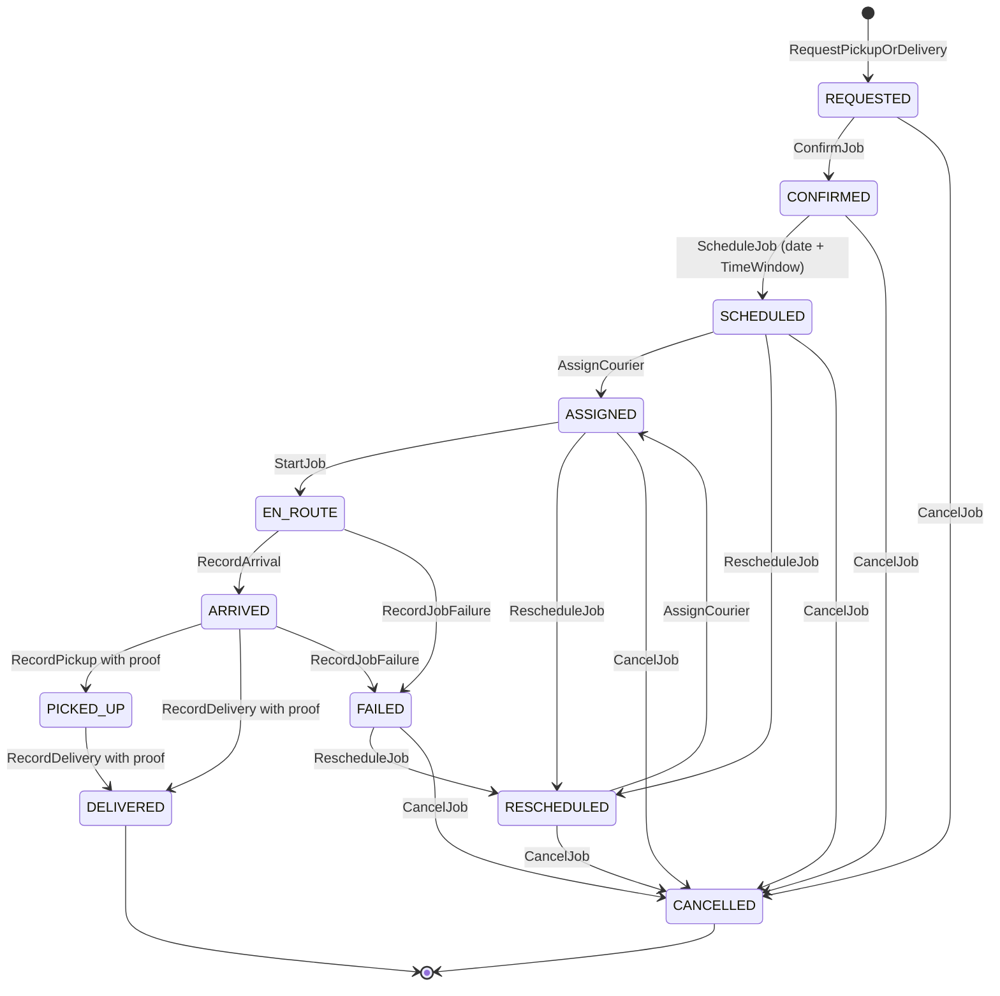

# Pickup and Delivery Job State Machine — Aish Laundry App

**Step:** 1 — Product Requirement and Domain Model
**Status:** `NOT IMPLEMENTED` (documentation only)
**Canonical source:** [`../MASTER_SOURCE.md`](../MASTER_SOURCE.md) v1.1.0
**Decision record:** [DEC-0007](../decisions/DEC-0007-pickup-and-delivery-as-core-product.md)
**Domain:** [`../domain/PICKUP_DELIVERY_DOMAIN.md`](../domain/PICKUP_DELIVERY_DOMAIN.md)

> **This enumeration is exhaustive. A transition not listed here is forbidden** (`DEL-001`). There is
> no free-form job-status path and no `SetJobStatus` command.

Antar-jemput introduces the two riskiest surfaces in the system: **physical custody of a customer's
belongings** and **cash held by a courier**. Both are governed here.

---

## 1. The eleven canonical statuses

There is no twelfth.

| Status | Meaning |
| --- | --- |
| `REQUESTED` | A pickup or delivery was requested, by the customer or by staff. |
| `CONFIRMED` | The outlet accepted the request; the address falls inside a served zone. |
| `SCHEDULED` | A date and a `TimeWindow` are set. |
| `ASSIGNED` | A courier holds the job — an internal kurir, or an external ojek lokal by guest job link. |
| `EN_ROUTE` | The courier is travelling to the stop. |
| `ARRIVED` | The courier is at the stop. Recorded before any custody transfer. |
| `PICKED_UP` | Custody transferred **to** the courier, with proof captured. |
| `DELIVERED` | Custody transferred **to** the recipient, with proof captured. Terminal. |
| `FAILED` | The attempt did not complete. A first-class outcome with a recorded reason, not an error. |
| `RESCHEDULED` | A new schedule was set after a failure or a customer request. The original is preserved in a chain. |
| `CANCELLED` | The job was terminated with a recorded reason. Terminal. |

---

## 2. Diagram

**Explanation.** Three structural facts the diagram encodes. First, **`ARRIVED` is on the only path
to a custody transfer** — a job never jumps from `EN_ROUTE` to `DELIVERED` (`DEL-028`), because a
delivery recorded from the road is a delivery nobody witnessed. Second, **`FAILED` is a normal
outcome with normal onward edges** to `RESCHEDULED` or `CANCELLED`; it is not a dead end and never
deletes a job. Third, **`DELIVERED` is terminal** (`DEL-029`): a dispute after delivery is recorded
as an order-level `ISSUE`, never by mutating a completed job.

---

## 3. Transition table

Every transition names an **actor** and its **preconditions**.

| # | From | To | Command | Actor(s) | Preconditions (guards) | Events |
| --- | --- | --- | --- | --- | --- | --- |
| D-01 | — | `REQUESTED` | `RequestPickupOrDelivery` | Customer, kasir, manager outlet | Exactly one order in the same tenant (`DEL-018`); a customer address exists | `PickupRequested` |
| D-02 | `REQUESTED` | `CONFIRMED` | `ConfirmJob` | Kasir, manager outlet | The address matches a defined service **zone** for the outlet (`DEL-017`) | `JobConfirmed` |
| D-03 | `CONFIRMED` | `SCHEDULED` | `ScheduleJob` | Kasir, manager outlet | A date **and** a `TimeWindow` are set — never a fictitious exact minute (`DEL-004`) | `JobScheduled` |
| D-04 | `SCHEDULED` / `RESCHEDULED` | `ASSIGNED` | `AssignCourier` | Manager outlet | Exactly **one active** `CourierAssignment` at a time (`DEL-019`); an external ojek receives a scoped guest job link | `CourierAssigned`, `GuestJobLinkIssued` (external only) |
| D-05 | `ASSIGNED` | `EN_ROUTE` | `StartJob` | Kurir, external courier | The actor holds the active assignment or a live guest job link | `JobEnRoute` |
| D-06 | `EN_ROUTE` | `ARRIVED` | `RecordArrival` | Kurir, external courier | Job is en route; arrival recorded with a server timestamp (`DEL-028`) | `CourierArrived` |
| D-07 | `ARRIVED` | `PICKED_UP` | `RecordPickup` | Kurir, external courier | **Proof of pickup captured** — OTP, photo, signature, or recipient name per tenant policy (`DEL-002`, `DEL-011`) | `ParcelPickedUp`, `DeliveryProofCaptured` |
| D-08 | `ARRIVED` / `PICKED_UP` | `DELIVERED` | `RecordDelivery` | Kurir, external courier | **`DeliveryProof` captured** (`DEL-027`); `ARRIVED` was recorded (`DEL-028`); any cash collected is recorded as a financial transaction (`DEL-014`, `FIN-027`) | `ParcelDelivered`, `DeliveryProofCaptured`, `CourierCashCollected` (if cash) |
| D-09 | `EN_ROUTE` / `ARRIVED` | `FAILED` | `RecordJobFailure` | Kurir, external courier | **`ReasonCode` mandatory** plus free text; the laundry returns to the outlet (`DEL-031`) | `JobFailed` |
| D-10 | `SCHEDULED` / `ASSIGNED` / `FAILED` | `RESCHEDULED` | `RescheduleJob` | Kasir, manager outlet | A new date and `TimeWindow`; **the original schedule is preserved in a recorded chain and never overwritten** (`DEL-022`) | `JobRescheduled` |
| D-11 | `REQUESTED` / `CONFIRMED` / `SCHEDULED` / `ASSIGNED` / `FAILED` / `RESCHEDULED` | `CANCELLED` | `CancelJob` | Kasir, manager outlet | `ReasonCode` plus free text and the actor recorded (`DEL-023`); **any active guest job link is revoked** | `JobCancelled`, `GuestJobLinkRevoked` |

---

## 4. Proof is mandatory

> **Every custody transfer requires proof. A parcel never silently changes hands** (`DEL-002`,
> `DEL-011`).

- Proof applies in **both** directions: proof of pickup at the customer's door (D-07) and proof of
  delivery at handover (D-08).
- Accepted methods, per tenant policy: **OTP, photo, signature, recipient name**. The method may
  vary; *some* recorded proof is always required.
- **`DELIVERED` and `PICKED_UP` are unreachable without a captured proof** (`DEL-027`). This is
  enforced in the state machine, not merely in the UI — a client that hides a button is not an access
  control.
- **Proof artefacts are private data** (`DEL-012`): private object storage, tenant-scoped unguessable
  object keys, and **signed expiring URLs only**. They are **never exposed on the public tracking
  portal** (`TRK-017`, `DEL-021`). A proof photograph may show the inside of a customer's doorway; a
  signature is biometric-adjacent handwriting.
- **Proof capture works offline** and syncs later (`DEL-013`, `OFF-022`). A courier in a dead zone is
  never forced to skip proof — that is precisely the situation in which a missing proof becomes a
  dispute the tenant cannot win.

---

## 5. Route ordering is a suggestion

> **The product suggests an order of stops. It never claims an optimal route** (`DEL-005`,
> `DEL-010`, `DEL-026`).

- The canonical phrase is **"usulan rute"** — route suggestion. The product must never say "rute
  optimal", must never claim a route optimisation engine, and must never promise a guaranteed
  arrival time or an ETA it does not actually compute.
- Stop ordering is a **simple ordered list** a courier works through. Reordering it is the courier's
  prerogative; the product does not pretend the order it offered was mathematically best.
- The customer receives a **`TimeWindow`**, never a fictitious exact minute (`DEL-004`). A window is
  a commitment measurable after the fact (`DEL-032`).
- Telling a courier a route is optimal when it is merely ordered is the same class of failure as
  telling a customer laundry is ready when it is not.

---

## 6. The external courier and the guest job link

An external ojek lokal holds **no membership, no account, and no application access** (`DEL-007`).
Their only access is a **guest job link** (`DEL-008`), which is:

- a **high-entropy token, stored hashed** server-side;
- **scoped to exactly one assigned job** — nothing else is reachable through it;
- **expiring**, always bounded, and **revocable** with immediate effect (`DEL-033`);
- **not** the order number and **not derivable** from it;
- granting **no** access to customer history, other orders, pricing, or any tenant data beyond the
  assignment (`DEL-024`);
- showing **only what the assigned delivery genuinely requires** of an address, never in a shareable
  or indexable form (`DEL-020`);
- **tenant-scoped**: a rider working for two tenants receives **two unrelated links** with no
  traversal between them (`DEL-009`), and **never a tenant membership**.

A guest link that is guessable, non-expiring, non-revocable, stored in plaintext, or that grants
access beyond its assignment is a security defect of the highest severity and is fixed before any
external courier feature ships.

---

## 7. Courier cash

Cash collected at the door is a **financial transaction** in full (`DEL-014`, `FIN-027`): **integer
Rupiah**, idempotent on `ClientReference`, never deleted through ordinary UI, corrected only by
reversal or adjustment entries, and audited with actor, timestamp, and reason. Floating point is
forbidden in every financial path.

Reconciliation is tracked **per courier, per shift or route**, from collection to handover;
**expected versus actual is compared explicitly**, and any variance is **recorded and acknowledged,
never silently absorbed**. The full lifecycle is in
[`COURIER_SETTLEMENT_STATE_MACHINE.md`](COURIER_SETTLEMENT_STATE_MACHINE.md).

---

## 8. Forbidden transitions

| Forbidden | Why |
| --- | --- |
| Any transition not enumerated above | The table is exhaustive (`DEL-001`). |
| `EN_ROUTE -> DELIVERED` | `ARRIVED` must be recorded first (`DEL-028`). |
| `EN_ROUTE -> PICKED_UP` | Same. |
| Any custody transfer without a captured proof | Not permitted (`DEL-002`, `DEL-027`). |
| `REQUESTED -> ASSIGNED` or any skip past `SCHEDULED` | A job is never assigned without a date and a `TimeWindow`. |
| `DELIVERED -> anything` | Terminal (`DEL-029`). A dispute is an order-level `ISSUE`. |
| `CANCELLED -> anything` | Terminal. A new job is created instead. |
| Two active `CourierAssignment` records on one job | Disallowed (`DEL-019`). Reassignment is serialised. |
| Overwriting the original schedule on reschedule | Disallowed; the chain is preserved (`DEL-022`). |
| `FAILED` recorded without a `ReasonCode` | Disallowed. A failure without a reason teaches nothing. |
| A job spanning two tenants, or referencing an order in another tenant | Illegal (`DEL-018`, `TEN-015`). |
| A guest job link granting anything beyond its one assigned job | Illegal (`DEL-024`). |
| A proof artefact reachable without authentication or shown on the public portal | Automatic `NO-GO` (`DEL-021`, `TRK-017`). |
| Any claim of an optimal route, a route optimisation engine, or a guaranteed arrival time | Never permitted; the product does not compute one and must not say it does (`DEL-005`, `DEL-026`). |
| Any transition driven by a notification outcome | Never (`DEL-035`, `NOT-001`). |
| Deleting a job, a proof, or a cash record | Illegal. Corrections are forward entries (`FIN-007`, `FIN-008`). |

---

## 9. Emitted domain events

`PickupRequested`, `JobConfirmed`, `JobScheduled`, `CourierAssigned`, `GuestJobLinkIssued`,
`JobEnRoute`, `CourierArrived`, `ParcelPickedUp`, `DeliveryProofCaptured`, `ParcelDelivered`,
`CourierCashCollected`, `JobFailed`, `JobRescheduled`, `JobCancelled`, `GuestJobLinkRevoked`.

Each carries its **source aggregate** (`PickupDeliveryJob`, or `DeliveryProof` for proof capture),
`TenantId`, the actor, a server timestamp, and a `CorrelationId` — see
[`../domain/DOMAIN_EVENTS.md`](../domain/DOMAIN_EVENTS.md) §1.1. **No event carries a guest token
plaintext, an OTP value, or a full address** (`NOT-015`, `NOT-016`).

---

## 10. Timestamps recorded

| Timestamp | Recorded at | Mutability |
| --- | --- | --- |
| `requested_at`, `confirmed_at` | D-01, D-02 | Immutable |
| `scheduled_at`, `window_start`, `window_end` | D-03 | Immutable per schedule; a reschedule creates a **new** schedule record |
| `assigned_at` | D-04 | Immutable per assignment |
| `en_route_at`, `arrived_at` | D-05, D-06 | Immutable per attempt |
| `picked_up_at`, `delivered_at` | D-07, D-08 | Immutable |
| `proof_captured_at` | D-07, D-08 | Immutable; the artefact is append-only |
| `cash_collected_at` | D-08 | Immutable |
| `failed_at` | D-09 | Immutable per attempt |
| `rescheduled_at` | D-10 | Immutable; chained to the prior schedule |
| `cancelled_at` | D-11 | Immutable |

Stored in UTC, rendered in Asia/Jakarta or outlet local time. **Server timestamps are
authoritative** (`OFF-015`); a courier's device clock never orders events.

---

## 11. Reason capture

A `ReasonCode` plus free text is **mandatory** on D-09 (failure), D-10 (reschedule), and D-11
(cancellation). Failure reasons are enumerated and meaningful: nobody home, address not found,
customer refused, payment not available, parcel damaged in transit. Reasons are recorded with the
actor and a server timestamp and are **never edited** — a correction is a new entry.

---

## 12. Rollback and corrective paths

There is **no rollback**. The job record is append-only in effect.

| Mistake | Corrective path |
| --- | --- |
| A delivery attempt failed | D-09 to `FAILED` with a reason; the laundry returns to the outlet (`DEL-031`) and the order returns to `READY_FOR_PICKUP`. **The order's aging anchor is unchanged** (`UCL-017`). |
| The wrong courier assigned | Reassign (D-04) — the prior assignment is closed, not deleted, and its guest link is revoked. |
| A schedule set wrongly | `RescheduleJob` (D-10). The original schedule remains in the chain. |
| Proof captured against the wrong job | The proof artefact is **never deleted**; a superseding annotation records the correction, and the correct job captures its own proof. |
| Cash recorded wrongly | A **reversal or adjustment entry** (`FIN-008`). A cash record is never edited or deleted. |
| A dispute after delivery | An order-level `ISSUE`; the `DELIVERED` job is not reopened (`DEL-029`). |
| A guest link over-shared | Revoke it (`DEL-033`) and issue a new one. Revocation is immediate. |

---

## 13. Conflict behaviour

- Every transition carries the job `Version` it read; a mismatch **rejects** the command.
- Assignment takes a serialising lock, so a job never ends up with two active couriers (`DEL-019`).
- Two couriers recording delivery on one job: the second is rejected as a version conflict. Exactly
  one `DELIVERED` transition and exactly one cash record result.
- A cancellation racing an arrival is ordered by the server; a job already `DELIVERED` cannot be
  cancelled.
- **A conflict affecting money escalates to a human** (`OFF-011`) — a courier's cash figure is never
  silently overwritten by whichever device synced last.
- No conflict is resolved by discarding a proof artefact or a cash record.

---

## 14. Offline sync behaviour

Couriers lose signal. Every courier-captured transition is offline-capable.

- D-05 through D-09, proof capture, and cash recording are queued with a stable `ClientReference`,
  generated once and **reused unchanged on every retry** (`DEL-034`, `OFF-001`).
- Idempotency is a **server contract**: a retry after a dead zone produces **exactly one** delivery
  record and **exactly one** cash collection. A duplicate order or duplicate payment is unacceptable
  (`OFF-007`).
- The queue is persistent and survives app kill and device reboot (`OFF-002`, `OFF-019`); retries
  back off exponentially (`OFF-003`).
- **A queued financial operation is never casually deleted** — no cache clear, no upgrade, no logout
  removes it (`OFF-004`).
- Dependency ordering is respected: an arrival never syncs ahead of the `EN_ROUTE` it follows
  (`OFF-009`).
- A queued operation replayed under a different tenant or user context is **rejected** (`OFF-016`).
- The courier always sees what is pending sync (`OFF-013`).
- On divergence the **server is the final source of truth** (`OFF-005`); money conflicts escalate to
  a human rather than resolving silently (`OFF-011`).

---

## 15. Status

`NOT IMPLEMENTED`. No job, zone, assignment, guest link, proof, or cash path exists. Backend runtime
is `ABSENT`. This document claims no test, build, deployment, CI run, or UAT.

---

## Related documents

- [`COURIER_SETTLEMENT_STATE_MACHINE.md`](COURIER_SETTLEMENT_STATE_MACHINE.md)
- [`ORDER_STATE_MACHINE.md`](ORDER_STATE_MACHINE.md)
- [`TRACKING_ACCESS_LIFECYCLE.md`](TRACKING_ACCESS_LIFECYCLE.md)
- [`../domain/PICKUP_DELIVERY_DOMAIN.md`](../domain/PICKUP_DELIVERY_DOMAIN.md)
- [`../domain/DOMAIN_INVARIANTS.md`](../domain/DOMAIN_INVARIANTS.md)
