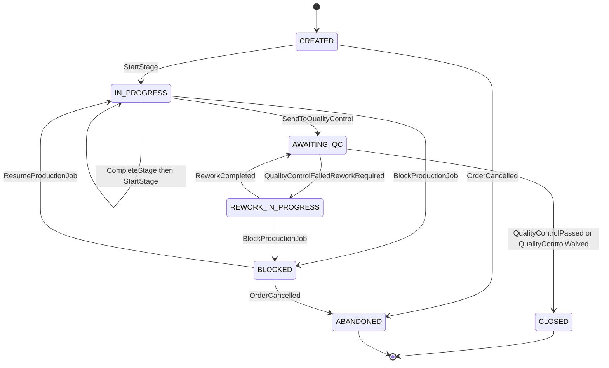

# Production Job State Machine — Aish Laundry App

**Step:** 1 — Product Requirement and Domain Model
**Status:** `NOT IMPLEMENTED` (documentation only)
**Canonical source:** [`../MASTER_SOURCE.md`](../MASTER_SOURCE.md) v1.1.0
**Domain:** [`../domain/PRODUCTION_AND_QC_DOMAIN.md`](../domain/PRODUCTION_AND_QC_DOMAIN.md)

> **This enumeration is exhaustive. A transition not listed here is forbidden.** There is no
> free-form job-status path and no `SetProductionJobStatus` command.

---

## 1. The states

| State | Meaning |
| --- | --- |
| `CREATED` | A job exists for an accepted order. No physical work has started. |
| `IN_PROGRESS` | A stage is running: `SORTING`, `WASHING`, `DRYING`, or `FINISHING`. |
| `BLOCKED` | Work cannot continue. A machine is down, an item is missing, an instruction is unclear. A recorded reason, never a stalled job. |
| `AWAITING_QC` | All stages complete. An inspection is open. |
| `REWORK_IN_PROGRESS` | Inspection returned `FAILED_REWORK_REQUIRED`; the work is being redone. |
| `CLOSED` | A verdict was recorded and the job is finished. Terminal. |
| `ABANDONED` | The order was cancelled underneath the job. Terminal, with a reason. |

The stage a job is currently running is a **field on `IN_PROGRESS`**, not a separate job state. The
order-level statuses `SORTING`, `WASHING`, `DRYING`, `FINISHING`, `QUALITY_CONTROL`, `REWORK`, and
`READY_FOR_PICKUP` are held by the order, not by the job — see
[`ORDER_STATE_MACHINE.md`](ORDER_STATE_MACHINE.md). The job **requests** an order transition; it never
writes one.

---

## 2. Diagram

**Explanation.** Three structural facts. First, **`CLOSED` is reachable only from `AWAITING_QC` and
only on a recorded verdict** — there is no path from `CREATED` or `IN_PROGRESS` to `CLOSED`, because
work cannot be skipped silently. Second, **`BLOCKED` is a first-class state with a reason**, not an
absence of activity; a job that has stopped is visible rather than merely stale. Third, the rework
loop between `AWAITING_QC` and `REWORK_IN_PROGRESS` is unbounded in the machine but **bounded in
policy**: every cycle is counted, and a job past the tenant's configured threshold surfaces to a
manager instead of looping quietly.

---

## 3. Transition table

Every transition names an **actor** and its **preconditions**. A transition whose preconditions do
not hold is rejected, not deferred.

| # | From | To | Command | Actor(s) | Preconditions (guards) | Events |
| --- | --- | --- | --- | --- | --- | --- |
| P-01 | — | `CREATED` | `CreateProductionJob` | System, on `OrderReceived` | Order is `RECEIVED` in the same tenant and outlet; at most one open job per order | `ProductionJobCreated` |
| P-02 | `CREATED` | `IN_PROGRESS` | `StartStage` | Operator produksi | Job open; the stage is the next canonical stage or a recorded re-entry | `ProductionStageStarted` |
| P-03 | `IN_PROGRESS` | `IN_PROGRESS` | `CompleteStage` then `StartStage` | Operator produksi | The running stage has a recorded start and an actor; **never back-filled as complete** | `ProductionStageCompleted`, `ProductionStageStarted` |
| P-04 | `IN_PROGRESS` | `BLOCKED` | `BlockProductionJob` | Operator produksi, manager outlet | `ReasonCode` **mandatory** plus free text | `ProductionJobBlocked` |
| P-05 | `BLOCKED` | `IN_PROGRESS` | `ResumeProductionJob` | Operator produksi, manager outlet | Blocker resolution recorded | `ProductionJobResumed` |
| P-06 | `IN_PROGRESS` | `AWAITING_QC` | `SendToQualityControl` | Operator produksi | Every canonical stage has a recorded start **and** completion | `QualityControlInspectionOpened` |
| P-07 | `AWAITING_QC` | `REWORK_IN_PROGRESS` | — (policy, on verdict) | System, on `QualityControlFailedReworkRequired` | An inspection verdict of `FAILED_REWORK_REQUIRED` exists | `ReworkRequested`, `ReworkCycleCounted` |
| P-08 | `REWORK_IN_PROGRESS` | `AWAITING_QC` | `ReworkCompleted` | Operator produksi | The re-entry stage and a `ReasonCode` are recorded | `ReworkCompleted`, `QualityControlInspectionOpened` |
| P-09 | `REWORK_IN_PROGRESS` | `BLOCKED` | `BlockProductionJob` | Operator produksi, manager outlet | `ReasonCode` mandatory | `ProductionJobBlocked` |
| P-10 | `AWAITING_QC` | `CLOSED` | — (policy, on verdict) | System, on `QualityControlPassed` or `QualityControlWaived` | A recorded verdict of `PASSED` or `WAIVED_WITH_AUTHORIZATION` | `ProductionJobClosed`; the order is **requested** to move to `READY_FOR_PICKUP` |
| P-11 | `CREATED` / `IN_PROGRESS` / `BLOCKED` / `REWORK_IN_PROGRESS` | `ABANDONED` | `AbandonProductionJob` | Manager outlet | The order reached `CANCELLED`; `ReasonCode` mandatory | `ProductionJobAbandoned` |

---

## 4. Forbidden transitions

Stated explicitly, because omission is not a specification.

| Forbidden | Why |
| --- | --- |
| Any transition not enumerated above | The table is exhaustive. |
| `CREATED -> CLOSED`, `IN_PROGRESS -> CLOSED` | Work cannot be skipped silently. |
| `AWAITING_QC -> CLOSED` without a recorded verdict | The verdict **is** the authorisation. |
| Any production transition writing the order to `READY_FOR_PICKUP` directly | Only a `PASSED` or `WAIVED_WITH_AUTHORIZATION` verdict reaches ready. |
| A stage completed without a recorded actor and server start time | Back-filling a stage as complete is disallowed. |
| `BLOCKED` entered without a `ReasonCode` | A blocker without a reason is an invisible stall. |
| `CLOSED -> anything`, `ABANDONED -> anything` | Terminal. |
| A batch spanning two tenants | Not representable (`TEN-015`). |
| Any transition that resets the order's first-ready timestamp | `UCL-002`, `UCL-017`. |
| Any transition driven by a notification outcome | `NOT-001`. |
| Any transition performed by a client without server authorisation | Authorisation is server-side on every transition. |

---

## 5. Emitted domain events

`ProductionJobCreated`, `ProductionStageStarted`, `ProductionStageCompleted`, `ProductionJobBlocked`,
`ProductionJobResumed`, `QualityControlInspectionOpened`, `ReworkRequested`, `ReworkCycleCounted`,
`ReworkCompleted`, `ProductionJobClosed`, `ProductionJobAbandoned`.

Every event carries its **source aggregate** (`ProductionJob`), `TenantId`, the actor, a server
timestamp, and the `CorrelationId` of the originating action — see
[`../domain/DOMAIN_EVENTS.md`](../domain/DOMAIN_EVENTS.md) §1.1.

---

## 6. Timestamps recorded

| Timestamp | Recorded at | Mutability |
| --- | --- | --- |
| `job_created_at` | P-01 | Immutable |
| Per-stage `started_at` / `completed_at` | P-02, P-03, P-08 | Immutable per stage occurrence; a correction is a new occurrence |
| `blocked_at` / `resumed_at` | P-04, P-05, P-09 | Immutable per blocker |
| `sent_to_qc_at` | P-06 | Immutable per inspection cycle |
| `rework_started_at` / `rework_completed_at` | P-07, P-08 | Immutable per cycle |
| `job_closed_at` | P-10 | Immutable |
| `abandoned_at` | P-11 | Immutable |

Stored in UTC, rendered in Asia/Jakarta or outlet local time. **Server timestamps are
authoritative** (`OFF-015`).

---

## 7. Reason capture

A `ReasonCode` plus free text is **mandatory** on P-04, P-08, P-09, and P-11, and on any rework
re-entry stage. A reason is recorded with the actor and a server timestamp and is **never edited** —
a correction is a new entry, never a rewrite.

---

## 8. Rollback and corrective paths

There is **no rollback**. The job record is append-only in effect; a mistake is corrected by a
forward transition that records what happened.

| Mistake | Corrective path |
| --- | --- |
| A stage marked complete in error | Record a new stage occurrence with a `ReasonCode`. The earlier occurrence remains in the record. |
| Work sent to inspection prematurely | The inspection returns `FAILED_REWORK_REQUIRED` (P-07) and the job re-enters `REWORK_IN_PROGRESS`. |
| A job blocked in error | `ResumeProductionJob` (P-05) with a resolution note. |
| A job opened against the wrong order | `AbandonProductionJob` (P-11) with a reason; a new job is created against the right order. |
| A defect discovered after the order was already ready | The order returns to `REWORK` and a new job cycle opens. **The order's aging anchor does not change** (`UCL-017`). |

---

## 9. Conflict behaviour

- Every transition carries the aggregate `Version` it read. A mismatch **rejects** the command and
  the caller re-reads (optimistic concurrency).
- Two operators completing the same stage: the second is rejected as a version conflict, never
  silently merged into one record and never producing two completions.
- Stage transitions and the inspection verdict take a serialising lock on the job, so a verdict
  cannot land between a stage completion and its order-status request.
- A block raised while a stage completion is in flight is ordered by the server, not by whichever
  device's clock ran fast.
- **No conflict in this domain is resolved by discarding a record.** Both attempts remain visible;
  one is rejected with a stated reason.

---

## 10. Offline sync behaviour

The production floor is exactly where the network drops, so every transition here is offline-capable.

- Stage start and completion, blocker records, and resumptions are captured offline and queued with
  a stable `ClientReference`, generated once and **reused unchanged on every retry** (`OFF-001`).
- Idempotency is a **server contract**: a replayed stage completion is recognised by its
  `ClientReference` and produces **no second stage record**.
- The queue is persistent and survives app kill and device restart (`OFF-002`).
- Retries use exponential backoff (`OFF-003`).
- Dependency ordering is respected: a stage completion never syncs ahead of the job creation it
  depends on (`OFF-009`).
- A queued transition replayed under a different tenant or user context is **rejected** (`OFF-016`).
- The operator always sees which records are pending sync (`OFF-013`).
- On divergence the **server is the final source of truth** (`OFF-005`). No money is at risk in this
  domain, which is why its failure mode is degraded rather than dangerous.

---

## 11. Status

`NOT IMPLEMENTED`. No job, stage, batch, blocker, or transition handler exists. Backend runtime is
`ABSENT`. This document claims no test, build, deployment, CI run, or UAT.

---

## Related documents

- [`ORDER_STATE_MACHINE.md`](ORDER_STATE_MACHINE.md)
- [`QUALITY_CONTROL_STATE_MACHINE.md`](QUALITY_CONTROL_STATE_MACHINE.md)
- [`UNCLAIMED_LAUNDRY_STATE_MACHINE.md`](UNCLAIMED_LAUNDRY_STATE_MACHINE.md)
- [`../domain/DOMAIN_INVARIANTS.md`](../domain/DOMAIN_INVARIANTS.md)
