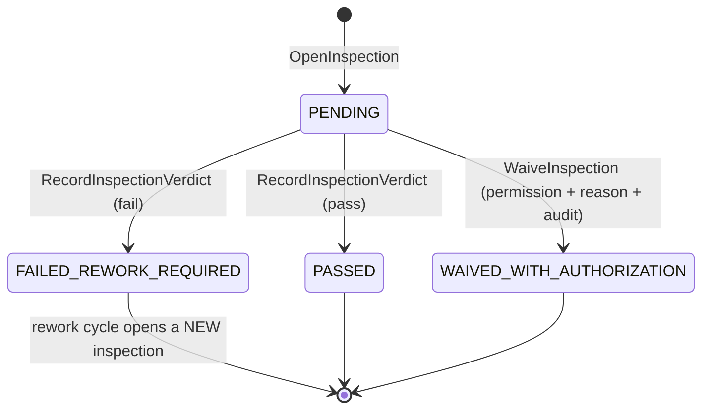

# Quality Control Inspection State Machine — Aish Laundry App

**Step:** 1 — Product Requirement and Domain Model
**Status:** `NOT IMPLEMENTED` (documentation only)
**Canonical source:** [`../MASTER_SOURCE.md`](../MASTER_SOURCE.md) v1.1.0
**Domain:** [`../domain/PRODUCTION_AND_QC_DOMAIN.md`](../domain/PRODUCTION_AND_QC_DOMAIN.md)

> **This enumeration is exhaustive. A transition not listed here is forbidden.** Quality control is
> the **only** gateway to `READY_FOR_PICKUP`. No production stage reaches ready directly.

---

## 1. The four statuses

There is no fifth.

| Status | Meaning | Consequence for the order |
| --- | --- | --- |
| `PENDING` | An inspection is open and undecided. | The order cannot reach `READY_FOR_PICKUP`. |
| `PASSED` | The work meets the standard. | The order may reach `READY_FOR_PICKUP`. |
| `FAILED_REWORK_REQUIRED` | The work does not meet the standard. | The order returns to `REWORK`. |
| `WAIVED_WITH_AUTHORIZATION` | The work is released despite a failed or incomplete inspection. | The order may reach `READY_FOR_PICKUP`, **and the waiver is permanently recorded**. |

All four are **terminal for the inspection they belong to**. An inspection is decided once. A second
look is a **new inspection cycle**, so the earlier verdict stays in the record forever.

---

## 2. Diagram

**Explanation.** The diagram is deliberately shallow, and that is the point. **There is no edge out
of a decided verdict.** `PASSED` never becomes `FAILED_REWORK_REQUIRED`, and
`FAILED_REWORK_REQUIRED` never becomes `PASSED`. Reversing a verdict in place would let a failure be
quietly overturned by whoever looked last; opening a new inspection instead leaves both the failure
and the later pass permanently visible, with their actors and reasons.

---

## 3. Transition table

Every transition names an **actor** and its **preconditions**.

| # | From | To | Command | Actor(s) | Preconditions (guards) | Events |
| --- | --- | --- | --- | --- | --- | --- |
| Q-01 | — | `PENDING` | `OpenInspection` | System, on `SendToQualityControl` | Every production stage has a recorded start and completion; the order is in the same tenant and outlet; no other inspection is `PENDING` for this order | `QualityControlInspectionOpened` |
| Q-02 | `PENDING` | `PASSED` | `RecordInspectionVerdict` | Quality control; manager outlet where tenant policy permits | Inspection is open; actor holds the inspect permission; verdict recorded with actor and server timestamp | `QualityControlPassed` |
| Q-03 | `PENDING` | `FAILED_REWORK_REQUIRED` | `RecordInspectionVerdict` | Quality control; manager outlet where tenant policy permits | Inspection is open; **`ReasonCode` plus free text mandatory**; defect evidence attached where tenant policy requires it | `QualityControlFailedReworkRequired`, `ReworkRequested` |
| Q-04 | `PENDING` | `WAIVED_WITH_AUTHORIZATION` | `WaiveInspection` | **Only** a role holding the explicit waiver permission | **All three, always:** the explicit permission, a recorded `ReasonCode` plus free text, and an audit entry written in the same transaction | `QualityControlWaived`, `AuditEntryRecorded` |
| Q-05 | — | `PENDING` (new cycle) | `OpenInspection` | System, on `ReworkCompleted` | The prior verdict was `FAILED_REWORK_REQUIRED` and a rework cycle completed; the cycle counter increments | `ReworkCycleCounted`, `QualityControlInspectionOpened` |
| Q-06 | — | `PENDING` (new cycle) | `OpenInspection` | Manager outlet, quality control | A defect was found **after** the order reached `READY_FOR_PICKUP`; `ReasonCode` mandatory; **the order's aging anchor is unchanged** (`UCL-017`) | `QualityControlInspectionOpened` |

---

## 4. The waiver rule, stated in full

> **A waiver requires an explicit permission, a recorded reason, and an audit entry — all three,
> always.**

- **Permission.** Only a role holding the explicit waiver permission may waive. It is **not** a
  default capability of any operator role, and it is never granted implicitly by seniority. It is
  enforced server-side; hiding the button is not an access control.
- **Reason.** A `ReasonCode` plus free text. "Pelanggan menunggu" is a legitimate reason; a blank
  field is not. The reason is recorded with the actor and a server timestamp and is never edited.
- **Audit entry.** Written in the **same transaction** as the waiver. **If the audit entry cannot be
  written, the waiver does not happen** (`FIN-038` applied to a non-financial gate). There is no
  best-effort audit path.
- Where tenant policy requires separation of duties, the waiving actor may not be the actor who
  performed the failing inspection.
- Waiver rates are a monitored signal, reported honestly. A tenant whose waivers climb is a tenant
  whose quality process is failing, and the product surfaces that rather than normalising it.

---

## 5. Forbidden transitions

| Forbidden | Why |
| --- | --- |
| Any transition not enumerated above | The table is exhaustive. |
| `PASSED -> PENDING`, `PASSED -> FAILED_REWORK_REQUIRED` | A decided verdict is never reversed in place. A new inspection cycle is opened instead. |
| `FAILED_REWORK_REQUIRED -> PASSED` | Same. Without an intervening rework cycle a failure could be silently overturned. |
| `FAILED_REWORK_REQUIRED -> WAIVED_WITH_AUTHORIZATION` in place | A waiver is a verdict on an inspection, not an edit of a previous one. |
| `WAIVED_WITH_AUTHORIZATION -> anything` | Terminal. The waiver is a permanent fact. |
| A waiver without the explicit permission | Not permitted. Severity: security defect. |
| A waiver without a recorded reason | Not permitted. |
| A waiver without an audit entry | Not permitted — the waiver does not happen at all. |
| An order reaching `READY_FOR_PICKUP` without a `PASSED` or `WAIVED_WITH_AUTHORIZATION` verdict | Disallowed. Inspection cannot be skipped. |
| Two `PENDING` inspections open for one order simultaneously | Disallowed; cycles are sequential and counted. |
| Deleting or editing an inspection record | Illegal. Inspections are append-only; a correction is a new cycle. |
| Any verdict driven by a notification outcome | `NOT-001`. |
| Any verdict recorded by a client without server authorisation | Authorisation is server-side. |

---

## 6. Emitted domain events

`QualityControlInspectionOpened`, `QualityControlPassed`, `QualityControlFailedReworkRequired`,
`QualityControlWaived`, `ReworkRequested`, `ReworkCycleCounted`, `AuditEntryRecorded`.

Each carries its **source aggregate** (`QualityControlInspection`), `TenantId`, the actor, a server
timestamp, and a `CorrelationId` — see [`../domain/DOMAIN_EVENTS.md`](../domain/DOMAIN_EVENTS.md)
§1.1. `QualityControlPassed` and `QualityControlWaived` are what cause the order to request
`READY_FOR_PICKUP`; on the **first** such occurrence the order emits
`OrderReachedReadyForPickupFirstTime`, exactly once in its entire life.

---

## 7. Timestamps recorded

| Timestamp | Recorded at | Mutability |
| --- | --- | --- |
| `inspection_opened_at` | Q-01, Q-05, Q-06 | Immutable per cycle |
| `inspection_decided_at` | Q-02, Q-03, Q-04 | Immutable; written once per inspection |
| `waived_at` | Q-04 | Immutable |
| `audit_written_at` | Q-04 | Immutable; same transaction as the waiver |
| `cycle_number` | Q-05 | Monotonic; never decremented, never reset |

Stored in UTC and rendered in Asia/Jakarta or outlet local time. Server timestamps are authoritative
(`OFF-015`).

---

## 8. Reason capture

Mandatory on Q-03, Q-04, and Q-06. Optional on Q-02, though a passing inspection may still record
notes. Every reason carries a `ReasonCode`, free text, the actor, and a server timestamp. Reasons are
never edited; a correction is a new record that supersedes without erasing.

Defect evidence photographs attached to a failing inspection are **private data**: private object
storage, tenant-scoped unguessable keys, signed expiring URLs only, and **never exposed on the public
tracking portal** (`TRK-017`, `TEN-023`).

---

## 9. Rollback and corrective paths

There is **no rollback**, because reversing a verdict is precisely the behaviour this machine exists
to prevent.

| Mistake | Corrective path |
| --- | --- |
| A pass recorded in error | Open a **new inspection cycle** (Q-06) with a reason. The erroneous pass stays in the record with its actor. |
| A failure recorded in error | Complete the rework cycle and record the new verdict (Q-05). Both verdicts remain visible. |
| A waiver granted in error | The waiver stands as a recorded fact. The corrective action is a new inspection cycle plus a manager review; the audit entry is never removed. |
| An inspection opened against the wrong order | Record the verdict as `FAILED_REWORK_REQUIRED` with a reason, or abandon the production job (`P-11`); the inspection record is not deleted. |
| A defect found after handover | An order-level `ISSUE`, resolved through [`ORDER_STATE_MACHINE.md`](ORDER_STATE_MACHINE.md) T-21/T-22. |

---

## 10. Conflict behaviour

- Each verdict carries the inspection `Version` it read. A mismatch **rejects** the command.
- The inspection takes a serialising lock, so two inspectors cannot record two verdicts on one
  inspection. The second attempt is rejected with a stated reason and is **not** merged.
- A verdict racing a stage completion is ordered by the server. A verdict never lands on an
  inspection whose preconditions no longer hold.
- A waiver racing a verdict: whichever the server serialises first decides the inspection; the other
  is rejected. There is no "last write wins" on a quality decision.
- No conflict is resolved by discarding an inspection record.

---

## 11. Offline sync behaviour

- Inspection verdicts are capturable offline and queued with a stable `ClientReference`, generated
  once and reused **unchanged** on every retry (`OFF-001`).
- Idempotency is a **server contract**: a replayed verdict is recognised by its `ClientReference` and
  produces **no second inspection and no second verdict**.
- The queue is persistent and survives app kill and device restart (`OFF-002`); retries back off
  exponentially (`OFF-003`).
- **A waiver is not capturable offline where the audit entry cannot be written.** The waiver requires
  its audit entry in the same transaction; an offline waiver is therefore queued as an intent and
  only becomes a waiver when the server writes both together. Until then the order does not reach
  ready.
- A verdict replayed under a different tenant or user context is **rejected** (`OFF-016`).
- The inspector always sees which verdicts are pending sync (`OFF-013`).
- On divergence the **server is the final source of truth** (`OFF-005`).

---

## 12. Status

`NOT IMPLEMENTED`. No inspection, verdict, waiver, permission check, or audit path exists. Backend
runtime is `ABSENT`. This document claims no test, build, deployment, CI run, or UAT.

---

## Related documents

- [`PRODUCTION_STATE_MACHINE.md`](PRODUCTION_STATE_MACHINE.md)
- [`ORDER_STATE_MACHINE.md`](ORDER_STATE_MACHINE.md)
- [`../domain/PRODUCTION_AND_QC_DOMAIN.md`](../domain/PRODUCTION_AND_QC_DOMAIN.md)
- [`../domain/DOMAIN_INVARIANTS.md`](../domain/DOMAIN_INVARIANTS.md)
