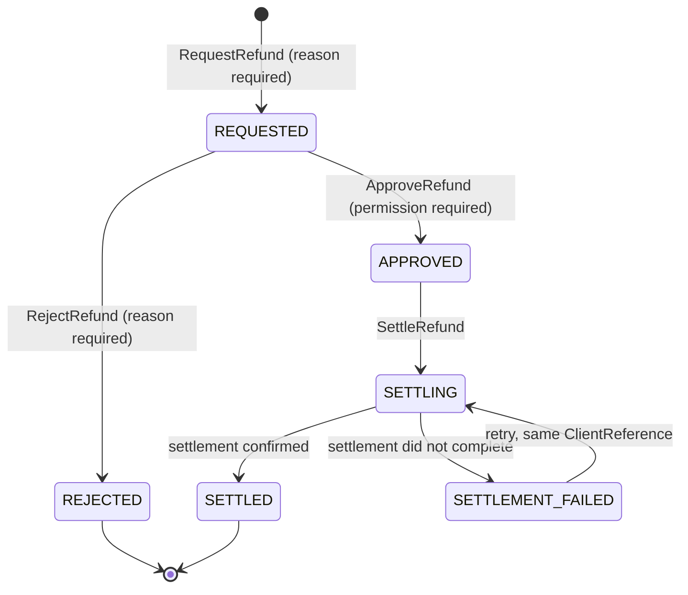

# Refund State Machine — Aish Laundry App

**Step:** 1 — Product Requirement and Domain Model
**Status:** `NOT IMPLEMENTED` (documentation only)
**Canonical source:** [`../MASTER_SOURCE.md`](../MASTER_SOURCE.md) v1.0.1
**Domain:** [`../domain/PAYMENT_DOMAIN.md`](../domain/PAYMENT_DOMAIN.md)

> **A refund is never a silent operation** (`FIN-021`). It requires an explicit permission and a
> recorded reason, with actor, timestamp, and amount (`FIN-006`).

---

## 1. The states

| State | Meaning |
| --- | --- |
| `REQUESTED` | A refund has been asked for, with a reason. |
| `APPROVED` | An authorised approver has agreed. |
| `REJECTED` | The request was declined, with a reason. Terminal. |
| `SETTLING` | Settlement is in progress (cash handed back, or a gateway refund submitted). |
| `SETTLED` | The refund is complete and the financial entry is posted. Terminal. |
| `SETTLEMENT_FAILED` | Settlement did not complete. The refund remains outstanding and visible. |

---

## 2. Diagram

**Explanation.** The separation of `REQUESTED` from `APPROVED` is what makes a refund reviewable:
the actor who wants the money returned is not necessarily the actor who authorises it. The
`SETTLEMENT_FAILED` state exists so that a refund which was approved but did not physically complete
stays **visible and outstanding** rather than vanishing — a refund the customer never received but
the system believes it issued is a financial integrity failure.

---

## 3. Transition table

| # | From | To | Command | Actor(s) | Preconditions | Events |
| --- | --- | --- | --- | --- | --- | --- |
| R-01 | — | `REQUESTED` | `RequestRefund` | Kasir, laundry admin, finance — each **holding the refund-request permission** | Parent `Payment` is `CAPTURED` or `PARTIALLY_REFUNDED`; `ReasonCode` + free text; amount ≤ captured net of prior refunds (`FIN-020`) | `RefundRequested` |
| R-02 | `REQUESTED` | `APPROVED` | `ApproveRefund` | Manager outlet, finance, owner — **holding the refund-approval permission** | Where tenant policy requires separation of duties, the approver is **not** the requester | `RefundApproved` |
| R-03 | `REQUESTED` | `REJECTED` | `RejectRefund` | Manager outlet, finance, owner | `ReasonCode` + free text | `RefundRejected` |
| R-04 | `APPROVED` | `SETTLING` | `SettleRefund` | Finance, kasir (cash), system (gateway) | Serialized against the parent payment so concurrent refunds cannot jointly exceed the captured amount | — |
| R-05 | `SETTLING` | `SETTLED` | — | System | Cash handed back and recorded, or gateway refund confirmed **server-side** | `RefundSettled`, `AdjustmentEntryPosted` |
| R-06 | `SETTLING` | `SETTLEMENT_FAILED` | — | System | Settlement did not complete | `PaymentFailed`-class record on the refund; the refund stays outstanding |
| R-07 | `SETTLEMENT_FAILED` | `SETTLING` | `SettleRefund` | Finance | Retry with the **same** `ClientReference` (`OFF-001`) | — |

---

## 4. Forbidden transitions

| Forbidden | Why |
| --- | --- |
| `REQUESTED -> SETTLING` | Settlement without approval. |
| `REQUESTED -> SETTLED` | Same. |
| Approval by the requesting actor where tenant policy requires separation of duties | `FIN-006` |
| A refund without a `ReasonCode` and free text | `FIN-006`, `FIN-021` |
| A refund taking cumulative refunds above the captured amount | `FIN-020` |
| `REJECTED -> anything` | Terminal. A new request is raised instead, so the rejection stays in the record. |
| `SETTLED -> anything` | Terminal. An error is corrected by an adjustment entry. |
| Any deletion of a refund record | `FIN-007` |
| A retry that regenerates the `ClientReference` | `OFF-025` — could settle the same refund twice |
| Any transition whose audit entry cannot be written | `FIN-038` |
| A refund on a payment belonging to another tenant | `TEN-030` |

---

## 5. Timestamps recorded

| Timestamp | Recorded at | Mutability |
| --- | --- | --- |
| `requested_at` | R-01 | Immutable |
| `approved_at` / `rejected_at` | R-02 / R-03 | Immutable |
| `settlement_started_at` | R-04 | Immutable per attempt |
| `settled_at` | R-05 | Immutable |
| `settlement_failed_at` | R-06 | Immutable per attempt |

Each attempt's timestamps are retained; a retry adds a record rather than overwriting one.

---

## 6. Reason capture

**Mandatory on R-01 and R-03.** A `ReasonCode` plus free text, recorded with the actor and the
amount. Typical fictional reason codes: `SERVICE_NOT_DELIVERED`, `ITEM_DAMAGED`, `OVERCHARGED`,
`DUPLICATE_PAYMENT`, `CUSTOMER_GOODWILL`. A blank reason is rejected at the domain level, not merely
by the form.

Approval (R-02) records the approving actor and may carry an optional note. Settlement records the
method and the reference.

---

## 7. Rollback and corrective paths

| Mistake | Corrective path |
| --- | --- |
| Refund approved in error, not yet settled | It cannot be "un-approved". A new `RejectRefund` is not available from `APPROVED`; instead the settlement is not performed and an **adjustment entry** records the decision, leaving the approval visible. |
| Refund settled in error | An **adjustment entry** in the opposite direction. The refund record is never deleted or edited (`FIN-008`). |
| Wrong amount refunded | A further refund for the shortfall, or an adjustment entry for the excess. |
| Settlement failed and the customer already received cash | Recorded as a variance and reconciled through the cashier shift or courier settlement, with a reason. **Never absorbed silently** (`FIN-026`). |

---

## 8. Conflict behaviour

- Refund settlement is **serialized against the parent payment** so two concurrent refunds cannot
  jointly exceed the captured amount (`FIN-020`).
- Optimistic concurrency on `Version` rejects a stale approval rather than merging it.
- A conflict between a locally recorded cash refund and the server's view is a **money conflict** and
  therefore **escalates to a human** (`OFF-011`). There is no automatic resolution.

---

## 9. Offline sync behaviour

- A cash refund handed back at the counter may be captured offline, queued with a stable
  `ClientReference`, and is idempotent on it (`OFF-001`).
- A **gateway** refund cannot be settled offline; the network is required (`OFF-023`).
- The queued refund is part of the **financial queue** and is therefore never casually deleted
  (`OFF-004`); purging requires an explicit, permissioned, audited action (`OFF-024`).
- A replayed settlement is recognised by its reference and does **not** produce a second refund.
- The kasir sees clearly whether a refund is settled or pending sync (`OFF-013`).

---

## 10. Interaction with payment and delivery

| Interaction | Rule |
| --- | --- |
| Parent payment | A settled refund moves the payment to `PARTIALLY_REFUNDED` or `REFUNDED`. The original `CAPTURED` record is never altered (`FIN-008`). |
| Receivable | A settled refund posts an entry; the receivable balance is derived only from posted entries (`FIN-022`). |
| Order | A refund never changes order status. An order-level consequence is recorded as an `ISSUE` if one is warranted. |
| Courier cash | A refund at the door is a courier cash movement and is reconciled in the settlement (`FIN-028`). |
| Notification | A refund may request a message. **A messaging failure never changes refund state** (`NOT-001`). |

---

## 11. Status

`NOT IMPLEMENTED`. No refund record, approval path, or settlement adapter exists. Backend runtime is
`ABSENT`. This document claims no test, build, deployment, CI run, or UAT.
