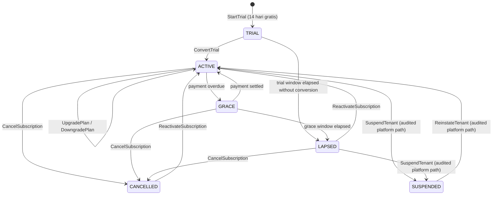

# Subscription State Machine — Aish Laundry App

**Step:** 1 — Product Requirement and Domain Model
**Status:** `NOT IMPLEMENTED` (documentation only)
**Canonical source:** [`../MASTER_SOURCE.md`](../MASTER_SOURCE.md) v1.1.0
**Domain:** [`../domain/SUBSCRIPTION_DOMAIN.md`](../domain/SUBSCRIPTION_DOMAIN.md)

> **This enumeration is exhaustive. A transition not listed here is forbidden.**

A subscription is held by a **`Tenant`** — never by a user, never by an outlet (`TEN-017`).
Subscription and platform administration arrive in Step 12; this document records the model only.

**Canonical pricing figures live in Master Source §21 and are deliberately not reproduced here.**
Restating a figure from memory is how pricing drifts, and this repository is PUBLIC. Plan names used
below (`Trial`, `Starter`, `Growth`, `Scale`, `Enterprise`) are identifiers, not amounts. The trial
is **14 hari gratis** (Master Source §21.1).

---

## 1. The states

| State | Meaning |
| --- | --- |
| `TRIAL` | 14 hari gratis. Bounded, and it either converts or lapses. |
| `ACTIVE` | A paid plan is in force for the tenant. |
| `GRACE` | Payment is overdue but the tenant retains full operation for a bounded window. |
| `LAPSED` | The grace window elapsed. Features are restricted; **data remains exportable**. |
| `CANCELLED` | The tenant deliberately ended the subscription. Data remains exportable per policy. |
| `SUSPENDED` | Suspended through the separated, audited platform-administration path. Data and export right retained (`TEN-003`). |

`UPGRADED` and `DOWNGRADED` are **transitions within `ACTIVE`**, not resting states — a tenant on a
larger plan is still `ACTIVE`. Each plan change is a recorded, immutable fact on the subscription's
history.

---

## 2. Diagram

**Explanation.** Three structural facts. First, **no state removes the tenant's data or its export
right** — `LAPSED`, `CANCELLED`, and `SUSPENDED` all restrict features while leaving the business's
own records exportable. Second, **`GRACE` exists so that a payment problem never stops a laundry
mid-shift**; a tenant in grace operates normally. Third, **there is no terminal state and no
deletion edge**: reactivation is always reachable, because a small business that lapsed for two weeks
should not lose two years of order history.

---

## 3. Transition table

Every transition names an **actor** and its **preconditions**.

| # | From | To | Command | Actor(s) | Preconditions (guards) | Events |
| --- | --- | --- | --- | --- | --- | --- |
| B-01 | — | `TRIAL` | `StartTrial` | Tenant owner, at tenant creation | Exactly one `Subscription` per `Tenant` (`TEN-002`); the trial window is bounded at **14 hari** and never self-extended | `TrialStarted` |
| B-02 | `TRIAL` | `ACTIVE` | `ConvertTrial` | Tenant owner, tenant admin | A plan is chosen; the amount is **integer Rupiah** read from the canonical pricing configuration derived from the Master Source, never hard-coded (`FIN-001`, `FIN-030`) | `SubscriptionActivated` |
| B-03 | `TRIAL` | `LAPSED` | — (policy) | System | The trial window elapsed without conversion. **A trial extension is a commercial decision requiring the owner; the system never grants itself one** | `SubscriptionLapsed` |
| B-04 | `ACTIVE` | `ACTIVE` | `UpgradePlan` | Tenant owner, tenant admin | The target plan exists in the canonical table; the change is recorded with actor, timestamp, and effective date; **historical charges are immutable** (`FIN-012`) | `SubscriptionUpgraded` |
| B-05 | `ACTIVE` | `ACTIVE` | `DowngradePlan` | Tenant owner, tenant admin | The target plan exists; existing outlets and staff above the new ceiling are surfaced honestly rather than silently deleted | `SubscriptionDowngraded` |
| B-06 | `ACTIVE` | `GRACE` | — (policy) | System | A due charge is unpaid past its date; the grace window is bounded and stated to the tenant | `SubscriptionEnteredGrace` |
| B-07 | `GRACE` | `ACTIVE` | — (policy) | System, on a **server-verified** payment | The payment is verified server-side; a client claim is never sufficient (`FIN-005`) | `SubscriptionActivated` |
| B-08 | `GRACE` | `LAPSED` | — (policy) | System | The grace window elapsed unpaid | `SubscriptionLapsed` |
| B-09 | `LAPSED` / `CANCELLED` | `ACTIVE` | `ReactivateSubscription` | Tenant owner, tenant admin | Payment verified server-side; the tenant's data was retained throughout | `SubscriptionReactivated` |
| B-10 | `ACTIVE` / `GRACE` / `LAPSED` | `CANCELLED` | `CancelSubscription` | Tenant owner — **permission required** | **`ReasonCode` mandatory**; the export right is restated to the tenant at cancellation | `SubscriptionCancelled` |
| B-11 | `ACTIVE` / `LAPSED` | `SUSPENDED` | `SuspendTenant` | Platform administration only, through the **explicitly separated, audited** path (`TEN-029`) | Reason recorded; audit entry written in the same transaction, readable by the tenant it concerns; **no silent tenant access** | `TenantSuspended`, `AuditEntryRecorded` |
| B-12 | `SUSPENDED` | `ACTIVE` | `ReinstateTenant` | Platform administration only, audited path | Reason and audit entry recorded | `TenantReinstated` |
| B-13 | Any state | same state | `RequestTenantDataExport` | Tenant owner, tenant admin | **Always available, in every state including `LAPSED`, `CANCELLED`, and `SUSPENDED`** (`TEN-018`, `TEN-028`) | `TenantDataExportRequested` |

---

## 4. Forbidden transitions

| Forbidden | Why |
| --- | --- |
| Any transition not enumerated above | The table is exhaustive. |
| Any state or plan representing a **lifetime cloud subscription** | **Forbidden absolutely, forever.** A cloud service carries perpetual cost; a one-time fee for perpetual service is a promise that cannot be kept honestly. |
| Blocking or delaying a tenant data export in `LAPSED`, `CANCELLED`, or `SUSPENDED` | Not permitted (`TEN-018`). A lapsed subscription never holds a tenant's own business data hostage. **There is no `BlockDataExport` command in this model.** |
| Deleting tenant business data on lapse, cancellation, or suspension | Illegal. No such edge exists. |
| Blocking order intake because an entitlement check failed | Not permitted (`TEN-019`). A laundry mid-rush does not stop because a counter crossed a threshold. |
| Treating the entry plan's order allowance as a hard cutoff | Disallowed — it is **fair-use** and must be described as fair-use unless a decision record changes that. |
| Placing authentication, authorisation, secure storage, rate limiting, audit logging, tenant isolation, or encrypted backup behind a paid tier | Forbidden. Security is not an upsell; isolation is the architecture, not a feature. |
| A per-nota fee on a normal plan | Forbidden. |
| Inventing a plan, discount, promotion, trial extension, or limit not in the canonical table | Forbidden. Pricing is owner territory. |
| A "custom Enterprise deal" that breaches any guardrail above | Forbidden without an owner decision record. Enterprise is a price point, not a guardrail exemption. |
| Subscription state applied per user or per outlet | Illegal. The boundary is the tenant (`TEN-017`). |
| Consolidating several tenants of one owner into one subscription or one bill | Disallowed; it would cross the isolation boundary. |
| Activating from a client claim of payment | Disallowed. Payment is verified server-side (`FIN-005`). |
| Floating-point arithmetic on any subscription amount | Forbidden (`FIN-002`). |
| Editing or deleting a historical charge | Illegal. Corrections are reversal or adjustment entries (`FIN-008`). |
| Platform administration reaching tenant data without an audit entry | Automatic `NO-GO` (`TEN-029`). |

---

## 5. Emitted domain events

`TrialStarted`, `SubscriptionActivated`, `SubscriptionUpgraded`, `SubscriptionDowngraded`,
`SubscriptionEnteredGrace`, `SubscriptionLapsed`, `SubscriptionReactivated`, `SubscriptionCancelled`,
`TenantSuspended`, `TenantReinstated`, `TenantDataExportRequested`, `PlanLimitApproached`,
`PlanLimitExceededFairUse`, `AuditEntryRecorded`.

Each carries its **source aggregate** (`Subscription`, or `Tenant` for the platform-administration
transitions), `TenantId`, the actor, a server timestamp, and a `CorrelationId` — see
[`../domain/DOMAIN_EVENTS.md`](../domain/DOMAIN_EVENTS.md) §1.1. Monetary fields are integer Rupiah.
No event carries a payment credential or a provider secret.

---

## 6. Timestamps recorded

| Timestamp | Recorded at | Mutability |
| --- | --- | --- |
| `trial_started_at`, `trial_ends_at` | B-01 | Immutable; **never extended in place** |
| `activated_at` | B-02, B-07, B-09 | Immutable per activation |
| `plan_changed_at` plus the effective date | B-04, B-05 | Immutable per change; the plan history is append-only |
| `grace_started_at`, `grace_ends_at` | B-06 | Immutable |
| `lapsed_at` | B-03, B-08 | Immutable |
| `cancelled_at` | B-10 | Immutable |
| `suspended_at`, `reinstated_at` | B-11, B-12 | Immutable; paired with an audit entry |
| `export_requested_at` | B-13 | Immutable per request |

Stored in UTC and rendered in Asia/Jakarta. Grace and trial windows are evaluated against **server**
time; a client clock never extends a subscription (`OFF-015`).

---

## 7. Reason capture

A `ReasonCode` plus free text is **mandatory** on B-10 (cancellation), B-11 (suspension), and B-12
(reinstatement). Cancellation reasons are commercially important and are recorded honestly rather
than inferred. Suspension and reinstatement reasons are part of the audit entry the tenant can read.
Reasons carry the actor and a server timestamp and are never edited.

---

## 8. Rollback and corrective paths

There is **no rollback**. The subscription history is append-only.

| Mistake | Corrective path |
| --- | --- |
| Wrong plan selected | `UpgradePlan` or `DowngradePlan` (B-04, B-05) with an effective date. **The prior charge is not rewritten**; a difference is settled by an adjustment entry (`FIN-008`). |
| Cancelled in error | `ReactivateSubscription` (B-09). The cancellation remains in the history; the data was never removed. |
| Lapsed because a payment was misapplied | The payment is corrected in the financial records by reversal or adjustment, then B-09 reactivates. |
| Suspended in error | `ReinstateTenant` (B-12) with a reason. Both the suspension and the reinstatement stay in the audit trail. |
| A charge amount recorded wrongly | A reversal or adjustment entry. A historical charge is never edited (`FIN-012`). |
| A tenant wants to leave | B-10, then `RequestTenantDataExport` (B-13). The export right survives the cancellation. |

---

## 9. Conflict behaviour

- Every transition carries the subscription `Version` it read; a mismatch **rejects** the command.
- Activation and plan change take a **serialising lock**, so a verified payment and a concurrent
  cancellation cannot both apply. One is rejected with a stated reason.
- A duplicate gateway callback is rejected as a replay; a retried subscription payment is idempotent
  on its stable `ClientReference` and **produces exactly one payment** (`FIN-003`).
- Grace expiry racing a payment: the server orders them, and a verified payment inside the window
  wins. Ambiguity resolves in the tenant's favour, never in a way that silently stops a laundry.
- **A conflict affecting money escalates to a human** (`OFF-011`); it is never auto-resolved by
  overwriting a balance.
- Usage counters are derived from tenant-scoped records and are never inferred across tenants.

---

## 10. Offline sync behaviour

- Subscription state is **server-side only**. There is no offline subscription transition, because an
  entitlement decided on a disconnected device is not an entitlement.
- **Entitlement failures degrade open for operations and closed for provisioning**: order intake,
  payment capture, and production continue offline exactly as they always do; creating a new outlet
  outside the plan does not silently happen.
- The Ops app caches only a **read-only** entitlement snapshot for display, clearly labelled as
  possibly stale. It is never treated as authorisation, and it is partitioned per tenant and per user
  like all local data (`OFF-006`).
- A tenant switch clears or partitions that cache so no previous tenant's plan data remains visible
  (`OFF-020`).
- Where an owner triggers a subscription action while offline, it queues as an **intent** with a
  stable `ClientReference` reused unchanged on retry; idempotency is a **server contract**, so a
  replay produces exactly one activation or one cancellation (`OFF-001`).
- On divergence the **server is the final source of truth** (`OFF-005`).

---

## 11. Status

`NOT IMPLEMENTED`. No subscription, billing, metering, trial, entitlement, or export implementation
exists. Subscription and platform administration arrive in Step 12. Backend runtime is `ABSENT`. This
document claims no test, build, deployment, CI run, or UAT.

---

## Related documents

- [`../domain/SUBSCRIPTION_DOMAIN.md`](../domain/SUBSCRIPTION_DOMAIN.md)
- [`../domain/TENANT_BOUNDARIES.md`](../domain/TENANT_BOUNDARIES.md)
- [`PAYMENT_STATE_MACHINE.md`](PAYMENT_STATE_MACHINE.md)
- [`../domain/DOMAIN_INVARIANTS.md`](../domain/DOMAIN_INVARIANTS.md)
