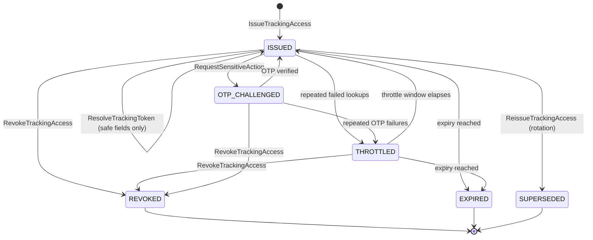

# Tracking Access Lifecycle — Aish Laundry App

**Step:** 1 — Product Requirement and Domain Model
**Status:** `NOT IMPLEMENTED` (documentation only)
**Canonical source:** [`../MASTER_SOURCE.md`](../MASTER_SOURCE.md) v1.1.0
**Decision record:** [DEC-0006](../decisions/DEC-0006-public-tracking-without-app-installation.md)
**Domain:** [`../domain/TRACKING_DOMAIN.md`](../domain/TRACKING_DOMAIN.md)

> **This enumeration is exhaustive. A transition not listed here is forbidden.** The Portal Tracking
> Publik is the product's most exposed surface: an unauthenticated visitor, holding only a link,
> reaching a tenant's order data. Every rule below exists because of that sentence.

---

## 1. The states

| State | Meaning |
| --- | --- |
| `ISSUED` | A `TrackingAccess` exists and resolves. The plaintext token exists only inside the link handed to the customer. |
| `THROTTLED` | Temporarily refusing lookups after repeated failures from a source. A rate-limiting state, not a permanent one. |
| `OTP_CHALLENGED` | A sensitive action was requested; the visitor must verify by OTP before it proceeds. |
| `REVOKED` | Deliberately terminated by staff, effective immediately. Terminal. |
| `EXPIRED` | Passed its bound expiry. Terminal. |
| `SUPERSEDED` | Replaced by a reissued token during rotation. Terminal. |

`REVOKED`, `EXPIRED`, and `SUPERSEDED` are terminal. **A terminated access is never reactivated** —
recovery is a new issuance, which is what makes revocation meaningful.

---

## 2. Diagram

**Explanation.** Three structural facts. First, **resolution does not change state** — a successful
lookup returns the projection and leaves the access `ISSUED`, so a shared link keeps working for the
family member collecting the laundry. Second, **`THROTTLED` is recoverable but `REVOKED` is not**:
abuse resistance is temporary, a deliberate revocation is permanent. Third, **rotation supersedes
rather than mutates**: reissue mints a new token and terminates the old one, because editing a token
in place would leave the old plaintext valid in somebody's WhatsApp history.

---

## 3. Transition table

Every transition names an **actor** and its **preconditions**.

| # | From | To | Command | Actor(s) | Preconditions (guards) | Events |
| --- | --- | --- | --- | --- | --- | --- |
| K-01 | — | `ISSUED` | `IssueTrackingAccess` | System, on `OrderReceived`; kasir on request | Order exists in the tenant; a **high-entropy token from a cryptographically secure source** is generated and **stored hashed** (`TRK-001`, `TRK-002`); scope is exactly one order in exactly one tenant (`TRK-020`) | `TrackingAccessIssued` |
| K-02 | `ISSUED` | `ISSUED` | `ResolveTrackingToken` | Anonymous public visitor | The presented token hashes to a live record; tenant is derived **server-side from the stored record**, never from the request (`TRK-021`); only allow-listed safe fields are served | `TrackingAccessViewed` |
| K-03 | `ISSUED` | `THROTTLED` | — (policy) | System | Repeated failed lookups from a source cross the rate-limit threshold (`TRK-007`) | `TrackingAccessThrottled` |
| K-04 | `THROTTLED` | `ISSUED` | — (policy) | System | The backoff window elapsed | `TrackingAccessThrottleCleared` |
| K-05 | `ISSUED` | `OTP_CHALLENGED` | `RequestSensitiveAction` | Anonymous public visitor | The requested action is on the sensitive list — changing a delivery address, requesting a schedule change (`TRK-012`) | `TrackingOtpChallengeIssued` |
| K-06 | `OTP_CHALLENGED` | `ISSUED` | `VerifyTrackingOtp` | Anonymous public visitor | OTP verified server-side within its validity window; attempt counted | `TrackingOtpVerified`, `SensitiveActionAccepted` |
| K-07 | `OTP_CHALLENGED` | `THROTTLED` | — (policy) | System | Repeated OTP failures cross the threshold | `TrackingAccessThrottled` |
| K-08 | `ISSUED` / `THROTTLED` / `OTP_CHALLENGED` | `REVOKED` | `RevokeTrackingAccess` | Kasir, manager outlet, tenant admin | Actor holds the permission; **`ReasonCode` mandatory**; effect is immediate (`TRK-004`, `TRK-022`) | `TrackingAccessRevoked` |
| K-09 | `ISSUED` / `THROTTLED` | `EXPIRED` | — (policy) | System | The bound expiry is reached. **Canonical default: 30 days after order completion** (`TRK-005`) | `TrackingAccessExpired` |
| K-10 | `ISSUED` | `SUPERSEDED` | `ReissueTrackingAccess` | Kasir, manager outlet | Rotation requested — the customer lost the link, or the link was over-shared; a **new** high-entropy token is minted and the old record is terminated in the same transaction | `TrackingAccessReissued`, `TrackingAccessSuperseded` |

---

## 4. Issuance, revocation, expiry, and reissue

### 4.1 Issuance

- The token is **high-entropy**, drawn from a cryptographically secure random source (`TRK-001`).
- It is **stored hashed** as `TrackingTokenHash`. The plaintext exists only inside the link
  (`TRK-002`). It is **never** logged, never written to an audit entry, and never returned by any API
  after issuance (`TRK-019`).
- **The token is not the order number and is not derivable from it** (`TRK-003`). `HumanOrderNumber`
  is short, sequential within an outlet, printed on the nota, and read aloud over the phone — it is
  guessable by design, and precisely because it is guessable it grants access to nothing.
- A `TrackingAccess` scopes to **exactly one order in exactly one tenant** (`TRK-020`). It never
  lists other orders and never traverses to another tenant.
- Sharing is a **feature**: the link is forwarded over WhatsApp to a family member collecting
  (`TRK-014`). The projection is designed to be safe under the assumption that it will be forwarded.

### 4.2 Revocation

- Revocation is available to permissioned staff, records actor and `ReasonCode`, and takes effect
  **immediately** (`TRK-004`, `TRK-022`).
- A revoked token is terminal. There is no reactivation path, because a revocation that can be undone
  by whoever revoked it is not a security control.
- The portal states the outcome plainly with a recovery step — "minta tautan baru dari outlet" —
  rather than an error code.

### 4.3 Expiry

- Every access is **always bounded**. There is no non-expiring tracking link.
- The canonical default is **30 days after order completion** (`TRK-005`). A tenant may shorten it;
  the model carries no path to make it unbounded.
- Expiry is evaluated server-side against server time. A client clock never extends an access.

### 4.4 Reissue and rotation

- Reissue mints a **new** high-entropy token and marks the previous record `SUPERSEDED` in the same
  transaction (K-10). The old plaintext stops resolving at that moment.
- Rotation is the correct response to a link that was over-shared, posted publicly, or sent to the
  wrong number.
- A reissued access is a **new record with a new expiry**. It never inherits, extends, or reuses the
  prior token material.

---

## 5. Forbidden transitions and forbidden behaviours

| Forbidden | Why |
| --- | --- |
| Any transition not enumerated above | The table is exhaustive. |
| `REVOKED -> ISSUED`, `EXPIRED -> ISSUED`, `SUPERSEDED -> ISSUED` | Terminal. Recovery is a **new issuance**, never a reactivation. |
| Extending an expiry in place | Not permitted; a longer-lived access is a new issuance with its own record. |
| Storing, logging, or returning the token plaintext after issuance | Disallowed. Only the hash is stored (`TRK-002`, `TRK-019`). |
| Using the order number as the token, or deriving the token from it | Disallowed (`TRK-003`). |
| Resolving a token whose stored record's tenant cannot be established | The lookup **fails closed** (`TRK-021`). |
| Accepting a tenant identifier from the request | Illegal. A visitor supplies a token; they never supply a tenant. |
| Serving a field not on the allow-list | Disallowed. **A field not enumerated is not served** (`TRK-028`); a deny-list fails open. |
| Showing the **full address**, in any state, with or without OTP | Never permitted (`TRK-010`). |
| Showing laundry photographs, delivery proof artefacts, internal notes, or the customer's other orders | Never permitted (`TRK-015`, `TRK-016`, `TRK-017`). |
| Echoing an OTP value alongside a tracking link in a message | Disallowed — it enables one-message takeover (`TRK-029`, `NOT-014`). |
| Indexing the portal | Disallowed. Pages are served **`noindex`** and never enter search engines (`TRK-006`). |
| Unlimited lookup attempts | Disallowed. Lookup is **rate-limited** with progressive backoff and **enumeration-protected** (`TRK-007`). |
| A throttle, failed lookup, revocation, or expiry changing order state | Never (`TRK-030`). |
| Requiring an app install to track | Disallowed (`TRK-025`, DEC-0006). |

---

## 6. The projection is a separate read model

> **The public tracking projection is a SEPARATE read model from the internal order
> representation** (`TRK-008`).

This is structural, not a rendering preference.

- The projection is **built** from the order carrying only the allow-listed safe field set. **Masking
  is applied at build time, not at render time**, so a rendering bug cannot leak a full value
  (`TRK-018`). A masked value is the only value the projection ever holds.
- Safe fields: order number; brand and outlet identity; service type; current status and status
  history; estimated completion; amount due and payment state; the actions available to the customer.
- **The customer name is partially masked** (`TRK-011`) and the phone number appears only as
  `MaskedPhoneNumber` (`TRK-009`).
- Merging this projection back into the internal order representation is forbidden.
- **Fictional illustration.** A portal page for order `OUT01-260719-0042` shows
  `Pelanggan: B*** S***`, `Telepon: +62-800-****-0001`, `Outlet: Outlet Percontohan 1`. It shows no
  street address in any form. Every value here is invented.

---

## 7. Emitted domain events

`TrackingAccessIssued`, `TrackingAccessViewed`, `TrackingAccessThrottled`,
`TrackingAccessThrottleCleared`, `TrackingOtpChallengeIssued`, `TrackingOtpVerified`,
`TrackingAccessRevoked`, `TrackingAccessExpired`, `TrackingAccessReissued`,
`TrackingAccessSuperseded`.

Each carries its **source aggregate** (`TrackingAccess`), `TenantId`, a server timestamp, and a
`CorrelationId`. **No event ever carries the token plaintext or an OTP value** (`TRK-019`,
`NOT-016`). Issuance, views, OTP challenges, throttling, and revocation are recorded as security
events (`TRK-024`).

---

## 8. Timestamps recorded

| Timestamp | Recorded at | Mutability |
| --- | --- | --- |
| `issued_at` | K-01 | Immutable |
| `expires_at` | K-01 | Immutable; **never extended in place** |
| `last_viewed_at` | K-02 | Overwritten; a view counter increments alongside |
| `throttled_at` / `throttle_cleared_at` | K-03, K-04, K-07 | Immutable per throttle episode |
| `otp_challenged_at` / `otp_verified_at` | K-05, K-06 | Immutable per challenge |
| `revoked_at` | K-08 | Immutable |
| `expired_at` | K-09 | Immutable |
| `superseded_at` | K-10 | Immutable |

Stored in UTC and evaluated against **server** time. Server timestamps are authoritative
(`OFF-015`).

---

## 9. Reason capture

`ReasonCode` plus free text is **mandatory** on revocation (K-08) and on reissue (K-10) — knowing
*why* a link was rotated is what distinguishes a lost link from a leaked one. Throttle and expiry are
system transitions and record the triggering condition rather than a human reason. Reasons are never
edited.

---

## 10. Rollback and corrective paths

There is **no rollback**. A terminated access stays terminated.

| Mistake | Corrective path |
| --- | --- |
| An access revoked in error | Issue a **new** access (K-01) and send the new link. The revocation record remains. |
| A link over-shared or posted publicly | `ReissueTrackingAccess` (K-10) with a reason. The old token stops resolving immediately. |
| An access issued against the wrong order | Revoke it (K-08) with a reason and issue against the correct order. |
| A customer locked out by throttling | Wait out the backoff window (K-04), or reissue. The throttle is never bypassed by relaxing the limit. |
| A suspected token leak | Revoke **and** reissue, and record the security event. Rotation is first; investigation is second. |

---

## 11. Conflict behaviour

- Every transition carries the aggregate `Version` it read; a mismatch **rejects** the command.
- Revocation and reissue take a serialising lock, so a token cannot be revoked and reissued into an
  inconsistent pair. Reissue writes the new record and supersedes the old in one transaction.
- Two staff revoking simultaneously: the second is rejected as a version conflict. The access is
  revoked once, with one recorded actor and reason.
- Expiry racing a view: the server decides. An access past its expiry **fails closed** even if the
  page was already open.
- If the stored record's tenant cannot be established, the lookup fails rather than guessing.

---

## 12. Offline sync behaviour

- **Public tracking is server-rendered and requires the network by nature** (`TRK-027`). It does not
  work offline, and the product does not pretend it does. A cached page is never presented as live
  status.
- Nothing in this lifecycle is captured on a device queue: issuance, revocation, expiry, and OTP
  verification are **server-side only**, because an offline-capable revocation would be a revocation
  that does not revoke.
- Where a staff member triggers issuance or revocation from the Ops app while offline, the action is
  queued as an **intent** with a stable `ClientReference` and takes effect only when the server
  applies it. Idempotency is a **server contract**: a replayed intent produces exactly one issuance
  or one revocation, never two (`OFF-001`).
- The staff member always sees which of these actions are pending sync (`OFF-013`), because believing
  a link is revoked when it is not is the dangerous failure mode here.
- On divergence the **server is the final source of truth** (`OFF-005`).

---

## 13. Status

`NOT IMPLEMENTED`. No token, hash, projection, portal, throttle, OTP, or revocation path exists.
Backend runtime is `ABSENT`. This document claims no test, build, deployment, CI run, or UAT.

---

## Related documents

- [`../domain/TRACKING_DOMAIN.md`](../domain/TRACKING_DOMAIN.md)
- [`ORDER_STATE_MACHINE.md`](ORDER_STATE_MACHINE.md)
- [`PICKUP_DELIVERY_STATE_MACHINE.md`](PICKUP_DELIVERY_STATE_MACHINE.md)
- [`../domain/DOMAIN_INVARIANTS.md`](../domain/DOMAIN_INVARIANTS.md)
