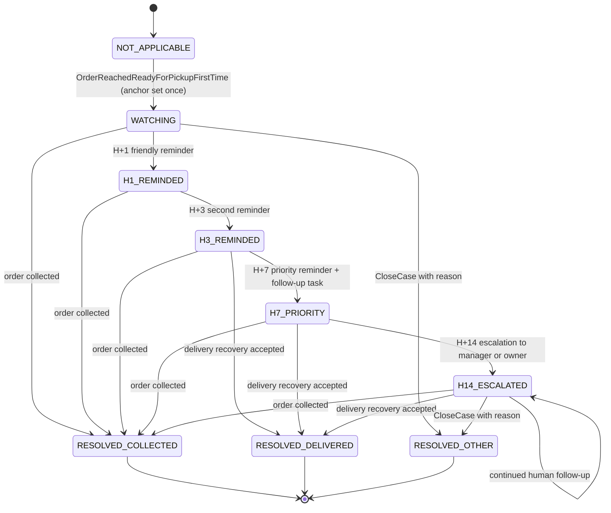

# Unclaimed Laundry Case State Machine — Aish Laundry App

**Step:** 1 — Product Requirement and Domain Model
**Status:** `NOT IMPLEMENTED` (documentation only)
**Canonical source:** [`../MASTER_SOURCE.md`](../MASTER_SOURCE.md) v1.1.0
**Decision record:** [DEC-0008](../decisions/DEC-0008-h1-h3-h7-reminder-as-core-product.md)
**Domain:** [`../domain/UNCLAIMED_LAUNDRY_DOMAIN.md`](../domain/UNCLAIMED_LAUNDRY_DOMAIN.md)

> **This enumeration is exhaustive. A transition not listed here is forbidden.**

*Cucian menumpuk* — finished laundry the customer never collects — consumes shelf space and traps
cash. This machine reminds, escalates, and reports. **It never disposes of anything.**

---

## 1. The aging anchor

> **Aging is anchored to the FIRST time an order reaches `READY_FOR_PICKUP`. The first-ready
> timestamp is recorded once, is immutable, and the aging clock NEVER restarts.** (`UCL-001`,
> `UCL-002`, `UCL-017`)

"First" is literal.

- If an order goes to `REWORK` and returns to `READY_FOR_PICKUP` again, the aging clock **does not
  restart**. The laundry has been finished since the first time, and the business has been carrying
  it since then.
- If an order is flagged `ISSUE` and returns to ready, the clock **does not restart**.
- If a delivery attempt `FAILED` and the order returns to ready, the clock **does not restart**.
- The anchor is the event `OrderReachedReadyForPickupFirstTime`, emitted **exactly once in the
  order's entire life**. The stored `first_ready_at` is **written once and is immutable forever**; it
  is never recomputed, never overwritten, and never reset.
- Aging is computed in **outlet local time** against Asia/Jakarta business-day semantics — never
  against an arbitrary server UTC midnight (`UCL-005`, `TEN-010`).

**There is no `ResetAging` command and no policy that resets the anchor.** Its absence is the
invariant. A recomputed or mutated first-ready timestamp is a defect requiring a regression test.

### Aging buckets

| Bucket | Range |
| --- | --- |
| 1 | 1–2 days |
| 2 | 3–6 days |
| 3 | 7–13 days |
| 4 | 14–30 days |
| 5 | More than 30 days |

---

## 2. The states

| State | Meaning |
| --- | --- |
| `NOT_APPLICABLE` | The order has never reached `READY_FOR_PICKUP`. No case exists. |
| `WATCHING` | The anchor is set. The case is open and the ladder has not yet fired. |
| `H1_REMINDED` | The H+1 friendly reminder has fired. |
| `H3_REMINDED` | The H+3 second reminder has fired. |
| `H7_PRIORITY` | The H+7 priority reminder has fired **and** an assignable follow-up task exists. |
| `H14_ESCALATED` | The H+14 escalation has reached a manager or owner. |
| `RESOLVED_COLLECTED` | The customer collected the laundry. Terminal. |
| `RESOLVED_DELIVERED` | The laundry was delivered as a recovery action. Terminal. |
| `RESOLVED_OTHER` | Closed for another recorded reason — the order was cancelled, or an `ISSUE` resolution superseded the case. Terminal. |

---

## 3. Diagram

**Explanation.** Three structural facts. First, the ladder is **strictly forward**: a case never
walks back down a rung, because each stage fires exactly once. Second, **collection resolves the case
from any stage** — the whole point of the ladder is to become unnecessary. Third, **`H14_ESCALATED`
has a self-loop and no automatic successor**: after escalation the product hands the problem to a
human and keeps reporting. There is no stage beyond H+14, and in particular there is no disposal
stage.

---

## 4. Transition table

Every transition names an **actor** and its **preconditions**.

| # | From | To | Command / trigger | Actor(s) | Preconditions (guards) | Events |
| --- | --- | --- | --- | --- | --- | --- |
| U-01 | `NOT_APPLICABLE` | `WATCHING` | — (policy) | System, on `OrderReachedReadyForPickupFirstTime` | The order reached `READY_FOR_PICKUP` for the **first** time; `first_ready_at` written **once**; at most one case per order, idempotently (`UCL-015`) | `UnclaimedCaseOpened` |
| U-02 | `WATCHING` | `H1_REMINDED` | `SendLadderStage` | System scheduler; the outlet owns the outcome | Age ≥ 1 day from `first_ready_at`; **stage not already fired** (`UCL-004`); outside quiet hours; recipient not opted out | `UnclaimedReminderSent` |
| U-03 | `H1_REMINDED` | `H3_REMINDED` | `SendLadderStage` | System scheduler | Age ≥ 3 days; stage not already fired; quiet hours and opt-out respected | `UnclaimedReminderSent` |
| U-04 | `H3_REMINDED` | `H7_PRIORITY` | `SendLadderStage` + `CreateFollowUpTask` | System scheduler; task assigned to a named follow-up officer | Age ≥ 7 days; stage not already fired; **the follow-up task is real, assignable, and closable, with a named owner** (`UCL-009`) | `UnclaimedReminderSent`, `FollowUpTaskCreated` |
| U-05 | `H7_PRIORITY` | `H14_ESCALATED` | `EscalateUnclaimedCase` | System scheduler → **outlet manager or tenant owner** | Age ≥ 14 days; stage not already fired; escalation is an **internal in-product notification**, not a customer WhatsApp message (`UCL-010`, `NOT-025`) | `UnclaimedCaseEscalated` |
| U-06 | Any ladder state | `RESOLVED_COLLECTED` | — (policy) | System, on order `COMPLETED` at the counter | The order was handed over and completed | `UnclaimedCaseClosed` |
| U-07 | `H3_REMINDED` / `H7_PRIORITY` / `H14_ESCALATED` | `RESOLVED_DELIVERED` | `ProposeDeliveryAsRecovery` then delivery completes | Kasir, manager outlet — **human-initiated, never automatic** (`UCL-018`, `DEL-025`) | The customer accepted delivery; the delivery job reached `DELIVERED` with proof | `UnclaimedCaseClosed` |
| U-08 | Any state | `RESOLVED_OTHER` | `CloseCase` | Manager outlet | **`ReasonCode` plus free text mandatory** | `UnclaimedCaseClosed` |
| U-09 | Any ladder state | same state | `RecordReasonNotCollected` | Kasir, manager outlet, follow-up officer | A `ReasonCode` plus free text from staff follow-up (`UCL-011`) | `ReasonNotCollectedRecorded` |
| U-10 | Any ladder state | same state | `SkipLadderStage` | System, manager outlet | The stage is skipped — the order was collected first, or the customer opted out — and **the skip records a reason** (`UCL-021`) | `UnclaimedReminderSkipped` |
| U-11 | `H14_ESCALATED` | `H14_ESCALATED` | `RecordFollowUpOutcome` | Manager outlet, tenant owner | Continued human follow-up; every outcome recorded | `FollowUpOutcomeRecorded` |

---

## 5. The reminder ladder

| Stage | Action | Rules |
| --- | --- | --- |
| **H+1** | **Friendly reminder** to the customer | Transactional; respects quiet hours and opt-out |
| **H+3** | **Second reminder** | Same |
| **H+7** | **Priority reminder plus an assignable follow-up task** | The task is real, assignable, and closable, with a named owner (`UCL-009`) |
| **H+14** | **Escalation to the outlet manager or the owner** | Internal in-product notification, reaching a human accountable for the outcome (`UCL-010`, `UCL-020`) |

Hard rules:

1. These four stages are the canonical ladder. **Adding, removing, or renumbering a stage requires an
   accepted decision record** (`UCL-016`).
2. **Each stage fires exactly once per order.** Deduplication is mandatory and survives scheduler
   restarts, retries, and queue replays (`UCL-004`, `NOT-002`). The deduplication key is the order,
   the stage, and the intended send window.
3. Reminders respect **quiet hours — default 20.00–08.00 outlet local time** — and customer
   **opt-out** (`UCL-006`, `UCL-023`, `NOT-003`, `NOT-005`). A message queued inside the quiet window
   is **deferred to the next permitted window**, never dropped and never sent anyway.
4. **A reminder that fails to send is retried with exponential backoff and made visible. It is never
   silently dropped, and its failure never alters the order's state** (`UCL-007`, `NOT-001`).
5. Ladder progression is driven by **age**, not by whether the previous message was delivered. A
   provider outage delays a message; it does not stall the ladder or change the order.

---

## 6. Dashboard — the nine minimum fields

The unclaimed laundry dashboard exposes at minimum all nine canonical fields (`UCL-012`): **order
count**, **customer count**, **held invoices**, **unpaid balance**, **order age**, **outlet**, **last
reminder**, **follow-up officer**, and **reason not collected**.

These are a minimum, not a maximum. Every figure is **tenant-scoped** (`UCL-019`). **Held invoices
and unpaid balance are read from the authoritative financial records** in integer Rupiah — the
dashboard never recomputes money independently (`UCL-014`, `FIN-023`).

---

## 7. The absolute prohibition

> **The product NEVER automatically discards, sells, auctions, donates, or transfers ownership of a
> customer's laundry.** (`UCL-013`, `UCL-026`, `UCL-027`)

Stated exhaustively, because this is the rule most likely to arrive as a "reasonable" feature
request:

- **No state, transition, command, event, or scheduled job in this machine represents disposal**, and
  none may be added. Its absence is the invariant.
- The product never automatically discards laundry at any age — not 30 days, not 90, not a year.
- The product never automatically sells, auctions, or donates a customer's belongings, and never
  automatically transfers ownership of them.
- No configuration flag, no plan tier, no escalation level, no unpaid balance, and no tenant request
  enables any of it.
- It is not prototyped, not built behind a feature toggle, not left as a `TODO`, and not proposed as
  a future option.

Disposal of a customer's property is a legal and ethical matter between a business and its customer.
The software's job ends at surfacing the problem, reminding the customer, escalating to a human, and
recording why the laundry was never collected. A proposal to implement any form of it is **refused
outright and escalated to the repository owner**.

---

## 8. Forbidden transitions

| Forbidden | Why |
| --- | --- |
| Any transition not enumerated above | The table is exhaustive. |
| Any transition that resets, recomputes, or overwrites `first_ready_at` | Illegal. The anchor is written once and never restarts (`UCL-002`, `UCL-017`). |
| A second `WATCHING` case for one order | Disallowed; case opening is idempotent (`UCL-015`). |
| Firing a ladder stage twice | Disallowed. Deduplication is mandatory (`UCL-004`). |
| Walking back down the ladder — `H7_PRIORITY -> H3_REMINDED` and similar | Not permitted. Stages are strictly forward. |
| Skipping a stage without recording a reason | Disallowed (`UCL-021`). |
| Sending a reminder inside quiet hours | Not permitted; the message is deferred (`NOT-003`). |
| Sending a reminder to an opted-out recipient | Not permitted (`NOT-005`). |
| A messaging failure changing the order's state or cancelling an order | Never (`NOT-001`, `UCL-007`). |
| Any state beyond `H14_ESCALATED` that acts on the goods | Illegal. The ladder ends at escalation to a human. |
| Any disposal, sale, auction, donation, or ownership transfer transition | **Forbidden absolutely.** See §7. |
| Computing unpaid balance or held invoices outside the financial records | Disallowed (`UCL-014`). |
| Aggregating aging statistics across tenants | Illegal (`UCL-019`, `TEN-015`). |
| Any transition performed by a client without server authorisation | Authorisation is server-side. |

---

## 9. Emitted domain events

`UnclaimedCaseOpened`, `UnclaimedReminderSent`, `UnclaimedReminderSkipped`, `FollowUpTaskCreated`,
`UnclaimedCaseEscalated`, `ReasonNotCollectedRecorded`, `FollowUpOutcomeRecorded`,
`UnclaimedCaseClosed`.

Each carries its **source aggregate** (`UnclaimedLaundryCase`, or `ReminderSchedule` for scheduling
facts), `TenantId`, the actor or the named scheduler, a server timestamp, and a `CorrelationId` —
see [`../domain/DOMAIN_EVENTS.md`](../domain/DOMAIN_EVENTS.md) §1.1. Message payload events carry
references, never a full address or a raw personal detail (`NOT-015`).

---

## 10. Timestamps recorded

| Timestamp | Recorded at | Mutability |
| --- | --- | --- |
| **`first_ready_at`** | The order's first `READY_FOR_PICKUP`, once | **Written once. Immutable forever. Never recomputed and never reset.** (`UCL-002`) |
| `case_opened_at` | U-01 | Immutable |
| `h1_sent_at`, `h3_sent_at`, `h7_sent_at` | U-02 … U-04 | Immutable; written once per stage |
| `follow_up_task_created_at` | U-04 | Immutable |
| `h14_escalated_at` | U-05 | Immutable |
| `last_reminder_at` | Every send | Overwritten; a dashboard field, **never used for aging** |
| `reason_recorded_at` | U-09 | Immutable per entry |
| `case_closed_at` | U-06 … U-08 | Immutable |

Aging is evaluated in outlet local time; storage is UTC. **Server timestamps are authoritative**
(`OFF-015`).

---

## 11. Reason capture

A `ReasonCode` plus free text is **mandatory** on U-08 (close), U-09 (reason not collected), and U-10
(skip). "Reason not collected" is a **first-class recorded field**, not an optional note: a customer
who moved away, a customer waiting on payday, an order the customer believes was already collected, a
dispute over condition, a phone number that no longer works. It is the data that actually reduces the
pile. Reasons carry the actor and a server timestamp and are never edited.

---

## 12. Rollback and corrective paths

There is **no rollback**, and above all **no path that unwinds the anchor**.

| Mistake | Corrective path |
| --- | --- |
| A case opened against the wrong order | `CloseCase` (U-08) as `RESOLVED_OTHER` with a reason. The record remains. |
| A reminder sent in error | The send stands as a recorded fact; a note is recorded via U-09. A message already delivered is never un-sent, and the record is never edited to pretend otherwise. |
| A stage fired inside quiet hours | Stop the scheduler before it repeats at scale, record the defect, and fix the deferral logic. The ladder is not "corrected" by re-sending. |
| A follow-up task assigned to the wrong officer | Reassign the task; the assignment history is preserved. |
| The order was collected but the case stayed open | U-06 closes it. The aging history is retained for reporting. |
| Someone believes the aging figure is "unfair" after a rework | It is not corrected. **The anchor is the first ready time and it does not restart** — that is the deliberate design (`UCL-017`). |

---

## 13. Conflict behaviour

- Every transition carries the case `Version` it read; a mismatch **rejects** the command.
- Two scheduler runs firing one stage concurrently: deduplication on order plus stage means exactly
  **one** message is sent. The second attempt is rejected, not queued behind the first.
- A case closing while a stage is being sent: the server serialises; a closed case sends nothing
  further, and a message already handed to the provider is recorded as sent.
- Held invoice and unpaid balance figures are read from the financial records at read time; the
  dashboard never caches a money figure that could disagree with the ledger (`UCL-014`).
- No conflict is resolved by discarding a case, a reminder record, or a recorded reason.

---

## 14. Offline sync behaviour

- The ladder and the escalation are **server-side scheduled**. They do not run on a device, because a
  reminder that depends on a phone being online is a reminder that silently stops.
- Staff-captured actions — `RecordReasonNotCollected`, follow-up task closure, `CloseCase` — are
  capturable offline and queued with a stable `ClientReference`, generated once and **reused
  unchanged on every retry** (`OFF-001`).
- Idempotency is a **server contract**: a replayed close or a replayed reason produces exactly one
  record, never two.
- Message delivery is **at least once**, so the send consumer is idempotent on the deduplication key;
  a redelivered instruction never produces a second customer message (`NOT-002`).
- The queue is persistent (`OFF-002`) and retries back off exponentially (`OFF-003`). A failed send
  is visible and actionable, never silently dropped.
- An operation replayed under a different tenant or user context is **rejected** (`OFF-016`).
- Staff always see what is pending sync (`OFF-013`). On divergence the **server is the final source
  of truth** (`OFF-005`).

---

## 15. Status

`NOT IMPLEMENTED`. No aging computation, scheduler, ladder, follow-up task, escalation, or dashboard
exists. Backend runtime is `ABSENT`. This document claims no test, build, deployment, CI run, or UAT.

---

## Related documents

- [`ORDER_STATE_MACHINE.md`](ORDER_STATE_MACHINE.md)
- [`PICKUP_DELIVERY_STATE_MACHINE.md`](PICKUP_DELIVERY_STATE_MACHINE.md)
- [`../domain/UNCLAIMED_LAUNDRY_DOMAIN.md`](../domain/UNCLAIMED_LAUNDRY_DOMAIN.md)
- [`../domain/NOTIFICATION_DOMAIN.md`](../domain/NOTIFICATION_DOMAIN.md)
- [`../domain/DOMAIN_INVARIANTS.md`](../domain/DOMAIN_INVARIANTS.md)
