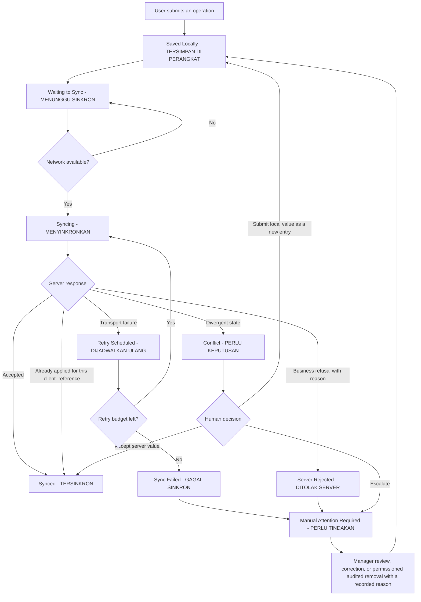

# Offline and Sync UX

**Primary surface:** Ops Android (Flutter)
**Roadmap steps enforcing this:** Step 5 onward
**Step 2 status:** IN PROGRESS
**Implementation status:** NOT IMPLEMENTED · **Flutter workspace:** ABSENT

> **Documentation is not implementation.** No queue, no sync, and no conflict resolution exists.

Accessibility posture: **DESIGNED TO MEET WCAG 2.2 AA REQUIREMENTS — NOT YET RUNTIME-TESTED**

---

## 1. The problem this document exists to solve

A cashier at a laundry counter in Indonesia takes an order for Budi Santoso, weighs 1,5 kg of
cucian kiloan, takes Rp25.000 as a partial payment against a Rp79.000 total, and hits submit. The
mobile data drops. What the interface says next decides whether the shop's books are correct at the
end of the day.

The failure mode is not "the app showed a spinner". The failure mode is **a cashier believing money
was recorded when it was not**, or **taking the same payment twice because the first one looked
lost**. Both are financial-integrity failures, and a duplicate order or duplicate payment caused by a
retry is an automatic **NO-GO**.

---

## 2. The nine sync states

These are the user-facing states. They map onto the taxonomy in
[`./UX_STATE_MODEL.md`](./UX_STATE_MODEL.md) and are never conflated with each other.

| # | State | Label (Bahasa Indonesia) | Meaning to the user | Server acknowledged? |
|---|---|---|---|---|
| 1 | **Saved Locally** | `TERSIMPAN DI PERANGKAT` | The operation exists on this device and cannot be lost by closing the app | **No** |
| 2 | **Waiting to Sync** | `MENUNGGU SINKRON` | Queued; will be sent when the network returns | **No** |
| 3 | **Syncing** | `MENYINKRONKAN` | Currently being sent | **No** |
| 4 | **Synced** | `TERSINKRON` | The server accepted it and returned the authoritative result | **Yes** |
| 5 | **Sync Failed** | `GAGAL SINKRON` | Sending failed after the bounded retry policy; the item is still here | **No** |
| 6 | **Conflict** | `PERLU KEPUTUSAN` | The server and this device disagree; a human must decide | Partially |
| 7 | **Server Rejected** | `DITOLAK SERVER` | The server understood the operation and refused it, with a reason | **Yes — as a refusal** |
| 8 | **Retry Scheduled** | `DIJADWALKAN ULANG` | An automatic retry is pending, with the next attempt time shown | **No** |
| 9 | **Manual Attention Required** | `PERLU TINDAKAN` | Automatic handling is exhausted; a person must act | **No** |

### Why these are distinguished

- **Saved Locally** and **Waiting to Sync** differ because the first tells the user their work is
  safe and the second tells them it is in a queue with an expected outcome. A cashier interrupted
  mid-order needs the first; a cashier closing a shift needs the second.
- **Sync Failed** and **Server Rejected** are opposite problems. The first is a transport failure and
  retrying is correct. The second is a business refusal and retrying unchanged is pointless — the
  interface must show the server's reason and offer correction, not a retry button that will fail
  identically.
- **Conflict** is neither. Nothing is wrong with the transport or the request; two truths exist and
  the product refuses to pick one silently.
- **Retry Scheduled** exists so that "nothing appears to be happening" is never the experience.
- **Manual Attention Required** is the terminal automated state, and it always names a human action.

---

## 3. State transitions

---

## 4. The nine rules

### Rule 1 — The user always knows whether the server acknowledged

Every operation with financial or custody significance carries a visible acknowledgement state at all
times. There is no ambiguous middle. The single question a cashier must always be able to answer —
"does the server know about this?" — is answered by the chip on the item, not by inference from the
absence of an error.

`TERSINKRON` is the **only** state that means the server acknowledged. It is never shown on the
strength of a local write.

### Rule 2 — A local receipt is honest

A receipt printed before server acknowledgement carries a printed marker reading
`BELUM DIKONFIRMASI SERVER` alongside the order reference and the amount. It is a valid record of
what was taken at the counter; it does not claim to be a confirmed transaction.

Once the server acknowledges, a confirmed reprint is available and is visually distinct. The
unconfirmed receipt is never retroactively described as confirmed.

### Rule 3 — An offline payment never looks final before acknowledgement

| Element | Offline behaviour |
|---|---|
| Payment success screen | Titled "Pembayaran tercatat di perangkat", not "Pembayaran berhasil" |
| Amount | Shown in integer Rupiah, `Rp25.000`, with the state chip beside it |
| Balance | Shown as provisional; the remaining balance is labelled as calculated locally |
| Receipt | Carries `BELUM DIKONFIRMASI SERVER` |
| Order status | Not advanced on the basis of a local payment claim — **an order is never marked paid on a client claim** (`FIN-005`) |
| Customer-facing effect | No notification is sent from the device; notification originates server-side after acknowledgement |

### Rule 4 — Unsynced financial operations are always visible

1. The Antrean destination is **never** hidden while any operation is unsynced, and it carries an
   exact count badge.
2. The count is exact. It is never rounded, capped at "9+", or suppressed to reduce visual noise.
3. Ops Android home shows an unsynced summary by type and total value in integer Rupiah.
4. The shift-close screen shows unsynced operations before the variance calculation, because closing
   a shift against an incomplete picture produces a false variance.
5. Unsynced items are listed with order reference, customer name, amount, capture time, and state.

### Rule 5 — Logout warns about unacknowledged work

Signing out with a non-empty queue presents a blocking warning that states the count, the types, and
the total value, and makes three things explicit:

- the queue **survives** sign-out and will be waiting for the same user on the same device;
- the queue **does not** travel to another user or another device;
- the queue is **not** cleared by signing out, by a version upgrade, or by clearing the cache.

Sign-out is permitted after acknowledgement of the warning. It is never blocked outright, because a
cashier ending a shift on a shared device must be able to leave.

### Rule 6 — A tenant switch is controlled when a critical queue exists

A switch with unsynced orders or payments presents the guard described in
[`./information-architecture/TENANT_OUTLET_CONTEXT_MODEL.md`](./information-architecture/TENANT_OUTLET_CONTEXT_MODEL.md).
The queue belongs to the tenant that produced it, is never carried across, and is never cleared by
the switch. Overriding the guard requires an explicit permission, a recorded reason, and an audit
entry.

### Rule 7 — A retry never creates a duplicate order

1. The `client_reference` is generated **once**, before the first attempt, and is persisted with the
   queued operation.
2. **Every retry reuses the same `client_reference`.** Regenerating it on retry is the highest-risk
   bug class in the entire offline design and is forbidden.
3. Idempotency is a **server contract**: a repeated `client_reference` returns the original result
   rather than creating a second record.
4. The interface never offers an action whose only effect is to resubmit with a fresh reference.
   There is no "kirim sebagai baru" button on a pending item.
5. When the server responds that the operation was already applied, the interface shows `TERSINKRON`
   — a success, not an error. A user who taps retry out of anxiety must not be punished with a
   frightening message.
6. Dependent operations preserve order. `CreateOrder` precedes `RecordPayment`; an operation whose
   predecessor failed does not jump ahead, and the queue shows the dependency plainly.

### Rule 8 — A conflict is never silently overwritten

The conflict panel shows the **server value** and the **local value** side by side, each with its
timestamp and its origin. No option is preselected. The two actions are worded distinctly, not merely
placed differently.

- The **server is the final source of truth**. Where the user believes the server is wrong, the
  correction is submitted as a **new, audited entry** — never as an edit of history.
- A conflict affecting **money escalates to a human**. It is never resolved by a last-write rule.
- A conflict affecting non-financial metadata may use a documented last-write rule — but only because
  that rule is written down here, and the interface still says which value won.
- The panel cannot be dismissed by navigating back. A conflict requires a decision.

### Rule 9 — No silent sync failure anywhere

This is the rule the other eight exist to protect.

- A failed operation is **never** dropped, hidden, collapsed into a generic offline indicator, or
  aged out of the queue.
- A failure is surfaced at the item, in the queue badge, and in the home summary.
- Automatic retry is bounded and its schedule is visible; it never becomes an infinite silent loop.
- When automation is exhausted, the item becomes `PERLU TINDAKAN` and names the human action.
- **Removing a queued financial operation requires an explicit permission, a recorded reason, and an
  audit entry.** There is no clear-cache, clear-queue, logout, or upgrade path that removes one.

---

## 5. The queue screen

`SCR-OPS-020` is the honest ledger of what this device owes the server.

| Column | Content |
|---|---|
| Type | Pesanan · Pembayaran · Transisi produksi · Bukti serah terima · Kas kurir |
| Reference | Order reference, plus the `client_reference` shown as a copyable technical identifier for support |
| Customer | Fictional example: `Budi Santoso` |
| Amount | Integer Rupiah where financial, `Rp25.000`; blank where not |
| Captured | 24-hour outlet local time, `14:30` |
| State | One of the nine states, as a chip with text and icon |
| Reason | The server's reason for `DITOLAK SERVER`, or the transport error class for `GAGAL SINKRON` |
| Next attempt | For `DIJADWALKAN ULANG`, the scheduled time |

Sorting places `PERLU TINDAKAN`, `PERLU KEPUTUSAN`, `DITOLAK SERVER`, and `GAGAL SINKRON` above
`MENUNGGU SINKRON`. Problems are never below the fold.

Actions available: *Kirim sekarang*, *Lihat detail*, *Selesaikan konflik*, *Eskalasi ke manajer*. The
permissioned, audited removal is deliberately not on this screen's primary action bar.

---

## 6. What survives what

| Event | Queue survives? | Drafts survive? | Cached tenant data survives? |
|---|---|---|---|
| App backgrounded | Yes | Yes | Yes |
| App killed mid-submit | **Yes** (`OFF-019`) | Yes | Yes |
| Device restart | **Yes** | Yes | Yes |
| Crash | **Yes** | Yes | Yes |
| Sign-out | **Yes**, for the same user on the same device | Yes | No — cleared |
| Tenant switch | **Yes**, held against the originating tenant | Yes, per tenant | No — discarded |
| Session expiry | **Yes** | Yes | Yes until re-authentication resolves |
| Device revocation | **Yes**, and surfaced for handover | Yes, surfaced | No |
| Application upgrade | **Yes** | Yes | Rebuilt |
| "Clear cache" | **Yes** — the financial queue is not cache | No | No |

An in-memory queue is not acceptable. The queue is persistent storage, and sensitive local data is
encrypted on device using platform secure storage for credentials and tokens.

---

## 7. Copy patterns

| Situation | Copy (Bahasa Indonesia) |
|---|---|
| Offline chip | `Mode offline — pekerjaan disimpan di perangkat` |
| Pending count | `3 operasi menunggu sinkron` |
| Payment captured offline | `Pembayaran Rp25.000 tercatat di perangkat. Belum dikonfirmasi server.` |
| Sync failed | `Gagal sinkron. Pesanan AL-2026-000123 belum diterima server. Coba kirim ulang.` |
| Server rejected | `Ditolak server: harga layanan sudah tidak berlaku. Perbaiki pesanan lalu kirim ulang.` |
| Conflict | `Perlu keputusan. Server mencatat Rp79.000, perangkat ini mencatat Rp75.000.` |
| Already applied | `Sudah tersinkron sebelumnya. Tidak ada pesanan ganda yang dibuat.` |
| Logout with queue | `3 operasi belum tersinkron, total Rp154.000. Antrean tetap tersimpan setelah keluar.` |

Copy never says "berhasil" for anything the server has not acknowledged.

---

## 8. Testing expectation (later steps)

Recorded here so no later step ships a weaker guarantee. These are **obligations, not results** — no
test has been written or run, and application CI is `NOT APPLICABLE`.

| Scenario | Required outcome | Step |
|---|---|---|
| Retry after network loss | Exactly one order and exactly one payment | 5 |
| App kill mid-submit | The queued operation is not lost (`OFF-019`) | 5 |
| Replay after a long offline period | Reconciles correctly; dependent order preserved | 5 |
| Tenant switch | No cached data from the previous tenant is reachable | 3 |
| Payment conflict | Surfaces for a human decision; never overwritten | 5 |
| Duplicate gateway callback | Rejected, not reprocessed | 5 |
| Proof capture offline | Uploads on reconnect; `DELIVERED` unreachable without captured proof (`DEL-027`) | 8 |

---

## 9. Related documents

- [`./UX_STATE_MODEL.md`](./UX_STATE_MODEL.md)
- [`./OPS_ANDROID_UX.md`](./OPS_ANDROID_UX.md)
- [`./COURIER_UX.md`](./COURIER_UX.md)
- [`./CRITICAL_JOURNEYS.md`](./CRITICAL_JOURNEYS.md)
- [`./information-architecture/OPS_ANDROID_IA.md`](./information-architecture/OPS_ANDROID_IA.md)
- [`./information-architecture/TENANT_OUTLET_CONTEXT_MODEL.md`](./information-architecture/TENANT_OUTLET_CONTEXT_MODEL.md)

## 10. Status

| Item | Status |
|---|---|
| Step 2 — Design System and UX Foundation | **IN PROGRESS** |
| Offline queue | **NOT IMPLEMENTED** |
| Sync and conflict resolution | **NOT IMPLEMENTED** |
| Idempotency | **NOT IMPLEMENTED** |
| Offline tests | **NOT STARTED** |
| Application CI | **NOT APPLICABLE** |

`GO` is conferred by the repository owner and is never self-declared.
