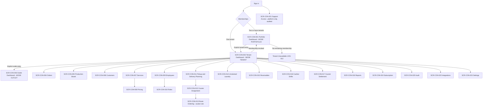

# Console Web — Information Architecture

**Surface:** Aish Laundry Console Web (Flutter Web)
**Roadmap steps delivering this surface:** Step 10 (finance, reports, portfolio), Step 12 (subscription and platform administration), with earlier slices from Steps 4, 8, and 9
**Step 2 status:** IN PROGRESS
**Implementation status:** NOT IMPLEMENTED
**Flutter workspace:** ABSENT

> **Documentation is not implementation.** No console, no dashboard, and no report exists.

Accessibility posture: **DESIGNED TO MEET WCAG 2.2 AA REQUIREMENTS — NOT YET RUNTIME-TESTED**

---

## 1. Personas and purpose

| Item | Value |
|---|---|
| Primary personas | **P-03 Tenant Owner**, **P-04 Tenant Admin**, **P-05 Outlet Manager**, **P-11 Finance** |
| Platform personas | **P-01 Platform Super Admin**, **P-02 Platform Support** |
| Environment | Desk, laptop or tablet, keyboard and pointer available, reliable connectivity assumed |
| Design bias | Comprehension and control over speed |

The console is where a business is **understood and configured**. It is not a second point of sale.

---

## 2. The three modes

The console has exactly three **visually distinct** modes. The mode is the single most important
piece of orientation on this surface and is never ambiguous.

| Mode | Scope | Who uses it | Visual treatment | Data rule |
|---|---|---|---|---|
| **Portfolio Mode** | Every tenant the authenticated user holds a membership in | Tenant Owner with multiple tenants | Dark blue application bar, badge reading `MODE PORTOFOLIO`, tenant-agnostic breadcrumb | Aggregates only across tenants the user legitimately belongs to. Aggregation **never widens the query surface** and never implies data merging. |
| **Tenant Mode** | One tenant, all of its brands and outlets | Tenant Owner, Tenant Admin, Finance | White application bar with the tenant name and a soft-blue accent, badge reading `MODE TENANT` | Every query is scoped to the one tenant. |
| **Outlet Mode** | One outlet within one tenant | Outlet Manager | Soft-blue application bar with brand and outlet name, badge reading `MODE OUTLET` | Every query is scoped to the outlet. |

Mode rules:

1. Mode is shown by **colour, badge text, and breadcrumb together** — never by colour alone.
2. Entering a mode is an explicit act. There is no implicit fall-through from Portfolio Mode into a
   tenant's operational data.
3. **Portfolio Mode never exposes a per-customer record.** It shows aggregates: revenue, order
   counts, aging distribution, receivable totals. Drilling into an individual customer requires
   entering Tenant Mode for that tenant, which re-scopes every subsequent query.
4. Portfolio aggregation must not weaken tenant isolation. If a membership is revoked, that tenant
   leaves the portfolio immediately and its contribution is removed from the aggregate rather than
   left as a stale figure.

---

## 3. Top-level navigation

A persistent left navigation rail, grouped. Groups are shown according to mode and role.

| Group | Destinations | Available in |
|---|---|---|
| Overview | Portfolio Dashboard `SCR-CON-001`, Tenant Dashboard `SCR-CON-002`, Outlet Dashboard `SCR-CON-003` | Portfolio / Tenant / Outlet respectively |
| Operations | Orders `SCR-CON-004`, Production Board `SCR-CON-005`, Pickup and Delivery Planning `SCR-CON-011`, Courier Assignment `SCR-CON-012`, Route Ordering `SCR-CON-013`, Unclaimed Laundry `SCR-CON-014` | Tenant, Outlet |
| Master data | Customers `SCR-CON-006`, Services `SCR-CON-007`, Pricing `SCR-CON-008` | Tenant, Outlet (read-only) |
| People | Employees `SCR-CON-009`, Roles `SCR-CON-010` | Tenant |
| Money | Receivables `SCR-CON-015`, Cashier Shifts `SCR-CON-016`, Courier Settlement `SCR-CON-017`, Reports `SCR-CON-018` | Tenant, Outlet (scoped) |
| Account | Subscription `SCR-CON-019`, Integrations `SCR-CON-022`, Settings `SCR-CON-023` | Tenant |
| Governance | Audit `SCR-CON-020`, Support Access `SCR-CON-021` | Tenant (Audit), Platform (Support Access) |

## 4. Secondary navigation

Secondary navigation is a horizontal tab strip inside a destination, plus a right-hand detail panel
for the selected row. The list never disappears when a detail opens on expanded and wide breakpoints.

| Destination | Tabs |
|---|---|
| Orders | Aktif · Selesai · Bermasalah (`ISSUE`) · Dibatalkan |
| Production Board | Kolom status: `AWAITING_PROCESS`, `SORTING`, `WASHING`, `DRYING`, `FINISHING`, `QUALITY_CONTROL`, `REWORK`, `READY_FOR_PICKUP` |
| Pickup and Delivery Planning | Permintaan · Terjadwal · Berjalan · Gagal |
| Unclaimed Laundry | H+1 · H+3 · H+7 · H+14 · Ditutup |
| Receivables | Terutang · Jatuh tempo · Sengketa · Lunas |
| Reports | Penjualan · Produksi · Pengantaran · Piutang · Cucian menumpuk |
| Subscription | Paket · Batas penggunaan · Riwayat tagihan · Ekspor data |

---

## 5. Navigation diagram

---

## 6. Role visibility

Visibility is presentation. **It is not authorization.** Every console read and write is authorised
server-side from Step 3.

| Destination | Tenant Owner | Tenant Admin | Outlet Manager | Finance | Platform Super Admin | Platform Support |
|---|---|---|---|---|---|---|
| Portfolio Dashboard | VISIBLE | HIDDEN | HIDDEN | HIDDEN | HIDDEN | HIDDEN |
| Tenant Dashboard | VISIBLE | VISIBLE | READ-ONLY | READ-ONLY | HIDDEN | HIDDEN |
| Outlet Dashboard | VISIBLE | VISIBLE | VISIBLE | READ-ONLY | HIDDEN | HIDDEN |
| Orders | VISIBLE | VISIBLE | VISIBLE (own outlet) | READ-ONLY | HIDDEN | HIDDEN |
| Production Board | VISIBLE | VISIBLE | VISIBLE (own outlet) | HIDDEN | HIDDEN | HIDDEN |
| Customers | VISIBLE | VISIBLE | VISIBLE (own outlet) | READ-ONLY | HIDDEN | HIDDEN |
| Services / Pricing | VISIBLE | VISIBLE | READ-ONLY | READ-ONLY | HIDDEN | HIDDEN |
| Employees / Roles | VISIBLE | VISIBLE | READ-ONLY | HIDDEN | HIDDEN | HIDDEN |
| Pickup and Delivery Planning | VISIBLE | VISIBLE | VISIBLE (own outlet) | HIDDEN | HIDDEN | HIDDEN |
| Courier Assignment / Route Ordering | VISIBLE | VISIBLE | VISIBLE (own outlet) | HIDDEN | HIDDEN | HIDDEN |
| Unclaimed Laundry | VISIBLE | VISIBLE | VISIBLE (own outlet) | READ-ONLY | HIDDEN | HIDDEN |
| Receivables | VISIBLE | READ-ONLY | READ-ONLY | VISIBLE | HIDDEN | HIDDEN |
| Cashier Shifts | VISIBLE | VISIBLE | VISIBLE (own outlet) | VISIBLE | HIDDEN | HIDDEN |
| Courier Settlement | VISIBLE | VISIBLE | VISIBLE (own outlet) | VISIBLE | HIDDEN | HIDDEN |
| Reports | VISIBLE | VISIBLE | VISIBLE (own outlet) | VISIBLE | HIDDEN | HIDDEN |
| Subscription | VISIBLE | READ-ONLY | HIDDEN | READ-ONLY | VISIBLE | READ-ONLY |
| Audit | VISIBLE | VISIBLE | READ-ONLY (own outlet) | READ-ONLY | VISIBLE | READ-ONLY |
| Support Access | HIDDEN | HIDDEN | HIDDEN | HIDDEN | VISIBLE | VISIBLE |
| Integrations | VISIBLE | VISIBLE | HIDDEN | HIDDEN | READ-ONLY | HIDDEN |
| Settings | VISIBLE | VISIBLE | READ-ONLY | HIDDEN | HIDDEN | HIDDEN |

Platform Support never reaches tenant data silently. Support Access is a **time-bound, audited,
reason-carrying** session and the tenant can see that it happened.

## 7. Tenant context

- The active tenant is displayed in the application bar at all times in Tenant and Outlet Mode.
- Switching tenants is explicit, re-scopes every query, and clears any in-memory tenant data. There
  is no cross-tenant list, no cross-tenant search, and no cross-tenant export.
- A record is never merged across tenants because a name, email, or phone matches.
- Exports carry the tenant scope of the view that produced them and are named accordingly.

## 8. Outlet context

- Outlet Mode is entered explicitly from Tenant Mode and shows brand and outlet in the bar.
- In Tenant Mode, an outlet filter is available on operational lists; the filter is **not** a mode
  and is visually distinct from Outlet Mode so the two are never confused.
- An inactive outlet remains readable for history and reporting; new operational actions are refused
  with `UXS-014 Outlet Inactive`.

## 9. Deep links

The console is URL-addressable, which makes link hygiene a security concern.

| Pattern | Target | Guard |
|---|---|---|
| `/t/{tenantSlug}/dashboard` | `SCR-CON-002` | Membership verified server-side; a slug is a hint, never proof |
| `/t/{tenantSlug}/o/{outletSlug}/dashboard` | `SCR-CON-003` | Membership plus outlet scope verified |
| `/t/{tenantSlug}/orders/{orderReference}` | `SCR-CON-004` detail panel | Refused with Permission Denied if out of scope |
| `/t/{tenantSlug}/unclaimed` | `SCR-CON-014` | — |
| `/t/{tenantSlug}/reports/{reportKey}` | `SCR-CON-018` | Report parameters are re-validated; a crafted parameter never widens scope |
| `/portfolio` | `SCR-CON-001` | Requires two or more active memberships |

**A tenant slug in a URL is never authorization.** It is an untrusted hint validated against the
authenticated user's memberships on every request.

## 10. Back behaviour

- Browser back and forward are first-class and always work; the application never traps history.
- Back from a detail panel closes the panel and restores the list with its filters, sort, page, and
  scroll position intact.
- Back never re-submits a write. Writes are not encoded in navigable history.
- Back out of Tenant Mode returns to Portfolio Mode for a multi-tenant owner, and to sign-out
  confirmation for a single-tenant user.

## 11. Unsaved-change behaviour

1. Any form with pending edits intercepts in-app navigation, browser back, and tab close, naming the
   specific unsaved item ("Perubahan harga layanan Cuci Kiloan belum disimpan").
2. Pricing edits carry an additional warning: a price-list change **never alters a historical order,
   invoice, or reprint**. The dialog says so explicitly so nobody expects a retroactive correction.
3. Role and permission edits show a diff before saving — who gains what, who loses what.
4. **Bulk destructive actions** require a confirmation panel showing all six of:
   - the **item count** affected;
   - the **scope** (tenant, brand, outlet, filter that produced the selection);
   - an explicit **confirmation** step that cannot be satisfied by a single stray click;
   - the **permission** being exercised and whether the current user holds it;
   - a mandatory **reason** (reason code plus free text);
   - the **audit effect** — that the action is recorded with actor, timestamp, and before/after values.

   Financial records are never hard-deleted from this surface. A financial correction is a reversal
   or adjustment entry, and the confirmation panel says which one it will create.

## 12. Offline behaviour

The console assumes connectivity and does **not** implement an offline queue.

- On connection loss the console shows `UXS-004 Offline`, disables write actions, and keeps the last
  rendered data visible with a `UXS-020 Stale Data` marker showing the fetch time.
- A write attempted during an outage fails visibly and is **not** queued. It is never silently
  retried in a way that could double-apply. The user re-submits deliberately.
- A partially loaded dashboard shows `UXS-019 Partial Data` naming which panels failed, rather than
  presenting an incomplete total as if it were complete.

## 13. Loading, error, permission-denied, and recovery

| Condition | State ID | Behaviour |
|---|---|---|
| First paint | `UXS-001 Loading` | Per-panel skeletons; the shell, mode badge, and navigation render immediately |
| No rows | `UXS-002 Empty` | Explains the filter that produced zero rows and offers to clear it |
| Query failed | `UXS-003 Error` | Names the panel and offers retry; other panels keep working |
| Not permitted | `UXS-010 Permission Denied` | States the required permission and who in the tenant can grant it; never reveals data shape |
| Session invalid | `UXS-011 Session Expired` | Preserves the current URL and returns to it after re-authentication |
| Membership revoked | `UXS-013 Tenant Unavailable` | Explains that access to the tenant ended, removes it from the portfolio, and offers the remaining tenants |
| Plan limit | `UXS-015 Subscription Limited` | Names the limit and the plan; Starter order volume is described as **fair-use**, never as a hard cutoff |
| Report too large | `UXS-019 Partial Data` | Offers a narrower range rather than silently truncating |
| Maintenance | `UXS-018 Maintenance` | States the expected window in outlet local time |

**Navigation recovery.** An unknown route resolves to a recovery page that offers the dashboard for
the current mode, the mode switcher, and sign-out. It never resolves to a blank frame, and it never
guesses a tenant.

---

## 14. Responsive behaviour

| Breakpoint | Layout |
|---|---|
| compact `<600px` | Single column; navigation rail collapses to a drawer; the mode badge stays in the app bar; wide tables become stacked cards; horizontal scroll is confined to the table container, never the page |
| medium `600–1023px` | Two columns; rail shows icons with labels on hover and focus; detail opens as a full-height sheet |
| expanded `1024–1439px` | Rail plus list plus detail panel side by side |
| wide `>=1440px` | As expanded, with a wider detail panel and additional dashboard columns; content is width-capped so lines stay readable |

---

## 15. Related documents

- [`../SCREEN_INVENTORY.md`](../SCREEN_INVENTORY.md)
- [`../CONSOLE_WEB_UX.md`](../CONSOLE_WEB_UX.md)
- [`../UNCLAIMED_LAUNDRY_UX.md`](../UNCLAIMED_LAUNDRY_UX.md)
- [`./ROLE_NAVIGATION_MATRIX.md`](./ROLE_NAVIGATION_MATRIX.md)
- [`./GLOBAL_SEARCH_MODEL.md`](./GLOBAL_SEARCH_MODEL.md)

## 16. Status

| Item | Status |
|---|---|
| Step 2 — Design System and UX Foundation | **IN PROGRESS** |
| Console Web surface | **NOT IMPLEMENTED** |
| Flutter workspace | **ABSENT** |
| Reports | **NOT IMPLEMENTED** |

`GO` is conferred by the repository owner and is never self-declared.
