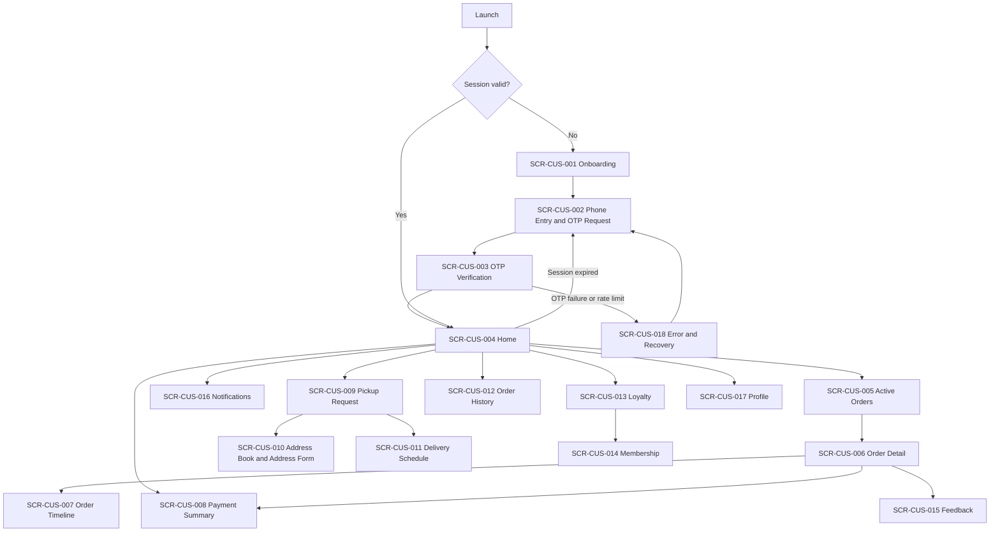

# Customer Android — Information Architecture

**Surface:** Aish Laundry Customer Android (Flutter)
**Roadmap step delivering this surface:** Step 11 — Customer Android Experience
**Step 2 status:** IN PROGRESS
**Implementation status:** NOT IMPLEMENTED
**Flutter workspace:** ABSENT

> **Documentation is not implementation.** This document describes the navigation obligations of a
> surface that does not exist. No screen has been built, no navigation has been executed, and no
> behaviour described here has been tested.

Accessibility posture for this surface: **DESIGNED TO MEET WCAG 2.2 AA REQUIREMENTS — NOT YET RUNTIME-TESTED**

---

## 1. Persona and purpose

| Item | Value |
|---|---|
| Primary persona | **P-12 Customer** |
| Secondary personas | **P-13 Corporate Customer Contact**, **P-14 Authorized Order Recipient** |
| Roles that reach this surface | Customer, Corporate Customer Contact, Authorized Recipient |
| Roles that never reach this surface | Platform Super Admin, Platform Support, Tenant Owner, Tenant Admin, Outlet Manager, Cashier, Production Operator, Quality Control, Courier Internal, External Courier, Finance |
| Primary language | Bahasa Indonesia |
| Money format | Integer Rupiah, displayed `Rp79.000` |
| Weight format | `1,5 kg` |
| Time format | 24-hour, `14:30`, displayed in the outlet's timezone; stored in UTC |

The Customer Android app is a **convenience surface, not a gate**. It does **not** replace the public
tracking portal (DEC-0014, `TRK-025`). A customer must always be able to track an order in a browser
without installing anything.

---

## 2. Top-level navigation

Five destinations in a bottom navigation bar. Five is the ceiling; a sixth destination requires a
decision record rather than a squeeze.

| # | Destination | Label (Bahasa Indonesia) | Purpose | Primary screen |
|---|---|---|---|---|
| 1 | Home | Beranda | Next action, active order summary, unpaid balance | `SCR-CUS-004` |
| 2 | Orders | Pesanan | Active orders and history | `SCR-CUS-005` |
| 3 | Pickup | Jemput | Request pickup, manage schedule and addresses | `SCR-CUS-009` |
| 4 | Rewards | Loyalitas | Loyalty balance, membership, deposit | `SCR-CUS-013` |
| 5 | Profile | Profil | Identity, addresses, notification preferences, sign out | `SCR-CUS-017` |

Notifications (`SCR-CUS-016`) is reachable from a header affordance on every top-level destination,
not from the bottom bar — it is a cross-cutting inbox, not a section of the app.

## 3. Secondary navigation

| Parent | Secondary destinations |
|---|---|
| Beranda | Notifications inbox, active order detail, unpaid balance detail |
| Pesanan | Active Orders / History tab pair; Order Detail → Timeline, Payment Summary, Feedback |
| Jemput | Pickup Request form, Address Book, Address Form, Delivery Schedule |
| Loyalitas | Loyalty ledger, Membership status, Deposit balance |
| Profil | Personal data, Address Book, Notification and opt-out preferences, Language, Sign out |

Tabs are used only where the two lists are peers (Active / History). Nested tabs are forbidden — a
third level of tabbing is a sign the IA is wrong, not that the user needs more tabs.

---

## 4. Navigation diagram

---

## 5. Role visibility

Menu visibility on this surface is a **user-experience affordance only**. It is **not authorization**.
Backend authorization becomes authoritative in Step 3 and every read on this surface is re-checked
server-side against the authenticated identity.

| Destination | Customer | Corporate Customer Contact | Authorized Recipient |
|---|---|---|---|
| Beranda | VISIBLE | VISIBLE | VISIBLE |
| Pesanan | VISIBLE | VISIBLE (orders of the corporate account) | READ-ONLY (only the order they are authorised to receive) |
| Jemput | VISIBLE | VISIBLE | HIDDEN |
| Loyalitas | VISIBLE | HIDDEN | HIDDEN |
| Profil | VISIBLE | VISIBLE | READ-ONLY |
| Notifications | VISIBLE | VISIBLE | READ-ONLY |

An Authorized Recipient sees a **single order**, never a customer's order list, never a customer's
addresses, and never a customer's payment history.

---

## 6. Tenant context

The customer surface is the one place where the tenant boundary is **inverted**: a customer may hold
orders at more than one tenant, and those tenants are competitors.

1. Order lists are grouped by **laundry brand**, and each order card carries the brand and outlet.
2. **No cross-tenant aggregate is ever displayed.** There is no combined "total spent" figure across
   tenants, no combined loyalty balance, and no combined order count. Loyalty and deposit are per
   tenant, always labelled with the tenant that owns them.
3. The same phone number registered at two tenants is **two unrelated customer profiles**. Nothing in
   this surface merges them, and nothing implies they are the same record.
4. Switching between brands is a **filter**, not a tenant switch — the customer identity is the
   authenticated user account, and every query is re-scoped server-side.

## 7. Outlet context

Outlet is displayed, never selected. The customer does not pick an outlet; the order carries the
outlet that took it. Outlet is shown on order cards, order detail, pickup confirmation, and delivery
schedule, so that a customer who uses two branches of the same brand can tell them apart.

An outlet that becomes inactive does not hide the customer's existing orders. It changes the contact
affordance to the tenant-level contact and shows state `UXS-014 Outlet Inactive`.

---

## 8. Deep links

| Deep link | Target | Authentication | Notes |
|---|---|---|---|
| `order/{orderReference}` | `SCR-CUS-006` | Required | Rejected with `UXS-010 Permission Denied` if the order is not the authenticated user's |
| `order/{orderReference}/timeline` | `SCR-CUS-007` | Required | — |
| `payment/{orderReference}` | `SCR-CUS-008` | Required | Never marks anything paid; display only (`FIN-005`) |
| `pickup/new` | `SCR-CUS-009` | Required | Prefills nothing from the link |
| `notifications` | `SCR-CUS-016` | Required | — |
| `track/{token}` | Handed to the **browser**, not the app | Not required | The public tracking portal is never replaced by an app install (`TRK-025`) |

Deep-link rules:

- A deep link **never carries a tracking token into authenticated app state**; the token belongs to
  the portal.
- A deep link to a resource the user may not read resolves to Permission Denied, **not** to a
  not-found that leaks existence, and never to a silent redirect to Home.
- A deep link received while unauthenticated is held, the OTP flow runs, and the link is resumed once
  — not replayed on every subsequent launch.

## 9. Back behaviour

| Position | Back result |
|---|---|
| A top-level destination that is not Beranda | Returns to Beranda |
| Beranda | System back exits the app after a single confirmation toast |
| A detail screen | Returns to the list that opened it, restoring scroll position and filters |
| A form with no changes | Closes immediately |
| A form with unsaved changes | Triggers the unsaved-change guard (§10) |
| OTP Verification | Returns to Phone Entry; the OTP attempt counter is **not** reset by navigating back |
| A deep-link entry with no history | Synthesises a parent stack so back never dead-ends |

## 10. Unsaved-change behaviour

Applies to Pickup Request, Address Form, Feedback, and Profile edits.

1. A modal confirmation names **what** would be lost ("Alamat baru belum disimpan"), and offers
   *Simpan*, *Buang*, *Batal*. Never a bare "Are you sure?".
2. Draft pickup requests are **retained locally** and offered again on the next visit rather than
   discarded silently.
3. Nothing on this surface holds a financial operation, so there is no financial queue to guard here.
   That guard belongs to Ops Android (see [`../OFFLINE_AND_SYNC_UX.md`](../OFFLINE_AND_SYNC_UX.md)).

## 11. Offline behaviour

The customer app is **read-tolerant, write-conservative**. It is not an offline-first surface; that
is Ops Android.

| Capability | Offline behaviour |
|---|---|
| Previously loaded order list and detail | Shown from cache, labelled `UXS-020 Stale Data` with the exact time it was fetched |
| Order timeline | Shown from cache with the same staleness label |
| Payment summary | Shown from cache, explicitly marked as not live; a balance is never presented as settled from cache |
| New pickup request | **Blocked** with `UXS-004 Offline`; the draft is retained and the primary action becomes *Coba lagi saat online* |
| Feedback | Held as a local draft, submitted on reconnect |
| OTP request and verification | Blocked; these require the server |
| Loyalty and deposit balances | Cached values are shown only with a staleness label; a cached balance is never used to imply spendable credit |

No customer-facing screen ever shows a money figure from cache without a visible freshness marker.

## 12. Loading, error, permission-denied, and recovery

| Condition | State ID | Behaviour |
|---|---|---|
| Initial fetch | `UXS-001 Loading` | Skeleton matching the final layout; no spinner-over-blank; announced to screen readers as "Memuat" |
| No orders yet | `UXS-002 Empty` | Explains what the list will contain and offers *Ajukan penjemputan* as the next action |
| Request failed | `UXS-003 Error` | States what failed, what it means, and the recovery step; never a bare error code |
| Not permitted | `UXS-010 Permission Denied` | Explains that this account cannot open this order and offers *Hubungi outlet*; never reveals whether the order exists in another tenant |
| Session invalid | `UXS-011 Session Expired` | Returns to Phone Entry preserving the intended destination |
| Provider degraded | `UXS-016 Provider Degraded` | Notification delivery may be delayed; the order is unaffected — a messaging failure never changes business state |
| Too many OTP attempts | `UXS-017 Rate Limited` | States when the customer may retry; offers *Hubungi outlet* as the human path |

**Navigation recovery.** Every terminal state on this surface has a way out. `SCR-CUS-018 Error and
Recovery` is the last-resort destination: it is reachable from any unrecoverable navigation failure,
always offers *Kembali ke Beranda* and *Hubungi outlet*, and never leaves the user on a blank screen.
A user is never stranded on a screen whose only exit is killing the app.

---

## 13. Related documents

- [`../SCREEN_INVENTORY.md`](../SCREEN_INVENTORY.md)
- [`../UX_STATE_MODEL.md`](../UX_STATE_MODEL.md)
- [`../CUSTOMER_ANDROID_UX.md`](../CUSTOMER_ANDROID_UX.md)
- [`./ROLE_NAVIGATION_MATRIX.md`](./ROLE_NAVIGATION_MATRIX.md)
- [`./TENANT_OUTLET_CONTEXT_MODEL.md`](./TENANT_OUTLET_CONTEXT_MODEL.md)

## 14. Status

| Item | Status |
|---|---|
| Step 2 — Design System and UX Foundation | **IN PROGRESS** |
| Customer Android surface | **NOT IMPLEMENTED** |
| Flutter workspace | **ABSENT** |
| Navigation testing | **NOT STARTED** |
| Accessibility runtime testing | **NOT STARTED** |

`GO` is conferred by the repository owner and is never self-declared.
