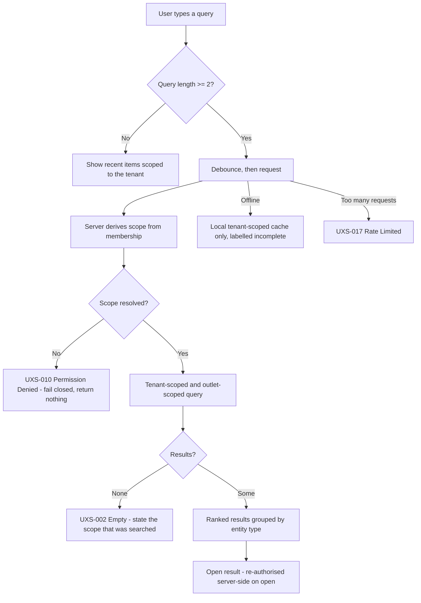

# Global Search Model

**Step 2 status:** IN PROGRESS
**Implementation status:** NOT IMPLEMENTED
**Backend runtime:** ABSENT

> **Documentation is not implementation.** No search, no index, and no ranking exists.

Accessibility posture: **DESIGNED TO MEET WCAG 2.2 AA REQUIREMENTS — NOT YET RUNTIME-TESTED**

---

## 1. Why search needs its own document

Search is the single easiest place to lose tenant isolation. A search box is, by construction, a
request to look across records the user did not name. If the scope is wrong by one line of code, a
competitor's customer list becomes visible — and it will look like a feature, not a bug.

Search is therefore treated as a **tenant-boundary surface** with the same seriousness as
authentication.

---

## 2. The four scoping rules

1. **Every search is tenant-scoped, server-side, by default.** Scoping is enforced at the data access
   layer so that a missing scope returns **nothing**, never another tenant's rows. Fail closed.
2. **A client-supplied tenant identifier is never authorization proof.** The scope is derived from
   the authenticated membership, not from a parameter in the request.
3. **Every search index carries a tenant dimension.** An index entry without a tenant key is treated
   as a cross-tenant leak waiting to happen.
4. **Search never crosses the tenant boundary, in any mode, for any role — including Portfolio Mode.**
   There is no cross-tenant search. Portfolio Mode aggregates numbers; it does not search records.

---

## 3. Scope by surface

| Surface | Scope | Notes |
|---|---|---|
| Customer Android | The authenticated customer's own orders, per tenant | Never other customers; never staff records |
| Ops Android | Active tenant **and** active outlet, plus tenant-wide where the role permits | Offline search hits the local tenant-scoped cache only |
| Console Web — Tenant Mode | The one active tenant | Outlet filter narrows further |
| Console Web — Outlet Mode | The one active outlet | Cannot be widened without leaving the mode |
| Console Web — Portfolio Mode | **Search is disabled.** Aggregates only | Entering a tenant is the way to search it |
| Public Tracking Portal | **No search exists.** The token is the only lookup | A lookup form would be an enumeration surface |

---

## 4. What is searchable

| Entity | Searchable by | Surfaces | Role gate |
|---|---|---|---|
| Order | Order reference (`AL-2026-000123`), customer name, masked phone fragment, label code | Ops, Console | Cashier, Outlet Manager, Tenant Admin, Tenant Owner, Finance (read-only) |
| Customer | Name, masked phone fragment, customer code | Ops, Console | Cashier, Outlet Manager, Tenant Admin, Tenant Owner |
| Service and price | Service name, category | Ops, Console | All operational roles (read) |
| Employee | Name, role | Console | Tenant Owner, Tenant Admin |
| Pickup or delivery job | Job reference, order reference, zone | Ops, Console | Outlet Manager, Tenant Admin, Tenant Owner; Courier Internal **restricted to own jobs** |
| Unclaimed laundry case | Order reference, customer name, aging bucket, follow-up owner | Console | Outlet Manager, Tenant Admin, Tenant Owner, Finance (read-only) |
| Receivable | Order reference, customer name | Console | Finance, Tenant Owner |
| Audit entry | Actor, entity, date range | Console | Tenant Owner, Tenant Admin, Platform Super Admin |

### Explicitly not searchable

| Not searchable | Reason |
|---|---|
| The customer database, by a **Courier Internal** | A courier sees assigned jobs and their minimum recipient detail. **A courier must never be able to browse the tenant's customer database.** |
| Anything, by an **External Courier** | An external courier holds a guest link scoped to one job. There is no search surface for that role at all |
| Anything financial, by a **Production Operator** | Production work does not require money |
| A tracking token, by anyone | Tokens are stored hashed; the plaintext exists only in the link and is never a search term |
| Another tenant's records, by anyone | No exception, no mode, no role, no "temporary" bypass |
| An OTP, a credential, or a session token | Never indexed, never logged, never a search term |

---

## 5. Search behaviour model

### Ranking

Ranking is by **operational usefulness**, not by relevance score alone:

1. Exact order-reference match, always first.
2. Active orders in the current outlet.
3. Active orders in other outlets of the same tenant, labelled with the outlet.
4. Customers with an unpaid balance or an open unclaimed-laundry case.
5. Completed orders, most recent first.

An order from another outlet is **always labelled with its outlet**, so a cashier never acts on the
wrong branch's order.

---

## 6. Masking in results

Search results are a disclosure surface and are masked per context.

| Field | In results | Rule |
|---|---|---|
| Customer name | Full name to authorised staff; `Budi S.` where masking applies | Masking level depends on who is looking and where |
| Phone | Always masked in a result row: `0812-XXXX-1234` | The full number is revealed only on the record, to a role permitted to see it, and the reveal is auditable |
| Address | **Never** in a search result row | Address is `RESTRICTED`; it appears on the record, not in a list |
| Money | Integer Rupiah, `Rp79.000` | Never inferred from a display string |
| Photographs | **Never** in search results | `RESTRICTED`; signed expiring URLs only, on the record |
| Internal notes | **Never** in search results | Internal notes are not a discovery surface |

---

## 7. Offline search (Ops Android)

| Rule | Detail |
|---|---|
| Cache scope | The local index is partitioned per tenant and per user, exactly like the rest of local storage |
| Honesty | Offline results are labelled "Hasil mungkin belum lengkap (offline)" with the last sync time |
| No silent narrowing | The interface never presents an offline subset as though it were the full set |
| Tenant switch | The local index for the previous tenant is not searchable under the new tenant, ever |
| Queued items | Orders still in the queue are searchable locally and are marked with their sync state, so a cashier can find an order they just took even before the server knows about it |

---

## 8. States

| Condition | State ID | Behaviour and recovery |
|---|---|---|
| Query running | `UXS-001 Loading` | Inline progress in the field; previous results stay until replaced |
| No matches | `UXS-002 Empty` | States the scope searched ("Outlet Cempaka, 30 hari terakhir") and offers to widen within the tenant |
| Query failed | `UXS-003 Error` | Offers retry; never silently returns zero results, because an empty list reads as "nothing exists" |
| Offline | `UXS-004 Offline` | Local cache only, clearly labelled |
| Not permitted | `UXS-010 Permission Denied` | Returns nothing and says the scope is not available to this role; **never** reveals whether a matching record exists elsewhere |
| Too many queries | `UXS-017 Rate Limited` | States when to retry; protects against scraping of the customer base |
| Index stale | `UXS-020 Stale Data` | Shows the index freshness rather than implying live truth |

**A failed search must never look like an empty search.** Those two states mean opposite things to a
cashier standing in front of a customer.

---

## 9. Abuse resistance

| Threat | Countermeasure |
|---|---|
| Customer-base scraping by a compromised staff account | Rate limiting, result-count caps, audit of high-volume search, no bulk export from the search surface |
| Order-number enumeration | Order references are not sequential guessing targets on any public surface; the portal has no lookup form at all |
| Cross-tenant probing via a crafted parameter | Scope derived from membership, not from the request; a mismatched tenant hint is refused, not honoured |
| Tenant enumeration via response timing or error shape | Permission Denied and Empty are shaped so that neither confirms the existence of a record in another tenant |
| Search terms leaking into logs | Query strings are not written to logs with personal data intact; no OTP, token, or credential is ever a logged term |

---

## 10. Analytics intent

Search analytics record **shape, not content**: query length band, entity type selected, result
position opened, zero-result rate, offline-versus-online ratio. They never record the query string
itself, a customer name, a phone number, an address, or a token.

---

## 11. Related documents

- [`./ROLE_NAVIGATION_MATRIX.md`](./ROLE_NAVIGATION_MATRIX.md)
- [`./TENANT_OUTLET_CONTEXT_MODEL.md`](./TENANT_OUTLET_CONTEXT_MODEL.md)
- [`./CONSOLE_WEB_IA.md`](./CONSOLE_WEB_IA.md)
- [`../UX_STATE_MODEL.md`](../UX_STATE_MODEL.md)

## 12. Status

| Item | Status |
|---|---|
| Step 2 — Design System and UX Foundation | **IN PROGRESS** |
| Global search | **NOT IMPLEMENTED** |
| Search index | **ABSENT** |
| Tenant scoping enforcement | **NOT IMPLEMENTED** (delivered in Step 3) |

`GO` is conferred by the repository owner and is never self-declared.
