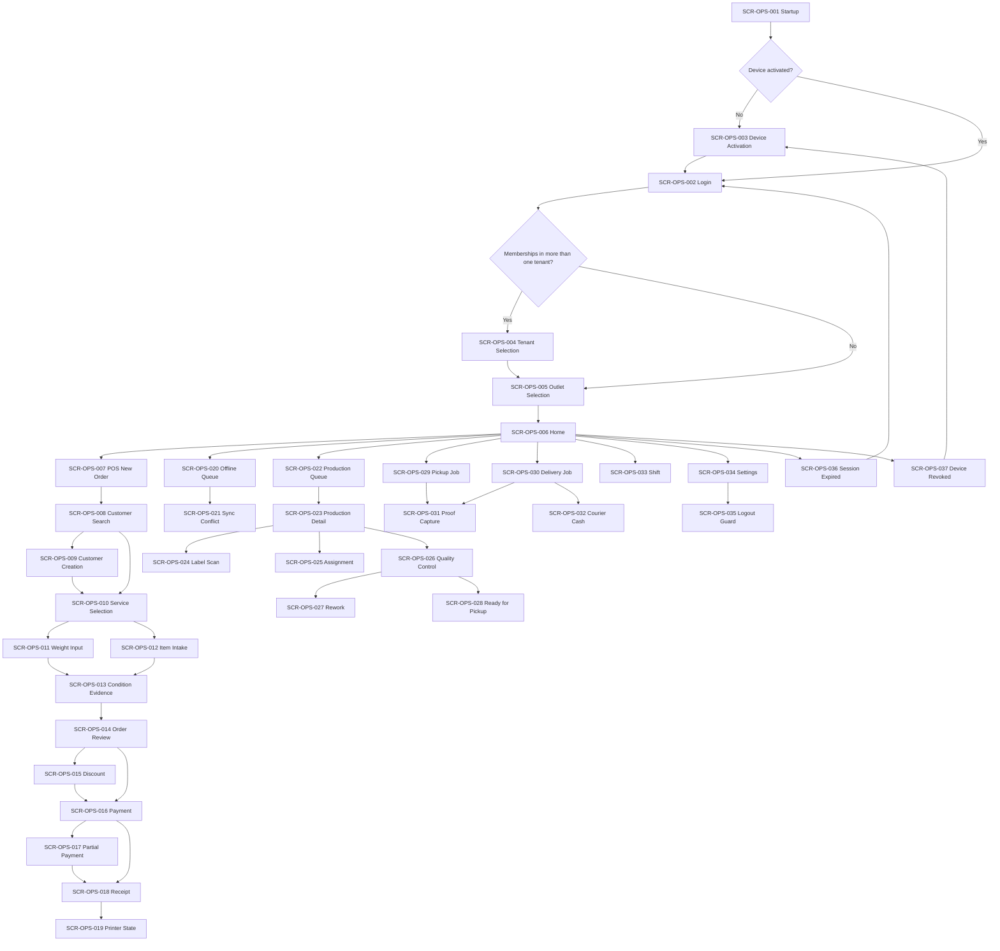

# Ops Android — Information Architecture

**Surface:** Aish Laundry Ops Android (Flutter)
**Roadmap steps delivering this surface:** Step 5 (POS, order, payment), Step 6 (production), Step 8 (pickup and delivery)
**Step 2 status:** IN PROGRESS
**Implementation status:** NOT IMPLEMENTED
**Flutter workspace:** ABSENT

> **Documentation is not implementation.** No screen, no navigation, and no offline queue exists.
> Everything below is an obligation on a later step.

Accessibility posture: **DESIGNED TO MEET WCAG 2.2 AA REQUIREMENTS — NOT YET RUNTIME-TESTED**

---

## 1. Personas and purpose

| Item | Value |
|---|---|
| Primary personas | **P-06 Cashier (Kasir)**, **P-07 Production Operator**, **P-08 Quality Control**, **P-09 Courier Internal** |
| Supporting personas | **P-05 Outlet Manager**, **P-04 Tenant Admin** |
| Excluded persona | **P-10 External Local Courier (Ojek Lokal)** — served by a scoped guest link, never by this app |
| Environment | Laundry counter and motorbike; cheap devices; patchy mobile data; one-handed use; outdoors |
| Design bias | Speed and honesty over feature density |

This is the **offline-first** surface. It is the only surface that holds queued financial operations,
and therefore the only surface with a logout guard and a tenant-switch guard tied to a queue.

---

## 2. Top-level navigation

The bottom navigation bar is **role-adaptive**. It shows at most five destinations, drawn from the
set below according to the roles carried by the active membership.

| # | Destination | Label | Roles that see it | Primary screen |
|---|---|---|---|---|
| 1 | Home | Beranda | All | `SCR-OPS-006` |
| 2 | POS | Kasir | Cashier, Outlet Manager | `SCR-OPS-007` |
| 3 | Production | Produksi | Production Operator, Quality Control, Outlet Manager | `SCR-OPS-022` |
| 4 | Jobs | Tugas | Courier Internal, Outlet Manager | `SCR-OPS-029` |
| 5 | Queue | Antrean | All (always present when the queue is non-empty) | `SCR-OPS-020` |
| 6 | More | Lainnya | All | `SCR-OPS-034` |

Rules:

1. **Queue is never hidden.** When any operation is unsynced, the Queue destination carries a count
   badge and cannot be collapsed into *Lainnya*. A cashier must never have to hunt for unsynced money.
2. **Cashier critical actions are never buried.** *Pesanan baru*, *Terima pembayaran*, and *Cetak
   ulang nota* are reachable in at most one tap from Beranda.
3. **A Production Operator does not see financial destinations.** POS, payment, shift, and courier
   cash are absent from that role's navigation — and are also refused server-side from Step 3.
4. **A Courier Internal does not see a customer directory.** Couriers see only their assigned jobs.
   There is no destination on this surface that lists all customers of the tenant for a courier.

## 3. Secondary navigation

| Parent | Secondary destinations |
|---|---|
| Beranda | Shift status, unsynced queue summary, today's counters, printer status |
| Kasir | Customer Search → Customer Creation → Service Selection → Weight Input / Item Intake → Condition Evidence → Order Review → Discount → Payment → Partial Payment → Receipt → Printer State |
| Produksi | Production Queue → Production Detail → Label Scan → Assignment → Quality Control → Rework → Ready for Pickup |
| Tugas | Pickup Job / Delivery Job → Proof Capture → Courier Cash |
| Antrean | Offline Queue → Sync Conflict |
| Lainnya | Settings, Shift, device information, Logout Guard |

The POS path is a **linear wizard with a persistent running total**. The user can step backwards
without losing entered lines; stepping backwards never silently discards a captured photo.

---

## 4. Navigation diagram

---

## 5. Role visibility

Visibility here is presentation only. **It is not authorization.** From Step 3, every command is
authorised server-side against the membership, and a hidden destination that is reached by any means
is refused by the backend.

| Destination | Cashier | Production Operator | Quality Control | Courier Internal | Outlet Manager | Tenant Admin |
|---|---|---|---|---|---|---|
| Beranda | VISIBLE | VISIBLE | VISIBLE | VISIBLE | VISIBLE | VISIBLE |
| Kasir (POS) | VISIBLE | HIDDEN | HIDDEN | HIDDEN | VISIBLE | READ-ONLY |
| Produksi | READ-ONLY | VISIBLE | VISIBLE | HIDDEN | VISIBLE | READ-ONLY |
| Tugas (jobs) | HIDDEN | HIDDEN | HIDDEN | VISIBLE | VISIBLE | READ-ONLY |
| Antrean | VISIBLE | VISIBLE | VISIBLE | VISIBLE | VISIBLE | VISIBLE |
| Shift | VISIBLE | HIDDEN | HIDDEN | HIDDEN | VISIBLE | READ-ONLY |
| Kas kurir | HIDDEN | HIDDEN | HIDDEN | VISIBLE (own only) | VISIBLE | READ-ONLY |
| Diskon | READ-ONLY (approval required) | HIDDEN | HIDDEN | HIDDEN | VISIBLE | READ-ONLY |
| Pengaturan | READ-ONLY | READ-ONLY | READ-ONLY | READ-ONLY | VISIBLE | VISIBLE |

## 6. Tenant context

The tenant, brand, outlet, role, and sync state are shown in a **persistent context bar** on every
operational screen. See [`./TENANT_OUTLET_CONTEXT_MODEL.md`](./TENANT_OUTLET_CONTEXT_MODEL.md) for the
full model. Summarised obligations:

1. Tenant switching is **always explicit** and never silent.
2. Switching tenants while a **critical queue** (unsynced order or payment) exists is guarded: the
   user is told what is unsynced, and may not switch until the queue drains or an explicitly
   permissioned, audited override is used.
3. Local storage is partitioned **per tenant and per user**. A tenant switch never surfaces the
   previous tenant's cached customers, orders, prices, or queue items.
4. A stale tenant cache is discarded on switch, not reused.

## 7. Outlet context

Outlet selection is required before any operational screen opens. A membership scoped to a single
outlet skips the picker but still shows the outlet in the context bar — never an implicit blank.

- Changing outlet mid-shift is guarded by the same queue rules as a tenant switch.
- An outlet that becomes inactive (`UXS-014 Outlet Inactive`) blocks new order intake and permits
  completion and sync of work already captured. It never deletes queued work.

## 8. Deep links

Deep linking on this surface is deliberately narrow, because an operational app is not a link target
for the public.

| Deep link | Target | Guard |
|---|---|---|
| `ops/order/{orderReference}` | `SCR-OPS-014` | Requires active session, matching tenant, and outlet scope |
| `ops/job/{jobReference}` | `SCR-OPS-029` or `SCR-OPS-030` | Only if assigned to the authenticated courier |
| `ops/queue` | `SCR-OPS-020` | Always permitted for an authenticated user |
| `ops/scan/{labelCode}` | `SCR-OPS-024` | Resolves within the active tenant only; never across tenants |

A deep link whose tenant differs from the active tenant **does not switch tenants silently**. It
presents the tenant switch as an explicit choice, states which tenant the link belongs to, and
applies the queue guard.

## 9. Back behaviour

| Position | Back result |
|---|---|
| Home | Requires an explicit confirmation to leave the app; states the unsynced count if any |
| POS wizard step | Returns to the previous step with all entered lines and captured evidence intact |
| Payment screen | Returns to Order Review **only if** no payment has been submitted; after submission the payment result screen is the only forward path |
| Proof Capture | Returns to the job, retaining captured proof as a local draft |
| Sync Conflict | Cannot be dismissed by back; a conflict requires an explicit decision |
| Session Expired / Device Revoked | Back is disabled; the only path is re-authentication or re-activation |

## 10. Unsaved-change behaviour

1. **A submitted financial operation is never "unsaved".** Once submitted it becomes a queue item
   with a `client_reference` and is visible in Antrean until the server acknowledges it.
2. A POS draft with entered lines is retained locally across app kill (`OFF-019`), and offered for
   resume by customer name and running total.
3. Captured condition photographs are retained with the draft; leaving a form never discards evidence
   the user took the trouble to capture.
4. Discarding a draft requires explicit confirmation naming the customer and the total.
5. **Discarding a queued financial operation is not an ordinary UI action.** It requires an explicit
   permission, a recorded reason, and an audit entry. There is no "clear queue" convenience button.

## 11. Offline behaviour

| Area | Offline behaviour |
|---|---|
| Order intake | Fully available; the order is saved locally with a `client_reference` and enters the queue |
| Payment capture | Available; the receipt states the payment is recorded locally and **not yet confirmed by the server** |
| Retry | Always reuses the original `client_reference`; a retry never creates a second order or payment |
| Production transitions | Available; queued and replayed idempotently |
| Proof capture | Available; photographs and signatures are held locally and uploaded on reconnect |
| Courier cash | Recorded locally; the reconciliation figure is marked provisional until acknowledged |
| Price list and service catalogue | Read from the last synced tenant-scoped cache, labelled with its fetch time |
| Customer search | Searches the local tenant-scoped cache only; states plainly that results may be incomplete offline |
| Discount approval | Blocked offline where the discount requires an approval the server must grant |

Full rules: [`../OFFLINE_AND_SYNC_UX.md`](../OFFLINE_AND_SYNC_UX.md).

## 12. Loading, error, permission-denied, and recovery

| Condition | State ID | Behaviour |
|---|---|---|
| Fetching | `UXS-001 Loading` | Skeletons; the context bar and sync chip remain visible while loading |
| Nothing queued | `UXS-002 Empty` | Antrean states "Semua pekerjaan sudah tersinkron" with the last sync time |
| Request failed | `UXS-003 Error` | Names the operation, the failure, and the next step |
| No connectivity | `UXS-004 Offline` | Persistent chip; write paths continue, server-dependent paths are disabled with reasons |
| Server rejected an operation | `UXS-008 Failed Sync` | The item stays in Antrean with the server's reason; it is never dropped |
| Divergence | `UXS-009 Conflict` | Requires an explicit human decision; never auto-resolved for money |
| Not permitted | `UXS-010 Permission Denied` | States that the action requires a different role and names who can perform it |
| Session invalid | `UXS-011 Session Expired` | Re-authentication preserves the queue; the queue is never cleared by a session change |
| Device revoked | `UXS-012 Device Revoked` | The device stops working immediately; unsynced work is reported to the user and to the manager rather than silently discarded |
| Plan limit reached | `UXS-015 Subscription Limited` | States the limit, that Starter order volume is **fair-use**, and who can resolve it |

**Navigation recovery.** Every dead end on this surface has an exit to Beranda or to Antrean. A user
who cannot proceed can always see what is unsynced and who to contact. No screen is reachable that
has no forward and no backward path.

---

## 13. Related documents

- [`../SCREEN_INVENTORY.md`](../SCREEN_INVENTORY.md)
- [`../OPS_ANDROID_UX.md`](../OPS_ANDROID_UX.md)
- [`../COURIER_UX.md`](../COURIER_UX.md)
- [`../OFFLINE_AND_SYNC_UX.md`](../OFFLINE_AND_SYNC_UX.md)
- [`./ROLE_NAVIGATION_MATRIX.md`](./ROLE_NAVIGATION_MATRIX.md)
- [`./TENANT_OUTLET_CONTEXT_MODEL.md`](./TENANT_OUTLET_CONTEXT_MODEL.md)

## 14. Status

| Item | Status |
|---|---|
| Step 2 — Design System and UX Foundation | **IN PROGRESS** |
| Ops Android surface | **NOT IMPLEMENTED** |
| Offline queue | **NOT IMPLEMENTED** |
| Flutter workspace | **ABSENT** |
| Navigation testing | **NOT STARTED** |

`GO` is conferred by the repository owner and is never self-declared.
