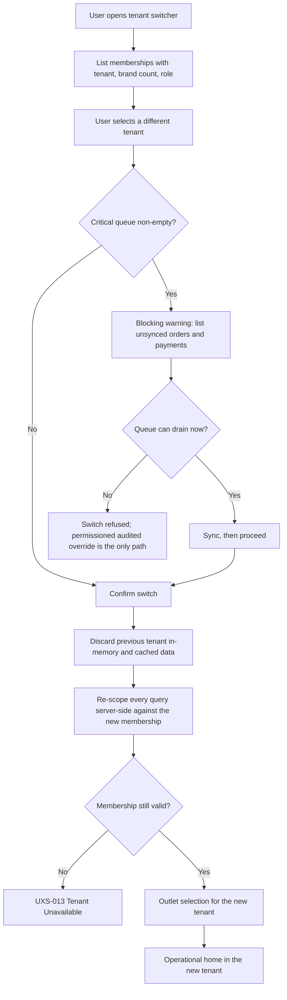

# Tenant and Outlet Context Model

**Step 2 status:** IN PROGRESS
**Implementation status:** NOT IMPLEMENTED
**Backend runtime:** ABSENT

> **Documentation is not implementation.** No context bar, no tenant switcher, and no cache
> partitioning exists. This document records obligations for Steps 3 and later.

---

## 1. The hierarchy

```
User Account -> Membership -> Tenant/Organization -> Laundry Brand -> Outlet
```

| Level | Meaning | UX consequence |
|---|---|---|
| User Account | One identity | The person signing in |
| Membership | The join carrying role and permissions **within one tenant** | Authorisation is derived from Membership, never from the account alone |
| Tenant / Organization | The isolation boundary and the billing boundary | The thing being switched between |
| Laundry Brand | A commercial brand owned by a tenant | Shown for orientation and grouping |
| Outlet | A physical location belonging to a brand | The operational unit of daily work |

A user may hold memberships in several tenants. An owner may own several tenants. Those tenants may
be **competitors of each other**. The interface must never behave as though they are one business.

---

## 2. The persistent context bar

Every **operational** screen — Ops Android throughout, Console Web in Tenant and Outlet Mode —
carries a persistent context bar. It is never collapsed, never scrolled away, and never abbreviated
to the point of ambiguity.

The bar always shows all five of:

| Element | Example (fictional) | Rule |
|---|---|---|
| **Tenant** | `Laundry Bersih Sejahtera` | Always present; truncation shows a tooltip and full value on focus |
| **Brand** | `Bersih Express` | Present when the tenant has more than one brand |
| **Outlet** | `Outlet Cempaka` | Always present on Ops Android; present in Console Outlet Mode |
| **Role** | `Kasir` | The role in force for the active membership |
| **Sync state** | `TERSINKRON` / `MENUNGGU SINKRON 3` / `GAGAL SINKRON 1` | Ops Android only; count is exact, never rounded or hidden |

Rules:

1. The bar is **never conveyed by colour alone**. Each element carries text; the sync state carries
   text plus an icon.
2. The bar is readable at large system font sizes without truncating the tenant or the sync count.
3. Tapping the bar opens the context sheet: the tenant switcher, the outlet switcher, the role
   summary, and the queue summary.
4. On a screen where a mistake would be expensive — Payment, Partial Payment, Proof Capture, Courier
   Cash, Shift close — the bar is **reinforced**, showing tenant and outlet in the confirmation
   dialog itself, so a user never confirms money against the wrong outlet.

---

## 3. Tenant switching

### 3.1 Explicit, never silent

**A tenant switch is always an explicit user action.** The following are forbidden:

- switching tenant because a deep link belonged to another tenant;
- switching tenant because a notification was tapped;
- switching tenant because the previous tenant became unavailable;
- switching tenant as a side effect of any background refresh, sync, or session renewal;
- inferring a tenant from "the last request", from ambient state, or from a client-supplied hint.

Where a link belongs to another tenant, the interface **states which tenant** and asks. It does not
act.

### 3.2 The switch sequence



### 3.3 The unsynced-work guard

When a **critical queue** exists — any unsynced order, payment, refund, proof, or courier cash
record — a tenant switch presents a blocking warning that states:

- how many operations are unsynced, by type;
- the customer name and order reference of each (fictional example: `AL-2026-000123 — Budi Santoso — Rp79.000`);
- that the queue belongs to the current tenant and will **not** travel to the new one;
- that the queue is **not deleted** by switching, and will be waiting when the user returns.

The queue is never cleared by a switch, a logout, a version upgrade, or a cache clear. Removing a
queued financial operation requires an explicit, permissioned, audited action — never a convenience
button.

### 3.4 No stale tenant cache

1. Local storage is partitioned **per tenant and per user**. Two memberships never share a partition.
2. On switch, in-memory tenant data is discarded before the new tenant renders. There is no frame in
   which tenant A's customer list is visible under tenant B's context bar.
3. Cache keys carry a tenant dimension. A tenant-less cache key is treated as a cross-tenant leak.
4. Search indexes, exports, report files, uploaded files, and object-storage keys are tenant-scoped.
5. On sign-out from a shared shop-floor device, cached tenant data is cleared — while queued
   financial operations are retained and surfaced, because losing money is worse than caching a name.

---

## 4. Outlet switching

Outlet switching follows the same discipline at a smaller scale.

| Rule | Detail |
|---|---|
| Explicit | The user selects an outlet; nothing selects one for them |
| Guarded | The unsynced-work guard applies — a queued order belongs to the outlet that took it |
| Scoped | A membership scoped to one outlet cannot switch; the picker is absent and the outlet is fixed in the bar |
| Reinforced | Outlet appears in every financial confirmation dialog |
| Reversible | Switching back is always possible and never destroys work |

---

## 5. Portfolio Mode versus operational Tenant Mode

These are **different mental models** and are kept visually and behaviourally distinct.

| Aspect | Portfolio Mode | Operational Tenant Mode |
|---|---|---|
| Scope | Every tenant the user holds an active membership in | Exactly one tenant |
| Purpose | Comparison and oversight | Doing the work |
| Surface | Console Web only | Console Web and Ops Android |
| Data granularity | **Aggregates only** — revenue, order counts, aging distribution, receivable totals | Individual orders, customers, payments |
| Customer records | **Never shown** | Shown, tenant-scoped |
| Write actions | **None**. Portfolio Mode is read-only by design | Available subject to role and server-side authorisation |
| Visual treatment | Dark blue app bar, `MODE PORTOFOLIO` badge | White or soft-blue app bar, `MODE TENANT` / `MODE OUTLET` badge |
| Query surface | Aggregation across memberships the user legitimately holds; **the query surface is never widened to achieve it** | Single-tenant scoping |

Entering a tenant from Portfolio Mode is an explicit act that re-scopes every subsequent query. There
is no partial state in which portfolio breadth and operational depth coexist.

**Aggregation is not merging.** Two tenants owned by the same person with the same registered phone
number remain two unrelated data sets. Nothing is deduplicated, cross-referenced, or joined because a
name, email, or phone matches.

---

## 6. UX states for context failure

Each state has a defined trigger, message intent, allowed actions, and a recovery path. Full
definitions live in [`../UX_STATE_MODEL.md`](../UX_STATE_MODEL.md).

### 6.1 `UXS-013` Tenant inaccessible

| Field | Value |
|---|---|
| Trigger | The tenant is suspended, deleted, or otherwise unreachable for this user |
| Message intent | Name the tenant, state that it cannot be opened right now, and say what does still work |
| Allowed actions | Switch to another tenant; contact the tenant owner; view the unsynced queue for that tenant |
| Prohibited | Silently switching to a different tenant; showing another tenant's data under the unavailable tenant's name |
| Recovery | Choose another membership, or wait and retry; the queue for the affected tenant is preserved |
| Note | A suspended tenant **retains its business data and its export right** (`TEN-003`, `TEN-028`) |

### 6.2 Membership revoked

| Field | Value |
|---|---|
| Trigger | The membership that granted access was withdrawn, or its role changed to remove access |
| Message intent | State plainly that access to this tenant has ended; do not imply a system fault |
| Allowed actions | Move to a remaining membership; sign out; view and hand over unsynced work |
| Prohibited | Continuing to serve cached tenant data; leaving the tenant in the portfolio aggregate |
| Recovery | The tenant is removed from the portfolio immediately and its contribution is removed from aggregates rather than left stale. Unsynced work is surfaced for handover to the outlet manager — never silently discarded, and never silently synced under a revoked membership |
| Note | Revocation takes effect at the next server interaction at the latest; the client never treats a cached membership as proof |

### 6.3 `UXS-014` Outlet inactive

| Field | Value |
|---|---|
| Trigger | The outlet has been deactivated by the tenant |
| Message intent | State that new intake is closed at this outlet and what remains possible |
| Allowed actions | Complete and sync work already captured; read history; switch outlet |
| Prohibited | Starting a new order; deleting queued work |
| Recovery | Switch to an active outlet, or finish and sync the outstanding queue |

### 6.4 `UXS-015` Subscription limited

| Field | Value |
|---|---|
| Trigger | A plan limit is reached — outlets, staff, or monthly order volume |
| Message intent | Name the limit, the current plan, and who can resolve it |
| Allowed actions | Continue reading; contact the tenant owner; open Subscription if permitted |
| Prohibited | Blocking export of the tenant's own data; describing Starter's order volume as a hard cutoff when it is **fair-use** |
| Recovery | The tenant owner reviews the plan. Tenant data remains exportable per policy even when a subscription lapses (`TEN-028`) |

### 6.5 Tenant switching (transitional)

| Field | Value |
|---|---|
| Trigger | A switch has been confirmed and is in progress |
| Message intent | Show the target tenant by name so the user knows where they are going |
| Allowed actions | Cancel before the re-scope completes |
| Prohibited | Rendering any data during the transition; showing the previous tenant's content under the new tenant's label |
| Recovery | Cancelling returns to the previous tenant with its cache and queue intact |

### 6.6 Tenant loading failure

| Field | Value |
|---|---|
| Trigger | The membership list or the tenant context could not be loaded |
| Message intent | State that the context could not be confirmed and that no tenant data will be shown until it is |
| Allowed actions | Retry; sign out; view the local queue summary, which is labelled with the tenant it belongs to |
| Prohibited | **Falling back to a cached tenant context and proceeding as though it were confirmed.** Fail closed |
| Recovery | Retry with backoff; if it continues to fail, the user signs out and the queue survives sign-out |

---

## 7. Non-negotiable rules

1. Tenant context is **displayed on every operational screen**, never inferred by the user from the
   data they happen to see.
2. A tenant switch is **explicit, guarded, and audited**.
3. **Client-supplied tenant identifiers are never authorization proof.**
4. **No stale tenant cache survives a switch.**
5. Portfolio aggregation never widens the query surface and never merges records.
6. A queued financial operation is never deleted by a context change.
7. On any doubt about context, the interface **fails closed** and shows nothing rather than guessing.

---

## 8. Related documents

- [`./ROLE_NAVIGATION_MATRIX.md`](./ROLE_NAVIGATION_MATRIX.md)
- [`./OPS_ANDROID_IA.md`](./OPS_ANDROID_IA.md)
- [`./CONSOLE_WEB_IA.md`](./CONSOLE_WEB_IA.md)
- [`../TENANT_AND_OUTLET_CONTEXT_UX.md`](../TENANT_AND_OUTLET_CONTEXT_UX.md)
- [`../OFFLINE_AND_SYNC_UX.md`](../OFFLINE_AND_SYNC_UX.md)
- [`../UX_STATE_MODEL.md`](../UX_STATE_MODEL.md)

## 9. Status

| Item | Status |
|---|---|
| Step 2 — Design System and UX Foundation | **IN PROGRESS** |
| Tenant switcher | **NOT IMPLEMENTED** |
| Cache partitioning | **NOT IMPLEMENTED** |
| Tenant isolation enforcement | **NOT IMPLEMENTED** (delivered in Step 3) |
| Backend runtime | **ABSENT** |

`GO` is conferred by the repository owner and is never self-declared.
