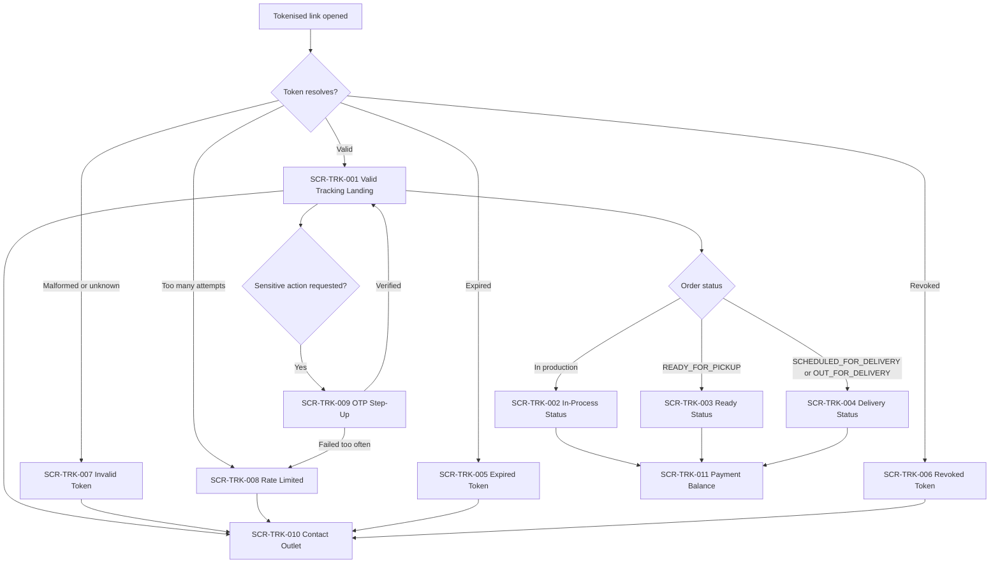

# Public Tracking Portal — Information Architecture

**Surface:** Portal Tracking Publik (browser-based, **no app installation required**)
**Roadmap step delivering this surface:** Step 7 — Customer Tracking and WhatsApp
**Step 2 status:** IN PROGRESS
**Implementation status:** NOT IMPLEMENTED
**Backend runtime:** ABSENT

> **Documentation is not implementation.** No portal, no token issuance, and no rate limiting exists.

Accessibility posture: **DESIGNED TO MEET WCAG 2.2 AA REQUIREMENTS — NOT YET RUNTIME-TESTED**

---

## 1. Persona and purpose

| Item | Value |
|---|---|
| Primary persona | **P-12 Customer** |
| Secondary personas | **P-13 Corporate Customer Contact**, **P-14 Authorized Order Recipient** |
| Authentication | None for safe information (`TRK-013`). OTP step-up only for a sensitive action |
| Device assumption | A cheap Android phone on mobile data, opening a WhatsApp link |
| Design bias | Light, fast, and immediately legible |

This portal is a **product differentiator** and is protected as one. It is **never** degraded into
"install the app first" (`TRK-025`). The Customer Android app does not replace it (DEC-0014).

This is the **most exposed surface in the product**. It is modelled as a hostile-traffic endpoint:
high-entropy hashed tokens, rate limiting, enumeration protection, `noindex`, and masked personal
data.

---

## 2. Top-level navigation

The portal has **no navigation menu**. It is a single-purpose page reached by a tokenised link.

| Destination | Reached by | Screen |
|---|---|---|
| Status page | The tokenised link itself | `SCR-TRK-001` … `SCR-TRK-004` |
| Contact outlet | A single button on the status page | `SCR-TRK-010` |
| Payment balance detail | An expandable section on the status page | `SCR-TRK-011` |
| OTP step-up | Only when a sensitive action is requested | `SCR-TRK-009` |
| Failure pages | Token state resolution | `SCR-TRK-005` … `SCR-TRK-008` |

There is deliberately **no search box, no order lookup by order number, and no login**. A lookup form
would be an enumeration surface; the token is the only way in.

## 3. Secondary navigation

Within the status page, content is a single vertical scroll in a fixed priority order:

1. **Primary status** — above the fold, always, on the smallest supported viewport.
2. Order reference, shown safely (`AL-2026-000123`).
3. Masked customer name (`Budi S.`).
4. Timeline of statuses reached, with timestamps in outlet local time.
5. Estimated readiness, clearly labelled an estimate.
6. Payment balance summary, in integer Rupiah.
7. Pickup or delivery schedule where one exists.
8. Contact outlet button.
9. Privacy notice.

---

## 4. Navigation diagram

---

## 5. Role visibility

The portal serves **unauthenticated visitors holding a valid token**. There are no roles on this
surface, and no staff view of it. Staff use Ops Android or Console Web.

| Viewer | What they get |
|---|---|
| Holder of a valid token | The safe projection of one order |
| Holder of an expired token | `SCR-TRK-005` and a way to request a new link |
| Holder of a revoked token | `SCR-TRK-006` and the outlet contact |
| Anyone else | `SCR-TRK-007` — indistinguishable from an unknown token, so existence is not leaked |
| A search-engine crawler | Nothing indexable; `noindex` is mandatory on every portal response |

## 6. Tenant context

The portal shows the **brand and outlet** that owns the order, because a customer needs to know which
laundry they are looking at. It never shows tenant identifiers, tenant configuration, or anything
about any other tenant.

- A token is scoped to exactly one order in exactly one tenant.
- **The portal never shows other orders belonging to the same customer** (`TRK-015`), in the same
  tenant or any other.
- A token from tenant A can never be traversed to tenant B. There is no navigation path that could
  attempt it.

## 7. Outlet context

Outlet name and public contact channel are displayed. Outlet address is displayed only if the tenant
has published it as a public business address — never the customer's address.

If the outlet is inactive, the portal still shows the order status and routes contact to the
tenant-level channel.

## 8. Deep links

| Pattern | Target | Notes |
|---|---|---|
| `/t/{token}` | Status page | The only entry point. The token is high-entropy, is **never** the order number, and is not derivable from it |
| `/t/{token}#pembayaran` | Payment balance section | Fragment only; no separate authorisation |
| `/t/{token}/kontak` | Contact outlet | — |

Deep-link rules:

1. The **plaintext token exists only in the link**. Only its hash is stored server-side.
2. The token is **never** placed in analytics, telemetry, logs, referrer headers, or any event
   payload. Outbound links carry `noreferrer`.
3. Every response carries `noindex, nofollow`.
4. Token lookup is rate-limited and enumeration-protected (`TRK-007`).
5. Revocation takes effect immediately (`TRK-004`), and re-issuing access revokes the prior token and
   records why (`TRK-023`).

## 9. Back behaviour

- Browser back from the payment section returns to the status page; back from the status page leaves
  the site, as any single-page site should.
- The token is not re-requested on back navigation in a way that consumes rate-limit budget
  unnecessarily; a cached render is reused within a short window and labelled with its fetch time.
- After OTP step-up, back returns to the status page and **does not** replay or reveal the OTP.

## 10. Unsaved-change behaviour

The portal has one input: the OTP field on `SCR-TRK-009`. A partially entered OTP is discarded on
navigation without a prompt, because retaining a partially entered credential is worse than losing
it. Nothing else on this surface holds user input, so there is no other unsaved-change case.

## 11. Offline behaviour

The portal is server-rendered content over a network. When the network is unavailable:

- A previously opened status page may be shown from the browser cache, marked `UXS-020 Stale Data`
  with the exact fetch time in outlet local time.
- **A cached page never shows a payment balance as current.** The balance section collapses to a
  "belum dapat dimuat" state rather than showing a stale number that a customer might act on.
- The contact-outlet action remains available because it hands off to the phone or messaging app.

## 12. Loading, error, permission-denied, and recovery

| Condition | State ID | Screen | Behaviour and recovery |
|---|---|---|---|
| Resolving token | `UXS-001 Loading` | — | A minimal skeleton; the page must be usable on a slow connection, so the primary status renders first |
| Order has no timeline entries yet | `UXS-002 Empty` | `SCR-TRK-002` | Explains that the laundry has been received and processing has not started |
| Lookup failed | `UXS-003 Error` | — | Offers retry and *Hubungi Outlet* |
| Expired | `UXS-003` variant | `SCR-TRK-005` | Explains expiry in plain Bahasa Indonesia and offers *Minta tautan baru* through the outlet |
| Revoked | `UXS-003` variant | `SCR-TRK-006` | States that access was withdrawn and offers *Hubungi Outlet*; never states why in a way that leaks |
| Invalid | `UXS-003` variant | `SCR-TRK-007` | Generic, identical to unknown-token, offers *Hubungi Outlet* |
| Rate limited | `UXS-017 Rate Limited` | `SCR-TRK-008` | States when to retry in plain language and offers *Hubungi Outlet* |
| Maintenance | `UXS-018 Maintenance` | — | States the window in outlet local time |

**Every failure state has a recovery path**, and that path is always human: contact the outlet. A
customer is never left on a page whose only content is a refusal.

## 13. What this surface must never show

`TRK-010`, `TRK-011`, and the data classification rules make these absolute:

- **Never** a full phone number. Never a full address (`TRK-010`).
- **Never** an unmasked customer name — `Budi S.`, not the full name (`TRK-011`).
- **Never** an internal note, a staff comment, or a rework reason written for internal use.
- **Never** a cost price, a margin, a discount rationale, or any tenant financial internal.
- **Never** employee identity beyond operational necessity (an outlet name, not a personal phone).
- **Never** an audit record.
- **Never** a condition photograph, a proof-of-delivery photograph, or a signature. These are
  `RESTRICTED` and are served only through signed expiring URLs to authorised staff.
- **Never** another order of the same customer (`TRK-015`).
- **Never** the token value in analytics, telemetry, logs, or a referrer.

## 14. Responsive behaviour

| Breakpoint | Layout |
|---|---|
| compact `<600px` | The design target. Primary status above the fold on a 360×640 viewport; single column; text-first |
| medium `600–1023px` | Single centred column, width-capped for readability |
| expanded `1024–1439px` | Centred column with the timeline and payment summary side by side |
| wide `>=1440px` | As expanded; the page never stretches to full width |

Status is conveyed by **text and icon as well as colour**, so a colour-blind customer on a bright
street can still read it.

---

## 15. Related documents

- [`../SCREEN_INVENTORY.md`](../SCREEN_INVENTORY.md)
- [`../TRACKING_PORTAL_UX.md`](../TRACKING_PORTAL_UX.md)
- [`../UX_STATE_MODEL.md`](../UX_STATE_MODEL.md)

## 16. Status

| Item | Status |
|---|---|
| Step 2 — Design System and UX Foundation | **IN PROGRESS** |
| Public tracking portal | **NOT IMPLEMENTED** |
| Token issuance and revocation | **NOT IMPLEMENTED** |
| Rate limiting | **NOT IMPLEMENTED** |
| Backend runtime | **ABSENT** |

`GO` is conferred by the repository owner and is never self-declared.
