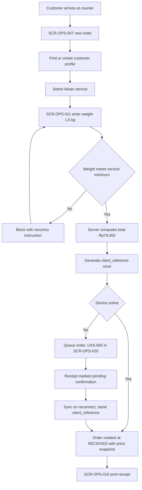
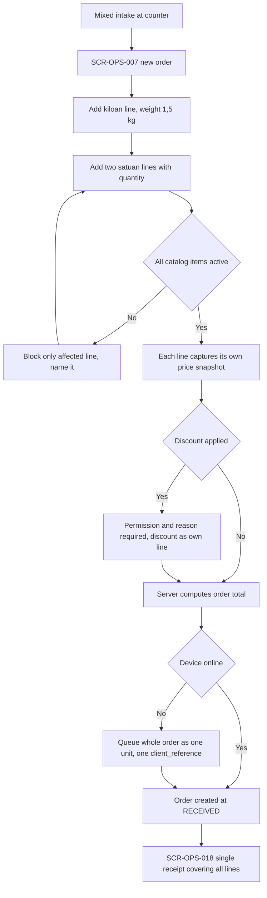
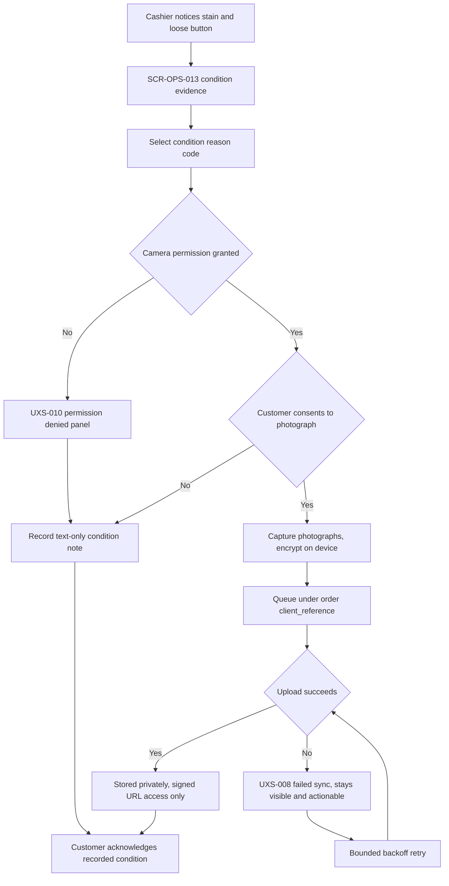
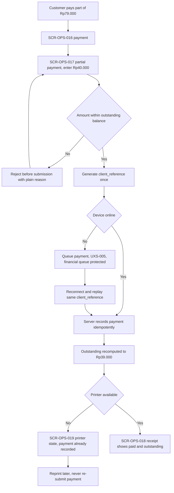

# Counter and POS Journeys

Step 2 — Design System and UX Foundation. Cluster file for **JRN-004**, **JRN-005**, **JRN-006**,
**JRN-007**.

Index and full specification tables: [`../CRITICAL_JOURNEYS.md`](../CRITICAL_JOURNEYS.md).
Screen definitions: [`../SCREEN_INVENTORY.md`](../SCREEN_INVENTORY.md).

## Purpose

To describe what happens at the counter of Outlet Cempaka: intake of kiloan and mixed orders, recording
the condition of items before they are accepted into custody, and taking payment. The counter is busy and
the queue is physical, so the common path must be the fastest path — and every money figure must be
correct the first time.

All example data is fictional: cashier "Siti Rahmawati", customer "Budi Santoso", order
`AL-2026-000123`, outlet "Outlet Cempaka", tenant "Laundry Bersih Sejahtera".

## Status block

| Item | Status |
|---|---|
| Step 2 — Design System and UX Foundation | **IN PROGRESS** |
| JRN-004, JRN-005, JRN-006, JRN-007 | **NOT IMPLEMENTED** |
| Backend runtime | **ABSENT** |
| Flutter workspace | **ABSENT** |
| Application CI | **NOT APPLICABLE** |
| UAT | **NOT STARTED** |
| Accessibility | **DESIGNED TO MEET WCAG 2.2 AA REQUIREMENTS — NOT YET RUNTIME-TESTED** |

Documentation is not implementation. `GO` is owner-conferred.

## JRN-004 — Cashier creates kiloan order

Siti Rahmawati receives a bag of laundry, weighs it at `1,5 kg`, and creates a weight-based order. The
total of `Rp79.000` is computed on the server in integer Rupiah; the figure shown on the device is a
display of the server's answer, never a substitute for it. At creation the order captures a price
snapshot, so a later change to the master price list can never retroactively alter this order, its
invoice, or a reprint. A `client_reference` is generated once at this point and travels with the
operation for its whole life. Where the connection is unavailable the order is queued and the receipt is
marked as pending confirmation rather than presented as final. The cashier sees the POS entry because it
is useful, not because visibility grants permission — the backend verifies membership and permission on
the create call from Step 3 onward.

## JRN-005 — Cashier creates mixed order

Budi Santoso brings both kiloan laundry and two satuan items, so one order carries lines of different
kinds. Each line captures its own price snapshot at creation; the order total is the server's sum of
those lines and is never assembled on the device. If the cashier applies a discount it requires a
permission and a recorded reason, and it appears as its own line rather than being folded invisibly into
a unit price — a discount hidden inside a price is a reconciliation problem three weeks later. An
inactive catalog item blocks only its own line and names which line needs attention, leaving the rest of
the intake intact. Offline, the whole multi-line order is queued as a single unit under one
`client_reference`; splitting lines across queue entries would let a partial order reach the server.
After confirmation, corrections follow the reversal and adjustment path rather than a silent edit.

## JRN-006 — Cashier records condition and photo

Siti Rahmawati notices a stain and a loose button and records the condition before the item enters
custody. She selects a reason code, captures photographs, and adds a short note; the customer
acknowledges the record at the counter. Laundry photographs are RESTRICTED data — they can show the
inside of a customer's home or personal garments — so they are stored in private object storage, served
only through signed expiring URLs, tenant-scoped, and never shown on the public tracking portal. If the
customer declines photography, the cashier records the condition with a reason code and no photograph,
and the absence is recorded explicitly rather than left to inference. A denied camera permission renders
the permission-denied state and the intake still proceeds with a text-only condition note. Offline,
photographs are stored encrypted on device and queued under the order's `client_reference`; the queue
survives an app kill and a failed upload stays visible rather than being dropped.

## JRN-007 — Cashier takes partial payment

Budi Santoso pays `Rp40.000` of an `Rp79.000` order and will settle `Rp39.000` on collection. The payment
carries a `client_reference` generated once, and the server records it idempotently: a retry with that
same reference returns the original payment rather than creating a second one. An amount larger than the
outstanding balance is rejected before submission with a plain explanation. If the printer fails after
the payment is recorded, the printer-state screen appears — but the payment already exists and is never
re-submitted merely to obtain a printout, which is exactly how duplicate payments are born. Offline the
payment queues as pending sync, and the financial queue is never cleared by a cache clear, a logout, or a
version upgrade. An order is never marked paid on a client claim; corrections are made by reversal or
adjustment entries recording actor, timestamp, amount, and reason.

