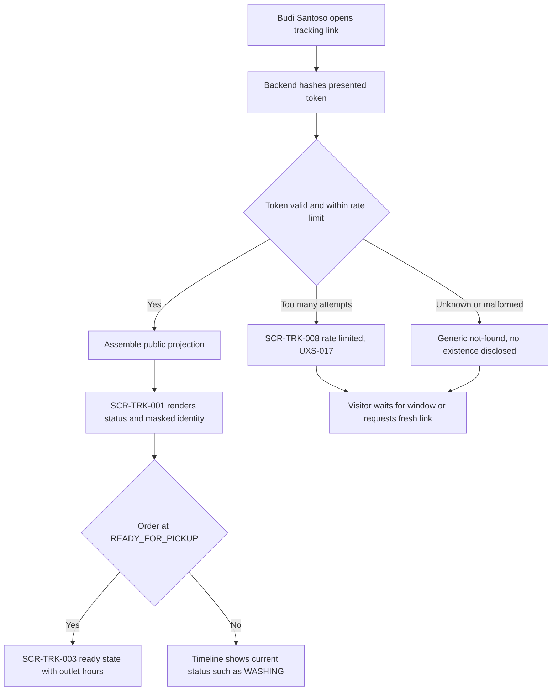
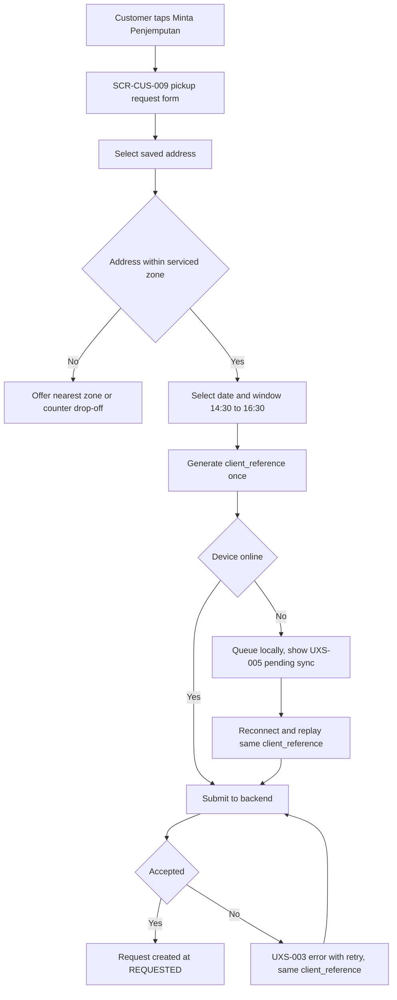
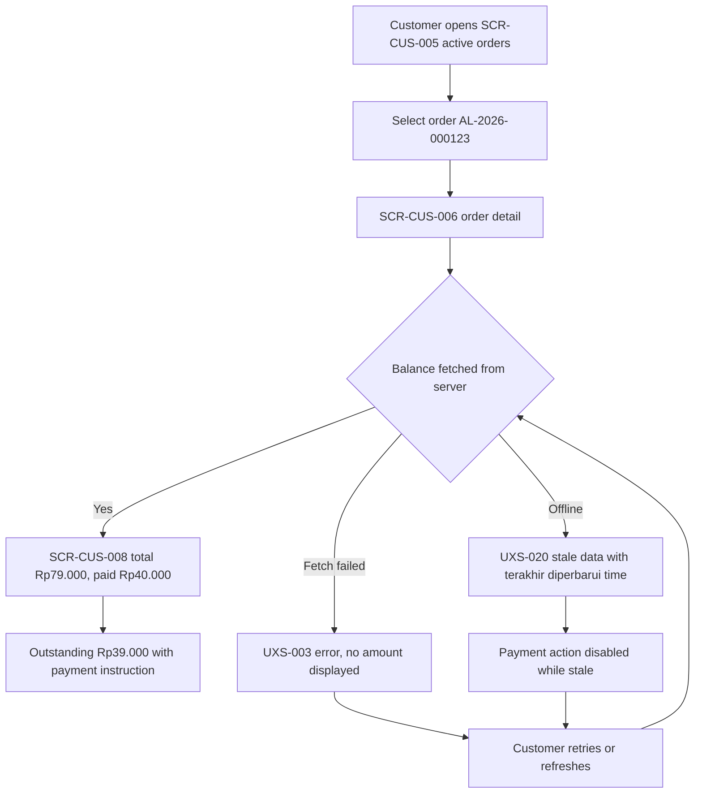

# Customer Self-Service Journeys

Step 2 — Design System and UX Foundation. Cluster file for **JRN-001**, **JRN-002**, **JRN-003**.

Index and full specification tables: [`../CRITICAL_JOURNEYS.md`](../CRITICAL_JOURNEYS.md).
Screen definitions: [`../SCREEN_INVENTORY.md`](../SCREEN_INVENTORY.md).

## Purpose

To describe the journeys a customer of a laundry tenant performs without any staff assistance: reading a
public tracking link, requesting a pickup, and understanding what is still owed. These three journeys
carry the product's public reputation, because they are the surfaces a customer meets alone.

All example data is fictional: customer "Budi Santoso", masked phone `0812-XXXX-1234`, order
`AL-2026-000123`, outlet "Outlet Cempaka", tenant "Laundry Bersih Sejahtera".

## Status block

| Item | Status |
|---|---|
| Step 2 — Design System and UX Foundation | **IN PROGRESS** |
| JRN-001, JRN-002, JRN-003 | **NOT IMPLEMENTED** |
| Backend runtime | **ABSENT** |
| Flutter workspace | **ABSENT** |
| Application CI | **NOT APPLICABLE** |
| UAT | **NOT STARTED** |
| Accessibility | **DESIGNED TO MEET WCAG 2.2 AA REQUIREMENTS — NOT YET RUNTIME-TESTED** |

Documentation is not implementation. `GO` is owner-conferred.

## JRN-001 — Customer opens tracking link

Budi Santoso receives a tracking link for order `AL-2026-000123` and opens it in a browser without
installing anything. The public tracking portal is deliberately app-free; requiring an install would
degrade the product's clearest differentiator. The backend hashes the presented token, checks it against
the stored hash, and applies rate limiting before assembling anything. What renders is a narrow public
projection: canonical order status, a masked identity such as `0812-XXXX-1234`, and a timeline. The
projection never contains a full address, an internal note, a cost, or a margin, and the page is
`noindex`. An unknown or malformed token yields a generic result that does not reveal whether the order
exists, because distinguishing the two cases would hand an attacker an enumeration oracle. Excess
attempts land on the rate-limited state rather than continuing to answer.

## JRN-002 — Customer requests pickup

Budi Santoso opens the Customer Android app and asks Outlet Cempaka to collect laundry from a saved
address. The app generates a `client_reference` once, before the request is attempted, and reuses that
same reference on every retry. If the address falls outside a serviced zone the app offers the nearest
serviced zone and counter drop-off rather than failing silently, because a dead end at this point loses
the customer entirely. A successful submission creates exactly one pickup request at `REQUESTED`. Where
connectivity is unavailable the request is queued locally and shown as pending sync; when the network
returns, the queued entry replays with its original reference and the server returns the original result
instead of creating a second request. A customer-supplied tenant identifier is never authorization proof;
the backend validates the request against the authenticated customer's own profile within one tenant.

## JRN-003 — Customer sees unpaid balance

Budi Santoso opens order `AL-2026-000123` and wants one plain fact: how much is still owed. The total is
`Rp79.000`, `Rp40.000` has been paid, and `Rp39.000` remains outstanding. Every one of those figures is
integer Rupiah computed and held authoritatively on the server; the client display is presentational
only, and a client-computed total is never treated as truth. If the current balance cannot be fetched,
the app shows an error state and displays no amount at all, because a wrong number here is worse than no
number. A cached figure may be shown only when it is explicitly labelled stale, with a "terakhir
diperbarui" timestamp in outlet timezone, and no payment may be initiated from a stale figure. The
customer sees only their own orders within one tenant; the same phone number registered at a different
tenant is an unrelated profile and is never merged.

