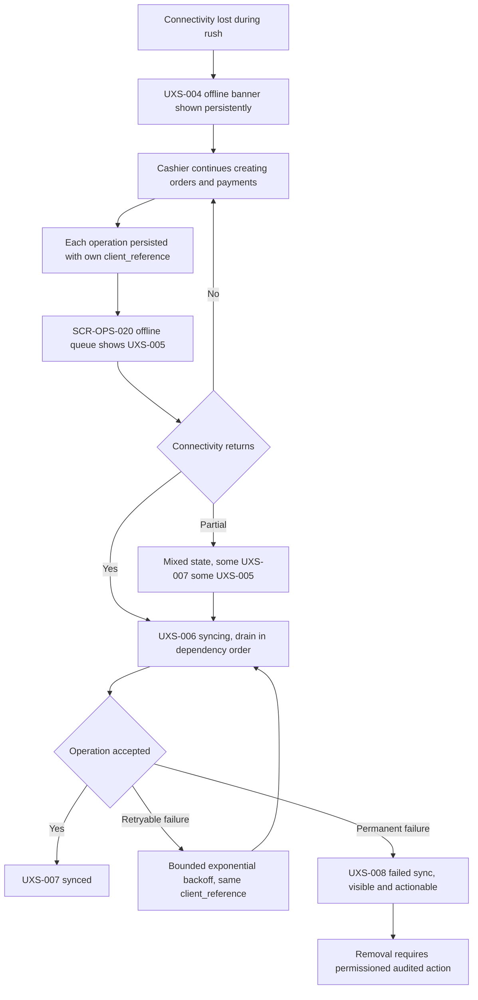
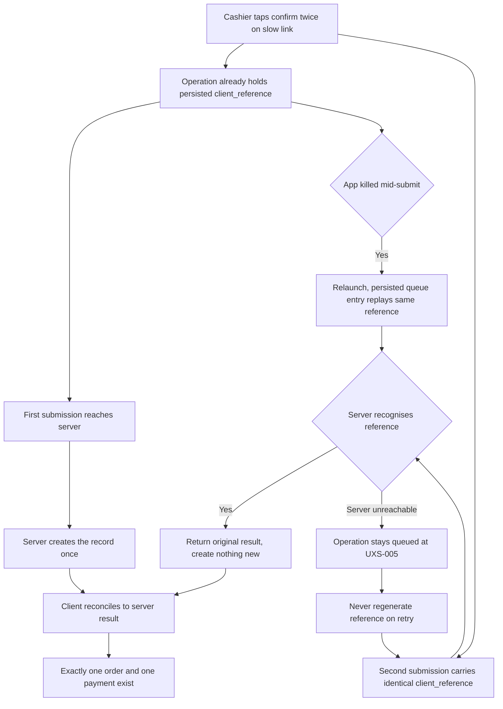
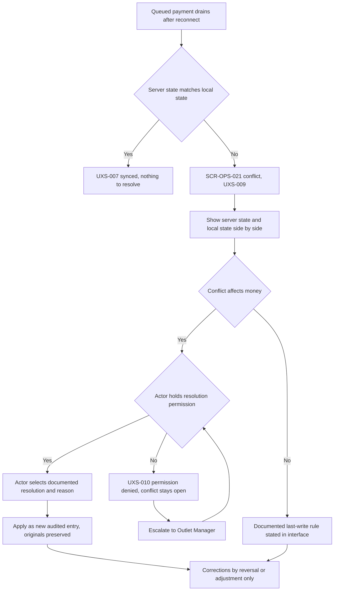

# Offline and Sync Journeys

Step 2 — Design System and UX Foundation. Cluster file for **JRN-008**, **JRN-009**, **JRN-032**.

Index and full specification tables: [`../CRITICAL_JOURNEYS.md`](../CRITICAL_JOURNEYS.md).
Screen definitions: [`../SCREEN_INVENTORY.md`](../SCREEN_INVENTORY.md).

## Purpose

To describe how the Ops Android surface behaves when the network is unreliable: continuing to take orders
and payments offline, refusing to create duplicates when an operation is retried, and surfacing a
conflict to a human rather than picking a winner. These journeys define the highest-risk behaviour in the
product, because a connectivity problem must never become a money problem.

All example data is fictional: cashier "Siti Rahmawati", order `AL-2026-000123`, outlet "Outlet Cempaka",
tenant "Laundry Bersih Sejahtera".

## Status block

| Item | Status |
|---|---|
| Step 2 — Design System and UX Foundation | **IN PROGRESS** |
| JRN-008, JRN-009, JRN-032 | **NOT IMPLEMENTED** |
| Backend runtime | **ABSENT** |
| Flutter workspace | **ABSENT** |
| Application CI | **NOT APPLICABLE** |
| UAT | **NOT STARTED** |
| Accessibility | **DESIGNED TO MEET WCAG 2.2 AA REQUIREMENTS — NOT YET RUNTIME-TESTED** |

Documentation is not implementation. `GO` is owner-conferred.

## JRN-008 — Cashier works offline

Connectivity drops at Outlet Cempaka during the morning rush and the counter cannot stop. The app shows
the offline state persistently — offline and sync state are visible at all times, never hidden behind a
menu — and the cashier keeps creating orders and taking payments. Each operation is persisted with its
own `client_reference` and appears in the offline queue as pending sync. When connectivity returns the
queue drains in dependency order: an order is created before its payment, and a payment whose order
failed does not jump ahead. Partial connectivity produces a mixed queue state rather than an aggregate
"all good", because a false all-clear is how a missing payment goes unnoticed until reconciliation. A
permanently failing operation shows the failed-sync state with its reason and stays visible and
actionable; it is never silently dropped. Local data is separated per tenant and per user and is
encrypted on device.

## JRN-009 — Duplicate submission prevented

Siti Rahmawati taps confirm twice on a slow connection, and then the app restarts mid-submit. The
`client_reference` was generated once and persisted with the operation, so both the double tap and the
post-restart replay carry the identical reference. The server recognises the repeated reference and
returns the original result instead of creating a second record — idempotency is a server contract, not a
client convention. The client then reconciles to whatever the server says, because the server is the
final source of truth. If the server cannot be reached at all, the operation simply stays queued; the
client never regenerates the reference to force a fresh attempt, which is the single highest-risk bug
class in the whole offline design. The outcome the cashier must see is one order and one payment. A
duplicate order or duplicate payment produced by a retry would be an automatic NO-GO.

## JRN-032 — Sync conflict requires user action

A queued payment for order `AL-2026-000123` reaches the server, which already holds a different payment
state for that order because another device recorded one at the counter. The divergence is surfaced, not
resolved: the conflict screen shows the server state and the local state side by side, with amounts in
integer Rupiah and timestamps in outlet timezone, so a human can see exactly what differs. The cashier
chooses a documented resolution and records a reason, and the resolution is applied as a new audited
entry rather than by overwriting anything. A conflict affecting money is a human decision; a conflict
touching only non-financial metadata may use a documented last-write rule, and that rule is stated in the
interface rather than assumed. If the cashier lacks the permission to resolve a financial conflict, the
permission-denied state is shown and the conflict stays open and visible for the outlet manager. The
original records are preserved; corrections are reversal or adjustment entries.

