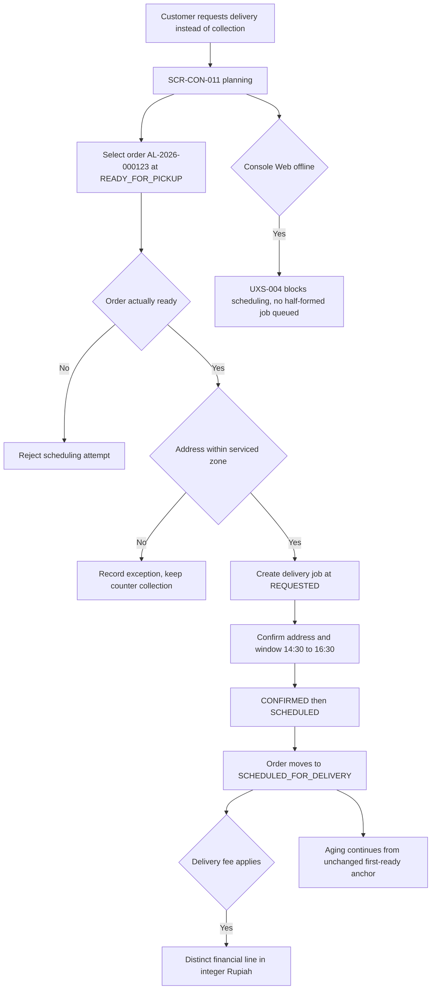
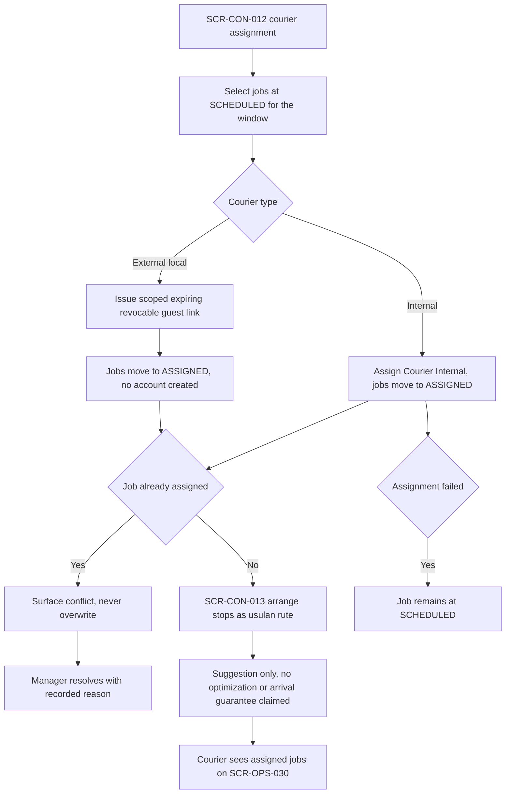
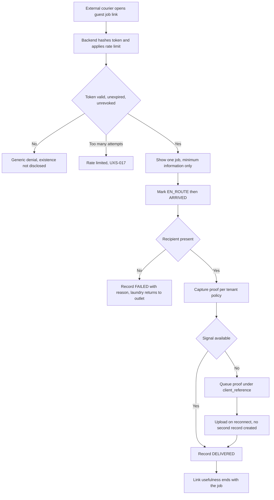
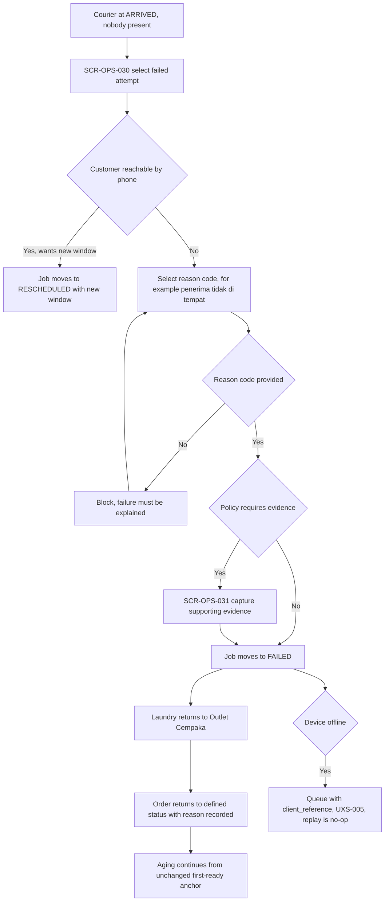
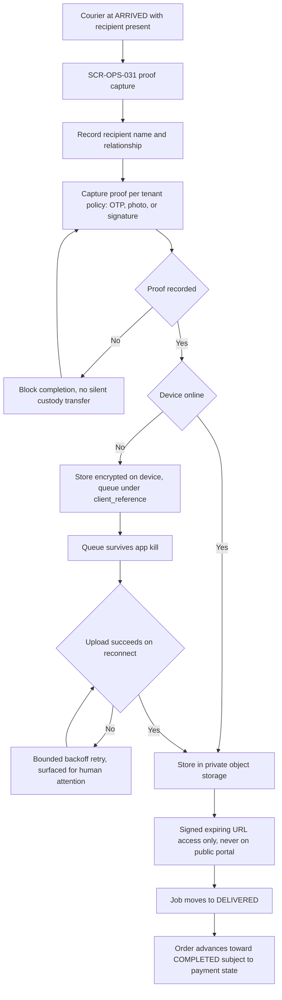
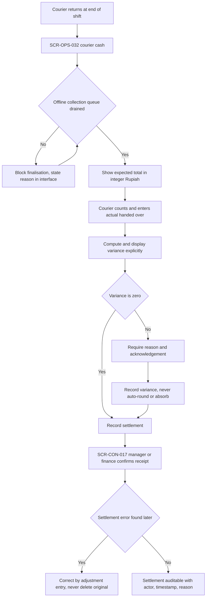

# Pickup and Delivery Journeys

Step 2 — Design System and UX Foundation. Cluster file for **JRN-017**, **JRN-018**, **JRN-019**,
**JRN-020**, **JRN-021**, **JRN-022**.

Index and full specification tables: [`../CRITICAL_JOURNEYS.md`](../CRITICAL_JOURNEYS.md).
Screen definitions: [`../SCREEN_INVENTORY.md`](../SCREEN_INVENTORY.md).

## Purpose

To describe scheduling, courier assignment, external courier access, custody proof, and cash
reconciliation. This area introduces the two riskiest operational surfaces in the product: physical
custody of a customer's belongings, and cash held by a courier.

Two constraints govern the whole cluster. **Route ordering is a suggestion — "usulan rute". No route
optimization, no guaranteed arrival time, and no delivery guarantee is claimed anywhere.** And **no
custody transfer is recorded without proof appropriate to the tenant's configured policy.**

All example data is fictional: customer "Budi Santoso", order `AL-2026-000123`, outlet "Outlet Cempaka",
tenant "Laundry Bersih Sejahtera".

## Status block

| Item | Status |
|---|---|
| Step 2 — Design System and UX Foundation | **IN PROGRESS** |
| JRN-017 … JRN-022 | **NOT IMPLEMENTED** |
| Backend runtime | **ABSENT** |
| Flutter workspace | **ABSENT** |
| Application CI | **NOT APPLICABLE** |
| UAT | **NOT STARTED** |
| Accessibility | **DESIGNED TO MEET WCAG 2.2 AA REQUIREMENTS — NOT YET RUNTIME-TESTED** |

Documentation is not implementation. `GO` is owner-conferred.

## JRN-017 — Manager converts pickup to delivery

Budi Santoso asks for the finished laundry to be delivered rather than collected, so the outlet manager
creates a delivery job for order `AL-2026-000123`. The job passes through `REQUESTED` and `CONFIRMED` to
`SCHEDULED` with a confirmed address and a time window such as `14:30`–`16:30`, and the order moves to
`SCHEDULED_FOR_DELIVERY`. Where the address falls outside a serviced zone the manager records the
exception and leaves the order at `READY_FOR_PICKUP` for counter collection rather than scheduling
something the outlet cannot fulfil. Any delivery fee is a distinct financial line in integer Rupiah,
never folded into the service price. The customer address is RESTRICTED and is exposed only as far as
scheduling genuinely requires. Aging on the underlying order continues from its unchanged first-ready
anchor throughout.

## JRN-018 — Manager assigns courier

The manager gathers the afternoon window's scheduled jobs and assigns a courier, moving each job to
`ASSIGNED`. The stops are then arranged into a **usulan rute** — a suggested ordering that a human can
override at any time. The product does not claim optimal routing, guaranteed arrival, or algorithmic
delivery guarantees, and the interface language reflects that: it suggests, it does not promise. An
external local courier may be assigned instead of an internal one, in which case they receive a scoped,
expiring, revocable guest job link rather than an account. Assigning a job that is already assigned
surfaces the conflict rather than overwriting it, so two couriers never believe they hold the same
parcel. Assignment may be changed with a recorded reason before the job reaches `EN_ROUTE`.

## JRN-019 — External courier uses guest job

An external local courier opens a guest job link for exactly one assigned delivery. The token is
high-entropy, stored hashed server-side, expiring and revocable, and it is neither the order number nor
derivable from it. What the link exposes is the minimum needed to complete that one job: it grants no
access to customer history, other orders, pricing, or any other tenant data, and it never shows a full
customer address in a shareable or indexable form. The courier progresses the job through `EN_ROUTE` and
`ARRIVED`, captures proof, and records `DELIVERED`. A courier working for two tenants gets two unrelated
links and can never traverse from one to the other. An expired or revoked token yields a generic denial
that does not reveal whether the job exists, and repeated attempts are rate limited. The manager may
revoke the link at any time, with immediate effect.

## JRN-020 — Courier records failed attempt

The courier arrives at the delivery address and nobody is there to receive the laundry. A failed delivery
is a first-class outcome, not an exception: the courier selects a reason code such as "penerima tidak di
tempat", captures supporting evidence where tenant policy requires it, and the job moves to `FAILED`. The
laundry returns to Outlet Cempaka and the order returns to a defined status with that reason recorded, so
the physical custody outcome is never ambiguous. A failed attempt without a reason code is blocked — a
failure must be explained, not merely marked, because the reason is the data that prevents the next
failure. If the customer answers and asks for another window the job moves to `RESCHEDULED` instead.
Offline the outcome queues under its `client_reference` and replays as a no-op if already applied. The
courier sees only their own assigned jobs; addresses of unrelated jobs are never visible.

## JRN-021 — Courier records proof

The courier hands the laundry to an authorised recipient and records proof of delivery. The tenant's
policy defines which methods are acceptable — OTP, photograph, signature, recipient name — but *some*
recorded proof is always required, and missing proof blocks completion. A parcel does not silently change
hands. Where the recipient is a neighbour designated by the customer, the courier records the recipient
name and relationship as part of the proof rather than leaving the handover unattributed. Proof artifacts
are RESTRICTED: they are stored in private object storage, served only through signed expiring URLs,
tenant-scoped, and never exposed on the public tracking portal. Offline, artifacts are stored encrypted
on device and queued under the job's `client_reference`; the queue survives an app kill and a failed
upload is retried under bounded backoff and surfaced for human attention rather than dropped.

## JRN-022 — Courier reconciles COD

The courier returns to Outlet Cempaka at the end of the shift holding cash collected on delivery. The
expected total for the shift is shown in integer Rupiah, the courier counts and enters the actual amount
handed over, and the variance is computed and displayed explicitly. A non-zero variance requires a reason
and an acknowledgement; it is never auto-rounded, absorbed, or written off silently, because a hidden
discrepancy is fraud-shaped while a visible one is a feature. Cash collection is a financial transaction
and inherits every financial rule: integer Rupiah, idempotency, no hard deletion, corrections by reversal
or adjustment with actor, timestamp, and reason. Settlement cannot be finalised until any offline
collection queue has drained, and the interface says so rather than presenting an incomplete expected
figure as final. The manager or finance confirms receipt and the settlement is recorded and auditable.

