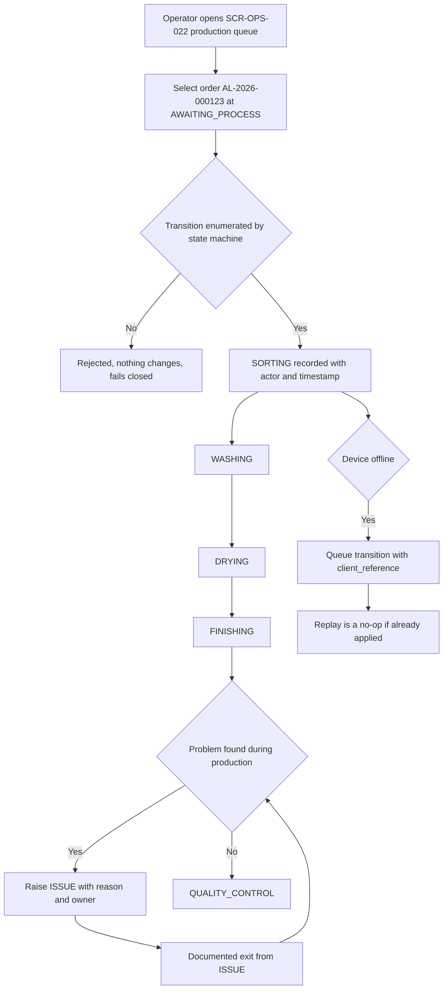
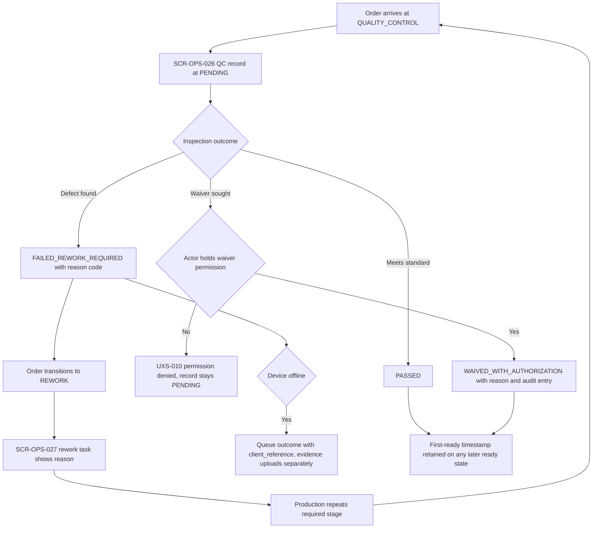
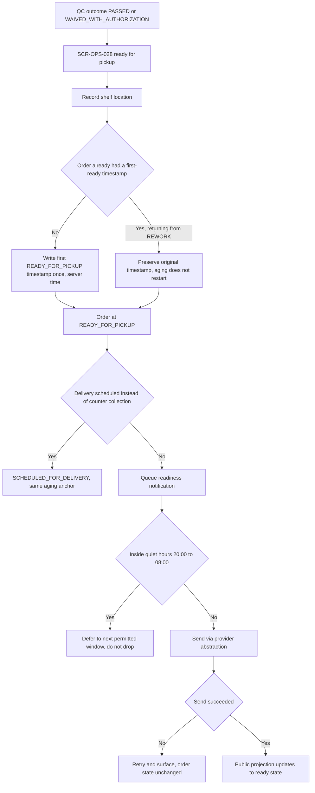

# Production and Quality Control Journeys

Step 2 — Design System and UX Foundation. Cluster file for **JRN-010**, **JRN-011**, **JRN-012**.

Index and full specification tables: [`../CRITICAL_JOURNEYS.md`](../CRITICAL_JOURNEYS.md).
Screen definitions: [`../SCREEN_INVENTORY.md`](../SCREEN_INVENTORY.md).

## Purpose

To describe how an order moves through the production floor and quality control, and how it becomes ready
for collection. Order status is the spine of the product — production reads it, tracking displays it,
aging is anchored to it, notifications fire from it, and reporting counts it — so these journeys are
written in terms of enumerated transitions only.

All example data is fictional: order `AL-2026-000123`, outlet "Outlet Cempaka", tenant "Laundry Bersih
Sejahtera".

## Status block

| Item | Status |
|---|---|
| Step 2 — Design System and UX Foundation | **IN PROGRESS** |
| JRN-010, JRN-011, JRN-012 | **NOT IMPLEMENTED** |
| Backend runtime | **ABSENT** |
| Flutter workspace | **ABSENT** |
| Application CI | **NOT APPLICABLE** |
| UAT | **NOT STARTED** |
| Accessibility | **DESIGNED TO MEET WCAG 2.2 AA REQUIREMENTS — NOT YET RUNTIME-TESTED** |

Documentation is not implementation. `GO` is owner-conferred.

## JRN-010 — Operator processes production queue

The production operator opens the outlet queue and works order `AL-2026-000123` from `AWAITING_PROCESS`
through `SORTING`, `WASHING`, `DRYING`, and `FINISHING` to `QUALITY_CONTROL`. Every transition records
actor, timestamp, and outlet, and every transition is one the state machine enumerates — a transition
that is not documented is forbidden, and there is no generic client-controlled "set status" operation.
Orders may be batched through a stage together for speed, but each order still records its own transition
entries rather than sharing one, because shared entries destroy the audit trail. A damaged item is raised
as `ISSUE`, which is a real state with a reason and an owner and documented exits, not an error screen.
Offline, transitions queue under their `client_reference` and replay idempotently; a replayed transition
that already applied is a no-op, not a second application. An incorrect transition is corrected through a
documented corrective path with permission, reason, and audit.

## JRN-011 — QC fails and creates rework

Quality control inspects order `AL-2026-000123` and finds a remaining stain, so the QC record moves from
`PENDING` to `FAILED_REWORK_REQUIRED` with a reason code and optional evidence, and the order transitions
to `REWORK`. The rework screen shows the task with its reason so the floor knows what to redo rather than
guessing. A waiver is the alternative outcome and it is deliberately expensive: `WAIVED_WITH_AUTHORIZATION`
requires an explicit permission, a recorded reason, and an audit entry, and a silent waiver is a defect.
An operator attempting a waiver without the permission sees the permission-denied state, and the QC
record stays `PENDING` with nothing written — client-side control visibility is not authorization. QC
evidence is RESTRICTED and private. Crucially, when the order later reaches `READY_FOR_PICKUP` a second
time, the original first-ready timestamp is retained and the aging clock does not restart.

## JRN-012 — Order becomes ready for pickup

QC passes the order, the operator records a shelf location, and the order transitions to
`READY_FOR_PICKUP`. At that moment the **first** `READY_FOR_PICKUP` timestamp is written once and is
immutable thereafter; it is the anchor for all unclaimed-laundry aging and it never restarts, even if the
order returns to `REWORK` and becomes ready again. The server timestamp is authoritative for this anchor,
not the device clock, because device clocks are skewed. A readiness notification is queued subject to
quiet hours 20:00–08:00 outlet local time and to customer opt-out, and a messaging failure is retried and
surfaced but never blocks or reverses the transition — messaging never gates a status change. If the
order is scheduled for delivery instead, it moves to `SCHEDULED_FOR_DELIVERY` and the same first-ready
anchor still governs aging. The public tracking projection updates to the ready state and still contains
no full address, no internal note, and no cost.

