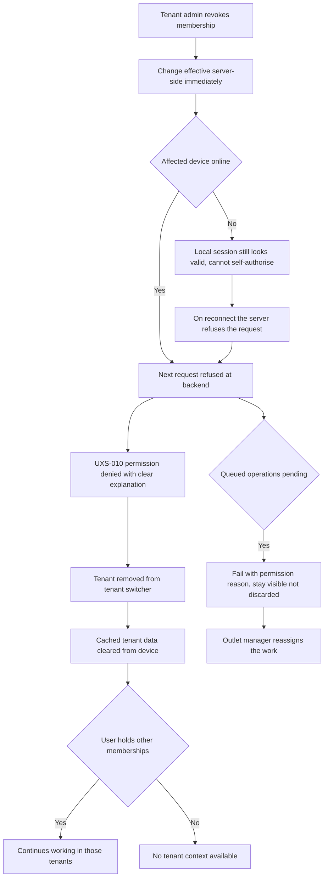
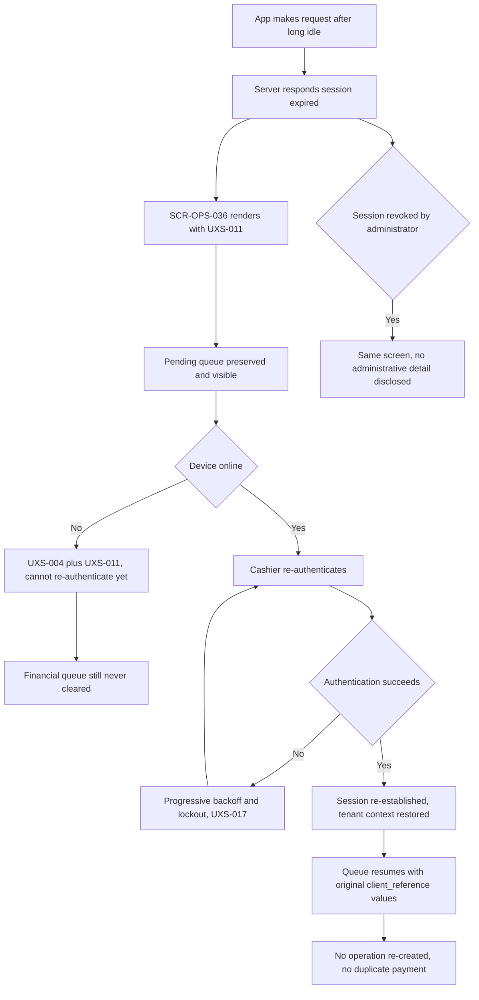
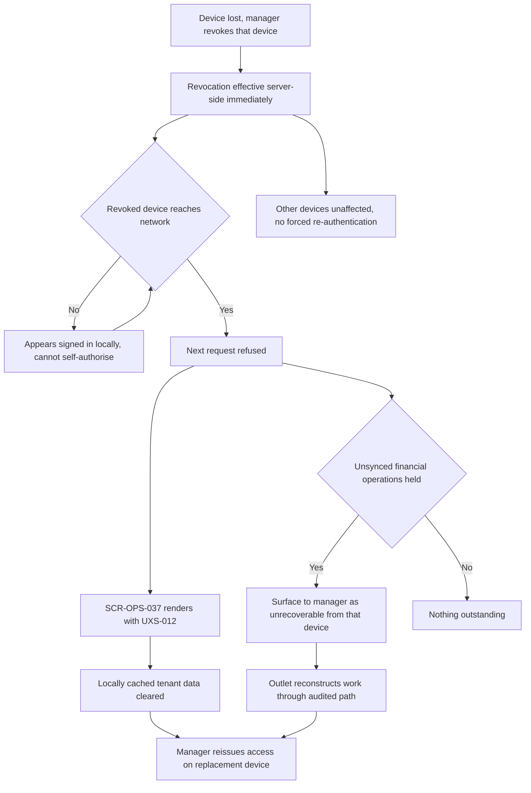
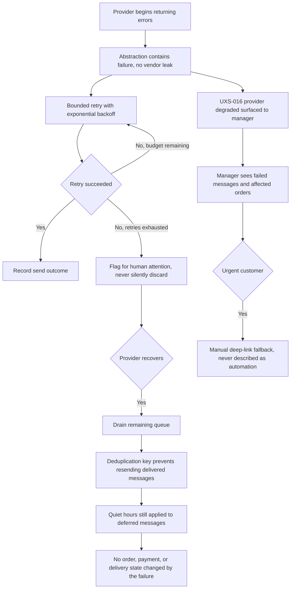
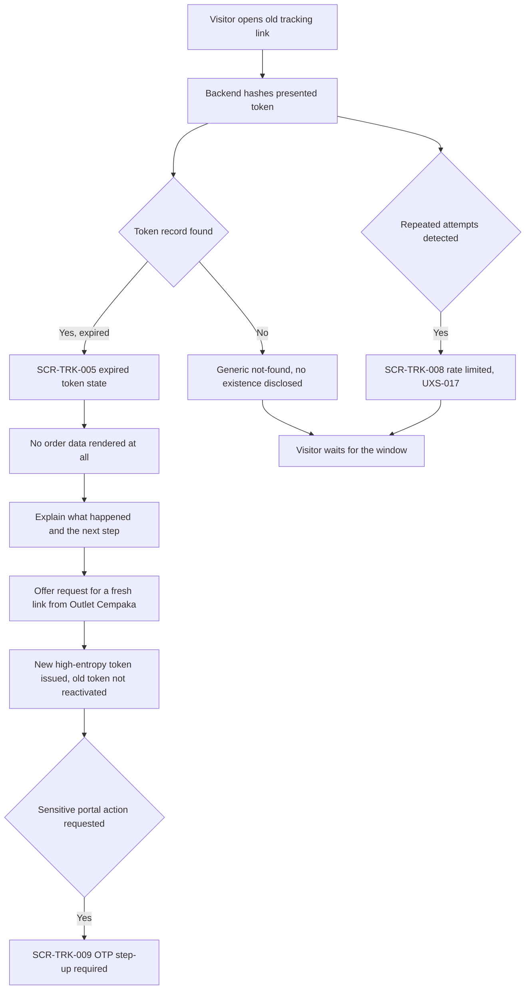
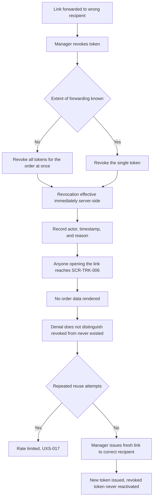

# Security and Failure Journeys

Step 2 — Design System and UX Foundation. Cluster file for **JRN-026**, **JRN-027**, **JRN-028**,
**JRN-029**, **JRN-030**, **JRN-031**.

Index and full specification tables: [`../CRITICAL_JOURNEYS.md`](../CRITICAL_JOURNEYS.md).
Screen definitions: [`../SCREEN_INVENTORY.md`](../SCREEN_INVENTORY.md).

## Purpose

To describe what a user experiences when access is withdrawn or a dependency fails: a revoked membership,
an expired session, a revoked device, a failing notification provider, and expired or revoked tracking
tokens. These are the journeys where a product either fails closed and explains itself, or fails open and
becomes an incident.

Two constraints govern the whole cluster. **Client-side menu visibility is not authorization** — the
backend is authoritative from Step 3 onward. And **a notification failure never changes business state.**

All example data is fictional: customer "Budi Santoso", cashier "Siti Rahmawati", order `AL-2026-000123`,
outlet "Outlet Cempaka", tenant "Laundry Bersih Sejahtera".

## Status block

| Item | Status |
|---|---|
| Step 2 — Design System and UX Foundation | **IN PROGRESS** |
| JRN-026 … JRN-031 | **NOT IMPLEMENTED** |
| Backend runtime | **ABSENT** |
| Flutter workspace | **ABSENT** |
| Application CI | **NOT APPLICABLE** |
| UAT | **NOT STARTED** |
| Accessibility | **DESIGNED TO MEET WCAG 2.2 AA REQUIREMENTS — NOT YET RUNTIME-TESTED** |

Documentation is not implementation. `GO` is owner-conferred.

## JRN-026 — Membership revoked

A tenant admin removes a staff member's membership in Laundry Bersih Sejahtera. The change takes effect
server-side immediately, so the affected user's very next request is refused at the backend rather than
at the interface. The app renders the permission-denied state with a clear explanation, the tenant
disappears from the tenant switcher, and cached tenant data on the device is cleared. Membership is the
source of authorization; the user account alone never is. If the device is mid-operation, the queued
operation fails with a permission reason and stays visible rather than being silently discarded, so the
outlet manager can reassign the work instead of discovering the gap at reconciliation. An offline device
may still hold a valid-looking local session, but it cannot self-authorise; the server refuses it on
reconnect. The user may hold valid memberships in other tenants and continues to use those.

## JRN-027 — Session expired

Siti Rahmawati returns from a long break and the session has expired. The app receives a session-expired
response, renders the session-expired screen, and — critically — preserves the pending queue and keeps it
visible. **The financial queue is never cleared by session expiry**, nor by a cache clear, a logout, or a
version upgrade. After re-authentication the tenant context is restored and the queue resumes draining
with its original `client_reference` values intact, so nothing is re-created and no duplicate payment
appears. Where the session was revoked deliberately by an administrator, the same screen is shown with a
message that does not disclose administrative detail. Repeated authentication failures trigger
progressive backoff and lockout. Credentials, OTPs, and tokens never appear in logs, at any level, even
temporarily.

## JRN-028 — Device revoked

A device is lost and the outlet manager revokes that specific device's access. Revocation takes effect
server-side immediately, the revoked device's next request is refused, the device-revoked screen renders,
and locally cached tenant data on that device is cleared. Device revocation is deliberately granular:
other devices continue working without being forced to re-authenticate, because a lost phone should not
stop the counter. Credentials and tokens on device use platform keystore-backed secure storage rather
than plain preferences or plain files. If the revoked device held unsynced financial operations, those
cannot be recovered from it — and that fact is surfaced to the manager so the outlet can reconstruct the
work through an audited path rather than assuming it synced. An offline revoked device continues to
appear signed in locally until it reaches the network; it cannot self-authorise, and the server refuses
it on reconnect.

## JRN-029 — Notification provider fails

The messaging provider returns errors for a sustained period. The provider sits behind an internal
abstraction, so no vendor SDK or vendor-specific payload has leaked into business logic and the failure
is contained. Sends are retried under a bounded policy with exponential backoff — bounded, never
infinite — and the degraded state is surfaced so the outlet manager can see which messages failed and for
which orders. The manager may use the manual deep-link fallback for the most urgent customers; that
fallback is a fallback and is never described as automation. When the provider recovers, deduplication
keyed on recipient, event, order, and intended send window prevents the drain from resending anything
already delivered, and quiet hours still apply to deferred messages. Transactional and marketing
categories remain separate throughout. The outcome that matters: **no order, payment, or delivery state
changed because a notification failed.**

## JRN-030 — Tracking token expired

Budi Santoso opens an old tracking link several weeks after collection. The backend hashes the presented
token, finds an expired record, and renders the expired-token state. No order data is rendered at all —
not a status, not a masked identity, nothing. The message explains what happened and offers a way to
request a fresh link from Outlet Cempaka, because an error that does not explain recovery is not an
acceptable error message. Requesting a fresh link issues a new high-entropy token; the expired token is
never reactivated. Only the token hash is stored server-side and the plaintext exists only in the link
itself. Repeated attempts with expired or guessed tokens trigger rate limiting rather than continuing to
answer, and the response reveals no order existence, no customer identity, and no tenant identity.
Sensitive portal actions may additionally require an OTP step-up.

## JRN-031 — Tracking token revoked

The outlet manager discovers a tracking link was forwarded to the wrong recipient and revokes it.
Revocation takes effect immediately server-side, and anyone opening the link reaches the revoked-token
state with no order data rendered. The denial deliberately does not distinguish "revoked" from "never
existed", because that distinction would confirm to a stranger that a particular order is real. The
manager may revoke all tokens for the order at once when unsure how widely the link travelled, then issue
a fresh link to the correct recipient. The revocation is recorded with actor, timestamp, and reason.
Tokens are revocable and expiring by design, stored hashed, and never derivable from the order number, so
a revoked token cannot be reasoned back into a working one. Repeated reuse attempts are rate limited, and
a revoked token is never reactivated.

