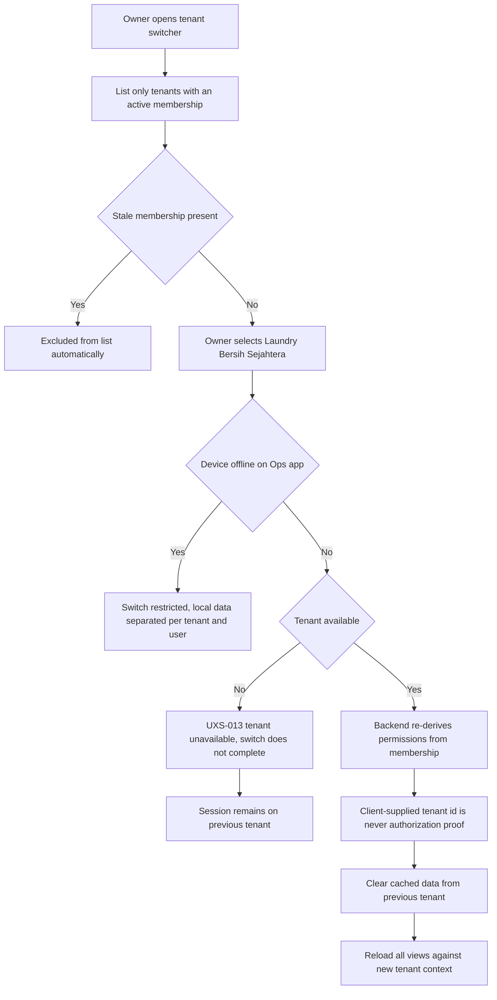
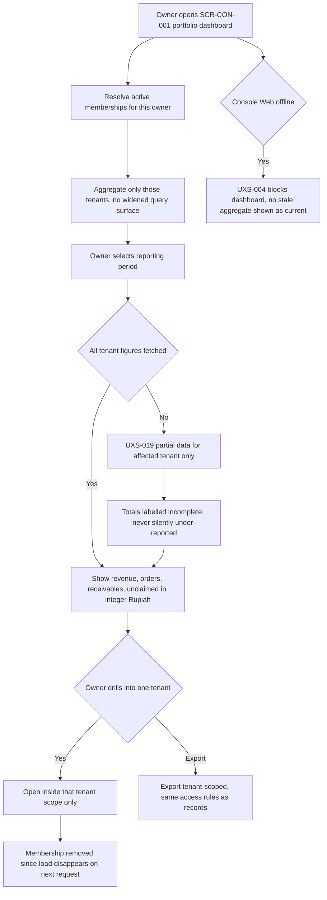
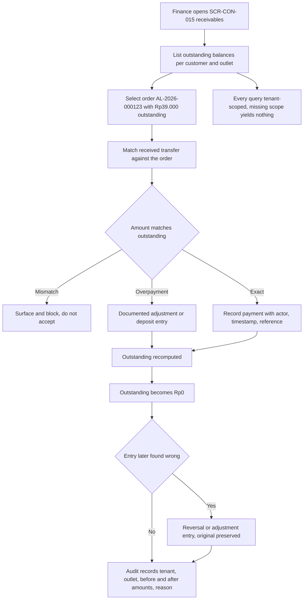

# Tenant and Portfolio Journeys

Step 2 — Design System and UX Foundation. Cluster file for **JRN-023**, **JRN-024**, **JRN-025**.

Index and full specification tables: [`../CRITICAL_JOURNEYS.md`](../CRITICAL_JOURNEYS.md).
Screen definitions: [`../SCREEN_INVENTORY.md`](../SCREEN_INVENTORY.md).

## Purpose

To describe the journeys that cross or approach the tenant boundary: switching between tenants a user
legitimately belongs to, aggregating a portfolio across them, and reconciling receivables inside one.
Tenant isolation is the product's central safety property, so these three journeys are written to make
the boundary visible rather than convenient.

The hierarchy is `User Account -> Membership -> Tenant/Organization -> Laundry Brand -> Outlet`.
Authorization derives from Membership, never from the user account alone, and **a client-supplied tenant
identifier is never authorization proof**.

All example data is fictional: order `AL-2026-000123`, outlet "Outlet Cempaka", tenant "Laundry Bersih
Sejahtera".

## Status block

| Item | Status |
|---|---|
| Step 2 — Design System and UX Foundation | **IN PROGRESS** |
| JRN-023, JRN-024, JRN-025 | **NOT IMPLEMENTED** |
| Backend runtime | **ABSENT** |
| Flutter workspace | **ABSENT** |
| Application CI | **NOT APPLICABLE** |
| UAT | **NOT STARTED** |
| Accessibility | **DESIGNED TO MEET WCAG 2.2 AA REQUIREMENTS — NOT YET RUNTIME-TESTED** |

Documentation is not implementation. `GO` is owner-conferred.

## JRN-023 — Owner switches tenant

An owner who holds memberships in more than one tenant finishes reviewing one and switches to Laundry
Bersih Sejahtera. A tenant switcher exists wherever a user can belong to more than one tenant, and it
lists only tenants where an active membership exists — a stale membership simply does not appear. On
selection the session context changes and the backend re-derives permissions from the membership rather
than trusting anything the client asserts. Any cached data belonging to the previous tenant is cleared,
because local cache surviving a tenant switch is a tenant-isolation defect, not a performance nicety. A
suspended or unavailable tenant renders the tenant-unavailable state and the switch does not complete,
leaving the session on the previous tenant rather than in an undefined state. On the Ops app a tenant
switch while offline is restricted for the same isolation reason.

## JRN-024 — Owner views portfolio

The owner opens the portfolio dashboard to compare performance across the tenants they own. Aggregation
covers only tenants where the owner holds an active membership, and the dashboard must not weaken tenant
isolation to produce its numbers: aggregating across tenants a user legitimately belongs to is permitted,
but widening the query surface to achieve it is not. Revenue, order counts, outstanding receivables, and
unclaimed volume are shown per tenant in integer Rupiah. Drilling into one tenant opens inside that
tenant's scope rather than issuing a broader query. When one tenant's figures cannot be fetched, the
partial-data state is shown for that tenant only and the totals state that they are incomplete, because a
silently under-reported total is worse than a visibly incomplete one. Exports carry the same access rules
as the underlying records and remain tenant-scoped.

## JRN-025 — Finance reconciles receivable

Finance works the outstanding receivables list at month end. The list shows outstanding balances per
customer and per outlet in integer Rupiah; for order `AL-2026-000123` the outstanding figure is
`Rp39.000`. Finance matches a received transfer against it, the payment is recorded with actor, timestamp,
and reference, and the outstanding balance becomes `Rp0`. An amount mismatch is surfaced and blocked
rather than accepted and reconciled later. A financial record is never hard-deleted: a wrong entry is
corrected by a reversal or adjustment entry that preserves the original, so the ledger is append-only in
effect. An overpayment is handled as a documented adjustment or deposit entry rather than discarded.
Every financial query is tenant-scoped, so a query missing its scope yields nothing rather than another
tenant's rows, and historical order prices remain immune to later price-list changes.

