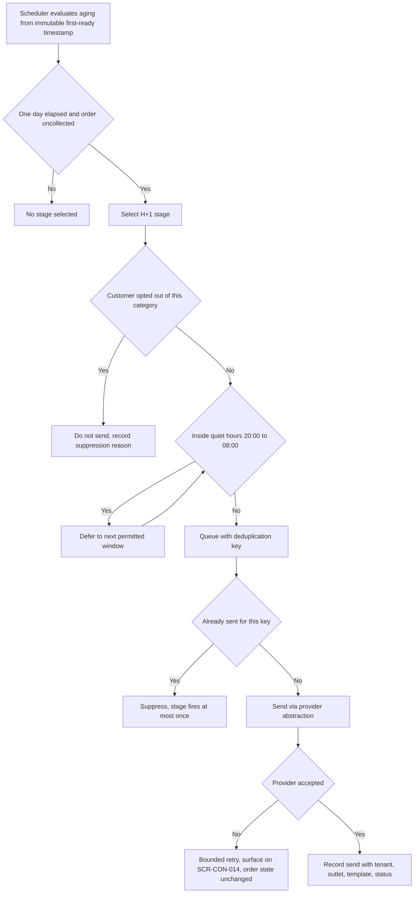
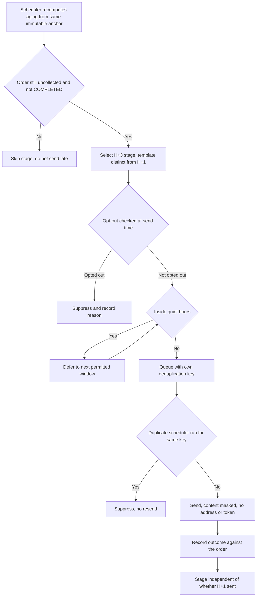
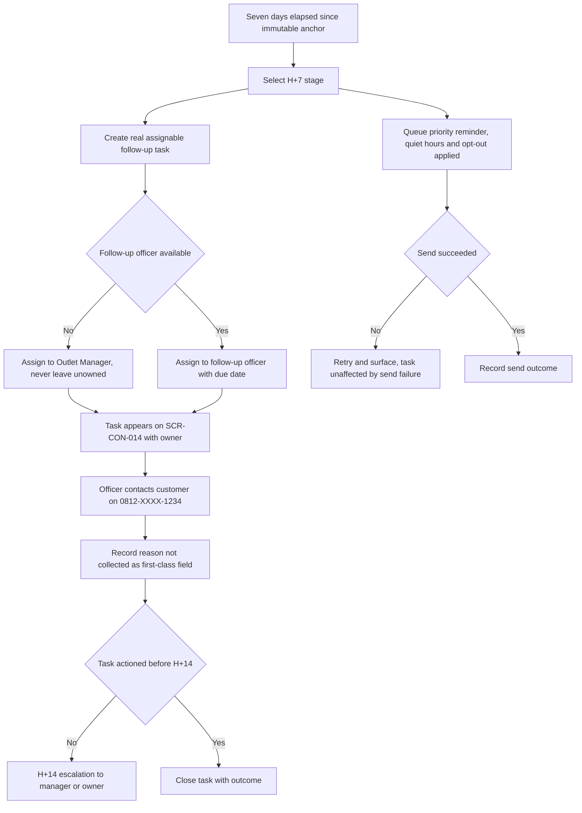
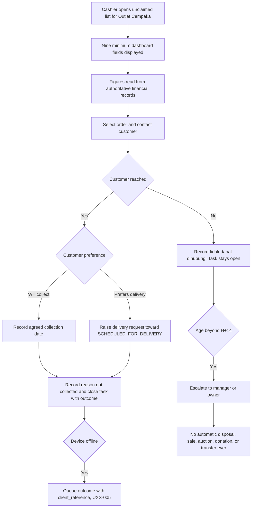

# Unclaimed Laundry Journeys

Step 2 — Design System and UX Foundation. Cluster file for **JRN-013**, **JRN-014**, **JRN-015**,
**JRN-016**.

Index and full specification tables: [`../CRITICAL_JOURNEYS.md`](../CRITICAL_JOURNEYS.md).
Screen definitions: [`../SCREEN_INVENTORY.md`](../SCREEN_INVENTORY.md).

## Purpose

To describe the reminder ladder and the human follow-up that recovers uncollected laundry and the money
owed on it. Finished orders that pile up consume shelf space and represent revenue that was never
collected, so this is treated as a core capability rather than a reporting nicety.

The ladder is exactly **H+1**, **H+3**, **H+7** (priority reminder plus a real assignable follow-up
task), and **H+14** (escalation to a manager or owner). Aging anchors to the **first**
`READY_FOR_PICKUP` timestamp and **never restarts**. **There is no automatic disposal, sale, auction,
donation, or ownership transfer of a customer's laundry — ever.**

All example data is fictional: customer "Budi Santoso", masked phone `0812-XXXX-1234`, order
`AL-2026-000123`, outlet "Outlet Cempaka", tenant "Laundry Bersih Sejahtera".

## Status block

| Item | Status |
|---|---|
| Step 2 — Design System and UX Foundation | **IN PROGRESS** |
| JRN-013, JRN-014, JRN-015, JRN-016 | **NOT IMPLEMENTED** |
| Backend runtime | **ABSENT** |
| Flutter workspace | **ABSENT** |
| Application CI | **NOT APPLICABLE** |
| UAT | **NOT STARTED** |
| Accessibility | **DESIGNED TO MEET WCAG 2.2 AA REQUIREMENTS — NOT YET RUNTIME-TESTED** |

Documentation is not implementation. `GO` is owner-conferred.

## JRN-013 — Reminder H+1

One day after the immutable first-ready timestamp of order `AL-2026-000123`, the scheduler evaluates
aging and selects the H+1 stage. Before anything is sent it checks quiet hours 20:00–08:00 outlet local
time and the customer's opt-out state, then queues a friendly reminder with a deduplication key. The
stage fires at most once per order; deduplication is keyed on recipient, event, order, and intended send
window so that a scheduler restart cannot resend it. Sending goes through the internal provider
abstraction, and the send is recorded against the order with tenant, outlet, template, category, and
status. A message evaluated inside quiet hours is deferred to the next permitted window — never dropped,
and never sent anyway. Provider failure is retried under a bounded policy and made visible, and it never
alters the order's state.

## JRN-014 — Reminder H+3

Three days after the same unchanged anchor, the scheduler recomputes aging and selects the H+3 stage. The
template is distinct from H+1, because a customer who ignored one message is unlikely to respond to the
identical text repeated. Opt-out and quiet hours are checked again at send time rather than only at
schedule time, since a customer may have opted out in the interval. If the laundry has since been
collected the order is no longer eligible and the stage is skipped rather than sent late, which would
read as carelessness to the customer. Stages are independent: if H+1 never sent, H+3 still fires on its
own schedule, and each stage fires at most once. Message content may state the outstanding amount in
integer Rupiah, but carries no address, no tracking token, and no internal note.

## JRN-015 — Reminder H+7

Seven days after the anchor, the H+7 stage does two things rather than one. It queues a priority reminder
subject to the same quiet-hours and opt-out rules, and it creates a **real assignable follow-up task**
with a named owner and a due date. A flag on a report is not a task; without an accountable human the
pile does not shrink. The task appears on the unclaimed dashboard with its assigned officer, who contacts
Budi Santoso and records the outcome, including the reason not collected as a first-class field. If no
follow-up officer is available the task is assigned to the outlet manager rather than left unowned.
Reminder send failure does not cancel the task — the task exists independently of message delivery. An
unactioned task escalates at H+14 to a manager or owner, a human accountable for the outcome.

## JRN-016 — Cashier follows up unclaimed laundry

During a quiet period the cashier works the unclaimed list for Outlet Cempaka. The view must expose all
nine minimum fields — order count, customer count, held invoices, unpaid balance, order age, outlet, last
reminder, follow-up officer, and reason not collected — because the dashboard is an operational tool, not
a summary. Unpaid balance and held-invoice figures are read from the authoritative financial records in
integer Rupiah and never recomputed independently. The cashier calls Budi Santoso, records an agreed
collection date, and closes the task with an outcome; if the customer prefers delivery, a delivery
request is raised instead. When the customer cannot be reached, a "tidak dapat dihubungi" reason is
recorded and the task stays open for the next attempt rather than being closed to tidy the list. Beyond
H+14 the matter escalates to a manager or owner — and **never** to automatic disposal, sale, auction,
donation, or ownership transfer.

